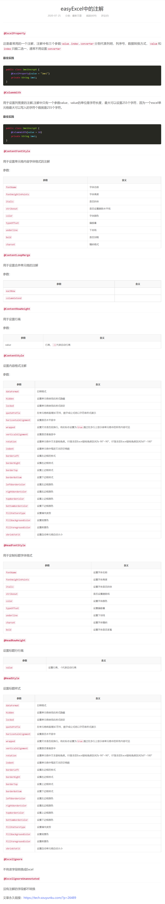
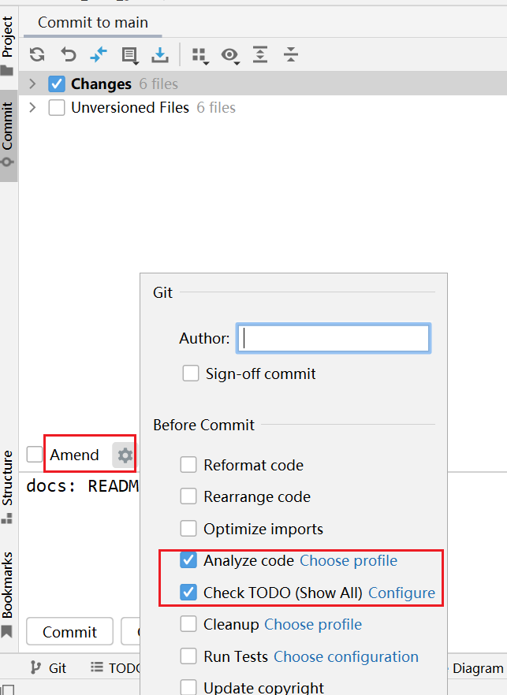
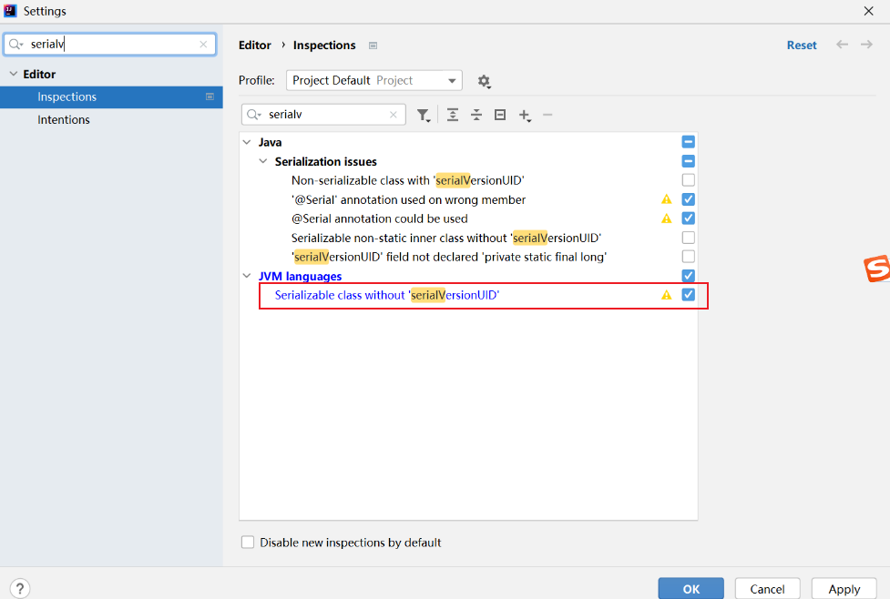

学习 哔哩哔哩尚硅谷 springcloud课程、java8新特性、nginx、linux

redis、mongo、消息队列、mysql进阶
## markdown文件

##### markdown文件表情

语法： &#xCODE;    
其中，CODE 可以从 [Emoji Unicode Tables](https://apps.timwhitlock.info/emoji/tables/unicode#block-4-enclosed-characters)
中查到。复制第四排的： Symbola [4] 即可

    例子： 查到了 表情对应的 Unicode 编码为 U+1F34E，则与此表情对应的 CODE 为 1F34E (舍弃前面的 U+)。
    我们只需在 Markdown 文档中输入 &#x1F34E; 即可显示为 。
##### markdown文件表情复制
😄
🙋
✅
✏
❓
💪
🐼
👊
💖
##### [git把某个文件去除版本控制不删除本地文件](https://my.oschina.net/yurenzhen/blog/1800790)

    git rm -h 查看说明
    git rm --cached 文件的全路径名
    -r 是允许递归删除，当要删除的是文件夹的时候有用
    git rm -r --cached loggers  # -r 是允许递归删除，当要删除的是文件夹的时候有用

##名词解释：
SDK （Software Development Kit）
👍：
    软件开发工具包一般都是一些软件工程师为特定的软件包、软件框架、硬件平台、操作系统等建立应用软件时的开发工具的集合。
    软件开发工具广义上指辅助开发某一类软件的相关文档、范例和工具的集合。
    软件开发工具包是一些被软件工程师用于为特定的软件包、软件框架、硬件平台、操作系统等创建应用软件的开发工具的集合，一般而言SDK即开发Windows平台下的应用程序所使用的SDK。它可以简单的为某个程序设计语言提供应用程序接口API的一些文件，但也可能包括能与某种嵌入式系统通讯的复杂的硬件。一般的工具包括用于调试和其他用途的实用工具。SDK还经常包括示例代码、支持性的技术注解或者其他的为基本参考资料澄清疑点的支持文档。
    为了鼓励开发者使用其系统或者语言，许多SDK是免费提供的。软件工程师通常从目标系统开发者那里获得软件开发包，也可以直接从互联网下载，有时也被作为营销手段。例如，营销公司会免费提供构建SDK以鼓励人们使用它，从而会吸引更多人由于能免费为其编程而购买其构件。
    SDK可能附带了使其不能在不兼容的许可证下开发软件的许可证。例如产品
[SDK百度百科](https://baike.baidu.com/item/%E8%BD%AF%E4%BB%B6%E5%BC%80%E5%8F%91%E5%B7%A5%E5%85%B7%E5%8C%85/10418833?fromtitle=SDK&fromid=7815680&fr=aladdin)

API （Application Programming Interface，应用编程接口）

    其实就是操作系统留给应用程序的一个调用接口，
    应用程序通过调用操作系统的API而使操作系统去执行应用程序的命令（动作）。
    其实早在DOS时代就有API的概念，只不过那个时候的API是以中断调用的形式（INT 21h）提供的，
    在DOS下跑的应用程序都直接或间接的通过中断调用来使用操作系统功能，
    比如将AH置为30h后调用INT 21h就可以得到DOS 操作系统的版本号。
    而在Windows中，系统API是以函数调用的方式提供的。同样是取得操作系统的版本号，
    在Windows中你所要做的就是调用GetVersionEx()函数。


## redis 学习笔记 finish
[](学习记录/redis学习笔记/redis.md)
[redis官网](https://redis.io)
[redis下载](https://redis.io/download)
[redis 安装教程](https://www.cnblogs.com/hunanzp/p/12304622.html)

## linux 学习笔记 finish
[](学习记录/Linux学习笔记/Linux实用指令.md)

## mysql 学习笔记 （未启动）
[](学习记录/mysql学习笔记/mysql.md)

####知识扩展
##### BI: 商务智能 (business intelligence)
smartbi[浅谈Smartbi和Power BI](https://zhuanlan.zhihu.com/p/165376092)

[持续集成 CI Continuous integration](https://baike.baidu.com/item/%E6%8C%81%E7%BB%AD%E9%9B%86%E6%88%90/6250744?fr=aladdin)
[持续交付 CD Continuous Delivery](https://baike.baidu.com/item/%E6%8C%81%E7%BB%AD%E4%BA%A4%E4%BB%98/9803571)
[CI/CD](https://www.redhat.com/zh/topics/devops/what-is-ci-cd)
[CI/CD](https://zhuanlan.zhihu.com/p/228272483)


在谈论软件开发时，经常会提到 持续集成(Continuous Integration)（CI）和 持续交付(Continuous Delivery)（CD）这几个术语。
但它们真正的意思是什么呢？在本文中，我将解释这些和相关术语背后的含义和意义，例如 
持续测试(Continuous Testing)和 持续部署(Continuous Deployment)。

##### CI 持续集成（Continuous Integration）
现代应用开发的目标是让多位开发人员同时处理同一应用的不同功能。但是，如果企业安排在一天内将所有分支源代码合并在一起（称为"合并日"），
最终可能造成工作繁琐、耗时，而且需要手动完成。这是因为当一位独立工作的开发人员对应用进行更改时，
有可能会与其他开发人员同时进行的更改发生冲突。如果每个开发人员都自定义自己的本地集成开发环境（IDE），
而不是让团队就一个基于云的 IDE 达成一致，那么就会让问题更加雪上加霜。

持续集成（CI）可以帮助开发人员更加频繁地（有时甚至每天）将代码更改合并到共享分支或"主干"中。
一旦开发人员对应用所做的更改被合并，系统就会通过自动构建应用并运行不同级别的自动化测试（通常是单元测试和集成测试）来验证这些更改，
确保这些更改没有对应用造成破坏。这意味着测试内容涵盖了从类和函数到构成整个应用的不同模块。
如果自动化测试发现新代码和现有代码之间存在冲突，CI 可以更加轻松地快速修复这些错误。

##### CD 持续交付（Continuous Delivery）
完成 CI 中构建及单元测试和集成测试的自动化流程后，持续交付可自动将已验证的代码发布到存储库。
为了实现高效的持续交付流程，务必要确保 CI 已内置于开发管道。持续交付的目标是拥有一个可随时部署到生产环境的代码库。

在持续交付中，每个阶段（从代码更改的合并，到生产就绪型构建版本的交付）都涉及测试自动化和代码发布自动化。在流程结束时，
运维团队可以快速、轻松地将应用部署到生产环境中。

##### CD 持续部署（Continuous Deployment）
对于一个成熟的 CI/CD 管道来说，最后的阶段是持续部署。作为持续交付——自动将生产就绪型构建版本发布到代码存储库——的延伸，
持续部署可以自动将应用发布到生产环境。由于在生产之前的管道阶段没有手动门控，因此持续部署在很大程度上都得依赖精心设计的测试自动化。

实际上，持续部署意味着开发人员对应用的更改在编写后的几分钟内就能生效（假设它通过了自动化测试）。这更加便于持续接收和整合用户反馈。
总而言之，所有这些 CI/CD 的关联步骤都有助于降低应用的部署风险，因此更便于以小件的方式（而非一次性）发布对应用的更改。
不过，由于还需要编写自动化测试以适应 CI/CD 管道中的各种测试和发布阶段，因此前期投资还是会很大。


#### Java中常见的对象类型简述(DO、BO、DTO、VO、AO、PO)

[Java中常见的对象类型简述(DO、BO、DTO、VO、AO、PO)](https://blog.csdn.net/uestcyms/article/details/80244407)

这些概念用于描述对象的类型；由于java是面向对象的语言；程序的世界就是各个对象之间的“交互”；在交互的工程中会存在多个层次，每个层次中所拥有（关注）的内容都是不一样的；

PO(Persistant Object) 持久对象
用于表示数据库中的一条记录映射成的 java 对象。PO 仅仅用于表示数据，没有任何数据操作。通常遵守 Java Bean 的规范，拥有 getter/setter 方法。

可以理解是一个PO就是数据库中的一条记录；可以理解某个事务依赖的原始数据；好处是可以将一条记录最为一个对象处理，可以方便转化为其他对象

BO(Business Object) 业务对象
封装对象、复杂对象，里面可能包含多个类
主要作用是把业务逻辑封装为一个对象。这个对象可以包括一个或多个其它的对象。

用于表示一个业务对象。BO 包括了业务逻辑，常常封装了对 DAO、RPC 等的调用，可以进行 PO 与 VO/DTO 之间的转换。BO 通常位于业务层， 要区别于直接对外提供服务的服务层：BO 提供了基本业务单元的基本业务操作，在设计上属于被服务层业务流程调用的对象，一个业务流程可能需要调用多个 BO 来完成。

比如一个简历，有教育经历、工作经历、社会关系等等。
我们可以把教育经历对应一个PO，工作经历对应一个PO，社会关系对应一个PO。
建立一个对应简历的BO对象处理简历，每个BO包含这些PO。
这样处理业务逻辑时，我们就可以针对BO去处理。

VO(Value Object) 表现对象
前端界面展示；value object值对象；ViewObject表现层对象；主要对应界面显示的数据对象。对于一个WEB页面，或者SWT、SWING的一个界面，用一个VO对象对应整个界面的值；对于Android而言即是activity或view中的数据元素。

用于表示一个与前端进行交互的 java 对象。有的朋友也许有疑问，这里可不可以使用 PO 传递数据？实际上，这里的 VO 只包含前端需要展示的数据即可，对于前端不需要的数据，比如数据创建和修改的时间等字段，出于减少传输数据量大小和保护数据库结构不外泄的目的，不应该在 VO 中体现出来。通常遵守 Java Bean 的规范，拥有 getter/setter 方法。

DTO(Data Transfer Object) 数据传输对象
前端调用时传输；也可理解成“上层”调用时传输;
比如我们一张表有100个字段，那么对应的PO就有100个属性。但是我们界面上只要显示10个字段，客户端用WEB service来获取数据，没有必要把整个PO对象传递到客户端，这时我们就可以用只有这10个属性的DTO来传递结果到客户端，这样也不会暴露服务端表结构.到达客户端以后，如果用这个对象来对应界面显示，那此时它的身份就转为VO.

用于表示一个数据传输对象。DTO 通常用于不同服务或服务不同分层之间的数据传输。DTO 与 VO 概念相似，并且通常情况下字段也基本一致。但 DTO 与 VO 又有一些不同，这个不同主要是设计理念上的，比如 API 服务需要使用的 DTO 就可能与 VO 存在差异。通常遵守 Java Bean 的规范，拥有 getter/setter 方法

DAO(Data access object) 数据访问对象
这个大家最熟悉，和上面几个O区别最大，基本没有互相转化的可能性和必要.，主要用来封装对数据库的访问。通过它可以把POJO持久化为PO，用PO组装出来VO、DTO；

用于表示一个数据访问对象。使用 DAO 访问数据库，包括插入、更新、删除、查询等操作，与 PO 一起使用。DAO 一般在持久层，完全封装数据库操作，对外暴露的方法使得上层应用不需要关注数据库相关的任何信息。

POJO(Plain ordinary java object) 简单java对象
一个POJO持久化以后就是PO；直接用它传递、传递过程中就是DTO；直接用来对应表示层就是VO。
————————————————

##### BO business Object: 业务对象


##### ConcurrentLinkedQueue
```java
/**
 * @see java.util.concurrent.ConcurrentLinkedQueue
 */
```


#### [idea翻译插件translation 安装以及使用](https://blog.csdn.net/qq_36353481/article/details/88869733?spm=1001.2101.3001.6650.4&utm_medium=distribute.pc_relevant.none-task-blog-2%7Edefault%7ECTRLIST%7ERate-4.pc_relevant_paycolumn_v3&depth_1-utm_source=distribute.pc_relevant.none-task-blog-2%7Edefault%7ECTRLIST%7ERate-4.pc_relevant_paycolumn_v3&utm_relevant_index=9)

#### [postman官方下载](https://www.postman.com/downloads/)


TODO

#### centos stream 学习 [centos百度百科](https://baike.baidu.com/item/centos/498948?fr=aladdin)

#### [http请求](https://www.cnblogs.com/weibanggang/p/9454581.html)
#### github.ben-namnes.caffine
#### 注解 脱敏
==========================================


[应用免登概述](https://open.feishu.cn/document/uYjL24iN/ukTO4UjL5kDO14SO5gTN)
    ctrl + f    应用管理后台免登

免登步骤:
第一步: 管理员登录企业管理后台，点击前往应用管理后台网站，携带登录预授权码跳转至应用管理后台主页；
第二步: 应用管理后台网页后端调用[获取登录用户身份](https://open.feishu.cn/document/uAjLw4CM/ukTMukTMukTM/reference/authen-v1/authen/access_token)
        校验登录预授权码合法性，获取到用户身份；
第三步: 建议应用管理后台调用获取[应用管理权限接口](https://open.feishu.cn/document/ukTMukTMukTM/uITN1EjLyUTNx4iM1UTM)
        检查用户的管理员身份。

服务端文档

三个token 一个免密登陆 
2个定时刷新 保存到数据库再存到 redis
机器人


接口 需要实现：
https://open.feishu.cn/open-apis/authen/v1/index?redirect_uri={REDIRECT_URI}&app_id={APPID}&state={STATE}

提供一个重定向url
**请求身份验证**  [请求身份验证](https://open.feishu.cn/document/ukTMukTMukTM/ukzN4UjL5cDO14SO3gTN)
**获取登录用户身份** [获取登录用户身份](https://open.feishu.cn/document/uAjLw4CM/ukTMukTMukTM/reference/authen-v1/authen/access_token)

用户登录成功后会生成登录预授权码 code，并作为参数追加到重定向URL

拿到用户信息 user_id 也就是itw_xxxx 是我们需要的信息
token两小时过期
有一个定时任务 


访问凭证 access token
开放平台提供了3种不同类型的访问凭证，用于验证调用方身份、确保调用方具有执行操作所需要的权限：

app_access_token: 应用 授权凭证，开放平台可据此识别调用方的应用身份，应用可以访问应用自身相关的信息，不归属到具体的企业或者用户，
比如获取当前登录应用的用户身份。
tenant_access_token: 租户 授权凭证，使用该access token，应用将代表公司或者团队执行对应的操作，比如获取一个通讯录用户的信息。
user_access_token: 用户 授权凭证，使用该access token，应用将代表用户执行对应的操作，比如通过API 创建一篇云文档或者一个日程。

## 常用网址或软件推荐 (java开发相关)
像quicker  snipaste   网易云音乐，有道词典等这些常用的软件或者开机启动的软件。 记得在对应软件的设置里把所有的快捷键关了（只留自己需要的）。
不然可能会和一些编辑器(IDEA, vscode, 其他工作软件)的快捷键冲突。

[gitee](https://gitee.com/)

[github](https://github.com/)
##### maven仓库 [maven仓库](https://mvnrepository.com/)
#####  redis可视化管理工具 
[AnotherRedisDesktopManager redis可视化管理工具 github下载](https://github.com/qishibo/AnotherRedisDesktopManager/releases)
##### [AnotherRedisDesktopManager redis可视化管理工具 gitee下载](https://gitee.com/qishibo/AnotherRedisDesktopManager/releases)

##### 代替xshell 的 github 开源软件：tabby
[](https://github.com/Eugeny/tabby)
[下载](https://github.com/Eugeny/tabby/tags)
点击download，点击对应系统的版本。
win版本： tabby-1.0.176-setup-x64.exe
[tabby win版本 2022年4月22日最新版本 直接下载](https://github.com/Eugeny/tabby/releases/download/v1.0.176/tabby-1.0.176-setup-x64.exe)
[tabby win版本 2022年4月22日最新版本 直接下载](https://github.com/Eugeny/tabby/releases/download/v1.0.176/tabby-1.0.176-macos-x86_64.zip)
##### 数据库 客户端 DBeaver：

DBeaver 是一个基于 Java 开发，免费开源的通用数据库管理和开发工具，使用非常友好的 ASL 协议。可以通过官方网站或者 Github 进行下载。
默认的 美化sql 可以 右键 或者 ctrl + shift + f

[dbeaver官方网站 and 下载](https://dbeaver.io)

[dbeaver Github](https://github.com/dbeaver/dbeaver)

[dbeaver Github下载](https://github.com/dbeaver/dbeaver/tags)
选择download，根据系统版本选择即可

[dbeaver Github下载2022年4月6日 最新win 64版本下载](https://github.com/dbeaver/dbeaver/releases/download/22.0.2/dbeaver-ce-22.0.2-x86_64-setup.exe)

[dbeaver 使用说明](https://mp.weixin.qq.com/s/HgY9Vgz2IGVvDRmi5o_54g)

#### 命名翻译
[codelf 命名翻译](https://unbug.github.io/codelf/)

## 常用网址或软件推荐 (通用)

#### 截图贴图 snipaste
[snipaste 截图贴图软件](https://zh.snipaste.com/)

#### windows系统 quicker指尖工具箱   
[quicker 官网](https://getquicker.net/)
(推荐截图转文本 本人常用, 鼠标中键呼出)

#### 超级PDF 在线免费 PDF 转 word
[在线免费 PDF 转 word](https://www.xpdf.cn/pdf-to-word)
需要微信登陆-关注公众号- 免费用户限制 200页


官网介绍：超级PDF为您提供在线免费的PDF转Word工具，每天免费三次，单个文件免费最大15M，
付费用户可以支持300M大小，对于99%的用户，免费额度足以支撑日常使用
#### 反向词典
[反向词典(近义词反义词英汉互译)](https://wantwords.net)
见到一个不知道啥意思的词，可以复制粘贴到搜索引擎查查，那反过来呢？
不知道大家碰没碰到过这样的场景，比如话到嘴边却不知道怎么精确用一个词概括，只能感慨一句书到用时方恨少。
别着急，你可以试试今天这个由清华大学自然语言处理与社会人文计算实验室开发的反向词典（WantWords）。

#### 图片去除水印
[MAGIC ERASER 魔术橡皮擦](https://www.magiceraser.io/)
#### 谷歌浏览器插件 
[谷歌浏览器插件 国内网站之一](https://chrome.zzzmh.cn/info?token=fjbknnledpckpbjcglogolokonffggpc)

[谷歌浏览器插件 国内网站之一](https://www.chrome666.com/)
[谷歌浏览器插件 简悦 沉浸式阅读](https://chrome.zzzmh.cn/info?token=ijllcpnolfcooahcekpamkbidhejabll)
[谷歌浏览器广告拦截插件之一](https://chrome.zzzmh.cn/info?token=cjpalhdlnbpafiamejdnhcphjbkeiagm)
[FireShot 网页截屏](https://chrome.zzzmh.cn/#/search) 后搜索关键词 fireShot 或 直接点击
[](https://chrome.zzzmh.cn/info?token=mcbpblocgmgfnpjjppndjkmgjaogfceg)
#### 世界名画博物馆
[世界名画博物馆](https://gallerix.asia)

## 收藏文章

[数据库设计工具 chiner](https://mp.weixin.qq.com/s/Q6AnaEfZHMJCefnx9YqjhQ)
[hutool 官网](https://hutool.cn/)
[hutool github](https://github.com/dromara/hutool)
[hutool java工具包-说明文档](https://www.bookstack.cn/read/hutool/a4579b97cf741bcd.md)
[hutool java工具包-说明文档](https://www.bookstack.cn/read/hutool-5.6.0-zh/9ac4d3d03444603a.md)

[mysql创建索引](https://www.cnblogs.com/sweet521/p/6203360.html)
    2022年4月7日 有一条sql语句用了 多表left join 查询  因为其中一张表(23000+条数据)创建了一个索引。查询速度从 4秒多变为1秒多
    其中的另一张表 创建了一个索引 查询速度从1秒多比变为了 0.2秒多


创建索引
在执行CREATE TABLE语句时可以创建索引，也可以单独用 CREATE INDEX 或 ALTER TABLE 来为表增加索引。

1．ALTER TABLE
ALTER TABLE用来创建普通索引、UNIQUE 唯一索引或 PRIMARY KEY 主键索引。

ALTER TABLE table_name ADD INDEX index_name (column_list)

ALTER TABLE table_name ADD UNIQUE (column_list)

ALTER TABLE table_name ADD PRIMARY KEY (column_list)


其中table_name是要增加索引的表名，column_list指出对哪些列进行索引，多列时各列之间用逗号分隔。索引名index_name可选，缺省时，MySQL将根据第一个索引列赋一个名称。另外，ALTER TABLE允许在单个语句中更改多个表，因此可以在同时创建多个索引。


3 索引类型
在创建索引时，可以规定索引能否包含重复值。如果不包含，则索引应该创建为PRIMARY KEY或UNIQUE索引。对于单列惟一性索引，这保证单列不包含重复的值。
对于多列惟一性索引，保证多个值的组合不重复。

PRIMARY KEY索引和UNIQUE索引非常类似。事实上，PRIMARY KEY索引仅是一个具有名称PRIMARY的UNIQUE索引。这表示一个表只能包含一个PRIMARY KEY，
因为一个表中不可能具有两个同名的索引。

下面的SQL语句对students表在sid上添加PRIMARY KEY索引：

ALTER TABLE students ADD PRIMARY KEY (sid)

4.查看索引
show index from tblname;


[提高SQL执行效率的16种方法](https://www.cnblogs.com/xuyatao/p/6738779.html)

项目中优化sql语句执行效率的方法：

    1)尽量选择较小的列
    2)将where中用的比较频繁的字段建立索引
    3)select子句中避免使用‘*’
    4)避免在索引列上使用计算、not in 和<>等操作
    5)当只需要一行数据的时候使用limit 1
    6)保证单表数据不超过200W，适时分割表。
    针对查询较慢的语句，可以使用explain 来分析该语句具体的执行情况。
------------------------------------------------------------------------------
    项目中优化sql语句执行效率的方法：
    1)尽量选择较小的列
    2)将where中用的比较频繁的字段建立索引
    3)select子句中避免使用‘*’
    4)避免在索引列上使用计算、not in 和<>等操作
    5)当只需要一行数据的时候使用limit 1
    6)保证单表数据不超过200W，适时分割表。
    针对查询较慢的语句，可以使用explain 来分析该语句具体的执行情况。
    ------------------------------------------------------------------------------

    1.尽量不要在where中包含子查询;

    关于时间的查询，尽量不要写成：where to_char(dif_date,’yyyy-mm-dd’)=to_char(’2007-07-01′,’yyyy-mm-dd’);

    2.在过滤条件中，可以过滤掉最大数量记录的条件必须放在where子句的末尾;

    FROM 子句中写在最后的表(基础表，driving table)将被最先处理，在FROM子句中包含多个表的情况下，你必须选择记录条数最少的表作为基础表。如果有三个以上的连接查询，那就需要选择交叉表 (intersection table)作为基础表，交叉表是指那个被其他表所引用的表;

    3.采用绑定变量

    4.在WHERE中尽量不要使用OR

    5.用EXISTS替代IN、用NOT EXISTS替代NOT IN;

    6.避免在索引列上使用计算：WHERE SAL*12>25000;

    7.用IN来替代OR： WHERE LOC_ID=10 OR LOC_ID=15 OR LOC_ID=20

    8.避免在索引列上使用IS NULL和IS NOT NULL;

    9.总是使用索引的第一个列;

    10.用UNION-ALL替代UNION;

    11.避免改变索引列的类型：SELECT…FROM EMP WHERE EMPNO=’123′，由于隐式数据类型转换，to_char(EMPNO)=’123′，因此，将不采用索引，一般在采用字符串拼凑动态SQL语句出现;

    12.’!=’ 将不使用索引;

    13.优化GROUP BY;

    14.避免带有LIKE参数的通配符，LIKE ’4YE%’使用索引，但LIKE ‘%YE’不使用索引

    15. 避免使用困难的正规表达式，例如select * from customer where zipcode like “98___”，即便在zipcode上建立了索引，在这种情况下也还是采用顺序扫描的方式。如果把语句改成select * from customer where zipcode>”98000″，在执行查询时就会利用索引来查询，显然会大大提高速度;

    16.尽量明确的完成SQL语句，尽量少让数据库工作。比如写SELECT语句时，需要把查询的字段明确指出表名。尽量不要使用SELECT *语句。组织SQL语句的时候，尽量按照数据库的习惯进行组织。

[全网最全 | MySQL EXPLAIN 完全解读](https://zhuanlan.zhihu.com/p/281517471)

#### mapstract
[mapstract 实体类映射](https://www.cnblogs.com/mmzs/p/12735212.html)
#####   简单的实体类映射

可以用 以下三个类的工具方法：

    org.springframework.beans.BeanUtils
    org.apache.commons.beanutils.BeanUtils;
    cn.hutool.core.bean.BeanUtil;

需要引入的依赖：

```xml
   <dependencies>
        <dependency>
            <groupId>commons-beanutils</groupId>
            <artifactId>commons-beanutils</artifactId>
            <version>1.9.4</version>
        </dependency>
    
        <dependency>
            <groupId>cn.hutool</groupId>
            <artifactId>hutool-all</artifactId>
            <version>5.8.0.M2</version>
        </dependency>
    </dependencies>
```

##### mapstract 介绍：
[mapstruct Github 地址](https://github.com/mapstruct/mapstruct/)

[mapstruct 使用例子](https://github.com/mapstruct/mapstruct-examples)

需要引入的依赖：
```xml
<dependencies>
    <dependency>
        <groupId>org.mapstruct</groupId>
        <!-- jdk8以下就使用mapstruct -->
        <artifactId>mapstruct-jdk8</artifactId>
        <version>1.2.0.Final</version>
    </dependency>
    <dependency>
        <groupId>org.mapstruct</groupId>
        <artifactId>mapstruct-processor</artifactId>
        <version>1.2.0.Final</version>
    </dependency>
</dependencies>
   
```

## Java8使用Stream流实现List列表的查询、统计、排序、分组

[Java8使用Stream流实现List列表的查询、统计、排序、分组](https://blog.csdn.net/pan_junbiao/article/details/105913518)

## java 开发相关 官网
[stackoverflow](https://stackoverflow.com/)
[谷歌 google](https://www.google.cn/)
[IDEA 插件官网](https://plugins.jetbrains.com/)
[后端架构师技术图谱 github](https://github.com/xingshaocheng/architect-awesome)

[JavaGuide github](https://github.com/Snailclimb/JavaGuide/)

[JavaGuide 在线阅读 ](https://javaguide.cn/home/)
（推荐谷歌浏览器打开 不支持 edge浏览器的沉浸式阅读（read: url））  

#### SpringBoot/SpringCloud项目 在项目启动时初始化一些 执行代码

[try-with-resources 代替 try catch](https://blog.csdn.net/java8cn/article/details/22761855?spm=1001.2101.3001.6650.5&utm_medium=distribute.pc_relevant.none-task-blog-2%7Edefault%7EBlogCommendFromBaidu%7ERate-5.pc_relevant_default&depth_1-utm_source=distribute.pc_relevant.none-task-blog-2%7Edefault%7EBlogCommendFromBaidu%7ERate-5.pc_relevant_default&utm_relevant_index=9)
```java
// 项目启动完以后执行，可以通过 @Order 控制启动顺序
@Component
public class  ApplicationStartUp implements org.springframework.boot.CommandLineRunner {
    // 重写run 方法。 run方法内部执行即可
    // 比如 加载字典表等
    
}
```


## easyExcel

#### easyExcel中的注解
[easyExcel中的注解](https://tech.souyunku.com/?p=26489)


[](word文档/easyexcel注解.pdf)


TODO 希望把springaop 研究透彻一点。 做一个demo
项目中有一个 请求参数 请求耗时 的aop。 实现一下


## FIXBUG

[Springboot2.x集成lettuce连接redis集群报超时异常Command timed out after 6 second(s)](https://www.cnblogs.com/zhujiqian/p/14552873.html)

[解决：class path resource [] cannot be resolved to absolute file path](https://blog.csdn.net/qq_37766026/article/details/107089310?spm=1001.2101.3001.6650.11&utm_medium=distribute.pc_relevant.none-task-blog-2~default~BlogCommendFromBaidu~default-11.queryctrv2&depth_1-utm_source=distribute.pc_relevant.none-task-blog-2~default~BlogCommendFromBaidu~default-11.queryctrv2&utm_relevant_index=14)

项目构建成jar的形式之后，resources目录中的文件并不是直接存在系统中，而是嵌套在jar文件中。


## 规范

[git git commit 规范指南](https://www.jianshu.com/p/201bd81e7dc9?utm_source=oschina-app)


####  IDEA 代码提交时忽略/跳过 分析代码 analyzing code
commit栏中 Amend(修改) 右边的 设置齿轮点开，取消勾选对应的即可


IDEA 序列化提示



## 项目x-springboot 

[x-springboot项目](https://github.com/pengtao4560/X-SpringBoot)

本地已配好。
数据库 x-springboot
win nginx 启动路径：
台式机 ： E:\nginx-windows\nginx-1.20.2

[pandoc word pdf markdown(.md) 文档互相转换](https://www.pandoc.org/installing.html)
本机笔记本安装路径：

C:\Program Files\Pandoc

## 项目： SpringBoot_v2项目非前后端分离
介绍：
SpringBoot_v2项目是努力打造springboot框架的极致细腻的脚手架 。
包括一套漂亮的前台。无其他杂七杂八的功能，原生纯净。
[github 地址](https://github.com/fuce1314/Springboot_v2)
[minio ](https://github.com/minio/minio)
md文档有详细的 win/linux/macos 步骤
[登陆](http://localhost:8060/admin)

[minio windows 下载路径](https://dl.min.io/server/minio/release/windows-amd64/minio.exe
)
下载后，cmd打开。执行：
    使用D盘作为存储库：（可使用其他的目录或子目录）

    minio.exe server D:\

[minor 登陆页面](http://127.0.0.1:9000/login)

修改配置文件application.yml 中端口为8060，启动项目，项目启动后访问
[springboot-v2](http://localhost:8060/admin)

####  数据库设计通常分为哪几步?

**需求分析** : 分析用户的需求，包括数据、功能和性能需求。

**概念结构设计** : 主要采用 E-R 模型进行设计，包括画 E-R 图。

**逻辑结构设计** : 通过将 E-R 图转换成表，实现从 E-R 模型到关系模型的转换。

**物理结构设计** : 主要是为所设计的数据库选择合适的存储结构和存取路径。

类别
category_offsite 0
category_offsite 0

本地就医 native_health_seeking
就医

引导医院 guide_hospital
native_hospital
约诊时间
预约就诊
medical 医学的
appointment
acquired
引导医院

挂号

陪诊
病情
illness
领取
病情简述
简述
简单描述 description


诊前确认 confirmedBeForeMedical
身份确认 identity verification
身份确认原因 ReasonForIdentification
病情描述 illnessDescription
结算方式 settleType
结算金额 settleSumPay
涉及大病金额 Amount involved in serious illness
是否有转诊需求 isreferralneed
意向医院 Intention to hospitalOfIntent
是否已进行 政策宣导
其他信息描述

回访
满意度 satisfaction
callback
陪诊人员
accompanying_person_satisfaction


标记


开发经验：
sql能实现的条件查询 获取list，不要去全查出来 list，再使用java逻辑判断 筛选
而是使用sql 条件查询

DEBUG汇总：
