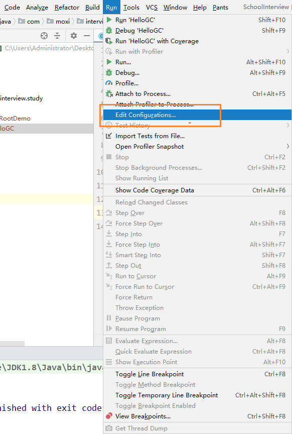
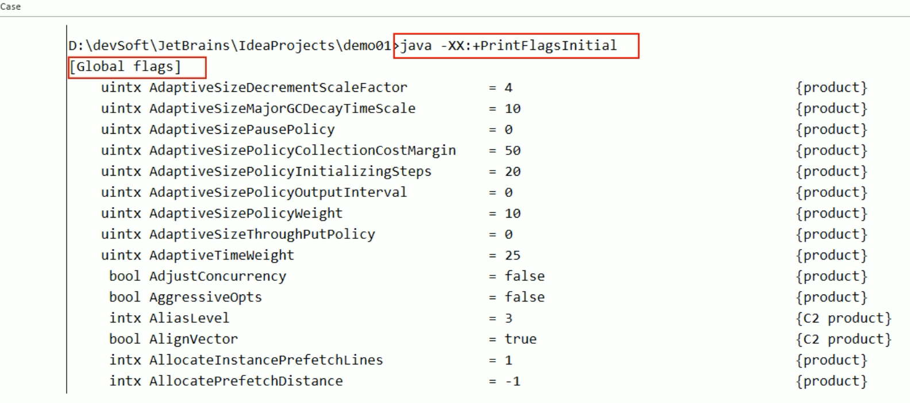

# JVM参数调优

## 前言

你说你做过JVM调优和参数配置，请问如何盘点查看JVM系统默认值

使用jps和jinfo进行查看

```
-Xms：初始堆空间
-Xmx：堆最大值
-Xss：栈空间
```

-Xms 和 -Xmx最好调整一致，防止JVM频繁进行收集和回收

## JVM参数类型

### 标配参数（从JDK1.0 - Java12都在，很稳定）
  - -version
  - -help
  - java -showversion
###  X参数（了解）
  - -Xint：解释执行
  - -Xcomp：第一次使用就编译成本地代码
  - -Xmixed：混合模式
```
java -version
java -help
java -Xint -version
java -Xcomp -version
```
### XX参数（重点）
  - Boolean类型
    - 公式：-XX:+ 或者-某个属性   + 表示开启，-表示关闭
    - Case：-XX:-PrintGCDetails：表示关闭了GC详情输出
  - key-value类型
    - 公式：-XX:属性key=属性value
    - 不满意初始值，可以通过下列命令调整
    - case：如何：-XX:MetaspaceSize=21807104：查看Java元空间的值
```
jps #查看进程号
jinfo -flag PrintGCDetails 进程号
```
```
C:\Users\Administrator>java -version
java version "1.8.0_45"
Java(TM) SE Runtime Environment (build 1.8.0_45-b15)
Java HotSpot(TM) 64-Bit Server VM (build 25.45-b02, mixed mode)

C:\Users\Administrator>java -Xint -version
java version "1.8.0_45"
Java(TM) SE Runtime Environment (build 1.8.0_45-b15)
Java HotSpot(TM) 64-Bit Server VM (build 25.45-b02, interpreted mode)

C:\Users\Administrator>java -Xcomp -version
java version "1.8.0_45"
Java(TM) SE Runtime Environment (build 1.8.0_45-b15)
Java HotSpot(TM) 64-Bit Server VM (build 25.45-b02, compiled mode)
```

## jps -l 命令查看运行的Java程序，jinfo -flg [参数] 进程号 查看JVM参数是否开启，具体值为多少？

首先我们运行一个HelloGC的java程序

```java
/**
 * @see com.atguigu.review.jvm59.HelloGC
 */
public class HelloGC {

    public static void main(String[] args) throws InterruptedException {
        System.out.println("hello GC");
        Thread.sleep(Integer.MAX_VALUE);
    }
}
```

然后使用下列命令查看它的默认参数

```
jps -l #查看java的后台进程
jinfo：查看正在运行的java程序
```

具体使用：

```
jps -l得到进程号
```

```
12608 com.moxi.interview.study.GC.HelloGC
15200 sun.tools.jps.Jps
15296 org.jetbrains.idea.maven.server.RemoteMavenServer36
4528
12216 org.jetbrains.jps.cmdline.Launcher
9772 org.jetbrains.kotlin.daemon.KotlinCompileDaemon
```

查看到HelloGC的进程号为：12608

我们使用jinfo -flag 然后查看是否开启PrintGCDetails这个参数

```
jinfo -flag PrintGCDetails 12608
```

得到的内容为

```
-XX:-PrintGCDetails
```

上面提到了，-号表示关闭，即没有开启PrintGCDetails这个参数

下面我们需要在启动HelloGC的时候，增加 PrintGCDetails这个参数，需要在运行程序的时候配置JVM参数



然后在VM Options中加入下面的代码，现在+号表示开启

```
-XX:+PrintGCDetails
```

然后在使用jinfo查看我们的配置

```
jps -l
jinfo -flag PrintGCDetails 13540
```

得到的结果为

```
-XX:+PrintGCDetails
```

我们看到原来的-号变成了+号，说明我们通过 VM Options配置的JVM参数已经生效了
## jvm的全部默认参数输出 jinfo -flags 进程号
使用下列命令，会把jvm的全部默认参数输出：

jinfo -flags 进程号
```
jinfo -flags 进程号

Server compiler detected.
JVM version is 25.45-b02
Non-default VM flags: 
-XX:CICompilerCount=3 
-XX:InitialHeapSize=268435456 
-XX:MaxHeapSize=4263510016
-XX:MaxNewSize=1420820480 
-XX:MetaspaceSize=1073741824
 -XX:MinHeapDeltaBytes=524288 -
XX:NewSize=89128960
-XX:OldSize=179306496
-XX:+UseCompressedClassPointers 
-XX:+UseCompressedOops 
-XX:+UseFastUnorderedTimeStamps 
-XX:-UseLargePagesIndividualAllocation 
-XX:+UseParallelGC

Command line:  -XX:MetaspaceSize=1024m -javaagent:D:\software\idea_c_2021.3\IntelliJ IDEA Community Edition 2021.3.3\lib\idea_rt.jar=61186:D:\software\idea_c_2021.3\IntelliJ IDEA Communi
ty Edition 2021.3.3\bin -Dfile.encoding=UTF-8

```
## jinfo -flag InitialHeapSize 进程号 查看进程的初始化的堆大小
jps -l 查看进程号
jinfo -flag InitialHeapSize 进程号

## jinfo -flag MaxHeapSize 进程号 查看进程最大堆大小
jps -l 查看进程号
jinfo -flag MaxHeapSize 进程号

```PS D:\workspace\pengtao-LearningNotes> jinfo -flag InitialHeapSize 27520
-XX:InitialHeapSize=268435456

PS D:\workspace\pengtao-LearningNotes> jinfo -flag MaxHeapSize 27520
-XX:MaxHeapSize=4263510016

```

## 两个经典参数：-Xms  和 -Xmx，这两个参数 如何解释（面试题题）

两个经典参数：-Xms  和 -Xmx，这两个参数 如何解释

这两个参数，还是属于XX参数，因为取了别名

- -Xms  等价于 -XX:InitialHeapSize  ：初始化堆内存（默认只会用最大物理内存的64分1）
- -Xmx 等价于 -XX:MaxHeapSize    ：最大堆内存（默认只会用最大物理内存的4分1）

```
jps -l
27092 com.atguigu.review.jvm59.HelloGC  
jinfo -flag MetaspaceSize 27092
-XX:MetaspaceSize=21807104 （22M左右）
```

设置vm参数：
-XX:MetaspaceSize=1024m
```
PS D:\workspace\pengtao-LearningNotes> jps -l
10980
21348 org.jetbrains.idea.maven.server.RemoteMavenServer36
23188 org.jetbrains.jps.cmdline.Launcher
3924 com.atguigu.review.jvm59.HelloGC
24680 sun.tools.jps.Jps
PS D:\workspace\pengtao-LearningNotes> jinfo -flag MetaspaceSize 3924
-XX:MetaspaceSize=1073741824


```
### jinfo -flag MaxTenuringThreshold 
```
PS D:\workspace\pengtao-LearningNotes> jps -l                          
27520 com.atguigu.review.jvm59.HelloGC
10980
21348 org.jetbrains.idea.maven.server.RemoteMavenServer36
25092 sun.tools.jps.Jps
16348 org.jetbrains.jps.cmdline.Launcher
PS D:\workspace\pengtao-LearningNotes> jinfo -flag MaxTenuringThreshold 10980
-XX:MaxTenuringThreshold=15

```


## 💖 java -XX:+PrintFlagsInitial/PrintFlagsFinal 命令查看JVM默认参数 (重要) 
查看 jvm 各种参数盘点：直接在cmd窗口或IDEA Terminal中 copy以下命令：

java -XX:+PrintFlagsInitial  # jvm 初始化的各种参数
java -XX:+PrintFlagsFinal  #  jvm 最终值的各种参数
java -XX:+PrintFlagsInitial -version # jvm 初始化的各种参数
java -XX:+PrintFlagsFinal -version  #  jvm 最终值的各种参数
java -XX:+PrintFlagsFinal -XX:MetaspaceSIze=512m  #  jvm 最终值的各种参数并**在查看过程中修改参数** MetaspaceSIze 的值
java -XX:+PrintCommandLineFlags -version #查看JVM标配参数的命令
- -XX:+PrintFlagsInitial

  - 主要是查看初始默认值
  - 公式
    - java -XX:+PrintFlagsInitial -version    
    - java -XX:+PrintFlagsInitial（重要参数）

  

### 示例  java -XX:+PrintFlagsFinal -XX:MetaspaceSize=512m T
```java
package com.atguigu.review.jvm59;

/**
 * @see com.atguigu.review.jvm59.T
 * cmd 窗口下运行 javac T.java 为什么不能带着 package（因为那样 javac T.java 编译后默认不在和 T.java同意目录下）
 */
public class T {

    public static void main(String[] args) {
        int a = 100;
        int b = 200;
        int retValue =  a + b;
        System.out.println("**********retValue: " + retValue);
    }
}

```
1. cmd 窗口下 more T.java 打印以上内容
2. 执行：
java -XX:+PrintFlagsFinal T
```结果 部分截取
    uintx MetaspaceSize                             = 21807104                            {pd product}
```
3. 执行：
   java -XX:+PrintFlagsFinal -XX:MetaspaceSize=512m T

```结果 部分截取
       uintx MetaspaceSize                            := 536870912                           {pd product}
```

- -XX:+PrintFlagsFinal：表示修改以后，最终的值

✏        会将JVM的各个结果都进行打印 

✏        **如果有  := 表示(JVM或用户)修改过的， = 表示没有修改过的**

### 查看JVM标配参数的命令： java -XX:+PrintCommandLineFlags -version
java -XX:+PrintCommandLineFlags -version
查看盘点 JVM标配参数的命令
```
D:\workspace\pengtao-LearningNotes\review\src\main\java\com\atguigu\review\jvm59>java -XX:+PrintCommandLineFlags -version
-XX:InitialHeapSize=266410240 
-XX:MaxHeapSize=4262563840 
-XX:+PrintCommandLineFlags
-XX:+UseCompressedClassPointers
-XX:+UseCompressedOops 
-XX:-UseLargePagesIndividualAllocation
-XX:+UseParallelGC
java version "1.8.0_45"
Java(TM) SE Runtime Environment (build 1.8.0_45-b15)
Java HotSpot(TM) 64-Bit Server VM (build 25.45-b02, mixed mode)
```
## 工作中常用的JVM基本配置参数之：查看堆内存


JDK1.8之后将最初的永久代取消了，由元空间取代。
JDK1.8之后将最初的永久代取消了，由**元空间**取代。在Java8中，永久代已经被移除，被一个称为元空间的区域所取代。
元空间的本质和永久代类似。

java 8 的元空间与 java7的永久代之间最大的区别在于：
永久带使用的VM的堆内存，但是java8以后的**元空间并不在虚拟机中而是使用本机物理内存**

因此，默认情况下，元空间的大小仅受本地内存限制。类的元数据放入native memory,字符串池和类的静态变量放入java堆中，
这样可以加载多少类的元数据就不再由 MaxPermSize 控制，而由系统的实际可用空间来控制


查看JVM的初始化堆内存 -Xms 和最大堆内存 Xmx

```java
package com.atguigu.review.jvm59;

/**
 * 打印 Java虚拟机中内存的总量
 * 以及Java虚拟机中试图使用的最大内存量
 * @see com.atguigu.review.jvm59.JVMMemoryPrint
 */
public class JVMMemoryPrint {
    public static void main(String[] args) throws InterruptedException {
        // 返回Java虚拟机中内存的总量
        long totalMemory = Runtime.getRuntime().totalMemory();

        // 返回Java虚拟机中试图使用的最大内存量
        long maxMemory = Runtime.getRuntime().maxMemory();

        System.out.println("TOTAL_MEMORY(-Xms) = " + totalMemory + "(字节)、" + (totalMemory / (double)1024 / 1024) + "MB");
        System.out.println("MAX_MEMORY(-Xmx) = " + maxMemory + "(字节)、" + (maxMemory / (double)1024 / 1024) + "MB");

    }
}

```

运行结果为：

```
TOTAL_MEMORY(-Xms) = 257425408(字节)、245.5MB
MAX_MEMORY(-Xmx) = 3790077952(字节)、3614.5MB
```

-Xms 初始堆内存为：物理内存的1/64          -Xmx 最大堆内存为：系统物理内存的 1/4

## 工作中常用的JVM基本配置参数之：打印JVM默认参数 java -XX:+PrintCommandLineFlags
java -XX:+PrintCommandLineFlags
使用 `-XX:+PrintCommandLineFlags` 打印出JVM的默认的简单初始化参数
java -XX:+PrintCommandLineFlags
比如我的机器输出为：

```
-XX:InitialHeapSize=266376000 -XX:MaxHeapSize=4262016000 -XX:+PrintCommandLineFlags -XX:+UseCompressedClassPointers -XX:+UseCompressedOops -XX:-UseLargePagesIndividualAllocation -XX:+UseParallelGC 
```
### 查java8官网

[oracle-java8官网](https://docs.oracle.com/javase/8/docs/index.html)
例如想查 java虚拟机 点击 最下边的： Java HotSpot Client and Server VM 跳转

[](https://docs.oracle.com/javase/9/tools/java.htm#JSWOR-GUID-9569449C-525F-4474-972C-4C1F63D5C357)
### 生活常用调优参数

- -Xms：初始化堆内存，默认为物理内存的1/64，等价于 -XX:initialHeapSize
- -Xmx：最大堆内存，默认为物理内存的1/4，等价于-XX:MaxHeapSize
- -Xss：设计单个线程栈的大小，一般默认为512K~1024K，等价于-XX:ThreadStackSize (官网原话 This option is similar to XX:ThreadStackSize)
  - 使用 jinfo -flag ThreadStackSize   会发现 -XX:ThreadStackSize = 0
  - 这个值的大小是取决于平台的 Sets the thread stack size (in bytes). Append the letter k or K to indicate KB, m or M to indicate MB, or g or G to indicate GB. The default value depends on the platform:

  - Linux/x64:1024KB
  - OS X：1024KB
  - Oracle Solaris：1024KB
  - Windows：取决于虚拟内存的大小
- -Xmn：设置年轻代大小（一般默认不需要调整）
- -XX:MetaspaceSize：设置元空间大小
  - 元空间的本质和永久代类似，都是对JVM规范中方法区的实现，不过元空间与永久代之间最大的区别在于：元空间并不在虚拟机中，而是使用本地内存，
    因此，默认情况下，元空间的大小仅受本地内存限制。
  - -Xms10m -Xmx10m -XX:MetaspaceSize=1024m  -XX:+PrintFlagsFinal
  - 但是默认的元空间大小：只有20多M
  - 为了防止在频繁的实例化对象的时候，让元空间出现OOM，因此可以把元空间设置的大一些
- -XX:PrintGCDetails：输出详细GC收集日志信息
  - GC
  - Full GC

- -XX:USESerialGC 串行垃圾回收器
- -XX:USESerialGC 并行垃圾回收器

### 典型配置参数：(粘贴到 vm)
-Xms128m -Xmx4096m -Xss1024k -XX:MetaspaceSize=512m -XX:+PrintCommandLineFlags -XX:+PrintGCDetails -XX:+UseSerialGC

配置前后对比：
配置前
```
-XX:InitialHeapSize=266410240
-XX:MaxHeapSize=4262563840
-XX:+PrintCommandLineFlags
-XX:+PrintGCDetails
-XX:+UseCompressedClassPointers
-XX:+UseCompressedOops
-XX:-UseLargePagesIndividualAllocation
-XX:+UseParallelGC 

```
配置后
```
-XX:InitialHeapSize=134217728
-XX:MaxHeapSize=4294967296
-XX:MetaspaceSize=536870912
-XX:+PrintCommandLineFlags
-XX:+PrintGCDetails 
-XX:ThreadStackSize=1024 
-XX:+UseCompressedClassPointers 
-XX:+UseCompressedOops 
-XX:-UseLargePagesIndividualAllocation 
-XX:+UseSerialGC 
```
GC日志收集流程图


我们使用一段代码，制造出垃圾回收的过程

首先我们设置一下程序的启动配置:  设置初始堆内存为10M，最大堆内存为10M

```
-Xms10m -Xmx10m -XX:+PrintGCDetails
```

然后用下列代码，创建一个 非常大空间的byte类型数组

```
byte [] byteArray = new byte[50 * 1024 * 1024];
```

运行后，发现会出现下列错误，这就是OOM：java内存溢出，也就是堆空间不足

```
Exception in thread "main" java.lang.OutOfMemoryError: Java heap space
	at com.moxi.interview.study.GC.HelloGC.main(HelloGC.java:22)
```

同时还打印出了GC垃圾回收时候的详情

```
[GC (Allocation Failure) [PSYoungGen: 1972K->504K(2560K)] 1972K->740K(9728K), 0.0156109 secs] [Times: user=0.00 sys=0.00, real=0.03 secs] 
[GC (Allocation Failure) [PSYoungGen: 504K->480K(2560K)] 740K->772K(9728K), 0.0007815 secs] [Times: user=0.00 sys=0.00, real=0.00 secs] 
[Full GC (Allocation Failure) [PSYoungGen: 480K->0K(2560K)] [ParOldGen: 292K->648K(7168K)] 772K->648K(9728K), [Metaspace: 3467K->3467K(1056768K)], 0.0080505 secs] [Times: user=0.00 sys=0.00, real=0.01 secs] 
[GC (Allocation Failure) [PSYoungGen: 0K->0K(2560K)] 648K->648K(9728K), 0.0003035 secs] [Times: user=0.00 sys=0.00, real=0.00 secs] 
[Full GC (Allocation Failure) [PSYoungGen: 0K->0K(2560K)] [ParOldGen: 648K->630K(7168K)] 648K->630K(9728K), [Metaspace: 3467K->3467K(1056768K)], 0.0058502 secs] [Times: user=0.00 sys=0.00, real=0.01 secs] 
Heap
 PSYoungGen      total 2560K, used 80K [0x00000000ffd00000, 0x0000000100000000, 0x0000000100000000)
  eden space 2048K, 3% used [0x00000000ffd00000,0x00000000ffd143d8,0x00000000fff00000)
  from space 512K, 0% used [0x00000000fff00000,0x00000000fff00000,0x00000000fff80000)
  to   space 512K, 0% used [0x00000000fff80000,0x00000000fff80000,0x0000000100000000)
 ParOldGen       total 7168K, used 630K [0x00000000ff600000, 0x00000000ffd00000, 0x00000000ffd00000)
  object space 7168K, 8% used [0x00000000ff600000,0x00000000ff69dbd0,0x00000000ffd00000)
 Metaspace       used 3510K, capacity 4500K, committed 4864K, reserved 1056768K
  class space    used 389K, capacity 392K, committed 512K, reserved 1048576K
```

问题发生的原因：

因为们通过 -Xms10m  和 -Xmx10m 只给Java堆栈设置了10M的空间，但是创建了50M的对象，因此就会出现空间不足，而导致出错

同时在垃圾收集的时候，我们看到有两个对象：GC 和 Full GC

#### GC垃圾收集

GC在新生区

```
[GC (Allocation Failure) [PSYoungGen: 1972K->504K(2560K)] 1972K->740K(9728K), 0.0156109 secs] [Times: user=0.00 sys=0.00, real=0.03 secs]
```

GC (Allocation Failure)：表示分配失败，那么就需要触发年轻代空间中的内容被回收

```
[PSYoungGen: 1972K->504K(2560K)] 1972K->740K(9728K), 0.0156109 secs]
```

参数对应的图为：


#### Full GC垃圾回收

Full GC大部分发生在养老区

```
[Full GC (Allocation Failure) [PSYoungGen: 0K->0K(2560K)] [ParOldGen: 648K->630K(7168K)] 648K->630K(9728K), [Metaspace: 3467K->3467K(1056768K)], 0.0058502 secs] [Times: user=0.00 sys=0.00, real=0.01 secs] 
```


规律：


**[名称： GC前内存占用 -> GC后内存占用 (该区内存总大小)]**


当我们出现了老年代都扛不住的时候，就会出现OOM异常

### -XX:SurvivorRatio 设置伊甸园区比例占多少 ， from 和 to 区固定占 1:1

调节新生代中 eden 和 S0、S1的空间比例，默认为 -XX:SuriviorRatio=8，Eden:S0:S1 = 8:1:1

加入设置成 -XX:SurvivorRatio=4，则为 Eden:S0:S1 = 4:1:1

SurvivorRatio值就是设置eden区的比例占多少，S0和S1相同

**Java堆 从GC的角度还可以细分为：新生代（新生代包括Eden区/From Survivor区/To Survivor区。 内存比例为8:1:1）和 老年代
新生代 占在Java堆的空间的 1/3 老年代占Java堆的空间的 2/3**


1. **eden、SurvivorFrom 复制到 SurvivorTo，年龄 + 1**

首先，当Eden区满的时候会触发第一次GC，把还活着的对象拷贝到SurvivorFrom去，
当 Eden 区再次触发GC的时候会扫描 Eden 区 和 From 区域，对这两个区域进行垃圾回收，经过这次回收后还存活的对象，
则直接复制到 To 区域（如果对象的年龄已经到达老年的标准，则赋值到老年代区），通知把这些对象的年龄 + 1

2. **清空eden、SurvivorFrom**

然后，清空eden，SurvivorFrom中的对象，也即复制之后有交换，谁空谁是to

3. **SurvivorTo和SurvivorFrom互换**
原 SurvivorTo 成为下一次 GC时的SurvivorFrom 区，部分对象会 在From 和 To 区域中复制来复制去，
如此交换15次（由JVM参数 MaxTenuringThreshold 决定，这个参数默认为15），最终如果还是存活，就存入老年代


参数配置为：
-XX:+PrintGCDetails -XX:+UseSerialGC -Xms10m -Xmx10m 
-XX:+PrintGCDetails -XX:+UseSerialGC -Xms10m -Xmx10m  -XX:SurvivorRatio=8
参数配置前后eden区差不多。 修改 8 -> 4
示例代码为：
```java
package com.atguigu.review.jvm59;

/**
 * 用该demo执行之后
 * 切入  jvm 参数
 */
public class HelloGC {

    public static void main(String[] args) throws InterruptedException {
        int setMetaspaceSize = 1073741824 / 1024 / 1024;
        System.out.println(268435456 / 1024 / 1024);
        System.out.println( 4263510016L / 1024 / 1024);
        System.out.println(setMetaspaceSize);
        
        System.out.println("hello GC");
//        byte[] bytes = new byte[50 * 1024 * 1024];
//        Thread.sleep(Integer.MAX_VALUE);
    }
}

```
### -XX:NewRatio 配置年轻代new 和老年代old 在堆结构的占比 （了解，一般用默认）

配置年轻代new 和老年代old 在堆结构的占比

默认： -XX:NewRatio=2 新生代占1，老年代2，年轻代占整个堆的1/3

-XX:NewRatio=4：新生代占1，老年代占4，年轻代占整个堆的1/5，NewRadio值就是设置老年代的占比，剩下的1个新生代

新生代特别小，会造成频繁的进行GC收集

### -XX:MaxTenuringThreshold 设置垃圾最大年龄，默认值为15

设置垃圾最大年龄，SurvivorTo和SurvivorFrom互换，原SurvivorTo成为下一次GC时的SurvivorFrom区，部分对象会在From和To区域中复制来复制去，
如此交换15次（由JVM参数MaxTenuringThreshold决定，这个参数默认为15），最终如果还是存活，就存入老年代

这里就是调整这个次数的，默认是15，并且**设置的值 在 0~15之间**

查看默认进入老年代年龄：jinfo -flag MaxTenuringThreshold 17344

-XX:MaxTenuringThreshold=0：设置垃圾最大年龄。**如果设置为0的话，则年轻对象不经过Survivor区，直接进入老年代。
对于年老代比较多的应用，可以提高效率**。如果将此值设置为一个较大的值，则年轻代对象会在Survivor区进行多次复制，
这样可以增加对象在年轻代的存活时间，增加在年轻代即被回收的概念
