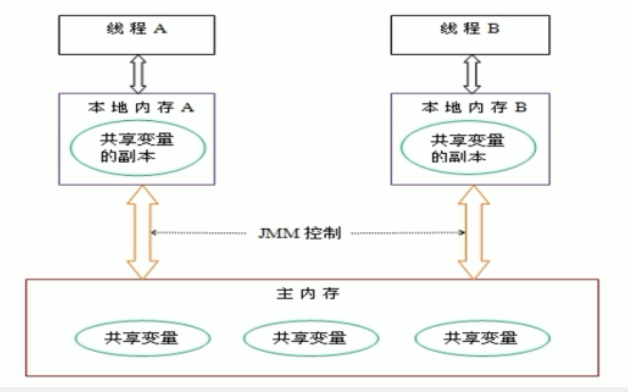

- JUC（java.util.concurrent）
  - 进程和线程
    - 进程：后台运行的程序（我们打开的一个软件，就是进程）
    - 线程：轻量级的进程，并且一个进程包含多个线程（同在一个软件内，同时运行窗口，就是线程）
  - 并发和并行
    - 并发：同时访问某个东西，就是并发
    - 并行：一起做某些事情，就是并行
- JUC下的三个包
  - java.util.concurrent
    - java.util.concurrent.atomic
    - java.util.concurrent.locks


## 谈谈对Volatile的理解(多线程 轻量级同步 可见 不原子 禁重排)

Volatile在日常的单线程环境是应用不到的

- Volatile是Java虚拟机提供的`轻量级`的同步机制（三大特性）
  - 保证可见性
  - 不保证原子性
  - 禁止指令重排

## JMM是什么

**JMM是Java内存模型**，也就是Java Memory Model，简称JMM，本身是一种抽象的概念，实际上**并不真实存在**，
它描述的是一组规则或规范，通过这组规范定义了程序中各个变量（包括实例字段，静态字段和构成数组对象的元素）的访问方式

JMM关于同步的规定：

- 线程解锁前，必须把共享变量的值刷新回主内存
- 线程加锁前，必须读取主内存的最新值，到自己的工作内存
- **加锁和解锁是同一把锁**

由于JVM运行程序的实体是线程，而每个线程创建时JVM都会为其创建一个工作内存（有些地方称为栈空间），工作内存是每个线程的私有数据区域，
而Java内存模型中规定所有变量都存储在**主内存**，主内存是共享内存区域，所有线程都可以访问，
**但线程对变量的操作（读取赋值等）必须在工作内存中进行，首先要将变量从主内存拷贝到自己的工作内存空间，然后对变量进行操作，操作完成后再将变量写会主内存，**
不能直接操作主内存中的变量，各个线程中的工作内存中存储着主内存中的**变量副本拷贝**，因此不同的线程间无法访问对方的工作内存，线程间的通信（传值）必须
通过主内存来完成，
其简要访问过程：



**数据传输速率**：硬盘 < 内存 < < 缓存cache < CPU   （cup管计算不管存储）


上面提到了两个概念：主内存  和 工作内存

- 主内存：就是计算机的内存，也就是经常提到的8G内存，16G内存

- 工作内存：但我们实例化 new student，那么 age = 25 也是存储在主内存中

  - 当同时有三个线程同时访问 student中的age变量时，那么每个线程都会拷贝一份，到各自的工作内存，
  - 从而实现了变量的拷贝

  

过程：
  三个线程t1, t2, t3 各自拷贝一份到各自线程的工作内存里面。
- t1将在自己的工作空间 将25修改成37（此时线程之间无法横向）
- 然后t1将工作内中的值，写回到**主内存**
- t2,t3内存如何知晓t1更改了主内存的值呢？
  这里就用到了 **JMM 的可见性，也就是主内存中值进行了修改，其它内存中的值马上获得通知**
- 

即：JMM内存模型的可见性，指的是当主内存区域中的值被某个线程写入更改后，其它线程会马上知晓更改后的值，并重新得到更改后的值。

验证demo: MyData中不加volatile 和 加 volatile
```java
package com.atguigu.review.volatiledemo;

import java.util.concurrent.TimeUnit;

class MyData {
     int number = 0;

    public void addTo60() {
        this.number = 60;
    }
}

/**
 * 验证volatile的可见性
 * 1.1假如int number=0;,、 number变量之前根本没有添加 volatile.关键字修饰. 也就是没有可见性
 * @see com.atguigu.review.volatiledemo.VolatileDemo
 */
public class VolatileDemo {
    public static void main(String[] args) { // main 是一切方法的运行入口
        MyData myData = new MyData(); //资源类
        new Thread(() -> {
            try {
                System.out.println(Thread.currentThread().getName() + "\t come in");
                TimeUnit.SECONDS.sleep(3);
                myData.addTo60();
                System.out.println(Thread.currentThread().getName() + "\t updated number value:" + myData.number);
            } catch (InterruptedException e) {
                e.printStackTrace();
            }
        }, "intput thread name").start();


        // 第2个线程就是我们的main线程
        while (myData.number == 0) {
          //main线程就一直再这里等待循坏，直到 number 的值不再等于零。
        }
        System.out.println(Thread.currentThread().getName() + "\t mission is over");
    }
}

```

通过前面对JMM的介绍，知道了各个线程对主内存中共享变量的操作都是各个线程各自拷贝到自己的工作内存进行操作后再写回到主内存中的。
这就可能存在一个线程AAA修改了共享变量X的值但还未写回主内存时，另外一个线程BBB又对主内存中
同一个共享变量X进行操作，但此时A线程工作内存中共享变量x对线程B来说并不可见，
这种工作内存与主内存同步延迟现象就造成了可见性问题


## 缓存一致性

为什么这里主线程中某个值被更改后，其它线程能马上知晓呢？其实这里是用到了总线嗅探技术

在说嗅探技术之前，首先谈谈缓存一致性的问题，就是当多个处理器运算任务都涉及到同一块主内存区域的时候，将可能导致各自的缓存数据不一。

为了解决缓存一致性的问题，需要各个处理器访问缓存时都遵循一些协议，在读写时要根据协议进行操作，这类协议主要有MSI、MESI等等。

### MESI

当CPU写数据时，如果发现操作的变量是共享变量，即在其它CPU中也存在该变量的副本，会发出信号通知其它CPU将该内存变量的缓存行设置为无效，
因此当其它CPU读取这个变量的时，发现自己缓存该变量的缓存行是无效的，那么它就会从内存中重新读取。
百度百科：
MESI协议是基于 Invalidate 的高速缓存一致性协议，并且是支持回写高速缓存的最常用协议之一。 
它也被称为伊利诺伊州协议（由于其在伊利诺伊大学厄巴纳 - 香槟分校的发展）。 回写高速缓存可以节省很多通常在写入缓存上浪费的
带宽。 回写高速缓存中总是存在脏状态，表示高速缓存中的数据与主存储器中的数据不同。 如果块驻留在另一个缓存中，
则Illinois协议要求缓存在未命中时缓存传输。 该协议相对于MSI协议减少了主存储器事务的数量。 这标志着性能的显着改善。
M : Modified
E : exclusive
S : Shared
I : Invalid
修正；否决；参与；无效（协议）(Modified, Exclusive, Shared, and Invalid);

[](https://baike.baidu.com/item/MESI%E5%8D%8F%E8%AE%AE/22742331?fr=aladdin)
### 总线嗅探

那么是如何发现数据是否失效呢？

这里是用到了总线嗅探技术，就是每个处理器通过嗅探在总线上传播的数据来检查自己缓存值是否过期了，
当处理器发现自己的缓存行对应的内存地址被修改，就会将当前处理器的缓存行设置为无效状态，当处理器对这个数据进行修改操作的时候，
会重新从内存中把数据读取到处理器缓存中。

### 总线风暴

总线嗅探技术有哪些缺点？

由于Volatile的MESI缓存一致性协议，需要不断的从主内存嗅探和CAS循环，无效的交互会导致总线带宽达到峰值。
因此不要大量使用volatile关键字，至于什么时候使用volatile、什么时候用锁以及Syschonized都是需要根据实际场景的。

## JMM的特性

JMM的三大特性，volatile只保证了两个，即可见性和有序性，不满足原子性

- 可见性
- 原子性
- 有序性

## 可见性代码验证

但我们对于成员变量没有添加任何修饰时，是无法感知其它线程修改后的值

```java
package com.moxi.interview.study.thread;

/**
 * Volatile Java虚拟机提供的轻量级同步机制
 *
 * 可见性（及时通知）
 * 不保证原子性
 * 禁止指令重排
 *
 * @author: 陌溪
 * @create: 2020-03-09-15:58
 */

import java.util.concurrent.TimeUnit;

/**
 * 假设是主物理内存
 */
class MyData {

    int number = 0;

    public void addTo60() {
        this.number = 60;
    }
}

/**
 * 验证volatile的可见性
 * 1. 假设int number = 0， number变量之前没有添加volatile关键字修饰
 */
public class VolatileDemo {

    public static void main(String args []) {

        // 资源类
        MyData myData = new MyData();

        // AAA线程 实现了Runnable接口的，lambda表达式
        new Thread(() -> {

            System.out.println(Thread.currentThread().getName() + "\t come in");

            // 线程睡眠3秒，假设在进行运算
            try {
                TimeUnit.SECONDS.sleep(3);
            } catch (InterruptedException e) {
                e.printStackTrace();
            }
            // 修改number的值
            myData.addTo60();

            // 输出修改后的值
            System.out.println(Thread.currentThread().getName() + "\t update number value:" + myData.number);

        }, "AAA").start();

        while(myData.number == 0) {
            // main线程就一直在这里等待循环，直到number的值不等于零
        }

        // 按道理这个值是不可能打印出来的，因为主线程运行的时候，number的值为0，所以一直在循环
        // 如果能输出这句话，说明AAA线程在睡眠3秒后，更新的number的值，重新写入到主内存，并被main线程感知到了
        System.out.println(Thread.currentThread().getName() + "\t mission is over");

        /**
         * 最后输出结果：
         * AAA	 come in
         * AAA	 update number value:60
         * 最后线程没有停止，并行没有输出  mission is over 这句话，说明没有用volatile修饰的变量，是没有可见性
         */

    }
}
```

输出结果为

	

最后线程没有停止，并行没有输出  mission is over 这句话，说明没有用volatile修饰的变量，是没有可见性

当我们修改MyData类中的成员变量时，并且添加volatile关键字修饰

```
/**
 * 假设是主物理内存
 */
class MyData {
    /**
     * volatile 修饰的关键字，是为了增加 主线程和线程之间的可见性，只要有一个线程修改了内存中的值，其它线程也能马上感知
     */
    volatile int number = 0;

    public void addTo60() {
        this.number = 60;
    }
}
```

最后输出的结果为：


主线程也执行完毕了，说明volatile修饰的变量，是具备JVM轻量级同步机制的，能够感知其它线程的修改后的值。


## 参考

https://mp.weixin.qq.com/s/Oa3tcfAFO9IgsbE22C5TEg
