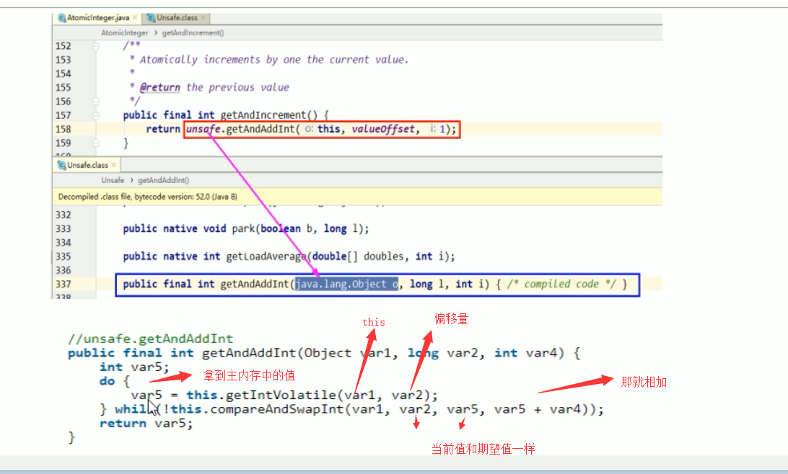

# CAS底层原理

## 1. CAS是什么？ 关键词 cpu并发原语 Unsafe

CAS的全称是Compare-And-Swap，比较和交换，它是一条**CPU并发原语**

它的功能是判断内存某个位置的值是否为预期值，如果是则更改为新的值，这个过程是原子的

CAS并发原语体现在Java语言中就是sun.misc.Unsafe类的各个方法。调用UnSafe类中的CAS方法，JVM会帮我们实现出**CAS汇编指令**，
这是一种**完全依赖于硬件**的功能，通过它实现了原子操作，再次强调，由于CAS是一种系统原语，原语属于操作系统用于范畴，是由若干条指令组成，
用于完成某个功能的一个过程，**并且原语的执行必须是连续的，在执行过程中不允许被中断(主席出行，交通管制，不允许其他车加塞)，
也就是说CAS是一条CPU的原子指令，不会造成所谓的数据不一致的问题**，也就是说CAS是线程安全的。

## 2.CAS demo

首先调用AtomicInteger创建了一个实例， 并初始化为5

```
// 创建一个原子类
AtomicInteger atomicInteger = new AtomicInteger(5);
```

然后调用CAS方法，企图更新成2019，这里有两个参数，一个是5，表示期望值，第二个就是我们要更新的值

```
atomicInteger.compareAndSet(5, 2019)
```

然后再次使用了一个方法，同样将值改成1024

```
atomicInteger.compareAndSet(5, 1024)
```

完整代码如下：

```java
package com.atguigu.review.cas;

import sun.misc.Unsafe;

import java.util.concurrent.atomic.AtomicInteger;

/**
 * CAS demo
 * @see com.atguigu.review.cas.CASDemo
 */
public class CASDemo {

    public static void main(String[] args) {
        AtomicInteger atomicInteger = new AtomicInteger(5);
        // main do thing...

        /**
         * @see AtomicInteger#compareAndSet(int, int)
         * @see sun.misc.Unsafe#compareAndSwapInt(java.lang.Object, long, int, int)
         */
        boolean b = atomicInteger.compareAndSet(5, 2022); // 比较并交换
        System.out.println(b + "\t current data:" + atomicInteger.get());

        boolean b2 = atomicInteger.compareAndSet(5, 1024);
        System.out.println(b2 + "\t current data:" + atomicInteger.get());

        atomicInteger.getAndIncrement();
    }
}

```

上面代码的执行结果为:
true	 current data:2022
false	 current data:2022

这是因为我们执行第一个的时候，期望值和原本值是满足的，因此修改成功，但是第二次后，主内存的值已经修改成了2019，不满足期望值，
因此返回了false，本次写入失败


这个就类似于SVN或者Git的版本号，如果没有人更改过，就能够正常提交，否者需要先将代码pull下来，合并代码后，然后提交

## 3. CAS底层原理 (关键词Unsafe类， valueOffSet方法)

CAS是比较和交换，凭什么能够保证原子性？靠的是来自于JVM的 rt.jar包里的sun.misc.UnSafe类
**Unsafe 类** 是CAS的核心类，由于Java方法无法直接访问底层系统，需要通过本地（Native）方法来访问，
Unsafe相当于一个后门，基于该类可以直接操作特定的内存数据。Unsafe类的内部方法操作可以像C语言的指针一样
**直接操作内存(底层、厉害、不会错)**，因为Java中的CAS操作的执行依赖于Unsafe类的方法。
**注意Unsafe类的所有方法都是(直接或间接)native修饰的，也就是说unsafe类中的方法都直接调用操作系统
底层资源执行相应的任务**

2、变量valueOffset

  表示该变量值在内存中的**偏移地址**，因为Unsafe就是根据内存偏移地址获取数据的。

首先我们先看看 atomicInteger.getAndIncrement()方法的源码
```java
/**
 * AtomicInteger 代码片段
 * @see java.util.concurrent.atomic.AtomicInteger#getAndIncrement() 
 */
/**
 * Atomically increments by one the current value.将当前值原子的加1
 *
 * @return the previous value
 */
class AtomicIntegerSnippet {
    
  public final int getAndIncrement() {
    // valueOffSet 内存偏移量，也就是内存地址
    // this当前对象
    return unsafe.getAndAddInt(this, valueOffset, 1);
  }
}
```

从这里能够看到，底层又调用了一个unsafe类的getAndAddInt方法

### 1、unsafe类


**Unsafe 类** 是CAS的核心类，由于Java方法无法直接访问底层系统，
需要通过本地（Native）方法来访问，Unsafe相当于一个后门，基于该类可以直接操作特定的内存数据。
Unsafe类存在sun.misc包中，其内部方法操作可以像C的指针一样**直接操作内存(底层、厉害、不会错)**，
因为Java中的CAS操作的执行依赖于Unsafe类的方法。

**注意Unsafe类的所有方法都是native修饰的，也就是说unsafe类中的方法都直接调用操作系统底层资源执行相应的任务**

为什么Atomic修饰的包装类，能够保证原子性，依靠的就是底层的unsafe类

```java
/**
 * @see java.util.concurrent.atomic.AtomicInteger#compareAndSet(int, int) 
 * 
 * @see java.util.concurrent.atomic.AtomicInteger#getAndIncrement() 
 * @see sun.misc.Unsafe#getAndAddInt(java.lang.Object, long, int)  #路径 jdk1.8/jre/lib/rt.jar下 sun.misc
 * 方法里面是 do ...while : 
 *  do 当前对象主物理内存的值
 *  while 如果当前对象的内存中 这个对象的值 （对于 CASDemo
 * @see com.atguigu.review.cas.CASDemo
 *  来说就是 atomicInteger）和 主物理内存的这个对象的真实值不一样，继续比较，不跳出循环，直至比较成功
 *  如果一样 ，我就修改成功，跳出循环
 */
```
### 2、变量valueOffset

表示该变量值在内存中的**偏移地址**，因为Unsafe就是根据内存偏移地址获取数据的。


从这里我们能够看到，通过valueOffset，直接通过内存地址，获取到值，然后进行加1的操作

### 3、变量value用volatile修饰

保证了多线程之间的内存可见性



var5：就是我们从主内存中拷贝到工作内存中的值(每次都要从主内存拿到最新的值到自己的本地内存，
然后执行compareAndSwapInt()在再和主内存的值进行比较。
因为线程不可以直接越过高速缓存，直接操作主内存，所以执行上述方法需要比较一次，在执行加1操作)

那么操作的时候，需要比较工作内存中的值，和主内存中的值进行比较

假设执行 compareAndSwapInt返回false，那么就一直执行 while方法，直到期望的值和真实值一样

- var1：AtomicInteger对象本身
- var2：该对象值得引用地址
- var4：需要变动的数量
- var5：用var1和var2找到的内存中的真实值
  - 用该对象当前的值与var5比较
  - 如果相同，更新var5 + var4 并返回true
  - 如果不同，继续取值然后再比较，直到更新完成
  - 
synchronized加锁，同一时间段只允许一个线程访问，一致性得到了保障，但是并发性下降。
这里**没有用synchronized，而用CAS，这样提高了并发性，也能够实现一致性**，是因为每个线程进来后，
进入的do while循环，
然后不断的获取内存中的值，判断是否为最新，然后在进行更新操作。

假设线程A和线程B同时执行getAndInt操作（分别跑在不同的CPU上）

1. AtomicInteger里面的value原始值为3，即主内存中AtomicInteger的 value 为3，根据JMM模型，+线程A和线程B各自持有一份价值为3的副本，分别存储在各自的工作内存
2. 线程A通过 Unsafe类的方法getAndAddInt 内部调用方法 getIntVolatile(var1 , var2) 拿到value值3，这是线程A被挂起（该线程失去CPU执行权）
3. 线程B也通过 getIntVolatile(var1, var2)方法获取到value值也是3，此时刚好线程B没有被挂起，并执行了compareAndSwapInt方法，比较内存的值也是3，成功修改内存值为4，线程B打完收工，一切OK
4. 这是线程A恢复，执行CAS方法，比较发现自己手里的数字3和主内存中的数字4不一致，说明该值已经被其它线程抢先一步修改过了，那么A线程本次修改失败，**只能够重新读取再来一遍了**，也就是在执行do while
5. 线程A重新获取value值，因为变量value被volatile修饰，所以其它线程对它的修改，线程A总能够看到，线程A**继续执行compareAndSwapInt进行比较替换，直到成功**。


Unsafe类 + CAS思想(也就是自旋，自我旋转)


## 底层汇编

Unsafe类中的compareAndSwapInt是一个本地方法，该方法的实现位于unsafe.cpp中

- 先想办法拿到变量value在内存中的地址
- 通过Atomic::cmpxchg实现比较替换，其中参数X是即将更新的值，参数e是原内存的值

## CAS缺点

CAS不加锁，保证一次性，但是需要多次比较

- **循环时间长，开销大**（因为执行的是do while，如果比较不成功一直在循环，最差的情况，就是某个线程一直取到的值和预期值都不一样，这样就会无限循环）
- **只能保证一个共享变量的原子操作**
  - 当对一个共享变量执行操作时，我们可以通过循环CAS的方式来保证原子操作
  - 但是对于多个共享变量操作时，循环CAS就无法保证操作的原子性，这个时候只能用锁来保证原子性
- 引出来ABA问题？

## ABA问题 ： 狸猫换太子

。。。。。。。。。
[](/JUC/3_谈谈原子类的ABA问题/6_原子类AtomicInteger的ABA问题/README.md)

## 总结

### CAS : CompareAndSwap

CAS是 compareAndSwap，比较当前工作内存中的值和主物理内存中的值，如果相同则执行规定操作，否者继续比较直到主内存和工作内存的值一致为止

### CAS应用

CAS有3个操作数，内存值V，旧的预期值A，要修改的更新值B。当且仅当预期值A和内存值V相同时，将内存值V修改为B，否者什么都不做

