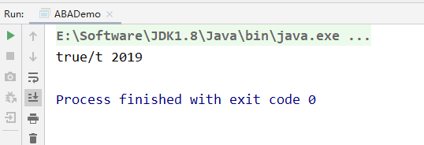
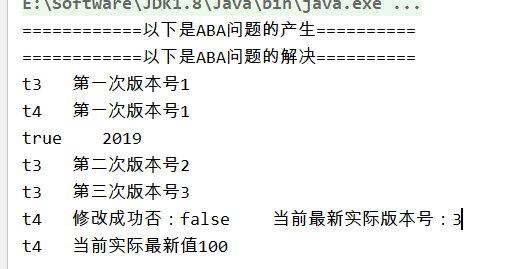
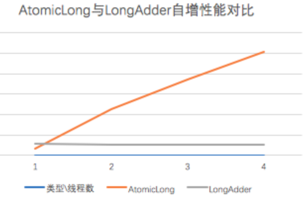
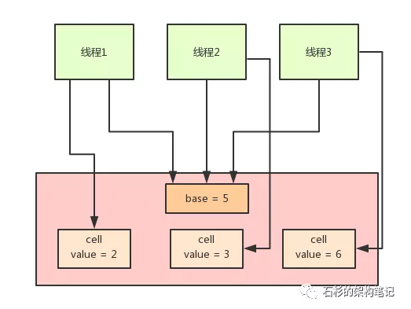
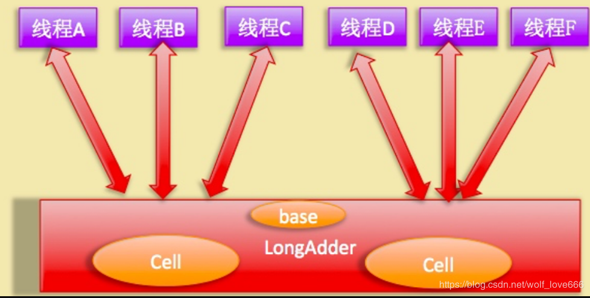
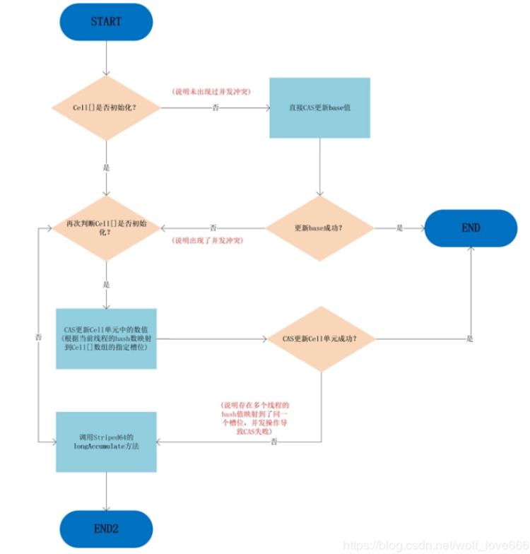
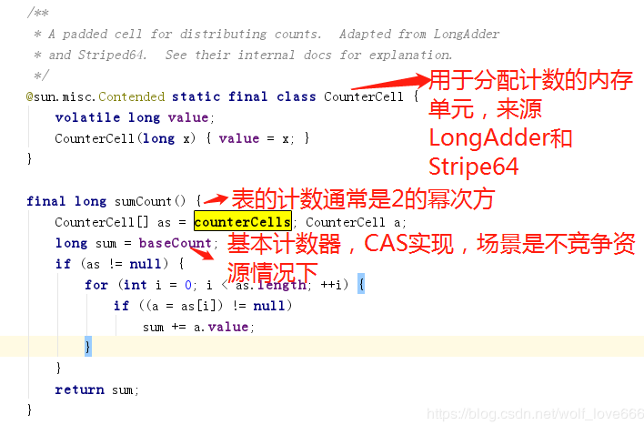

# 原子类AtomicInteger的ABA问题

## 连环套路

从AtomicInteger引出下面的问题

CAS -> Unsafe -> CAS底层思想 -> ABA -> 原子引用更新 -> 如何规避ABA问题

## ABA问题是什么

狸猫换太子


假设现在有两个线程，分别是T1 和 T2，然后T1执行某个操作的时间为10秒，T2执行某个时间的操作是2秒，最开始AB两个线程，
分别从主内存中获取A值，但是因为B的执行速度更快，他先把A的值改成B，然后在修改成A，然后执行完毕，T1线程在10秒后，
执行完毕，判断内存中的值为A，并且和自己预期的值一样，它就认为没有人更改了主内存中的值，就快乐的修改成B，
但是实际上 可能中间经历了 ABCDEFA 这个变换，也就是中间的值经历了狸猫换太子。

所以ABA问题就是，在进行获取主内存值的时候，该内存值在我们写入主内存的时候，已经被修改了N次，但是最终又改成原来的值了

## CAS导致ABA问题
CAS 会导致ABA问题
CAS算法实现了一个重要的前提，需要取出内存中某时刻的数据，并在当下时刻比较并替换，那么这个时间差会导致数据的变化。

比如说一个线程one从内存位置V中取出A，这时候另外一个线程two也从内存中取出A，并且线程two进行了一些操作将值变成了B，
然后线程two又将V位置的数据变成A，这时候线程one进行CAS操作发现内存中仍然是A，然后线程one操作成功

**尽管线程one的CAS操作成功，但是不代表这个过程就是没有问题的**
说明一下，如果只要求该数据最终结果是A，不关心中间是否有其他改动，那么该问题影响不大，或者说没有影响。

但是，举个例子，该数据是用户的钱，或者说是仓库的货物量。每一次操作应该都是受监督的，不可能说有人挪用了钱，或者挪用货物去卖了。当有人来查的时候，
又将数据加了回去。虽然最终的数据是对的上的，但是肯定这样肯定是存在问题的。
————————————————
[扩展阅读链接](https://blog.csdn.net/xueping_wu/article/details/124601769)
ABA问题及解决
## ABA问题及解决AtomicStampedReference

CAS只管开头和结尾，也就是头和尾是一样，那就修改成功，中间的这个过程，可能会被人修改过

**如何解决ABA问题：要解决ABA问题，可以使用带时间戳的原子引用：AtomicStampedReference**

## 原子引用 java.util.concurrent.atomic.AtomicReference

原子引用其实和原子包装类是差不多的概念，就是将一个java类，用原子引用类进行包装起来，那么这个类就具备了原子性
２、除了ABA问题，在多线程情况下，之前解决n++的原子性问题，使用的是AtomicInteger类。那么如果要解决的是某一个自定义类的原子性问题呢？
此时就可以使用原子更新引用：AtomicReference

３、要解决ABA问题，可以使用带时间戳的原子引用：AtomicStampedReference

stamp 戳，戳记，印章，邮票
```
/**
 * 原子引用
 */
class User {
    String userName;
    int age;
}   
public class AtomicReferenceDemo {

    public static void main(String[] args) {

        User z3 = new User("z3", 22);

        User l4 = new User("l4", 25);

        // 创建原子引用包装类
        AtomicReference<User> atomicReference = new AtomicReference<>();

        // 现在主物理内存的共享变量，为z3
        atomicReference.set(z3);

        // 比较并交换，如果现在主物理内存的值为z3，那么交换成l4
        System.out.println(atomicReference.compareAndSet(z3, l4) + "\t " + atomicReference.get().toString());

        // 比较并交换，现在主物理内存的值是l4了，但是预期为z3，因此交换失败
        System.out.println(atomicReference.compareAndSet(z3, l4) + "\t " + atomicReference.get().toString());
    }
}
```

### 基于原子引用的ABA问题

我们首先创建了两个线程，然后T1线程，执行一次ABA的操作，T2线程在一秒后修改主内存的值

```
/**
 * ABA问题的解决，AtomicStampedReference
 * @author: 陌溪
 * @create: 2020-03-12-15:34
 */
public class ABADemo {

    /**
     * 普通的原子引用包装类
     */
    static AtomicReference<Integer> atomicReference = new AtomicReference<>(100);

    public static void main(String[] args) {

        new Thread(() -> {
            // 把100 改成 101 然后在改成100，也就是ABA
            atomicReference.compareAndSet(100, 101);
            atomicReference.compareAndSet(101, 100);
        }, "t1").start();

        new Thread(() -> {
            try {
                // 睡眠一秒，保证t1线程，完成了ABA操作
                TimeUnit.SECONDS.sleep(1);
            } catch (InterruptedException e) {
                e.printStackTrace();
            }
            // 把100 改成 101 然后在改成100，也就是ABA
            System.out.println(atomicReference.compareAndSet(100, 2019) + "\t" + atomicReference.get());

        }, "t2").start();
    }
}
```

我们发现，它能够成功的修改，这就是ABA问题



## 解决ABA问题

新增一种机制，也就是修改版本号，类似于时间戳的概念

T1：  100 1                       2019 2

T2：  100 1     101 2       100  3

如果T1修改的时候，版本号为2，落后于现在的版本号3，所以要重新获取最新值，这里就提出了一个使用时间戳版本号，来解决ABA问题的思路

## AtomicStampedReference

时间戳原子引用，来这里应用于版本号的更新，也就是每次更新的时候，需要比较期望值和当前值，以及期望版本号和当前版本号

```
/**
 * ABA问题的解决，AtomicStampedReference
 * @author: 陌溪
 * @create: 2020-03-12-15:34
 */
public class ABADemo {

    /**
     * 普通的原子引用包装类
     */
    static AtomicReference<Integer> atomicReference = new AtomicReference<>(100);

    // 传递两个值，一个是初始值，一个是初始版本号
    static AtomicStampedReference<Integer> atomicStampedReference = new AtomicStampedReference<>(100, 1);

    public static void main(String[] args) {

        System.out.println("============以下是ABA问题的产生==========");

        new Thread(() -> {
            // 把100 改成 101 然后在改成100，也就是ABA
            atomicReference.compareAndSet(100, 101);
            atomicReference.compareAndSet(101, 100);
        }, "t1").start();

        new Thread(() -> {
            try {
                // 睡眠一秒，保证t1线程，完成了ABA操作
                TimeUnit.SECONDS.sleep(1);
            } catch (InterruptedException e) {
                e.printStackTrace();
            }
            // 把100 改成 101 然后在改成100，也就是ABA
            System.out.println(atomicReference.compareAndSet(100, 2019) + "\t" + atomicReference.get());

        }, "t2").start();

        System.out.println("============以下是ABA问题的解决==========");

        new Thread(() -> {

            // 获取版本号
            int stamp = atomicStampedReference.getStamp();
            System.out.println(Thread.currentThread().getName() + "\t 第一次版本号" + stamp);

            // 暂停t3一秒钟
            try {
                TimeUnit.SECONDS.sleep(1);
            } catch (InterruptedException e) {
                e.printStackTrace();
            }

            // 传入4个值，期望值，更新值，期望版本号，更新版本号
            atomicStampedReference.compareAndSet(100, 101, atomicStampedReference.getStamp(), atomicStampedReference.getStamp()+1);

            System.out.println(Thread.currentThread().getName() + "\t 第二次版本号" + atomicStampedReference.getStamp());

            atomicStampedReference.compareAndSet(101, 100, atomicStampedReference.getStamp(), atomicStampedReference.getStamp()+1);

            System.out.println(Thread.currentThread().getName() + "\t 第三次版本号" + atomicStampedReference.getStamp());

        }, "t3").start();

        new Thread(() -> {

            // 获取版本号
            int stamp = atomicStampedReference.getStamp();
            System.out.println(Thread.currentThread().getName() + "\t 第一次版本号" + stamp);

            // 暂停t4 3秒钟，保证t3线程也进行一次ABA问题
            try {
                TimeUnit.SECONDS.sleep(3);
            } catch (InterruptedException e) {
                e.printStackTrace();
            }

            boolean result = atomicStampedReference.compareAndSet(100, 2019, stamp, stamp+1);

            System.out.println(Thread.currentThread().getName() + "\t 修改成功否：" + result + "\t 当前最新实际版本号：" + atomicStampedReference.getStamp());

            System.out.println(Thread.currentThread().getName() + "\t 当前实际最新值" + atomicStampedReference.getReference());


        }, "t4").start();

    }
}
```
stamp 
运行结果为：



我们能够发现，线程t3，在进行ABA操作后，版本号变更成了3，而线程t4在进行操作的时候，就出现操作失败了，因为版本号和当初拿到的不一样


## LongAdder（CAS机制优化）

LongAdder是java8为我们提供的新的类，跟AtomicLong有相同的效果。是对CAS机制的优化

```
LongAdder：
//变量声明
public static LongAdder count = new LongAdder();
//变量操作
count.increment();
//变量取值
count
```

### 为什么有了AtomicLong还要新增一个 LongAdder 呢

原因是：CAS底层实现是在一个死循环中不断地尝试修改目标值，直到修改成功。如果竞争不激烈的时候，修改成功率很高，否则失败率很高。在失败的时候，
这些重复的原子性操作会耗费性能。（不停的**自旋**，进入一个无限重复的循环中）



**核心思想：将热点数据分离。**

比如说它可以将AtomicLong内部的内部核心数据value分离成一个数组，每个线程访问时，通过hash等算法映射到其中一个数字进行计数，
而最终的计数结果则为这个数组的求和累加，其中热点数据value会被分离成多个单元的cell，每个cell独自维护内部的值。
当前对象的实际值由所有的cell累计合成，这样热点就进行了有效地分离，并提高了并行度。
这相当于将AtomicLong的单点的更新压力分担到各个节点上。在低并发的时候通过对base的直接更新，
可以保障和AtomicLong的性能基本一致。而在高并发的时候通过分散提高了性能。

```java
/**
 * @see java.util.concurrent.atomic.LongAdder;
 */
public void increment() {
    add(1L);
}
public void add(long x) {
    Cell[] as; long b, v; int m; Cell a;
    if ((as = cells) != null || !casBase(b = base, b + x)) {
        boolean uncontended = true;
        if (as == null || (m = as.length - 1) < 0 ||
            (a = as[getProbe() & m]) == null ||
            !(uncontended = a.cas(v = a.value, v + x)))
            longAccumulate(x, null, uncontended);
    }
}
```

但是这个CAS有没有问题呢？肯定是有的。比如说大量的线程同时并发修改一个AtomicInteger，可能有**很多线程会不停的自旋**，进入一个无限重复的循环中。

这些线程不停地获取值，然后发起CAS操作，但是发现这个值被别人改过了，于是再次进入下一个循环，获取值，发起CAS操作又失败了，再次进入下一个循环。

在大量线程高并发更新AtomicInteger的时候，这种问题可能会比较明显，导致大量线程空循环，自旋转，性能和效率都不是特别好。

于是，当当当当，Java 8推出了一个新的类，**LongAdder**，他就是尝试使用分段CAS以及自动分段迁移的方式来大幅度提升多线程高并发执行CAS操作的性能！



在LongAdder的底层实现中，首先有一个base值，刚开始多线程来不停的累加数值，都是对base进行累加的，比如刚开始累加成了base = 5。

接着如果发现并发更新的线程数量过多，在发生竞争的情况下，会有一个Cell数组用于将不同线程的操作离散到不同的节点上去 ==(会根据需要扩容，最大为CPU核）
==就会开始施行**分段CAS的机制**，也就是**内部会搞一个Cell数组，每个数组是一个数值分段**。

这时，让大量的线程分别去对不同Cell内部的value值进行CAS累加操作，这样就把CAS计算压力分散到了不同的Cell分段数值中了！

这样就可以大幅度的降低多线程并发更新同一个数值时出现的无限循环的问题，大幅度提升了多线程并发更新数值的性能和效率！

而且他内部实现了**自动分段迁移的机制**，也就是如果某个Cell的value执行CAS失败了，那么就会自动去找另外一个Cell分段内的value值进行CAS操作。

这样也解决了**线程空旋转**、**自旋不停等待执行CAS操作**的问题，让一个线程过来执行CAS时可以尽快的完成这个操作。

最后，如果你要从LongAdder中获取当前累加的总值，就会把base值和所有Cell分段数值加起来返回给你。



如上图所示，LongAdder则是内部维护多个Cell变量，每个Cell里面有一个初始值为0的long型变量，在同等并发量的情况下，争夺单个变量的线程会减少，这是变相的减少了争夺共享资源的并发量，另外多个线程在争夺同一个原子变量时候，

如果失败并不是自旋CAS重试，而是尝试获取其他原子变量的锁，最后当获取当前值时候是把所有变量的值累加后再加上base的值返回的。

LongAdder维护了要给延迟初始化的原子性更新数组和一个基值变量base数组的大小保持是2的N次方大小，数组表的下标使用每个线程的hashcode值的掩码表示，数组里面的变量实体是Cell类型。

Cell 类型是Atomic的一个改进，用来减少缓存的争用，对于大多数原子操作字节填充是浪费的，因为原子操作都是无规律的分散在内存中进行的，多个原子性操作彼此之间是没有接触的，但是原子性数组元素彼此相邻存放将能经常共享缓存行，也就是**伪共享**。所以这在性能上是一个提升。（补充：可以看到Cell类用Contended注解修饰，这里主要是解决false sharing(伪共享的问题)，不过个人认为伪共享翻译的不是很好，或者应该是错误的共享，比如两个volatile变量被分配到了同一个缓存行，但是这两个的更新在高并发下会竞争，比如线程A去更新变量a，线程B去更新变量b，但是这两个变量被分配到了同一个缓存行，因此会造成每个线程都去争抢缓存行的所有权，例如A获取了所有权然后执行更新这时由于volatile的语义会造成其刷新到主存，但是由于变量b也被缓存到同一个缓存行，因此就会造成cache miss，这样就会造成极大的性能损失）
**LongAdder的add操作图**



可以看到，只有从未出现过并发冲突的时候，base基数才会使用到，一旦出现了并发冲突，之后所有的操作都只针对Cell[]数组中的单元Cell。
如果Cell[]数组未初始化，会调用父类的longAccumelate去初始化Cell[]，如果Cell[]已经初始化但是冲突发生在Cell单元内，则也调用父类的longAccumelate，此时可能就需要对Cell[]扩容了。
**另外由于Cells占用内存是相对比较大的，所以一开始并不创建，而是在需要时候再创建，也就是惰性加载，当一开始没有空间时候，所有的更新都是操作base变量。**



如上图代码：
例如32、64位操作系统的缓存行大小不一样，因此JAVA8中就增加了一个注`@sun.misc.Contended`解用于解决这个问题,由JVM去插入这些变量，[具体可以参考openjdk.java.net/jeps/142](http://xn--openjdk-hc5k25at0ntqhnpa7548b.java.net/jeps/142) ，但是通常来说对象是不规则的分配到内存中的，但是数组由于是连续的内存，因此可能会共享缓存行，因此这里加一个Contended注解以防cells数组发生伪共享的情况。

为了降低高并发下多线程对一个变量CAS争夺失败后大量线程会自旋而造成降低并发性能问题，LongAdder内部通过根据并发请求量来维护多个Cell元素(一个动态的Cell数组)来分担对单个变量进行争夺资源。


可以看到LongAdder继承自Striped64类，Striped64内部维护着三个变量，LongAdder的真实值其实就是base的值与Cell数组里面所有Cell元素值的累加，base是个基础值，默认是0，cellBusy用来实现自旋锁，当创建Cell元素或者扩容Cell数组时候用来进行线程间的同步。

在无竞争下直接更新base，类似AtomicLong高并发下，会将每个线程的操作hash到不同的cells数组中，从而将AtomicLong中更新一个value的行为优化之后，分散到多个value中
从而降低更新热点，而需要得到当前值的时候，直接 将所有cell中的value与base相加即可，但是跟AtomicLong(compare and change -> xadd)的CAS不同，incrementAndGet操作及其变种可以返回更新后的值，而LongAdder返回的是void。

由于Cell相对来说比较占内存，因此这里采用懒加载的方式，在无竞争的情况下直接更新base域，在第一次发生竞争的时候(CAS失败)就会创建一个大小为2的cells数组，每次扩容都是加倍，只到达到CPU核数。同时我们知道扩容数组等行为需要只能有一个线程同时执行，因此需要一个锁，这里通过CAS更新cellsBusy来实现一个简单的spin lock。

数组访问索引是通过Thread里的threadLocalRandomProbe域取模实现的，这个域是ThreadLocalRandom更新的，cells的数组大小被限制为CPU的核数，因为即使有超过核数个线程去更新，但是每个线程也只会和一个CPU绑定，更新的时候顶多会有cpu核数个线程，因此我们只需要通过hash将不同线程的更新行为离散到不同的slot即可。
我们知道线程、线程池会被关闭或销毁，这个时候可能这个线程之前占用的slot就会变成没人用的，但我们也不能清除掉，因为一般web应用都是长时间运行的，线程通常也会动态创建、销毁，很可能一段时间后又会被其他线程占用，而对于短时间运行的，例如单元测试，清除掉有啥意义呢？

## 参考

[AtomicLong与LongAdder（CAS机制的优化）](https://blog.csdn.net/eluanshi12/article/details/84871879)

[大白话聊聊Java并发面试问题之Java 8如何优化CAS性能？](https://mp.weixin.qq.com/s/KFsqsCVgyiiTDXMR-Hu1-Q)

https://blog.csdn.net/wolf_love666/article/details/87693771

