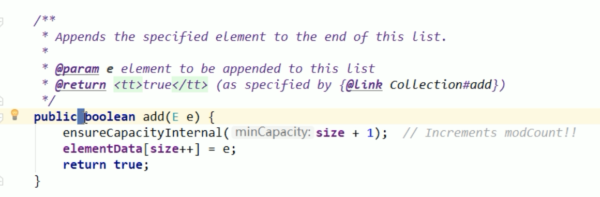
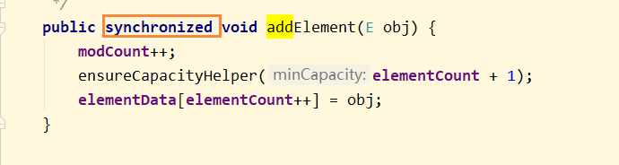
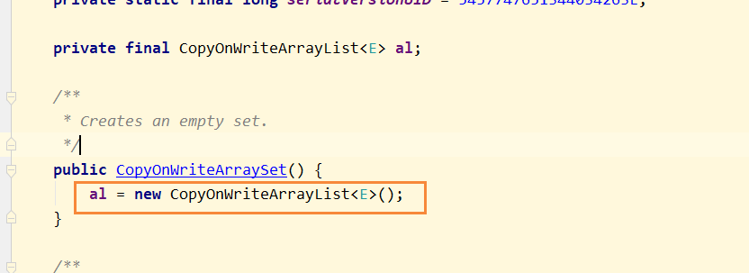

## Collection线程不安全的举例

## 前言

1、当我们执行下面语句的时候，底层进行了什么操作

```
new ArrayList<Integer>();
```

底层创建了一个空的数组，伴随着初始值为10

当执行add方法后，如果超过了10，那么会进行扩容，扩容的大小为原值的一半，也就是5个，使用下列方法扩容

```
Arrays.copyOf(elementData, netCapacity)
```

## 单线程环境下 ArrayList是不会有问题的

单线程环境的ArrayList是不会有问题的

```
public class ArrayListNotSafeDemo {
    public static void main(String[] args) {

        List<String> list = new ArrayList<>();
        list.add("a");
        list.add("b");
        list.add("c");

        for(String element : list) {
            System.out.println(element);
        }
    }
}
```

## ArrayList线程不安全

为什么ArrayList是线程不安全的？
**因为在进行写操作的时候，方法上为了保证并发性，是没有添加synchronized修饰，所以并发写的时候，就会出现问题**



当我们同时启动30个线程去操作List的时候

```java
package com.atguigu.review.collectiondemo20;

import java.util.ArrayList;
import java.util.Collection;
import java.util.Collections;
import java.util.List;
import java.util.UUID;
import java.util.Vector;
import java.util.concurrent.CopyOnWriteArrayList;

/**
 * ArrayList线程不安全问题
 * @see com.atguigu.review.collectiondemo20.ArrayListNotSafeDemo
 */
public class ArrayListNotSafeDemo {
    public static void main(String[] args) {

        // arrayListNotSafeDemo();

        // fixArrayListNotSafeMethod1();
        // fixArrayListNotSafeMethod2();
        fixArrayListNotSafeMethod3();
    }
    /**
     * Copyonwrite容器即写时复制的容器。往一个容器添加元素的时候，不直接往当前容器object【】添M,而是先将当前容object【】，进行Copy,
     * 夏制出一个新的容器object【】newELements,然后新的容object【】newELements里添加元素，添加完元素之后，
     * 再将原容器的引用指向新的容器setArray(newELements)j。这样微的好处是可以Copyonirite容器进行并发的读，
     * 而不需要领，因为当前容器不会添加任何元素。所以Copyonwr1te容器也是一种读写分离的想想，读和写不问同的容器
     */

    /**
     * ArrayList线程不安全演示
     */
    private static void arrayListNotSafeDemo() {
        List<String> list = new ArrayList<>();

        listForeachAdd(list);
    }

    private static void listForeachAdd(Collection<String> list) {
        for (int i = 0; i < 30; i++) {
            new Thread(() -> {
                list.add(UUID.randomUUID().toString().substring(0, 8));
                System.out.println(list);
            }, String.valueOf(i)).start();
        }
    }

    /**
     * 写时复制CopyOnWrite 在写的时候复制 list
     *
     * @see java.util.concurrent.CopyOnWriteArrayList
     * @see java.util.concurrent.CopyOnWriteArrayList#add(Object)
     * Appends the specified element to the end of this list. 追加一个特殊的元素到list的尾部
     *
     * 不要只是会用，会用只不过是一个API调用工程师
        底层原理？？

     * 1.故障现象
     *      java.util.ConcurrentModificationException
     * 2.导致原因
     * 并发争抢修改导致，参考我们的花名册签名情况。
     * 1个人正在写入，另外一个同学过来抢夺，导致数据不一致异常。并发修改异常。
     * 3解决方案
     * 3.1 new Vector<>();
     * 3.2 Collections.synchronizedlist(new ArrayList<>())j
     * 3.3 new CopyonwriteArrayList();
     *
     * @see Vector
     * @see java.util.Collections#synchronizedList(List)
     * @see java.util.concurrent.CopyOnWriteArrayList
     */
    private static void fixArrayListNotSafeMethod3() {
        List<String> list = new CopyOnWriteArrayList<>();

        listForeachAdd(list);
    }

    /**
     * Collections.synchronizedCollection
     */
    private static void fixArrayListNotSafeMethod2() {
        List<String> list = new ArrayList<>();

        Collection<String> decoratorList = Collections.synchronizedCollection(list);
        listForeachAdd(decoratorList);
    }

    /**
     * 使用Vector 代替 ArrayList 提高安全性，并发性急剧下降。因为
     *
     * @see Vector#add(Object) 加锁synchronized
     */
    private static void fixArrayListNotSafeMethod1() {
        List<String> list = new Vector<>();

        listForeachAdd(list);
    }

}

```

这个时候出现了错误，也就是java.util.ConcurrentModificationException

```
Exception in thread "9" java.util.ConcurrentModificationException
	at java.util.ArrayList$Itr.checkForComodification(ArrayList.java:901)
	at java.util.ArrayList$Itr.next(ArrayList.java:851)
	at java.util.AbstractCollection.toString(AbstractCollection.java:461)
	at java.lang.String.valueOf(String.java:2982)
	at java.io.PrintStream.println(PrintStream.java:821)
	at com.atguigu.review.collectiondemo20.ArrayListNotSafeDemo.lambda$listForeachAdd$4(ArrayListNotSafeDemo.java:53)
```

这个异常是 并发修改的异常

故障现象：java.util.ConcurrentModificationException
导致原因: 因为在进行写操作的时候，方法上为了保证并发性，是没有添加synchronized修饰，所以并发写的时候，就会出现问题
解决方案：
```
1.使用Vector替代 ArrayList 
2.使用工具类Collections.synchronizedList(new ArrayList()) 
3.采用JUC里面的CopyOnWriteArrayList 
```

优化建议：（同样的错误不犯第二次）

## ArrayList线程不安全的解决方案

### 方案一：Vector

第一种方法，就是不用ArrayList这种不安全的List实现类，而采用Vector，线程安全的

关于Vector如何实现线程安全的，而是在方法上加了锁，即synchronized



这样就每次只能够一个线程进行操作，所以不会出现线程不安全的问题，但是因为加锁了，导致并发性基于下降

### 方案二：Collections.synchronized()

```
List<String> list = Collections.synchronizedList(new ArrayList<>());
```

采用Collections集合工具类，在ArrayList外面包装一层 同步 机制

### 方案三：采用JUC里面的CopyOnWriteArrayList

CopyOnWriteArrayList：写时复制，主要是一种读写分离的思想

写时复制，CopyOnWrite容器即写时复制的容器，往一个容器中添加元素的时候，不直接往当前容器Object[]添加，
而是先将Object[]进行copy，复制出一个新的容器object[] newElements，然后新的容器Object[] newElements里添加元素，
添加元素完后，在将原容器的引用指向新的容器 setArray(newElements)；这样做的好处是可以对copyOnWrite容器进行并发的读，
而不需要加锁，因为当前容器不需要添加任何元素。所以CopyOnWrite容器也是一种读写分离的思想，读和写不同的容器

就是写的时候，把ArrayList扩容一个出来，然后把值填写上去，再通知其他的线程，ArrayList的引用指向扩容后的

查看底层 CopyOnWriteArrayList 的 add 方法源码

```java
class CopyOnWriteArrayList {

    /**
     * @see java.util.concurrent.CopyOnWriteArrayList#add(Object)
     */
    public boolean add(E e) {
        final ReentrantLock lock = this.lock;
        lock.lock();
        try {
            Object[] elements = getArray();
            int len = elements.length;
            Object[] newElements = Arrays.copyOf(elements, len + 1);
            newElements[len] = e;
            setArray(newElements);
            return true;
        } finally {
            lock.unlock();
        }
    }
}
```

首先需要加锁

```
final ReentrantLock lock = this.lock;
lock.lock();
```

然后在末尾扩容一个单位

```
Object[] elements = getArray();
int len = elements.length;
Object[] newElements = Arrays.copyOf(elements, len + 1);
```

然后在把扩容后的空间，填写上需要add的内容

```
newElements[len] = e;
```

最后把内容set到Array中
## ArrayList线程不安全及解决方案demo
```java
package com.atguigu.review.collectiondemo20;

import org.testng.annotations.Test;

import java.util.ArrayList;
import java.util.Collection;
import java.util.Collections;
import java.util.List;
import java.util.UUID;
import java.util.Vector;
import java.util.concurrent.CopyOnWriteArrayList;

/**
 * ArrayList线程不安全及解决方案demo
 * @see com.atguigu.review.collectiondemo20.ArrayListNotSafeDemo
 */
public class ArrayListNotSafeDemo {
    public static void main(String[] args) {
        fixArrayListNotSafeByCopyOnWriteArrayList();
    }
    /**
     * ArrayList线程不安全demo
     */
    @Test
    public void testArrayListNotSafe() {
        arrayListNotSafeDemo();
    }

    /**
     * ArrayList线程不安全解决方案1: Vector
     */
    @Test
    public void testFixArrayListNotSafeByVector() {
        fixArrayListNotSafeByVector();
    }

    /**
     * ArrayList线程不安全解决方案2: Collections.synchronizedCollection
     */
    @Test
    public void testFixArrayListNotSafeBysynchronizedCollection() {
        fixArrayListNotSafeBysynchronizedCollection();
    }
    
    /**
     * ArrayList线程不安全解决方案3： CopyOnWriteArrayList
     */
    @Test
    public void testFixArrayListNotSafeByCopyOnWriteArrayList() {
        fixArrayListNotSafeByCopyOnWriteArrayList();
    }

    /**
     * Copyonwrite容器即写时复制的容器。往一个容器添加元素的时候，不直接往当前容器object【】添M,而是先将当前容object【】，进行Copy,
     * 夏制出一个新的容器object【】newELements,然后新的容object【】newELements里添加元素，添加完元素之后，
     * 再将原容器的引用指向新的容器setArray(newELements)j。这样微的好处是可以Copyonwrite容器进行并发的读，
     * 而不需要领，因为当前容器不会添加任何元素。所以Copyonwrite容器也是一种读写分离的想想，读和写不问同的容器
     */

    /**
     * ArrayList线程不安全演示
     */
    private static void arrayListNotSafeDemo() {
        List<String> list = new ArrayList<>();

        listForeachAdd(list);
    }

    private static void listForeachAdd(Collection<String> list) {
        for (int i = 0; i < 30; i++) {
            new Thread(() -> {
                list.add(UUID.randomUUID().toString().substring(0, 8));
                System.out.println(list);
            }, String.valueOf(i)).start();
        }
    }

    /**
     * 写时复制CopyOnWrite 在写的时候复制 list
     *
     * @see java.util.concurrent.CopyOnWriteArrayList
     * @see java.util.concurrent.CopyOnWriteArrayList#add(Object)
     * Appends the specified element to the end of this list. 追加一个特殊的元素到list的尾部
     *
     * 不要只是会用，会用只不过是一个API调用工程师
        底层原理？？

     * 1.故障现象
     *      java.util.ConcurrentModificationException
     * 2.导致原因
     * 并发争抢修改导致，参考我们的花名册签名情况。
     * 1个人正在写入，另外一个同学过来抢夺，导致数据不一致异常。并发修改异常。
     * 3解决方案
     * 3.1 new Vector<>();
     * 3.2 Collections.synchronizedlist(new ArrayList<>())j
     * 3.3 new CopyonwriteArrayList();
     *
     * @see Vector
     * @see java.util.Collections#synchronizedList(List)
     * @see java.util.concurrent.CopyOnWriteArrayList
     */
    private static void fixArrayListNotSafeByCopyOnWriteArrayList() {
        List<String> list = new CopyOnWriteArrayList<>();

        listForeachAdd(list);
    }

    /**
     * Collections.synchronizedCollection
     */
    private static void fixArrayListNotSafeBysynchronizedCollection() {
        List<String> list = new ArrayList<>();

        Collection<String> decoratorList = Collections.synchronizedCollection(list);
        listForeachAdd(decoratorList);
    }

    /**
     * 使用Vector 代替 ArrayList 提高安全性，并发性急剧下降。因为
     *
     * @see Vector#add(Object) 加锁synchronized
     */
    private static void fixArrayListNotSafeByVector() {
        List<String> list = new Vector<>();

        listForeachAdd(list);
    }

}

```
## HashSet线程不安全 （HashSet的底层结构就是HashMap）
### HashSet底层结构

同理HashSet的底层结构就是HashMap

HashSet源码片段：
```java
class HashSet{

    private static final Object PRESENT = new Object();
    
    /**
     * @see java.util.HashSet
     */
    /**
     * Constructs a new, empty set; the backing <tt>HashMap</tt> instance has
     * default initial capacity (16) and load factor (0.75).
     */
    public HashSet() {
        map = new HashMap<>();
    }

    public boolean add(E e) {
        return map.put(e, PRESENT)==null;
    }

}
```

但是为什么我调用 HashSet.add()的方法，只需要传递一个元素，而HashMap是需要传递key-value键值对？

首先我们查看hashSet的add方法

```
    public boolean add(E e) {
        return map.put(e, PRESENT)==null;
    }
```

我们能发现但我们调用add的时候，存储一个值进入map中，只是作为key进行存储，而value存储的是一个Object类型的常量，
也就是说HashSet只关心key，而不关心value
## HashSet线程不安全 解决方案：
### 1.使用 Collections.synchronizedSet()
### 2.使用JUC的 CopyOnWriteArraySet

CopyOnWriteArraySet 底层还是使用 CopyOnWriteArrayList 进行实例化



## HashSet线程不安全及解决方案demo
```java
package com.atguigu.review.collectiondemo20;

import org.testng.annotations.Test;

import java.util.Collection;
import java.util.Collections;
import java.util.HashSet;
import java.util.Set;
import java.util.UUID;
import java.util.concurrent.CopyOnWriteArraySet;

/**
 * @see com.atguigu.review.collectiondemo20.HashSetNotSafeDemo
 */
public class HashSetNotSafeDemo {
    public static void main(String[] args) {
        // hashSetNotSafe();

        // fixHashSetNotSafeByDecorate();

        fixHashSetNotSafeByCopyOnWriteArraySet();

        HashSet<Object> set = new HashSet<>();//HashSet底层数据结构是 HashMap
        // Constructs a new, empty set; the backing HashMap instance has default initial capacity (16) and load factor (0.75).
        set.add("a");
        // private static final Object PRESENT = new Object();
        // value是恒定的 PRESENT 对象

    }
    /**
     * 演示 HashSet 线程不安全
     */
    @Test
    public void testHashSetNotSafe() {
        hashSetNotSafe();
    }
    /**
     *  HashSet 线程不安全解决方案：Collections.synchronizedSet
     */
    @Test
    public void testFixHashSetNotSafeByDecorate() {
        fixHashSetNotSafeByDecorate();
    }
    private static void fixHashSetNotSafeByDecorate() {
        Set<String> stringHashSet2 = Collections.synchronizedSet(new HashSet<String>());
        listForeachAdd(stringHashSet2);
    }
    /**
     *  HashSet 线程不安全解决方案：CopyOnWriteArraySet
     */
    @Test
    public void testfixHashSetNotSafeByCopyOnWriteArraySet() {
        fixHashSetNotSafeByCopyOnWriteArraySet();
    }
    private static void fixHashSetNotSafeByCopyOnWriteArraySet() {
        Set<String> stringHashSet3 = new CopyOnWriteArraySet<String>();
        listForeachAdd(stringHashSet3);
    }

    /**
     * 测试 HashSet 线程不安全
     */
    private static void hashSetNotSafe() {
        HashSet<String> stringHashSet = new HashSet<>();
        listForeachAdd(stringHashSet);
        /*
        Exception in thread "226" java.util.ConcurrentModificationException
        at java.util.HashMap$HashIterator.nextNode(HashMap.java:1429)
        at java.util.HashMap$KeyIterator.next(HashMap.java:1453)
        at java.util.AbstractCollection.toString(AbstractCollection.java:461)
        at java.lang.String.valueOf(String.java:2982)
        at java.io.PrintStream.println(PrintStream.java:821)
        at com.atguigu.review.collectiondemo20.HashSetNotSafeDemo.lambda$listForeachAdd$0(HashSetNotSafeDemo.java:60)
        at com.atguigu.review.collectiondemo20.HashSetNotSafeDemo$$Lambda$109/897074030.run(Unknown Source)
        at java.lang.Thread.run(Thread.java:745)
        * */
    }

    private static void listForeachAdd(Collection<String> list) {
        for (int i = 0; i < 300; i++) {
            new Thread(() -> {
                list.add(UUID.randomUUID().toString().substring(0, 8));
                System.out.println(list);
            }, String.valueOf(i)).start();
        }
    }
}

```


## HashMap线程不安全

同理HashMap在多线程环境下，也是不安全的

```
    public static void main(String[] args) {

        Map<String, String> map = new HashMap<>();

        for (int i = 0; i < 30; i++) {
            new Thread(() -> {
                map.put(Thread.currentThread().getName(), UUID.randomUUID().toString().substring(0, 8));
                System.out.println(map);
            }, String.valueOf(i)).start();
        }
    }
```

## HashMap线程不安全解决方法

### 1、使用Collections.synchronizedMap(new HashMap<>());

### 2、使用 ConcurrentHashMap

```
Map<String, String> map = new ConcurrentHashMap<>();
```
## HashMap线程不安全及解决方案demo

```java
package com.atguigu.review.collectiondemo20;

import org.testng.annotations.Test;

import java.util.Collections;
import java.util.HashMap;
import java.util.Map;
import java.util.UUID;
import java.util.concurrent.ConcurrentHashMap;

/**
 * HashMap线程不安全及解决方案demo
 * @see com.atguigu.review.collectiondemo20.HashMapNotSafeDemo
 */
public class HashMapNotSafeDemo {

    public static void main(String[] args) {
        // hashMapNotSafe();
        fixHashMapNotSafeByConcurrentHashMap();

        fixHashMapNotSafeByCollectionsSynchronizedMap();
    }

    /**
     * 演示 HashMap 线程不安全 demo
     */
    @Test
    public void testHashMapNotSafe() {
        hashMapNotSafe();
    }

    /**
     * HashMap 线程不安全 解决方案：Collections.synchronizedMap
     */
    @Test
    public void testFixHashMapNotSafeByCollectionsSynchronizedMap() {
        fixHashMapNotSafeByCollectionsSynchronizedMap();
    }
    /**
     * 解决 HashMap 线程不安全：使用 Collections.synchronizedMap()
     *  @see java.util.Collections#synchronizedMap(Map)
     */
    private static void fixHashMapNotSafeByCollectionsSynchronizedMap() {
        Map<String, String> map = Collections.synchronizedMap(new HashMap<String, String>());
        addToMap(map);
    }

    /**
     * HashMap 线程不安全 解决方案：JUC的 ConcurrentHashMap
     */
    @Test
    public void testFixHashMapNotSafeByConcurrentHashMap() {
        fixHashMapNotSafeByConcurrentHashMap();
    }
    /**
     * 解决 HashMap 线程不安全：使用 java.util.concurrent.ConcurrentHashMap
     * @see java.util.concurrent.ConcurrentHashMap
     */
    private static void fixHashMapNotSafeByConcurrentHashMap() {
        Map<String, String> stringStringConcurrentHashMap = new ConcurrentHashMap<String, String>();
        addToMap(stringStringConcurrentHashMap);
    }

    /**
     * 演示 HashMap 线程不安全
     */
    private static void hashMapNotSafe() {
        HashMap<String, String> map = new HashMap<>();

        addToMap(map);
    }

    private static void addToMap(Map<String, String> map) {
        for (int i = 0; i <= 300; i++) {
            new Thread(() -> {
                map.put(Thread.currentThread().getName(), UUID.randomUUID().toString().substring(0, 8));
                System.out.println(map);
            }, String.valueOf(i)).start();
        }
    }
}

```


