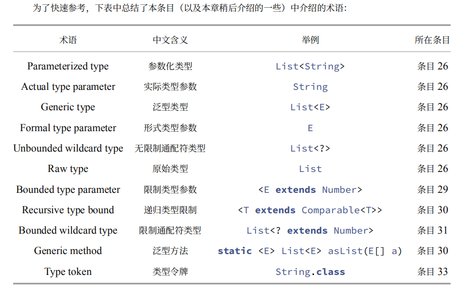

从22章节开始进行备注，以前章节 待补全

### 22.【接口仅用来定义类型】USE INTERFACES ONLY TO DEFINE TYPES
常量接口是对接口的糟糕使用
如果你想导出常量，有几个合理的选择方案。

    如果常量与现有的类或接口紧密相关，则应将其添加到该类或 接口中。例如，所有数字基本类型的包装类，如 Integer 和 Double，都会导出 MIN_VALUE 和 MAX_VALUE
    常量。
    如果常量最好被看作枚举类型的成员，则应该使用枚举类型（详⻅第 34 条）导出它们。
    否则，你应该用一个不可实例化的工具类来导出常量（详⻅第 4 条）。

 知识点：

     请注意在数字文字中使用下划线字符（_）。从 Java 7 开始，合法的下划线对数字字面量的值没
     有影响，但是如果使用得当的话可以使它们更容易阅读。无论是固定的浮点数，如果他们包含五个或更多的连续
     数字，考虑将下划线添加到数字字面量中。对于底数为 10 的数字，无论是整型还是浮点型的，都应该用下划线将
     数字分成三个数字组，表示一千的正负幂。

```jshelllanguage
    class test {/** {@link javase.effectivejava.c21.testXiaHuaXian}*/}
```
### 23 【类层次结构优于标签类】 PREFER CLASS HIERARCHIES TO TAGGED CLASSES
tagged classes are verbose, error-prone, and inefficient.
带标记的类冗长、容易出错且效率低下。  
```jshelllanguage
    class test {/** {@link javase.effectivejava.c23.Figure}*/}
```
当遇到一个带有标签字段的现有类时，可以考虑将其重构为一个类层次结构

### 24 【倾向于使用静态成员类而不是非静态类】FAVOR STATIC MEMBER CLASSES OVER NONSTATIC
嵌套类（nested class）是在另一个类中定义的类。嵌套类应该只存在于其宿主类（enclosing class）中。
如果一 个嵌套类在其他一些情况下是有用的，那么它应该是一个顶级类。
有四种嵌套类：静态成员类，非静态成员类，匿 名类和局部类。
除了第一种以外，剩下的三种都被称为内部类（inner class）。
这个条目告诉你什么时候使用哪种类型的嵌套类以及为什么使用。

### 24 25  看不懂，TODO

# 26 不要使用原始类型
泛型类和泛型接口：

第五章 泛型 Generics
自 Java 5 以来，泛型已经成为java语言的一部分。在泛型之前，你必须转换从集合中读取的每个对象。如果有
人不小心插入了错误类型的对象，则在运行时可能会失败。使用泛型，你告诉编译器在每个集合中允许哪些类型的
对象。编译器会自动插入强制转换，并在编译时告诉你是否尝试插入错误类型的对象。这样做的结果是既安全又清
晰的程序，但这些益处，不限于集合，是有代价的。本章告诉你如何最大限度地提高益处，并将并发症降至最低。
###不要使用原始类型
A class or interface whose declaration has one or more type parameters is a genericclass or interface
首先，有几个术语。一个类或接口，它的声明有一个或多个类型参数（type parameters ），被称之为泛型类或泛
型接口 [JLS，8.1.2,9.1.2]。
For example, the List interface has a single type parameter, E, representing its element type. The full name of the interface is List<E> (read “list of E”), but people often call it List for short.
Generic classes and interfaces are collectively known as generic types.
例如，List 接口具有单个类型参数 E，表示其元素类型。
接口的全名是 List<E>（读作「E」的列表），
但是人们经常称它为 List。
泛型类和接口统称为泛型类型（generic types）。

    List<String>（读作「字 String 的列表。（String 是与形式类型参数 E 相对应的实际
    类型参数）
    符串列表」）是一个参数化类型，表示其元素类型为
    最后，每个泛型定义了一个原始类型（raw type），它是没有任何类型参数的泛型类型的名称
    例如，对应于 List<E> 的原始类型是 List。原始类型的行为就像所有的泛型类型信息都从类型声明中被清除
    一样。它们的存在主要是为了与没有泛型之前的代码相兼容。

```jshelllanguage
    class test {/** {@link javase.effectivejava.c26.WithGeneric}*/}
```
正如本书所提到的，在编译完成之后尽快发现错误是值得的，理想情况是在编译时。在这种情况下，直
到运行时才发现错误，在错误发生后的很⻓一段时间，以及可能远离包含错误的代码的代码中。一旦看到
ClassCastException，就必须搜索代码类库，查找将 coin 实例放入 stamp 集合的方法调用。编译器不能
帮助你，因为它不能理解那个说「strList 是一个 字符串的List集合」的注释。

如果你使用原始类型，则会丧失反省的所有安全性和表达上的优势

    为什么语言设计者首先允许原始类型呢？答案是为了兼容性。
    泛型被添加时，Java 即将进入第二个十年，并且有大量的代码没有使用泛型。所有这些代码都
    是合法的，并且与使用泛型的新代码进行交互操作被认为是至关重要的。将参数化类型的实例传递给为原始类型
    设计的方法必须是合法的，反之亦然。这个需求，被称为迁移兼容性，驱使决策支持原始类型，并使用擦除来实现
    泛型（详⻅第 28 条）。

While you shouldn’t use raw types such as List, it is fine to use types that are parameterized to allow insertion 
of arbitrary objects, such as List<Object>.

    虽然不应该使用List等原始类型，但可以使用参数化的类型来允许插入例如 List<Object>。  
    原始类型 List 和参数化类型 List<Object> 之间有什么区别？松散地说，前者已经选择了泛型类型系统，
    而后者明确地告诉编译器，它能够保存任何类型的对象。虽然可以将 List<String> 传递给 List 类型的参数，
    但不能将其传递给 List<Object> 类型的参数。泛型有子类型的规则，List<String> 是原始类型 List 的
    子类型，但不是参数化类型 List<Object> 的子类型（条目 28）。因此，如果使用诸如 List 之类的原始类型，
    则会丢失类型安全性，但是如果使用参数化类型（例如 List<Object>）则不会。
具体说明参考：
```jshelllanguage
    class test {/**{@link javase.effectivejava.c26.UseaParameterizedType}*/}
```
把16行放开，发现不会编译而是发出错误提示。

以下代码：

    static int numElementsInCommon(Set s1, Set s2) { 
        int result = 0; 
        for (Object o1 : s1) 
            if (s2.contains(o1)) 
                result++; 
        return result; }

可以工作，但是使用原始类型是危险的，安全替代方式是使用
安全替代方式是使用无限制通配符类型（unbounded
wildcard types）。如果要使用泛型类型，但不知道或关心实际类型参数是什么，则可以使用问号来代替。例如，
泛型类型 Set<E> 的无限制通配符类型是 Set<?>（读取「某种类型的集合」）。它是最通用的参数化的 Set 类
型，能够保持任何集合
应该被优化为：
    
    static int numElementsInCommon(Set<?> s1, Set<?> s2) { ... }

有什么区别：
    通配符类型是安全的，原始类型不是。 可以把任何元素放入具有原始类型的集合中，轻易破坏
    集合的类型不变性。
    但是 不能把任何元素放入 带通配符的Collection Collection<?> 中。
    带上通配符，集合的类型不变性不会被破坏。

以上的例外情况有二： 1.类字面值中必须是永远是类型，例如  List.class, String[].class, int.class
                                            而 List<String>.class和 List<?>.class不是合法的
2。 涉及的是instanceof操作符。 因为泛型类型信息在运行时被删除

总结：
    总之，使用原始类型可能导致运行时异常，所以不要使用它们。它们仅用于与泛型引入之前的传统代码的兼
    容性和互操作性。
    作为一个快速回顾：

    Set<Object> 是一个参数化类型，表示一个可以包含任何类型对象的集合。 安全
    Set<?> 是一个通配符类型，表示一个只能包含某些未知类型对象的集合。安全
    Set 是一个原始类型，它不在泛型类型系统之列。  不安全
    前两个类型是安全的，最后一个不是。



###27 消除非检查警告
    尽可能地消除每一个未经检查的警告
    如 果 你 不 能 消 除 警 告， 但 你 可 以 证 明 引 发 警 告 的 代 码 是 类 型 安 全 的，
    那 么 （并 且 只 能 这 样） 用 @SuppressWarnings(“unchecked”) 注解来抑制警告
    SuppressWarnings 注解可用于任何声明，从单个局部变量声明到整个类。始终在尽可能最小的范围内
    使用 SuppressWarnings 注解
    每当使用 @SuppressWarnings(“unchecked”) 注解时，请添加注释，说明为什么是安全的

### 28 列表优于数组 【PREFER LISTS TO ARRAYS】

// Fails at runtime! 
Object[] objectArray = new Long[1]; 
objectArray[0] = "I don't fit in"; // Throws ArrayStoreException

```jshelllanguage
    class test {/** {@link javase.effectivejava.c28ListBetterThanArray}*/}
```
无论哪种方式，你不能把一个 String 类型放到一个 Long 类型容器中，但是用一个数组，你会发现在运
行时产生了一个错误；对于列表，可以在编译时就能发现错误。当然，你宁愿在编译时找出错误（所以这是 列表优于数组的体现之一）
为什么创建一个泛型数组是非法的？因为它不是类型安全的。如果这是合法的，编译器生成的强制转换程序
在运行时可能会因为 ClassCastException 异常而失败。这将违反泛型类型系统提供的基本保证。
为了具体说明，请考虑下面的代码片段：

    // Why generic array creation is illegal - won't compile! 2 
    List<String>[] stringLists = new List<String>[1]; // (1)
     List<Integer> intList = List.of(42); // (2)
    Object[] objects = stringLists; // (3)
    objects[0] = intList; // (4)
    String s = stringLists[0].get(0); // (5)
### 29 优先考虑泛型类 FAVOR GENERIC TYPES

```jshelllanguage
    class test {/** 
    {@link javase.effectivejava.c29.MyStack}
    {@link javase.effectivejava.c29.MyNewStack}
    {@link javase.effectivejava.c29.UserMyNewStack}
    */}
```
### 30 优先使用泛型方法 FAVOR GENERIC METHODS
