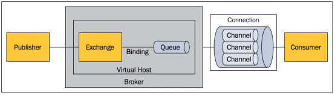

[rabbitmq.md 文章出处](https://www.jianshu.com/p/79ca08116d57)

[作者](https://www.jianshu.com/u/6c5d73c5b4cb)

##消息队列之 RabbitMQ

市面上的消息队列产品有很多，比如老牌的 ActiveMQ、RabbitMQ ，目前我看最火的 Kafka ，还有 ZeroMQ ，去年底阿里巴巴捐赠给 Apache 的 RocketMQ ，连 redis 这样的 NoSQL 数据库也支持 MQ 功能。总之这块知名的产品就有十几种，就我自己的使用经验和兴趣只打算谈谈 RabbitMQ、Kafka 和 ActiveMQ ，本文先讲 RabbitMQ ，在此之前先看下消息队列的相关概念。
#### 什么叫消息队列

消息（Message）是指在应用间传送的数据。消息可以非常简单，比如只包含文本字符串，也可以更复杂，可能包含嵌入对象。

消息队列（Message Queue）是一种应用间的通信方式，消息发送后可以立即返回，由消息系统来确保消息的可靠传递。
消息发布者只管把消息发布到 MQ 中而不用管谁来取，消息使用者只管从 MQ 中取消息而不管是谁发布的。这样发布者和使用者都不用知道对方的存在。

#### 为何用消息队列
从上面的描述中可以看出消息队列是一种应用间的异步协作机制，那什么时候需要使用 MQ 呢？

以常见的订单系统为例，用户点击【下单】按钮之后的业务逻辑可能包括：扣减库存、生成相应单据、发红包、发短信通知。
在业务发展初期这些逻辑可能放在一起同步执行，随着业务的发展订单量增长，需要提升系统服务的性能，
这时可以将一些不需要立即生效的操作拆分出来异步执行，比如发放红包、发短信通知等。这种场景下就可以用 MQ ，
在下单的主流程（比如扣减库存、生成相应单据）完成之后发送一条消息到 MQ 让主流程快速完结，
而由另外的单独线程拉取MQ的消息（或者由 MQ 推送消息），当发现 MQ 中有发红包或发短信之类的消息时，执行相应的业务逻辑。
以上是用于业务解耦的情况，其它常见场景包括最终一致性、广播、错峰流控等等。

##### RabbitMQ 特点
RabbitMQ 是一个由 Erlang 语言开发的 AMQP 的开源实现。
AMQP ：Advanced Message Queue，高级消息队列协议。它是应用层协议的一个开放标准，为面向消息的中间件设计，
基于此协议的客户端与消息中间件可传递消息，并不受产品、开发语言等条件的限制。

RabbitMQ 最初起源于金融系统，用于在分布式系统中存储转发消息，在易用性、扩展性、高可用性等方面表现不俗。具体特点包括：

1.可靠性（Reliability）

    RabbitMQ 使用一些机制来保证可靠性，如持久化、传输确认、发布确认。

2.灵活的路由（Flexible Routing）

    在消息进入队列之前，通过 Exchange 来路由消息的。对于典型的路由功能，RabbitMQ 已经提供了一些内置的 Exchange 来实现。针对更复杂的路由功能，
    可以将多个 Exchange 绑定在一起，也通过插件机制实现自己的 Exchange 。

3.消息集群（Clustering）

    多个 RabbitMQ 服务器可以组成一个集群，形成一个逻辑 Broker 。

4.高可用（Highly Available Queues）

    队列可以在集群中的机器上进行镜像，使得在部分节点出问题的情况下队列仍然可用。

5.多种协议（Multi-protocol）

    RabbitMQ 支持多种消息队列协议，比如 STOMP、MQTT 等等。

6.多语言客户端（Many Clients）

    RabbitMQ 几乎支持所有常用语言，比如 Java、.NET、Ruby 等等。

9.管理界面（Management UI）

    RabbitMQ 提供了一个易用的用户界面，使得用户可以监控和管理消息 Broker 的许多方面。

8.跟踪机制（Tracing）

    如果消息异常，RabbitMQ 提供了消息跟踪机制，使用者可以找出发生了什么。

9.插件机制（Plugin System）
  
      RabbitMQ 提供了许多插件，来从多方面进行扩展，也可以编写自己的插件。 

#### RabbitMQ 中的概念模型
消息模型
所有 MQ 产品从模型抽象上来说都是一样的过程：
**消费者（consumer）订阅某个队列。生产者（producer）创建消息，然后发布到队列（queue）中，最后将消息发送到监听的消费者。**

消息流
RabbitMQ 基本概念
上面只是最简单抽象的描述，具体到 RabbitMQ 则有更详细的概念需要解释。

上面介绍过 RabbitMQ 是 AMQP 协议的一个开源实现，所以其内部实际上也是 AMQP 中的基本概念：

1.Message

    消息，消息是不具名的，它由消息头和消息体组成。消息体是不透明的，而消息头则由一系列的可选属性组成，这些属性包括
    routing-key（路由键）、priority（相对于其他消息的优先权）、delivery-mode（指出该消息可能需要持久性存储）等。

2.Publisher

    消息的生产者，也是一个向交换器发布消息的客户端应用程序。
3.Exchange

    交换器，用来接收生产者发送的消息并将这些消息路由给服务器中的队列。
4.Binding

    绑定，用于消息队列和交换器之间的关联。一个绑定就是基于路由键将交换器和消息队列连接起来的路由规则，
    所以可以将交换器理解成一个由绑定构成的路由表。

5.Queue

    消息队列，用来保存消息直到发送给消费者。它是消息的容器，也是消息的终点。一个消息可投入一个或多个队列。消息一直在队列里面，
    等待消费者连接到这个队列将其取走。

6.Connection

    网络连接，比如一个TCP连接。
7.Channel

    信道，多路复用连接中的一条独立的双向数据流通道。信道是建立在真实的TCP连接内地虚拟连接，AMQP 命令都是通过信道发出去的，
    不管是发布消息、订阅队列还是接收消息，这些动作都是通过信道完成。因为对于操作系统来说建立和销毁 TCP 都是非常昂贵的开销，
    所以引入了信道的概念，以复用一条 TCP 连接。

8.Consumer

    消息的消费者，表示一个从消息队列中取得消息的客户端应用程序。
9.Virtual Host

    虚拟主机，表示一批交换器、消息队列和相关对象。虚拟主机是共享相同的身份认证和加密环境的独立服务器域。
    每个 vhost 本质上就是一个 mini 版的 RabbitMQ 服务器，拥有自己的队列、交换器、绑定和权限机制。
    vhost 是 AMQP 概念的基础，必须在连接时指定，RabbitMQ 默认的 vhost 是 / 。
10.Broker
    表示消息队列服务器实体。

#### AMQP 中的消息路由

AMQP 中消息的路由过程和 Java 开发者熟悉的 JMS 存在一些差别，AMQP 中增加了 Exchange 和 Binding 的角色。生产者把消息发布到 Exchange 上，消息最终到达队列并被消费者接收，而 Binding 决定交换器的消息应该发送到那个队列。

AMQP 的消息路由过程
Exchange 类型
Exchange分发消息时根据类型的不同分发策略有区别，目前共四种类型：direct、fanout、topic、headers 。headers 匹配 AMQP 消息的 header 而不是路由键，此外 headers 交换器和 direct 交换器完全一致，但性能差很多，目前几乎用不到了，所以直接看另外三种类型：
direct

direct 交换器

消息中的路由键（routing key）如果和 Binding 中的 binding key 一致， 交换器就将消息发到对应的队列中。路由键与队列名完全匹配，如果一个队列绑定到交换机要求路由键为“dog”，则只转发 routing key 标记为“dog”的消息，不会转发“dog.puppy”，也不会转发“dog.guard”等等。它是完全匹配、单播的模式。
fanout

fanout 交换器

每个发到 fanout 类型交换器的消息都会分到所有绑定的队列上去。fanout 交换器不处理路由键，只是简单的将队列绑定到交换器上，每个发送到交换器的消息都会被转发到与该交换器绑定的所有队列上。很像子网广播，每台子网内的主机都获得了一份复制的消息。fanout 类型转发消息是最快的。
topic

topic 交换器

topic 交换器通过模式匹配分配消息的路由键属性，将路由键和某个模式进行匹配，此时队列需要绑定到一个模式上。它将路由键和绑定键的字符串切分成单词，这些单词之间用点隔开。它同样也会识别两个通配符：符号“#”和符号“”。#匹配0个或多个单词，匹配不多不少一个单词。
RabbitMQ 安装
一般来说安装 RabbitMQ 之前要安装 Erlang ，可以去Erlang官网下载。接着去RabbitMQ官网下载安装包，之后解压缩即可。根据操作系统不同官网提供了相应的安装说明：Windows、Debian / Ubuntu、RPM-based Linux、Mac
如果是Mac 用户，个人推荐使用 HomeBrew 来安装，安装前要先更新 brew：
brew update
接着安装 rabbitmq 服务器：
brew install rabbitmq
这样 RabbitMQ 就安装好了，安装过程中会自动其所依赖的 Erlang 。
RabbitMQ 运行和管理
启动
启动很简单，找到安装后的 RabbitMQ 所在目录下的 sbin 目录，可以看到该目录下有6个以 rabbitmq 开头的可执行文件，直接执行 rabbitmq-server 即可，下面将 RabbitMQ 的安装位置以 . 代替，启动命令就是：
./sbin/rabbitmq-server
启动正常的话会看到一些启动过程信息和最后的 completed with 7 plugins，这也说明启动的时候默认加载了7个插件。

正常启动
后台启动
如果想让 RabbitMQ 以守护程序的方式在后台运行，可以在启动的时候加上 -detached 参数：
./sbin/rabbitmq-server -detached
查询服务器状态
sbin 目录下有个特别重要的文件叫 rabbitmqctl ，它提供了 RabbitMQ 管理需要的几乎一站式解决方案，绝大部分的运维命令它都可以提供。
查询 RabbitMQ 服务器的状态信息可以用参数 status ：
./sbin/rabbitmqctl status
该命令将输出服务器的很多信息，比如 RabbitMQ 和 Erlang 的版本、OS 名称、内存等等
关闭 RabbitMQ 节点
我们知道 RabbitMQ 是用 Erlang 语言写的，在Erlang 中有两个概念：节点和应用程序。节点就是 Erlang 虚拟机的每个实例，而多个 Erlang 应用程序可以运行在同一个节点之上。节点之间可以进行本地通信（不管他们是不是运行在同一台服务器之上）。比如一个运行在节点A上的应用程序可以调用节点B上应用程序的方法，就好像调用本地函数一样。如果应用程序由于某些原因奔溃，Erlang 节点会自动尝试重启应用程序。
如果要关闭整个 RabbitMQ 节点可以用参数 stop ：
./sbin/rabbitmqctl stop
它会和本地节点通信并指示其干净的关闭，也可以指定关闭不同的节点，包括远程节点，只需要传入参数 -n ：
./sbin/rabbitmqctl -n rabbit@server.example.com stop
-n node 默认 node 名称是 rabbit@server ，如果你的主机名是 server.example.com ，那么 node 名称就是 rabbit@server.example.com 。
关闭 RabbitMQ 应用程序
如果只想关闭应用程序，同时保持 Erlang 节点运行则可以用 stop_app：
./sbin/rabbitmqctl stop_app
这个命令在后面要讲的集群模式中将会很有用。
启动 RabbitMQ 应用程序
./sbin/rabbitmqctl start_app
重置 RabbitMQ 节点
./sbin/rabbitmqctl reset
该命令将清除所有的队列。
查看已声明的队列
./sbin/rabbitmqctl list_queues
查看交换器
./sbin/rabbitmqctl list_exchanges
该命令还可以附加参数，比如列出交换器的名称、类型、是否持久化、是否自动删除：
./sbin/rabbitmqctl list_exchanges name type durable auto_delete
查看绑定
./sbin/rabbitmqctl list_bindings
Java 客户端访问
RabbitMQ 支持多种语言访问，以 Java 为例看下一般使用 RabbitMQ 的步骤。
maven工程的pom文件中添加依赖
<dependency>
<groupId>com.rabbitmq</groupId>
<artifactId>amqp-client</artifactId>
<version>4.1.0</version>
</dependency>
消息生产者
package org.study.rabbitmq;
import com.rabbitmq.client.Channel;
import com.rabbitmq.client.Connection;
import com.rabbitmq.client.ConnectionFactory;
import java.io.IOException;
import java.util.concurrent.TimeoutException;
public class Producer {

    public static void main(String[] args) throws IOException, TimeoutException {
        //创建连接工厂
        ConnectionFactory factory = new ConnectionFactory();
        factory.setUsername("guest");
        factory.setPassword("guest");
        //设置 RabbitMQ 地址
        factory.setHost("localhost");
        //建立到代理服务器到连接
        Connection conn = factory.newConnection();
        //获得信道
        Channel channel = conn.createChannel();
        //声明交换器
        String exchangeName = "hello-exchange";
        channel.exchangeDeclare(exchangeName, "direct", true);

        String routingKey = "hola";
        //发布消息
        byte[] messageBodyBytes = "quit".getBytes();
        channel.basicPublish(exchangeName, routingKey, null, messageBodyBytes);

        channel.close();
        conn.close();
    }
}
消息消费者
package org.study.rabbitmq;
import com.rabbitmq.client.*;
import java.io.IOException;
import java.util.concurrent.TimeoutException;
public class Consumer {

    public static void main(String[] args) throws IOException, TimeoutException {
        ConnectionFactory factory = new ConnectionFactory();
        factory.setUsername("guest");
        factory.setPassword("guest");
        factory.setHost("localhost");
        //建立到代理服务器到连接
        Connection conn = factory.newConnection();
        //获得信道
        final Channel channel = conn.createChannel();
        //声明交换器
        String exchangeName = "hello-exchange";
        channel.exchangeDeclare(exchangeName, "direct", true);
        //声明队列
        String queueName = channel.queueDeclare().getQueue();
        String routingKey = "hola";
        //绑定队列，通过键 hola 将队列和交换器绑定起来
        channel.queueBind(queueName, exchangeName, routingKey);

        while(true) {
            //消费消息
            boolean autoAck = false;
            String consumerTag = "";
            channel.basicConsume(queueName, autoAck, consumerTag, new DefaultConsumer(channel) {
                @Override
                public void handleDelivery(String consumerTag,
                                           Envelope envelope,
                                           AMQP.BasicProperties properties,
                                           byte[] body) throws IOException {
                    String routingKey = envelope.getRoutingKey();
                    String contentType = properties.getContentType();
                    System.out.println("消费的路由键：" + routingKey);
                    System.out.println("消费的内容类型：" + contentType);
                    long deliveryTag = envelope.getDeliveryTag();
                    //确认消息
                    channel.basicAck(deliveryTag, false);
                    System.out.println("消费的消息体内容：");
                    String bodyStr = new String(body, "UTF-8");
                    System.out.println(bodyStr);

                }
            });
        }
    }
}
启动 RabbitMQ 服务器
./sbin/rabbitmq-server
运行 Consumer
先运行 Consumer ，这样当生产者发送消息的时候能在消费者后端看到消息记录。
运行 Producer
接着运行 Producer ,发布一条消息，在 Consumer 的控制台能看到接收的消息：

Consumer 控制台
RabbitMQ 集群
RabbitMQ 最优秀的功能之一就是内建集群，这个功能设计的目的是允许消费者和生产者在节点崩溃的情况下继续运行，以及通过添加更多的节点来线性扩展消息通信吞吐量。RabbitMQ 内部利用 Erlang 提供的分布式通信框架 OTP 来满足上述需求，使客户端在失去一个 RabbitMQ 节点连接的情况下，还是能够重新连接到集群中的任何其他节点继续生产、消费消息。
RabbitMQ 集群中的一些概念
RabbitMQ 会始终记录以下四种类型的内部元数据：
队列元数据
包括队列名称和它们的属性，比如是否可持久化，是否自动删除
交换器元数据
交换器名称、类型、属性
绑定元数据
内部是一张表格记录如何将消息路由到队列
vhost 元数据
为 vhost 内部的队列、交换器、绑定提供命名空间和安全属性
在单一节点中，RabbitMQ 会将所有这些信息存储在内存中，同时将标记为可持久化的队列、交换器、绑定存储到硬盘上。存到硬盘上可以确保队列和交换器在节点重启后能够重建。而在集群模式下同样也提供两种选择：存到硬盘上（独立节点的默认设置），存在内存中。
如果在集群中创建队列，集群只会在单个节点而不是所有节点上创建完整的队列信息（元数据、状态、内容）。结果是只有队列的所有者节点知道有关队列的所有信息，因此当集群节点崩溃时，该节点的队列和绑定就消失了，并且任何匹配该队列的绑定的新消息也丢失了。还好RabbitMQ 2.6.0之后提供了镜像队列以避免集群节点故障导致的队列内容不可用。
RabbitMQ 集群中可以共享 user、vhost、exchange等，所有的数据和状态都是必须在所有节点上复制的，例外就是上面所说的消息队列。RabbitMQ 节点可以动态的加入到集群中。
当在集群中声明队列、交换器、绑定的时候，这些操作会直到所有集群节点都成功提交元数据变更后才返回。集群中有内存节点和磁盘节点两种类型，内存节点虽然不写入磁盘，但是它的执行比磁盘节点要好。内存节点可以提供出色的性能，磁盘节点能保障配置信息在节点重启后仍然可用，那集群中如何平衡这两者呢？
RabbitMQ 只要求集群中至少有一个磁盘节点，所有其他节点可以是内存节点，当节点加入火离开集群时，它们必须要将该变更通知到至少一个磁盘节点。如果只有一个磁盘节点，刚好又是该节点崩溃了，那么集群可以继续路由消息，但不能创建队列、创建交换器、创建绑定、添加用户、更改权限、添加或删除集群节点。换句话说集群中的唯一磁盘节点崩溃的话，集群仍然可以运行，但知道该节点恢复，否则无法更改任何东西。
RabbitMQ 集群配置和启动
如果是在一台机器上同时启动多个 RabbitMQ 节点来组建集群的话，只用上面介绍的方式启动第二、第三个节点将会因为节点名称和端口冲突导致启动失败。所以在每次调用 rabbitmq-server 命令前，设置环境变量 RABBITMQ_NODENAME 和 RABBITMQ_NODE_PORT 来明确指定唯一的节点名称和端口。下面的例子端口号从5672开始，每个新启动的节点都加1，节点也分别命名为test_rabbit_1、test_rabbit_2、test_rabbit_3。
启动第1个节点：
RABBITMQ_NODENAME=test_rabbit_1 RABBITMQ_NODE_PORT=5672 ./sbin/rabbitmq-server -detached
启动第2个节点：
RABBITMQ_NODENAME=test_rabbit_2 RABBITMQ_NODE_PORT=5673 ./sbin/rabbitmq-server -detached
启动第2个节点前建议将 RabbitMQ 默认激活的插件关掉，否则会存在使用了某个插件的端口号冲突，导致节点启动不成功。
现在第2个节点和第1个节点都是独立节点，它们并不知道其他节点的存在。集群中除第一个节点外后加入的节点需要获取集群中的元数据，所以要先停止 Erlang 节点上运行的 RabbitMQ 应用程序，并重置该节点元数据，再加入并且获取集群的元数据，最后重新启动 RabbitMQ 应用程序。
停止第2个节点的应用程序：
./sbin/rabbitmqctl -n test_rabbit_2 stop_app
重置第2个节点元数据：
./sbin/rabbitmqctl -n test_rabbit_2 reset
第2节点加入第1个节点组成的集群：
./sbin/rabbitmqctl -n test_rabbit_2 join_cluster test_rabbit_1@localhost
启动第2个节点的应用程序
./sbin/rabbitmqctl -n test_rabbit_2 start_app
第3个节点的配置过程和第2个节点类似：
RABBITMQ_NODENAME=test_rabbit_3 RABBITMQ_NODE_PORT=5674 ./sbin/rabbitmq-server -detached

./sbin/rabbitmqctl -n test_rabbit_3 stop_app

./sbin/rabbitmqctl -n test_rabbit_3 reset

./sbin/rabbitmqctl -n test_rabbit_3 join_cluster test_rabbit_1@localhost

./sbin/rabbitmqctl -n test_rabbit_3 start_app
RabbitMQ 集群运维
停止某个指定的节点，比如停止第2个节点：
RABBITMQ_NODENAME=test_rabbit_2 ./sbin/rabbitmqctl stop
查看节点3的集群状态：
./sbin/rabbitmqctl -n test_rabbit_3 cluster_status
