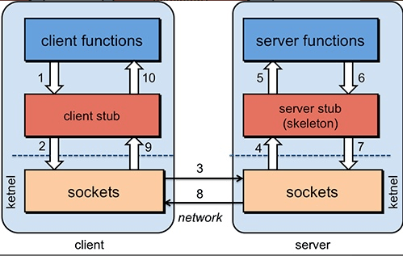

## SpringCloud篇

### 1 、什么是SpringCloud

Spring cloud 流应用程序启动器是基于 Spring Boot 的 Spring 集成应用程序，提供与外部系统的集成。Spring cloud Task，一个生命周期短暂的微服务框架，用于快速构建执行有限数据处理的应用
程序。

### 2 、什么是微服务? 将单一应用程序划分为一组小的服务

微服务架构是一种架构模式或者说是一种架构风格，它**提倡将单一应用程序划分为一组小的服务，每个服务运行在其独立的自己的进程中，服务之间相互协调、互相配合，为用户提供最终价值。**
服务之间采用轻量级的通信机制互相沟通（通常是基于HTTP的RESTful API）,每个服务都围绕着具体的业务进行构建，并且能够被独立的构建在生产环境、类生产环境等。
另外，应避免统一的、集中式的服务管理机制，对具体的一个服务而言，应根据业务上下文，选择合适的语言、工具对其进行构建，可以有一个非常轻量级的集中式管理来协调这些服务，
可以使用不同的语言来编写服务，也可以使用不同的数据存储。

### 3 、SpringCloud有什么优势

使用 Spring Boot 开发分布式微服务时，我们面临以下问题

1. 与分布式系统相关的复杂性-这种开销包括网络问题，延迟开销，带宽问题，安全问题。
2. 服务发现-服务发现工具管理群集中的流程和服务如何查找和互相交谈。它涉及一个服务目录，在该目录中注册服务，然后能够查找并连接到该目录中的服务。
3. 冗余-分布式系统中的冗余问题。
4. 负载平衡 --负载平衡改善跨多个计算资源的工作负荷，诸如计算机，计算机集群，网络链路，中央处理单元，或磁盘驱动器的分布。
5. 性能-问题 由于各种运营开销导致的性能问题。
6. 部署复杂性-Devops 技能的要求。

### 4 、 什么是服务熔断？什么是服务降级？

> 服务降级 fallback : 假设对方系统不可用了，客户端可以自己准备一个本地的fallback回调给返回一个兜底的解决办法 不让客户等待并立刻返回一个友好提示比如：服务器忙，请稍后再试，

    哪些情况会降级： 程序运行异常，超时，服务熔断触发服务降级，线程池/信号量打满也会导致服务降级

> 服务熔断 break: 就是保险丝，跳闸限电。 达到最大访问量后，调用服务降级的方法并返回友好提示。 服务的降级->进而熔断->恢复调用链路

> 服务限流 flowlimit ：秒杀高并发等操作，严禁一窝蜂的过来拥挤，大家排队，一秒钟N个，有序进行

 熔断机制是应对雪崩效应的一种微服务链路保护机制。当某个微服务不可用或者响应时间太长时，会进行服务降级，进而熔断该节点微服务的调用，
 快速返回“错误”的响应信息。当检测到该节点微服务调用响应正常后恢复调用链路。在SpringCloud框架里熔断机制通过Hystrix实现，Hystrix会监控微服务间调用的状况，
 当失败的调用到一定阈值，缺省是 5 秒内调用 20 次，如果失败，就会启动熔断机制。

服务降级，一般是从整体负荷考虑。就是当某个服务熔断之后，服务器将不再被调用，此时客户端可以自己准备一个本地的fallback回调，返回一个缺省值。
这样做，虽然水平下降，但好歹可用，比直接挂掉强。

Hystrix相关注解 @EnableHystrix：开启熔断 @HystrixCommand(fallbackMethod=”XXX”)：声明
一个失败回滚处理函数XXX，当被注解的方法执行超时（默认是 1000 毫秒），就会执行fallback函
数，返回错误提示。

### 5 、 Eureka和zookeeper都可以提供服务注册与发现的功能，请说说两个的区别？

```
CAP理论的核心是：一个分布式系统不可能同时很好的满足C:Consistency（强一致性），A:Availability（可用性）和 P:Partition tolerance（分区容错性）这三个需求，
最多只能同时较好的满足两个。
因此，根据 CAP 原理将 NoSQL 数据库分成了满足 CA 原则、满足 CP 原则和满足 AP 原则三 大类：
CA - 单点集群，满足一致性，可用性的系统，通常在可扩展性上不太强大。
CP - 满足一致性，分区容忍必的系统，通常性能不是特别高。
AP - 满足可用性，分区容忍性的系统，通常可能对一致性要求低一些。
```

Zookeeper保证了CP（C：一致性，P：分区容错性），Eureka保证了AP（A：高可用） 1.当向注册中心查询服务列表时，我们可以容忍注册中心返回的是几分钟以前的信息，
但不能容忍直接down掉不可用。也就是说，服务注册功能对高可用性要求比较高，但zk会出现这样一种情况，当master节点因为网络故障与其他节点失去联系时，剩余节点会重新选leader。
问题在于，选取 leader时间过长，30 ~ 120s，且选取期间zk集群都不可用，这样就会导致选取期间注册服务瘫痪。
在云部署的环境下，因网络问题使得zk集群失去master节点是较大概率会发生的事，虽然服务能够恢复，但是漫长的选取时间导致的注册长期不可用是不能容忍的。

2.Eureka保证了可用性，Eureka各个节点是平等的，几个节点挂掉不会影响正常节点的工作，剩余的节点仍然可以提供注册和查询服务。
而Eureka的客户端向某个Eureka注册或发现时发生连接失败，则会自动切换到其他节点，只要有一台Eureka还在，就能保证注册服务可用，
只是查到的信息可能不是最新的。

除此之外，Eureka还有自我保护机制，如果在 15 分钟内超过85%的节点没有正常的心跳，那么Eureka就认为客户端与注册中心发生了网络故障，此时会出现以下几种情况：
 1. Eureka不在从注册列表中移除因为长时间没有收到心跳而应该过期的服务。
 2. Eureka仍然能够接受新服务的注册和查询请求，但是不会被同步到其他节点上（即保证当前节点仍然可用） 
 3. 当网络稳定时，当前实例新的注册信息会被同步到其他节点。

因此，Eureka可以很好的应对因网络故障导致部分节点失去联系的情况，而不会像Zookeeper那样使整个微服务瘫痪

### 6 、SpringBoot和SpringCloud的区别？

SpringBoot专注于快速方便的开发单个个体微服务。

SpringCloud是关注全局的微服务协调整理治理框架，它将SpringBoot开发的一个个单体微服务整合并管理起来，

为各个微服务之间提供，配置管理、服务发现、断路器、路由、微代理、事件总线、全局锁、决策竞选、分布式会话等等集成服务

SpringBoot可以离开SpringCloud独立使用开发项目， 但是SpringCloud离不开SpringBoot ，属于依赖的关系.

SpringBoot专注于快速、方便的开发单个微服务个体，SpringCloud关注全局的服务治理框架。

### 7 、负载平衡的意义什么？
负载均衡系统通常用于将任务比如用户请求处理分配到多个服务器处理以提高网站、应用或者数据库的性能和可靠性。

常见的负载均衡系统包括 3 种：

1. **DNS 负载均衡** ：一般用来实现地理级别的均衡。
2. **硬件负载均衡** ： 通过单独的硬件设备比如 F5 来实现负载均衡功能（硬件的价格一般很贵）。
3. **软件负载均衡** ：通过负载均衡软件比如 Nginx 来实现负载均衡功能。

 答案一来自 javaGuide 

 答案二：
 在计算中，**负载平衡可以改善跨计算机，计算机集群，网络链接，中央处理单元或磁盘驱动器等多种计算资源的工作负载分布**。
 负载平衡旨在优`化资源使用`，`最大化吞吐量`，`最小化响应时间` 并 `避免任何单一资源的过载`。使用多个组件进行负载平衡而不是单个组件
 可能会通过冗余来提高可靠性和可用性。负载平衡通常涉及专用软件或硬件，例如多层交换机或域名系统服务器进程。

### 8 、什么是 Hystrix？它如何实现容错？

Hystrix 是一个用于**处理分布式系统的延迟和容错的开源库**，在分布式系统里，许多依赖不可避免的会调用失败，比如超时、异常等，
Hystrix 能够保证在一个依赖出问题的情况下，不会导致整体服务失败，避免级联故障，以提高分布式系统的弹性。

“断路器”本身是一种开关装置，当某个服务单元发生故障之后，通过断路器的故障监控（类似熔断保险丝），向调用方返回一个符合预期的、可处理的备选响应（FallBack），
而不是长时间的等待或者抛出调用方无法处理的异常，这样就**保证了服务调用方的线程不会被长时间、不必要地占用**，从而避免了故障在分布式系统中的蔓延，乃至雪崩。

ps: 以上来自 SpringCloud2020.mmap   尚硅谷-周阳
[](学习记录/springcloud学习笔记/SpringCloud2020.mmap)

### 9 、
## RPC基础

### 何为 RPC?

**RPC（Remote Procedure Call）** 即远程过程调用，通过名字我们就能看出 RPC 关注的是远程调用而非本地调用。

**为什么要 RPC  ？**

**因为，两个不同的服务器上的服务提供的方法不在一个内存空间，所以，需要通过网络编程才能传递方法调用所需要的参数。并且，方法调用的结果也需要通过网络编程来接收。
但是，如果我们自己手动网络编程来实现这个调用过程的话工作量是非常大的，因为，我们需要考虑底层传输方式（TCP还是UDP）、序列化方式等等方面。**


**RPC 能帮助我们做什么呢？** 简单来说，通过 RPC 可以帮助我们调用远程计算机上某个服务的方法，这个过程就像调用本地方法一样简单。并且！我们不需要了解底层网络编程的具体细节。


举个例子：两个不同的服务 A、B 部署在两台不同的机器上，服务 A 如果想要调用服务 B 中的某个方法的话就可以通过 RPC 来做。

一言蔽之：**RPC 的出现就是为了让你调用远程方法像调用本地方法一样简单。**

### RPC 的原理是什么?

整个 RPC的 核心功能看作是下面 👇  6 个部分实现的：

1. **客户端（服务消费端）** ：调用远程方法的一端。
2. **客户端 Stub（桩）** ： 这其实就是一代理类。代理类主要做的事情很简单，就是把你调用方法、类、方法参数等信息传递到服务端。
3. **网络传输** ： 网络传输就是你要把你调用的方法的信息比如说参数啊这些东西传输到服务端，然后服务端执行完之后再把返回结果通过网络传输给你传输回来。网络传输的实现方式有很多种比如最近基本的 Socket或者性能以及封装更加优秀的 Netty（推荐）。
4. **服务端 Stub（桩）** ：这个桩就不是代理类了。我觉得理解为桩实际不太好，大家注意一下就好。这里的服务端 Stub 实际指的就是接收到客户端执行方法的请求后，去指定对应的方法然后返回结果给客户端的类。
5. **服务端（服务提供端）** ：提供远程方法的一端。


具体原理图如下，后面我会串起来将整个RPC的过程给大家说一下。



1. 服务消费端（client）以本地调用的方式调用远程服务；
2. 客户端 Stub（client stub） 接收到调用后负责将方法、参数等组装成能够进行网络传输的消息体（序列化）：`RpcRequest`；
3. 客户端 Stub（client stub） 找到远程服务的地址，并将消息发送到服务提供端；
4. 服务端 Stub（桩）收到消息将消息反序列化为Java对象: `RpcRequest`；
5. 服务端 Stub（桩）根据`RpcRequest`中的类、方法、方法参数等信息调用本地的方法；
6. 服务端 Stub（桩）得到方法执行结果并将组装成能够进行网络传输的消息体：`RpcResponse`（序列化）发送至消费方；
7. 客户端 Stub（client stub）接收到消息并将消息反序列化为Java对象:`RpcResponse` ，这样也就得到了最终结果。over!


相信小伙伴们看完上面的讲解之后，已经了解了 RPC 的原理。

虽然篇幅不多，但是基本把 RPC 框架的核心原理讲清楚了！另外，对于上面的技术细节，我会在后面的章节介绍到。

**最后，对于 RPC 的原理，希望小伙伴不单单要理解，还要能够自己画出来并且能够给别人讲出来。因为，在面试中这个问题在面试官问到 RPC 相关内容的时候基本都会碰到。**

### 10 、说说 RPC 的实现原理

 首先需要有处理网络连接通讯的模块，负责连接建立、管理和消息的传输。其次需要有编 解码的模块，因为网络通讯都是传输的字节码，需要将我们使用的对象序列化和反序列 化。
 剩下的就是客户端和服务器端的部分，服务器端暴露要开放的服务接口，客户调用服 务接口的一个代理实现，这个

 代理实现负责收集数据、编码并传输给服务器然后等待结果 返回。

### 11 ，eureka自我保护机制是什么?

当Eureka Server 节点在短时间内丢失了过多实例的连接时（比如网络故障或频繁启动关闭客户端）节点会进入自我保护模式，保护注册信息，
不再删除注册数据，故障恢复时，自动退出自我保护模式。

### 12 ，什么是 Ribbon？
> Ribbon 负载均衡 + restTemplate 调用

Spring Cloud Ribbon 是基于 Netflix Ribbon 实现的一套客户端 负载均衡的工具。
简单的说，Ribbon是 Netflix 发布的开源项目，主要功能是提供客户端的软件负载均衡算法和服务调用。**Ribbon 客户端组件提供一系列完善的配置项如连接超时，重试等**。
简单的说，就是在配置文件中列出 Load Balancer（简称LB）后面所有的机器，`Ribbon` 会自动的 基于某种规则（如简单轮询，随机连接等）去连接这些机器。
我们很容易使用Ribbon实现自定义的负载均衡算法。


### 13 ，什么是feigin？它的优点是什么？
Feign是一个声明式的Web服务客户端，让编写Web服务客户端变得非常容易，只需创建一个接口并在接口上添加注解即可

1. feign采用的是基于接口的注解
2. feign整合了ribbon，具有负载均衡的能力 
3. 整合了Hystrix，具有熔断的能力

使用: 
1. 添加pom依赖。 
2. 启动类添加 @EnableFeignClients 
3. 定义一个接口 @FeignClient(name=“xxx”) 指定调用哪个服务


```xml

<dependency>
 <groupId>org.springframework.cloud</groupId>
 <artifactId>spring-cloud-starter-feign</artifactId>
</dependency>

<dependency>
<groupId>org.springframework.cloud</groupId>
<artifactId>spring-cloud-starter-openfeign</artifactId>
</dependency>
```


Feign和 OpenFeign的区别

|     | Feign    |  OpenFeign   |
|-----|-----|-----|
|     | Feign是Spring Cloud组件中的一个轻量级RESTful的HTTP服务客户端Feign内置了Ribbon，用来做客户端负载均衡，去调用服务注册中心的服务。Feign的使用方式是：使用Feign的注解定义接口，调用这个接口，就可以调用服务注册中心的服务    |   OpenFeign是Spring Cloud 在Feign的基础上支持了SpringMVC的注解，如@RequesMapping等等。OpenFeign的@FeignClient可以解析SpringMVC的@RequestMapping注解下的接口，并通过动态代理的方式产生实现类，实现类中做负载均衡并调用其他服务。  |
|     |     |     |
|     |     |     |
|     |     |     |


### 14 ， Ribbon和Feign的区别？

1. Ribbon都是调用其他服务的，但方式不同。 
2. 启动类注解不同，Ribbon是@RibbonClient feign 的是@EnableFeignClients 
3. 服务指定的位置不同，Ribbon是在@RibbonClient注解上声明，Feign 则是在定义抽象方法的接口中使用@FeignClient声明。 
4. 4.调用方式不同，Ribbon需要自己构建http 请求，模拟http请求

// ----------------分割线 dubbo 未整理


## Dubbo篇

其实关于 Dubbo 的面试题，我觉得最好的文档应该还是官网，因为官网有中文版，照顾了很多阅读英文文档吃力的小伙伴。但是官网内容挺多的，于是这里就结合官网和平时面试被问的相对较多的题目整理了一下。

### 1 、 说说一次 Dubbo 服务请求流程？

 基本工作流程：


 上图中角色说明：

### 2 、说说 Dubbo 工作原理

 工作原理分 10 层：

第一层：service 层，接口层，给服务提供者和消费者来实现的（留给开发人员来实现）；
第二层：config 层，配置层，主要是对 Dubbo 进行各种配置的，Dubbo 相关配置；
第三层：proxy 层，服务代理层，透明生成客户端的 stub 和服务单的 skeleton，调用的是接
口，实现类没有，所以得生成代理，代理之间再进行网络通讯、负责均衡等；
第四层：registry 层，服务注册层，负责服务的注册与发现；

第五层：cluster 层，集群层，封装多个服务提供者的路由以及负载均衡，将多个实例组合成一
个服务；
第六层：monitor 层，监控层，对 rpc 接口的调用次数和调用时间进行监控；
第七层：protocol 层，远程调用层，封装 rpc 调用；
第八层：exchange 层，信息交换层，封装请求响应模式，同步转异步；
第九层：transport 层，网络传输层，抽象 mina 和 netty 为统一接口；
第十层：serialize 层，数据序列化层。

这是个很坑爹的面试题，但是很多面试官又喜欢问，你真的要背么？你能背那还是不错的，我建议不要背，你就想想 Dubbo 服务调用过程中应该会涉及到哪些技术，把这些技术串起来就 OK 了。

面试扩散

如果让你设计一个 RPC 框架，你会怎么做？其实你就把上面这个工作原理中涉及的到技术点总结一下就行了。

### 3 、Dubbo 支持哪些协议？

还有三种，混个眼熟就行：Memcached 协议、Redis 协议、Rest 协议。

上图基本上把序列化的方式也罗列出来了。

详细请参考：Dubbo 官网：http://dubbo.apache.org/zh-cn/docs/user/references/protocol/dubbo.html。

### 4 、注册中心挂了，consumer 还能不能调用 provider？

可以。因为刚开始初始化的时候，consumer 会将需要的所有提供者的地址等信息拉取到本地缓存，所以注册中心挂了可以继续通信。但是 provider 挂了，那就没法调用了。


关键字：consumer 本地缓存服务列表。

### 5 、怎么实现动态感知服务下线的呢？


服务订阅通常有 pull 和 push 两种方式：

```
pull 模式需要客户端定时向注册中心拉取配置；
push 模式采用注册中心主动推送数据给客户端。
```

Dubbo ZooKeeper 注册中心采用是事件通知与客户端拉取方式。服务第一次订阅的时候将会拉取
对应目录下全量数据，然后在订阅的节点注册一个 watcher。一旦目录节点下发生任何数据变化，
ZooKeeper 将会通过 watcher 通知客户端。客户端接到通知，将会重新拉取该目录下全量数据，
并重新注册 watcher。利用这个模式，Dubbo 服务就可以做到服务的动态发现。

注意：ZooKeeper 提供了“心跳检测”功能，它会定时向各个服务提供者发送一个请求（实际上建立
的是一个 socket 长连接），如果长期没有响应，服务中心就认为该服务提供者已经“挂了”，并将其
剔除。

### 6 、Dubbo 负载均衡策略？

 随机（默认）：随机来

 轮训：一个一个来

 活跃度：机器活跃度来负载

```
一致性 hash：落到同一台机器上
```
### 7 、 Dubbo 容错策略

failover cluster 模式

provider 宕机重试以后，请求会分到其他的 provider 上，默认两次，可以手动设置重试次数，建
议把写操作重试次数设置成 0 。

failback 模式

失败自动恢复会在调用失败后，返回一个空结果给服务消费者。并通过定时任务对失败的调用进行
重试，适合执行消息通知等操作。

failfast cluster 模式

快速失败只会进行一次调用，失败后立即抛出异常。适用于幂等操作、写操作，类似于 failover
cluster 模式中重试次数设置为 0 的情况。

failsafe cluster 模式

失败安全是指，当调用过程中出现异常时，仅会打印异常，而不会抛出异常。适用于写入审计日志
等操作。

forking cluster 模式

并行调用多个服务器，只要一个成功即返回。通常用于实时性要求较高的读操作，但需要浪费更多
服务资源。可通过 forks="2" 来设置最大并行数。

broadcacst cluster 模式

广播调用所有提供者，逐个调用，任意一台报错则报错。通常用于通知所有提供者更新缓存或日志
等本地资源信息。


### 8 、Dubbo 动态代理策略有哪些？

默认使用 javassist 动态字节码生成，创建代理类，但是可以通过 SPI 扩展机制配置自己的动态代理
策略。

### 9 、说说 Dubbo 与 Spring Cloud 的区别？

 这是很多面试官喜欢问的问题，本人认为其实他们没什么关联之处，但是硬是要问区别，那就说说

 吧。

回答的时候主要围绕着四个关键点来说：通信方式、注册中心、监控、断路器，其余像 Spring 分布
式配置、服务网关肯定得知道。

通信方式

Dubbo 使用的是 RPC 通信；Spring Cloud 使用的是 HTTP RestFul 方式。

注册中心

Dubbo 使用 ZooKeeper（官方推荐），还有 Redis、Multicast、Simple 注册中心，但不推荐。；

Spring Cloud 使用的是 Spring Cloud Netflix Eureka。

监控

Dubbo 使用的是 Dubbo-monitor；Spring Cloud 使用的是 Spring Boot admin。

断路器

Dubbo 在断路器这方面还不完善，Spring Cloud 使用的是 Spring Cloud Netflix Hystrix。

分布式配置、网关服务、服务跟踪、消息总线、批量任务等。

Dubbo 目前可以说还是空白，而 Spring Cloud 都有相应的组件来支撑。

### 10 、Zookeeper 和 Dubbo 的关系？

Zookeeper的作用

zookeeper用来注册服务和进行负载均衡，哪一个服务由哪一个机器来提供必需让调用者知道，简
单来说就是ip地址和服务名称的对应关系。当然也可以通过硬编码的方式把这种对应关系在调用方
业务代码中实现，但是如果提供服务的机器挂掉调用者无法知晓，如果不更改代码会继续请求挂掉
的机器提供服务。zookeeper通过心跳机制可以检测挂掉的机器并将挂掉机器的ip和服务对应关系
从列表中删除。至于支持高并发，简单来说就是横向扩展，在不更改代码的情况通过添加机器来提
高运算能力。通过添加新的机器向zookeeper注册服务，服务的提供者多了能服务的客户就多了。


dubbo

是管理中间层的工具，在业务层到数据仓库间有非常多服务的接入和服务提供者需要调度，dubbo
提供一个框架解决这个问题。 注意这里的dubbo只是一个框架，至于你架子上放什么是完全取决于
你的，就像一个汽车骨架，你需要配你的轮子引擎。这个框架中要完成调度必须要有一个分布式的
注册中心，储存所有服务的元数据，你可以用zk，也可以用别的，只是大家都用zk。

zookeeper和dubbo的关系

Dubbo 的将注册中心进行抽象，它可以外接不同的存储媒介给注册中心提供服务，有
ZooKeeper，Memcached，Redis 等。

引入了 ZooKeeper 作为存储媒介，也就把 ZooKeeper 的特性引进来。首先是负载均衡，单注册中
心的承载能力是有限的，在流量达到一定程度的时 候就需要分流，负载均衡就是为了分流而存在
的，一个 ZooKeeper 群配合相应的 Web 应用就可以很容易达到负载均衡；资源同步，单单有负载
均衡还不 够，节点之间的数据和资源需要同步，ZooKeeper 集群就天然具备有这样的功能；命名
服务，将树状结构用于维护全局的服务地址列表，服务提供者在启动 的时候，向 ZooKeeper 上的
指定节点 /dubbo/${serviceName}/providers 目录下写入自己的 URL 地址，这个操作就完成了服
务的发布。 其他特性还有 Mast 选举，分布式锁等。
