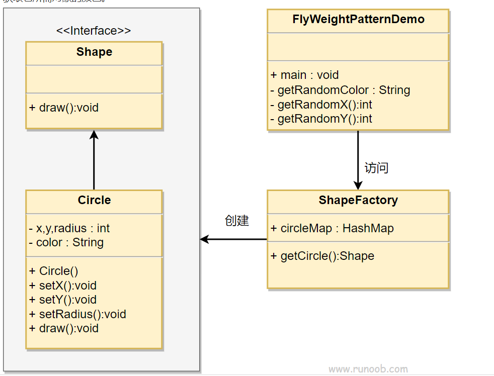

## 享元模式(蝇量模式) Flyweight Pattern ： 共享对象模式
基本介绍：

1)享元模式(Flyweight Pattern）也叫蝇量模式:运用共享技术有效地支持大量细粒度的对象

2)常用于系统底层开发，解决系统的性能问题。像
**数据库连接池**，里面都是创建好的连接对象，在这些连接对象中有我们需要的则直接拿来用，避免重新创建，
如果没有我们需要的，则创建一个

3)**享元模式能够解决重复对象的内存浪费的问题**，
当系统中有大量相似对象，需要缓冲池时。不需总是创建新对象，可以从缓冲池里拿。这样可以降低系统内存，同时提高效率

4)享元模式**经典的应用场景**就是**池技术**了，String常量池、数据库连接池、缓冲池等等都是享元模式的应用，
享元模式是池技术的重要实现方式


需求：展示网站项目需求

    小型的外包项目，给客户A做一个产品展示网站，客户A的朋友感觉效果不错，
    也希望做这样的产品展示网站，但是要求都有些不同:

    1)有客户要求以新闻的形式发布
    2)有客户要求以博客的形式发布
    3)有客户希望以微信公众号的形式发布


#### 传统方案解决网站展现项目-问题分析

    1. 需要的网站结构相似度很高，而且都不是高访问量网站，如果分成多个虚拟空间来处理，相当于一个相同网站的实例对象很多，造成服务器的资源浪费
    2. 解决思路:整合到一个网站中，共享其相关的代码和数据，对于硬盘、内存、CPU、数据库空间等服务器资源都可以达成共享，减少服务器资源
    3. 对于代码来说，由于是一份实例，维护和扩展都更加容易
    4. 上面的解决思路就可以使用享元模式来解决


**String、池 技术 都是享元模式的使用案例**

#### 享元模式原理类图


对原理图的说明-即(模式的角色及职责)

1) FlyWeight 是抽象的享元角色，他是产品的抽象类，同时定义出对象的外部状态和内部状态(后面介绍)的接口或实现
2) ConcreteFlyWeight 是具体的享元角色，是具体的产品类，实现抽象角色定义相关业务
3) UnSharedCancreteFlyWeight 是不可共享的角色，一般不会出现在享元工厂
4) FlyweightFactory 享元工厂类，用于构建一个池容器(集合)，同时提供从池中获取对象方法

#### 内部状态和外部状态
    比如围棋、五子棋、跳棋，它们都有大量的棋子对象，围棋和五子棋只有黑白两色，跳棋颜色多一点，所以棋子颜色就是棋子的内部状态;
    而各个棋子之间的差别就是位置的不同，当我们落子后，落子颜色是定的，但位置是变化的，所以棋子坐标就是棋子的外部状态

    1）享元模式提出了两个要求:细粒度和共享对象。这里就涉及到内部状态和外部状态了，即将对象的信息分为两个部分:内部状态和外部状态
    2)内部状态指对象共享出来的信息，存储在享元对象内部且不会随环境的改变而改变
    3)外部状态指对象得以依赖的一个标记，是随环境改变而改变的、不可共享的状态。
    4)举个例子:围棋理论上有361个空位可以放棋子，每盘棋都有可能有两三百个棋子对象产生，
    因为内存空间有限，一台服务器很难支持更多的玩家玩围棋游戏，如果用享元模式来处理棋子，那么棋子对象就可以减少到只有两个实例，
    这样就很好的解决了对象的开销问题


享元模式demo的uml图-增加外部状态


##### 代码实现案例：

网站实体类：使用网页方法的参数是用户
```java
package com.atguigu.flyweight;

/**
 * 享元模式- 网站实体类
 */
public abstract class WebSite {

    public abstract void use(User user);

}
@Data
@NoArgsConstructor
@AllArgsConstructor
class User {

    private String name;
}
```

实现享元模式中抽象类的
```java
/**
 * 享元模式 - 具体的网站
 */
public class ConcreteWebSite extends WebSite {
    // 网站发布的形式、类型
    private String type;

    @Override
    public void use(User user) {
        System.out.println("网站的发布形式为：" + type + " 在使用中, 使用者是：" + user.getName());
    }

    public ConcreteWebSite(String type) {
        this.type = type;
    }
}
```
网站工厂类-根据需求返回一个具体的网站

```java
package com.atguigu.flyweight;

import java.util.HashMap;

/**
 * 享元模式- 网站工厂类-根据需求返回一个具体的网站
 */
public class WebSiteFactory {

    // 池 集合
    private HashMap<String, ConcreteWebSite> pool = new HashMap<>();

    // 根据网站的类型，返回一个网站，如果没有就创建一个网站，并放入到池中
    public WebSite getWebSiteCategory(String type) {

        if (!pool.containsKey(type)) {
             // 创建一个网站，放到池中
            pool.put(type, new ConcreteWebSite(type));
        }
        return pool.get(type);
    }

    // 获取网站分类的总数（池中有多少个网站类型）
    public int getWebSiteCount() {
        return pool.size();
    }

}

```

模拟客户端调用
```java
package com.atguigu.flyweight;

/**
 * 享元模式 客户端调用
 */
public class FlyWeightClient {

    public static void main(String[] args) {

        // 创建一个工厂类
        WebSiteFactory webSiteFactory = new WebSiteFactory();

        // 客户要以一个新闻形式发布的网站
        WebSite webSite = webSiteFactory.getWebSiteCategory("新闻");
        webSite.use(new User("李彦宏"));

        WebSite webSite2 = webSiteFactory.getWebSiteCategory("微博");
        webSite2.use(new User("张朝阳"));

        WebSite webSite3 = webSiteFactory.getWebSiteCategory("微博");
        webSite2.use(new User("马化腾"));

        WebSite webSite4 = webSiteFactory.getWebSiteCategory("微博");
        webSite2.use(new User("刘强东"));

        System.out.println("网站的分类共：" + webSiteFactory.getWebSiteCount());
    }
}

```

调用结果print：

    网站的发布形式为：新闻 在使用中, 使用者是：李彦宏
    网站的发布形式为：微博 在使用中, 使用者是：张朝阳
    网站的发布形式为：微博 在使用中, 使用者是：马化腾
    网站的发布形式为：微博 在使用中, 使用者是：刘强东
    网站的分类共：2

#### 享元模式 FlyWeight 菜鸟教程
[享元模式 FlyWeight 菜鸟教程](https://www.runoob.com/design-pattern/flyweight-pattern.html)

享元模式（Flyweight Pattern）主要用于减少创建对象的数量，以减少内存占用和提高性能。这种类型的设计模式属于结构型模式，

它提供了减少对象数量从而改善应用所需的对象结构的方式。

享元模式尝试重用现有的同类对象，如果未找到匹配的对象，则创建新对象。我们将通过创建 5 个对象来画出 20 个分布于不同位置的圆来演示这种模式。

由于只有 5 种可用的颜色，所以 color 属性被用来检查现有的 Circle 对象。

#####介绍
意图：运用共享技术有效地支持大量细粒度的对象。

主要解决：在有大量对象时，有可能会造成内存溢出，我们把其中共同的部分抽象出来，如果有相同的业务请求，直接返回在内存中已有的对象，避免重新创建。

何时使用： 1、系统中有大量对象。 2、这些对象消耗大量内存。 3、这些对象的状态大部分可以外部化。 4、这些对象可以按照内蕴状态分为很多组，当把外蕴对象从对象中剔除出来时，每一组对象都可以用一个对象来代替。 5、系统不依赖于这些对象身份，这些对象是不可分辨的。

如何解决：用唯一标识码判断，如果在内存中有，则返回这个唯一标识码所标识的对象。

关键代码：用 HashMap 存储这些对象。

应用实例： 1、JAVA 中的 String，如果有则返回，如果没有则创建一个字符串保存在字符串缓存池里面。 2、数据库的数据池。

优点：大大减少对象的创建，降低系统的内存，使效率提高。

缺点：提高了系统的复杂度，需要分离出外部状态和内部状态，而且外部状态具有固有化的性质，不应该随着内部状态的变化而变化，否则会造成系统的混乱。

使用场景： 1、系统有大量相似对象。 2、需要缓冲池的场景。

注意事项： 1、注意划分外部状态和内部状态，否则可能会引起线程安全问题。 2、这些类必须有一个工厂对象加以控制。

实现
我们将创建一个 Shape 接口和实现了 Shape 接口的实体类 Circle。下一步是定义工厂类 ShapeFactory。

ShapeFactory 有一个 Circle 的 HashMap，其中键名为 Circle 对象的颜色。无论何时接收到请求，都会创建一个特定颜色的圆。
ShapeFactory 检查它的 HashMap 中的 circle 对象，如果找到 Circle 对象，则返回该对象，否则将创建一个存储在 hashmap 中以备后续使用的新对象，
并把该对象返回到客户端。

FlyWeightPatternDemo 类使用 ShapeFactory 来获取 Shape 对象。它将向 ShapeFactory 传递信息（red / green / blue/ black / white），
以便获取它所需对象的颜色。



```java
public interface Shape {
   void draw();
}
```


