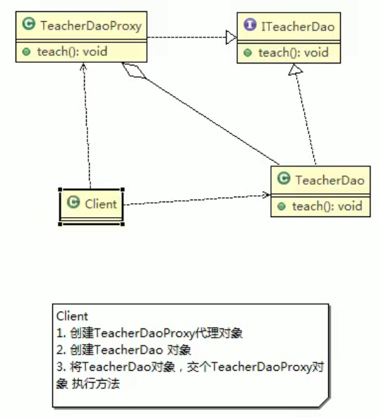
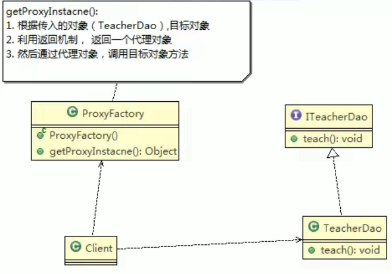

## 代理模式

1）代理模式:为一个对象**提供一个替身**，以控制对这个对象的访问。即通过代理对象访问目标对象.
这样做的好处是:**可以在目标对象实现的基础上,增强额外的功能操作,即扩展目标对象的功能**。

2)被代理的对象可以是**远程对象、创建开销大的对象或需要安全控制的对象**

3）代理模式有不同的形式,主要有三种静态代理、动态代理(JDK代理、接口代理)和
Cglib代理(可以在内存动态的创建对象，而不需要实现接口，他是属于动态代理的范畴)。

4)代理模式示意图


### 静态代理

静态代码模式的基本介绍
静态代理在使用时,需要定义接口或者父类,**被代理对象(即目标对象)与代理对象一起实现相同的接口或者是继承相同父类**


#### 应用实例

    具体要求
    1)定义一个接口:**lTeacherDao**
    2)目标对象 TeacherDAO 实现接口 ITeacherDAO
    3)使用静态代理方式,就需要在代理对象 TeacherDAOProxy 中也实现 ITeacherDAO
    4)调用的时候通过调用代理对象的方法来调用目标对象.
    5)特别提醒:代理对象与目标对象要实现相同的接口,然后通过调用相同的方法来调用目标对象的方法。



案例代码：
```java

```

#### 静态代理优缺点

    1)优点:在不修改目标对象的功能前提下,能通过代理对象对目标功能扩展
    2)缺点:因为代理对象需要与目标对象实现一样的接口,所以会有很多代理类
    3)一旦接口增加方法,目标对象与代理对象都要维护

### 动态代理

1）代理对象,不需要实现接口，但是目标对象要实现接口，否则不能用动态代理
2)代理对象的生成，是利用JDK的API，动态的在内存中构建代理对象
3)动态代理也叫做:JDK代理、接口代理

#### JDK中生成代理对象的API
1)代理类所在包:java.lang.reflect.Proxy
2)JDK实现代理只需要使用 newProxylnstance 方法,但是该方法需要接收三个参数,完整的写法是:
static Object newProxyInstance(ClassLoader loader,Class<?>[]interfaces,InvocationHandler h )

```java
/**
 * @see java.lang.reflect.Proxy
 * @see java.lang.reflect.Proxy
 */
```
#### 动态代理应用实例


