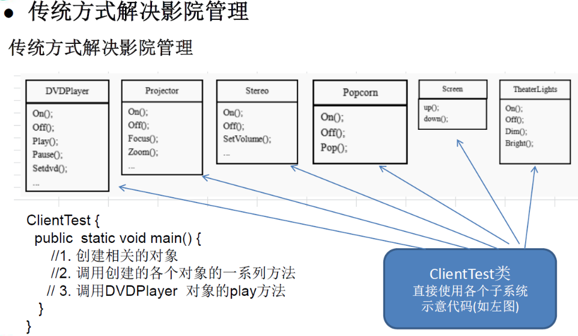
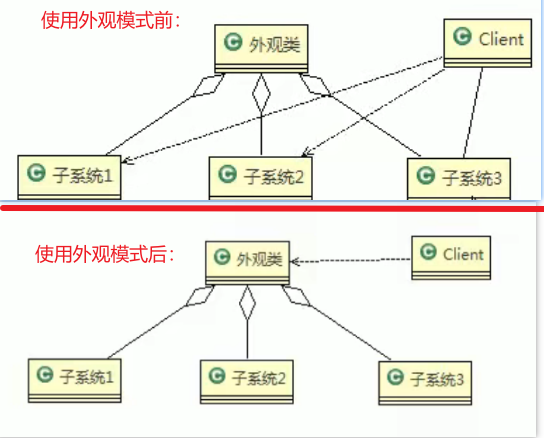
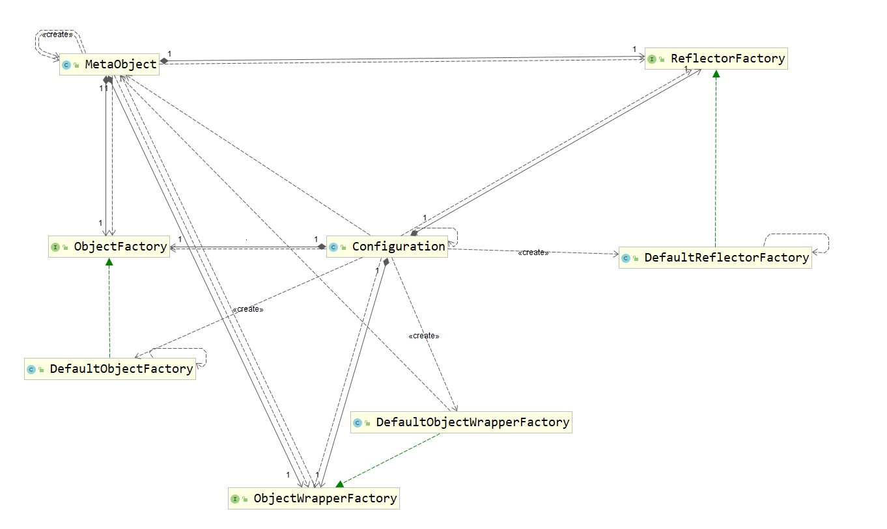

## 外观模式 (过程模式) Facade Pattern

外观模式基本介绍

1)外观模式（Facade)，也叫“过程模式” ：外观模式为子系统中的一组接口提供一个一致的界面，
此模式定义了一个高层接口，这个接口使得这一子系统更加容易使用

2)外观模式通过定义一个一致的接口，用以**屏蔽内部子系统的细节**，使得调用端只需跟这个接口发生调用，
而**无需关心这个子系统的内部细节(即使子系统之间内部有互相调用，客户端也无需关心)**


**使用外观模式好，还是直接调用模块好：要以让系统有层次，利于维护为目的 来进行判断**

##### 案例：影院管理

    组建一个家庭影院:
    DVD播放器、投影仪、自动屏幕、环绕立体声、爆米花机,要求完成使用家庭影院的功能，其过程为:

    直接用遥控器: 统筹各设备开关。
    开爆米花机
    放下屏幕。开投影仪
    开音响
    开DVD， 选dvd。
    去拿爆米花。
    调暗灯光。
    播放
    观影结束后，关闭各种设备

传统方案：



传统方式解决影院管理问题分析

    1 在ClientTest 的main方法中，创建各个子系统的对象，并直接去调用子系统(对象)相关方法，会造成调用过程混乱，没有清晰的过程
    2 不利于在ClientTest 中，去维护对子系统的操作
    3 解决思路:**定义一个高层接口，给子系统中的一组接口提供一个一致的界面**(比如在高层接口提供四个方法ready, play, pause, end )，
    用来访问子系统中的一群接口
    4 也就是说就是通过定义一个一致的接口(界面类)，用以屏蔽内部子系统的细节，使得调用端只需跟这个接口发生调用，
    而无需关心这个子系统的内部细节=>外观模式




#### 外观模式原理类图的说明(外观模式的角色)

1) 外观类(Facade):为调用端提供统一的调用接口，外观类知道哪些子系统负责处理请求,从而将调用端的请求代理给适当子系统对象

2) 调用者(Client):外观接口的调用者

3) 子系统的集合:指模块或者子系统，处理Facade对象指派的任务，他是功能的实际提供者
#### 案例 代码实现

```java
package com.atguigu.facdate;

/**
 * 外观模式- 影院灯光
 *
 * @author pengtao
 * @createdate 2022/02/19 0019
 */
public class TheaterLight {

    // 使用 饿汉式单例模式
    private static TheaterLight INSTANCE = new TheaterLight();

    private TheaterLight() {
    }

    public static TheaterLight getInstance() {
        return INSTANCE;
    }

    public void on() {
        System.out.println(" TheaterLight on ");
    }
    public void off() {
        System.out.println(" TheaterLight off ");
    }

    public void dim() {
        System.out.println(" TheaterLight  dim ");
    }

    //....
    public void bright() {
        System.out.println(" TheaterLight bright ..");
    }

}

```

```java
package com.atguigu.facdate;

/**
 * 爆米花机
 *
 * @author pengtao
 * @createdate 2022/02/19 0019
 */
public class Popcorn {

    // 使用 饿汉式单例模式
    private static Popcorn INSTANCE = new Popcorn();

    private Popcorn() {
    }

    public static Popcorn getInstance() {
        return INSTANCE;
    }

    public void on() {
        System.out.println(" Popcorn on ");
    }
    public void off() {
        System.out.println(" Popcorn off ");
    }

    /** 爆米花机爆米花 */
    public void pop() {
        System.out.println(" Popcorn is poping ");
    }

}

```

```java
package com.atguigu.facdate;

/**
 * 外观模式- 立体声机
 *
 * @author pengtao
 * @createdate 2022/02/19 0019
 */
public class Stereo {

    // 使用 饿汉式单例模式
    private static Stereo INSTANCE = new Stereo();

    private Stereo() {
    }

    public static Stereo getInstance() {
        return INSTANCE;
    }

    public void on() {
        System.out.println(" Screen on ");
    }

    public void off() {
        System.out.println(" Screen off ");
    }

    public void up() {
        System.out.println(" Screen voice up... ");
    }

}

```
```java
package com.atguigu.facdate;

/**
 * 外观模式- 投影仪
 *
 * @author pengtao
 * @createdate 2022/02/19 0019
 */
public class Projector {

    // 使用 饿汉式单例模式
    private static Projector INSTANCE = new Projector();

    private Projector() {
    }

    public static Projector getInstance() {
        return INSTANCE;
    }

    public void on() {
        System.out.println(" Projector on ");
    }
    public void off() {
        System.out.println(" Projector off ");
    }

    public void focus() {
        System.out.println(" Projector is focus ");
    }

}

```

```java
package com.atguigu.facdate;

/**
 * 外观模式- 屏幕
 *
 * @author pengtao
 * @createdate 2022/02/19 0019
 */
public class Screen {

    // 使用 饿汉式单例模式
    private static Screen INSTANCE = new Screen();

    private Screen() {
    }

    public static Screen getInstance() {
        return INSTANCE;
    }

    public void up() {
        System.out.println(" Screen up ");
    }

    public void down() {
        System.out.println(" Screen down ");
    }

}

```
```java
package com.atguigu.facdate;

/**
 * 外观模式- DVD播放器
 *
 * @author pengtao
 * @createdate 2022/02/19 0019
 */
public class DVDPlayer {

    // 使用 饿汉式单例模式
    private static DVDPlayer INSTANCE = new DVDPlayer();

    private DVDPlayer() {
    }

    public static DVDPlayer getInstance() {
        return INSTANCE;
    }

    public void on() {
        System.out.println(" dvd on ");
    }
    public void off() {
        System.out.println(" dvd off ");
    }

    public void play() {
        System.out.println(" dvd is playing ");
    }

    //....
    public void pause() {
        System.out.println(" dvd pause ..");
    }

}

```

创建外观类(过程类)。组合以上 程序调用中需要调用到的 实体类。定义方法进行调用
```java
package com.atguigu.facdate;

import lombok.extern.slf4j.Slf4j;

/**
 * 外观模式-家庭影院外观类
 *
 * @author pengtao
 * @createdate 2022/02/19 0019
 */
@Slf4j
public class HomeTheaterFacade {

    /* 定义各个子系统的对象 */
    private  TheaterLight theaterLight;
    private Popcorn popcorn;
    private Stereo stereo;
    private Projector projector;
    private Screen screen;
    private DVDPlayer dvdPlayer;

    public HomeTheaterFacade() {
        this.theaterLight = TheaterLight.getInstance();
        this.popcorn = Popcorn.getInstance();
        this.stereo = Stereo.getInstance();
        this.projector = Projector.getInstance();
        this.screen = Screen.getInstance();
        this.dvdPlayer = DVDPlayer.getInstance();
    }

    public void ready() {
        popcorn.on();
        popcorn.pop();
        screen.down();
        projector.on();
        stereo.on();
        dvdPlayer.on();
        theaterLight.dim();
        log.info("--准备工作完成--");
    }

    public void play() {
        dvdPlayer.play();
        log.info("--播放中--");
    }

    public void pause() {
        dvdPlayer.pause();
        log.info("--已暂停--");
    }

    public void end() {
        popcorn.off();
        theaterLight.bright();
        screen.up();
        projector.off();
        dvdPlayer.off();
        log.info("--结束--");
    }

}

```
模拟客户端调用
```java
package com.atguigu.facdate;

/**
 * @author pengtao
 * @createdate 2022/02/19 0019
 */
public class FacadeDemoClient {

    public static void main(String[] args) {
        // 这里如果直接调用。。。 很麻烦

        // 而使用外观模式，可以屏蔽具体细节，方便调用
        HomeTheaterFacade homeTheaterFacade = new HomeTheaterFacade();
        homeTheaterFacade.ready();
        homeTheaterFacade.play();

        homeTheaterFacade.pause();
        homeTheaterFacade.end();
    }
}

```

#### 框架源码分析

```java


/**
 * 为什么这里IDEA报红但是ctrl能够跳转?
 * @see org.apache.ibatis.session.Configuration#newMetaObject(Object o);
 * @see org.apache.ibatis.reflection.MetaObject#MetaObject;
 * @see org.apache.ibatis.reflection.MetaObject;
 * @see org.apache.ibatis.session.Configuration;
 * @author Clinton Begin
 */
public class Configuration {
    
    // ...
    protected Properties variables = new Properties();
    protected ReflectorFactory reflectorFactory = new DefaultReflectorFactory();
    protected ObjectFactory objectFactory = new DefaultObjectFactory();
    protected ObjectWrapperFactory objectWrapperFactory = new DefaultObjectWrapperFactory();
    
    // ...
}


```



#### 外观模式的注意事项和细节

1)外观模式**对外屏蔽了子系统的细节**，因此**外观模式降低了客户端对子系统使用的复杂性**

2)外观模式对客户端与子系统的耦合关系，让子系统内部的模块更易维护和扩展

3)通过合理的使用外观模式，可以帮我们更好的划分访问的层次

4)当系统需要进行分层设计时，可以考虑使用Facade模式

5)在维护一个遗留的大型系统时，可能这个系统已经变得非常难以维护和扩展，此时
可以考虑为新系统开发一个Facade类，来提供遗留系统的比较清晰简单的接口,让新系统与Facade类交互，提高复用性

6)不能过多的或者不合理的使用外观模式，使用外观模式好，还是直接调用模块好要以让系统有层次，利于维护为目的。


============================================================================================

[外观模式-菜鸟教程](https://www.runoob.com/design-pattern/facade-pattern.html)

外观模式
外观模式（Facade Pattern）隐藏系统的复杂性，并向客户端提供了一个客户端可以访问系统的接口。这种类型的设计模式属于结构型模式，它向现有的系统添加一个接口，来隐藏系统的复杂性。

这种模式涉及到一个单一的类，该类提供了客户端请求的简化方法和对现有系统类方法的委托调用。

介绍
意图：为子系统中的一组接口提供一个一致的界面，外观模式定义了一个高层接口，这个接口使得这一子系统更加容易使用。

主要解决：降低访问复杂系统的内部子系统时的复杂度，简化客户端之间的接口。

何时使用： 1、客户端不需要知道系统内部的复杂联系，整个系统只需提供一个"接待员"即可。 2、定义系统的入口。

如何解决：客户端不与系统耦合，外观类与系统耦合。

关键代码：在客户端和复杂系统之间再加一层，这一层将调用顺序、依赖关系等处理好。

应用实例： 1、去医院看病，可能要去挂号、门诊、划价、取药，让患者或患者家属觉得很复杂，如果有提供接待人员，只让接待人员来处理，就很方便。 2、JAVA 的三层开发模式。

优点： 1、减少系统相互依赖。 2、提高灵活性。 3、提高了安全性。

缺点：不符合开闭原则，如果要改东西很麻烦，继承重写都不合适。

使用场景： 1、为复杂的模块或子系统提供外界访问的模块。 2、子系统相对独立。 3、预防低水平人员带来的风险。

注意事项：在层次化结构中，可以使用外观模式定义系统中每一层的入口。

菜鸟教程的demo。没意思，不贴了


