# 尚硅谷图解设计模式

设计模式是站在软件结构角度，可扩展性、稳定性 如果站在功能实现角度，或许这个功能的实现没必要用设计模式这么复杂。 prototype

#### 课程亮点和授课方式

    1)课程深入非蜻蜓点水
    2)课程成体系,非星星点灯
    3)高效而愉快的学习，设计模式很有用，其实也很好玩很像小时候搭积木。怎样搭建更加稳定，坚固
    4)设计模式很重要，因为包含很多编程思想，还是有一定难度的，我们努力做到通俗易懂
    5)采用应用场景->设计模式->剖析原理->分析实现步骤(图解)>代码实现>框架或项目源码分析(找到使用的地
    方)的步骤讲解[比如:建造者模式]
    6)课程目标:让大家掌握本质﹐达能在工作中灵活运用解决实际问题和优化程序结构的目的.

### 设计模式的七大原则

要求 1. 七大设计原则核心思想 2.能够以类图的说明涉及原则 3.在项目实际开发中哪里用到了ocp原则

    设计模式常用的七大原则：
    1.单一职责原则
    2.接口隔离原则
    3.依赖倒转原则
    4.里式替换原则
    5.开闭原则ocp
    6.迪米特法则
    7.合成复用原则

### > 原型设计模式问题:

    1)有请使用UML类图画出原型模式核心角色
    2)原型设计模式的深拷贝和浅拷贝是什么，并写出深拷贝的两种方式的源码(重写clone方法实现深拷贝、使用序列化来实现深拷贝)
    3)在Spring框架中哪里使用到原型模式，并对源码进行分析
    beans.xml
    bean id="id01" class="com.atguigu.spring.bean.Monster" scope="prototype"/>4) Spring 中原型bean 的创建，就是原型模式的应用

#### 先看几个经典的设计模式面试题

    金融借贷平台项目:借贷平台的订单，有审核-发布-抢单等等步骤，随着操作的不同,会改变订单的状态，
    项目中的这个模块实现就会使用到状态模式，请你使用状态模式进行设计，并完成实际代码


间题分析:

    这类代码难以应对变化，在添加一种状态时，我们需要手动添加if/else，在添加一种功能时，要对所有的状态进行判断。
    因此代码会变得越来越臃肿,并且一旦没有处理某个状态,便会发生极其严重的BUG，难以维护

##### 先看几个经典的设计模式面试题解释器设计模式

    1)介绍解释器设计模式是仕么?
    2)画出解释器设计模式的UML类图
        分析设计模式中的各个角色是什么?
    3)请说明Spring的框架中，哪里是用到了解释器设计模式，并做源码级别的分析

```java
    /** @see org.springframework.expression.spel.standard.SpelExpressionParser*/

import org.springframework.expression.spel.standard.SpelExpressionParser;

```

#### 单例设计模式一共有几种实现方式?请分别用代码实现，并说明各个实现方式的优点和缺点?

    单例设计模式一共有8种写法，后面我们会依次讲到
    1) 饿汉式两种
    2) 懒汉式三种
    3) 双重检查
    4) 静态内部类 
    5) 枚举

### 设计模式的重要性

    1)软件工程中，设计模式(design pattern）是对软件设计中普遍存在（反复出现)的各种问题，所提出的解决方案。
    这个术语是由埃里希·伽玛（Erich Gamma）等人在1990年代从建筑设计领域引入到计算机科学的
    
    2)大厦VS简易房
    
    3)拿实际工作经历来说，当一个项目开发完后，如果客户提出增新功能，怎么办?。（可扩展性，使用设计模式软件具有很好的扩展性）
    4)如果项目开发完后，原来程序员离职，你接手维护该项目怎么办?（维护性[可读性、规范性]）
    5)目前程序员门槛越来越高，一线IT公司(大厂)，都会问你在实际项目中使用过什么设计模式，怎样使用的，解决了什么问题。
    6)设计模式在软件中哪里? 面向对象（oo) ->功能模块[设计模式+算法(数据结构)]->框架->架构[服务器集群]
    7)如果想成为合格软件工程师，那就花时间来研究下设计模式是非常必要的.

### 设计模式的目的

编写软件过程中，程序员面临着来自耦合性，内聚性以及可维护性，可扩展性，重用性，灵活性等多方面的挑战， 设计模式是为了让程序(软件)，具有更好

    1)代码重用性(即:相同功能的代码，不用多次编写) 
    2)可读性(即:编程规范性，便于其他程序员的阅读和理解)
    3)可扩展性(即:当需要增加新的功能时，非常的方便，称为可维护)
    4)可靠性(即:当我们增加新的功能后，对原来的功能没有影响)
    5)使程序呈现 【高内聚，低耦合】 的特性
        分享金句:
        设计模式包含了面向对象的精髓，“懂了设计模式，你就懂了面向对象分析和设计（OOA/D）的精要”
        Scott Mayers 在其巨著《Effective C++》就曾经说过:C++老手和C++新手的区别就是前者手背上有很多伤疤(踩坑吃亏受伤)

## 设计模式七大原则

设计模式原则，其实就是程序员在编程时，应当遵守的原则，也是各种设计模式的 基础(即:设计模式为什么这样设计的依据)

### 1.单一职责原则：

对类来说的，即一个类应该只负责一项职责。 如类A负责两个不同职责:职责1，职责2。当职责1需求变更而改变A时，可能造成职责2执行错误，所以需要将类A的粒度分解为两个类：A1和A2

应用实例：

```java
    import com.atguigu.principle.singleresponsibility.SingleRsponsibility1;
import com.atguigu.principle.singleresponsibility.SingleRsponsibility2;
import com.atguigu.principle.singleresponsibility.SingleRsponsibility3;
```

#### 单一职责原则注意事项和细节

    1)降低类的复杂度，一个类只负责一项职责。
    2)提高类的可读性，可维护性
    3)降低变更引起的风险
    4)）通常情况下，我们应当遵守单一职责原则，只有逻辑足够简单例如方法很少(像上例的SingleRsponsibility3)，才可以在代码级违反单一职责原则;
        只有类中方法数量足够少，可以在方法级别保持单一职责原则

心得： if else 可以用 增加类、增加方法来代替，用来降低耦合度

### 2. 接口隔离原则

客户端不应该依赖它不需要的接口，即一个类对另一个类的依赖应该建立在最小的接口上

应用实例：
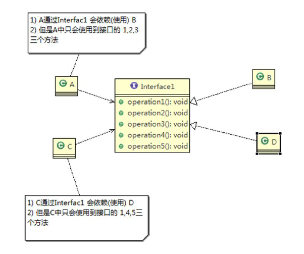

类A通过接口Interfacel依赖类B，类C通过接口Interfacel依赖类D，如果接口Interfacel对于类A和类C来说不是最小接口， 那么类B和类D必须去实现他们不需要的方法。 改进前：

```java
    import com.atguigu.principle.segregation.Segregation1;
```

按隔离原则应当这样处理:
将接口Interface1拆分为独立的几个接口(这里我们拆分成3个接口)，类A和类C分别与他们需要的接口建立依赖关系。也就是采用接口隔离原则

改进后：

    l)类A通过接口Interfacel依赖类B，类C通过接口Interfacel依赖类D，如果接口Interfacel对于类A和类C
    来说不是最小接口，那么类B和类D必须去实现他们不需要的方法
    2)将接口Interface1拆分为独立的几个接口，类A和类C分别与他们需要的接口建立依赖关系。也就是采用接口
    隔离原则
    3)接口 Interface1 中出现的方法，根据实际情况拆分为三个接口
    Interface1拆分以下接口 Interface1Plus，Interface2，Interface3，见：

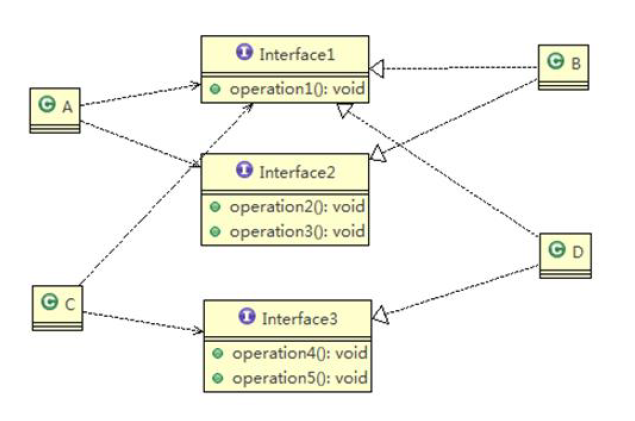

```java
    import com.atguigu.principle.segregation.Segregation2;
```

通俗讲：希望我们依赖的 是最小的

### 3. 依赖倒转(依赖倒置)原则

    依赖倒转原则(Dependence Inversion Principle)是指:
    l)高层模块不应该依赖低层模块，二者都应该依赖其抽象
    2)抽象不应该依赖细节，细节应该依赖抽象
    3)依赖倒转(依赖倒置)的中心思想是面向接口编程
    4)依赖倒转原则是基于这样的设计理念:相对于细节的多变性，抽象的东西要稳定的多。以抽象为基础搭建的架
    构比以细节为基础的架构要稳定的多。在java中，抽象指的是接口或抽象类，细节就是具体的实现类
    5)使用接口或抽象类的目的是制定好规范，而不涉及任何具体的操作，把展现细节的任务交给他们的实现类去完成

应用案例：

```java
    // 优化前

import com.atguigu.principle.inversion.Person;
// 优化后
import com.atguigu.principle.inversion.PersonPlus;
import com.atguigu.principle.inversion.IReceiver;
```

依赖倒置原则 依赖传递 可以通过 接口方式、构造器方式、setter方式 三种方式。 第一种方式如上应用案例。第二第三种方式 使用“组合”:

```java
import com.atguigu.principle.inversion.PersonPlusConstructor;
import com.atguigu.principle.inversion.PersonPlusSetter;
```

依赖倒转原则的注意事项和细节:

    l)低层模块尽量都要有抽象类或接口，或者两者都有，程序稳定性更好.
    2)变量的声明类型尽量是抽象类或接口,这样我们的变量引用和实际对象间，就存在一个缓冲层，利于程序扩展和优化
    3)继承时遵循里氏替换原则

### 4. 里氏替换原则

基本介绍

    1)里氏替换原则(Liskov Substitution Principle)在1988年，由麻省理工学院的里斯科夫（Liskov）女士提出的。
    2)如果对每个类型为T1的对象o1，都有类型为T2的对象o2，使得以T1定义的所有程序
        P在所有的对象o1都代换成o2时，程序P的行为没有发生变化，那么类型T2是类型T1的子类型。
        换句话说，所有引用基类的地方必须能透明地使用其子类的对象。
    3)在使用继承时，遵循里氏替换原则，在子类中尽量不要重写父类的方法
    4)里氏替换原则告诉我们，继承实际上让两个类耦合性增强了，在适当的情况下，可以通过聚合,组合,依赖来解决问题。.

### 5. 开闭原则 OCP: Open Closed Principle

基本介绍

    1）开闭原则(Open Closed Principle）是编程中最基础、最重要的设计原则
    2)一个软件实体如类，模块和函数应该对扩展开放，对修改关闭。用抽象构建框架，用实现扩展细节。
    3)当软件需要变化时，尽量通过扩展软件实体的行为来实现变化，而不是通过修改已有的代码来实现变化。
    4)编程中遵循其它原则，以及使用设计模式的目的就是遵循开闭原则。

应用案例

```java
// 修改前
import com.atguigu.principle.ocp.Ocp;
// 发现新增一个三角形违背了开闭原则 OCP原则
import com.atguigu.principle.ocp.Triangle;
// 修改后，满足OCP原则
import com.atguigu.principle.ocp.OcpImprove;
// 新增一个其他图形。
import com.atguigu.principle.ocp.OtherGraphic;
```

### 6. 迪米特法则(最少知道原则)

基本介绍

    1)一个对象应该对其他对象保持最少的了解
    2)类与类关系越密切，耦合度越大
    3)迪米特法则(Demeter Principle)又叫最少知道原则，即一个类对自己依赖的类知道的越少越好。
      也就是说，对于被依赖的类不管多么复杂，都尽量将逻辑封装在类的内部。对外除了提供的public方法，不对外泄露任何信息
    4)迪米特法则还有个更简单的定义:只与直接的朋友通信
    5)直接的朋友:每个对象都会与其他对象由耦合关系，只要两个对象之间有耦合关系，我们就说这两个对象之间是朋友关系。
    耦合的方式很多，依赖，关联，组合，聚合等。其中，我们称出现成员变量，方法参数，方法返回值中的类为直接的朋友，
    而出现在局部变量中的类不是直接的朋友。也就是说，陌生的类最好不要以局部变量的形式出现在类的内部。

应用实例
    1)有一个学校，下属有各个学院和总部，现要求打印出学校总部员工ID和学院员工的id
    编程实现上面的功能,看代码演示
```java
// 改进前
// 77行代码分析
import com.atguigu.principle.demeter.SchoolManager;
// 改进后
import com.atguigu.principle.demeter.SchoolManagerPlus;
```

### 7. 合成复用原则(Composite Reuse Principle)
原则是尽量使用合成/聚合的方式，而不是使用继承

如果只是让 B类 去使用 A类 的方法，使用继承会让 B类 和 A类 的耦合性增强，这种情况继承不是一个好的选择 is a 改为 has a会更好


设计原则核心思想

    l)找出应用中可能需要变化之处，把它们独立出来，不要和那些不需要变化的代码混在一起。
    2)针对接口编程，而不是针对实现编程。
    3)为了交互对象之间的松耦合设计而努力


### UML类图
####UML基本介绍

    I)UML——Unified modeling language UML(统一建模语言)，是一种用于软件系统分析和设计的语言工具，
      它用于帮助软件开发人员进行思考和记录思路的结果
    2)UML本身是一套符号的规定，就像数学符号和化学符号一样，这些符号用于描述软件模型中的各个元素和
      他们之间的关系，比如类、接口、实现、泛化、依赖、组合、聚合等，如下图:
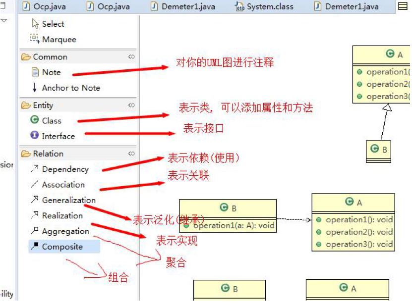
    3) 使用UJML来建模，常用的工具有 RationalRose,也可以使用一些插件来建模
    [RationalRose 介绍](https://blog.csdn.net/gz153016/article/details/49641847)
    暂未下载研究
说明：
    IDEA专业版右键DiaGrams。IDEA 社区版本暂不支持，正在搜索较好的插件中。。。

####UML图分类:

    1)用例图(use case)
    2)静态结构图:类图、对象图、包图、组件图、部署图
    3)动态行为图:交互图(时序图与协作图）、状态图、活动图

####UML类图

    1)用于描述系统中的类(对象)本身的组成和类(对象)之间的各种静态关系。
    2)类之间的关系:依赖、泛化（继承）、实现、关联、 聚合与组合

依赖关系 Dependency ： 只要在类中用到了对方。那么他们之间就存在依赖关系，如果没有对方，连编译都通过不了

    构成依赖关系的情况：
        1)类中用到了对方
        2)如果是类的成员属性
        3)如果是方法的返回类型
        4)是方法接收的参数类型
        5)方法中使用到

泛化关系(继承关系) Generalization ：泛化关系就是继承关系，是依赖关系的特例

实现关系 Realization ：就是实现关系， A类实现B类，也是依赖关系的特例

关联关系 Association : 就是雷与类之间的联系， 也是依赖关系的特例。关联具有导航性，即双向关系或单向关系 关联具有多重性
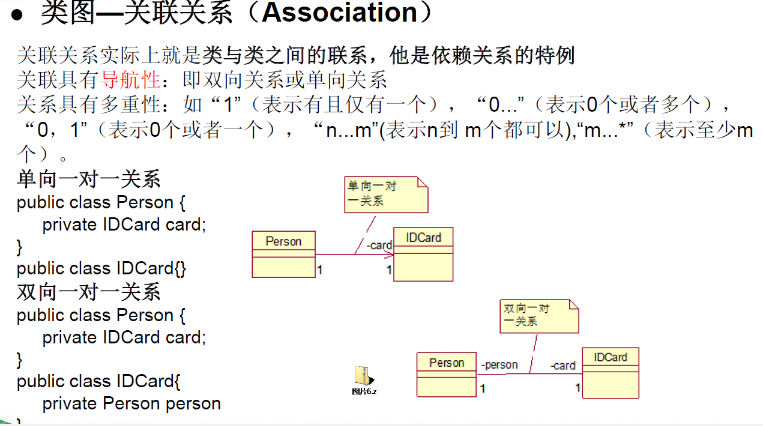

聚合关系 Aggregation ：表示的是整体和部分的关系，整体与部分可以分开(电脑与鼠标)。聚合关系是关联关系的特例。 所以也具有关联关系的导航性和多重性
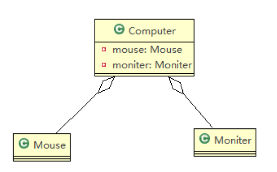
组合关系 Composite : 表示的是整体和部分的关系。但是整齐和部分不可以分开(人和 head)
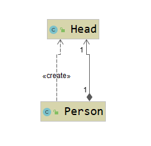

###掌握设计模式的层次
    1)第1层:刚开始学编程不久，听说过什么是设计模式
    2)第2层:有很长时间的编程经验，自己写了很多代码，其中用到了设计模式，但是自己却不知道
    3)第3层:学习过了设计模式，发现自己已经在使用了，并且发现了一些新的模式挺好用的
    4)第4层:阅读了很多别人写的源码和框架，在其中看到别人设计模式，并且能够领会设计模式的精妙和带来的好处。
    5)第5层:代码写着写着，自己都没有意识到使用了设计模式，并且熟练的写了出来。

###设计模式介绍
    1)设计模式是程序员在面对同类软件工程设计问题所总结出来的有用的经验，
    设计模式不是代码，而是某类问题的通用解决方案，设计模式(（Design pattern)代表了最佳的实践。这些解决方案是众多软件开发人员经过相当长的一段时间的试验和错误总结出来的。
    2)设计模式的本质提高软件的维护性，通用性和扩展性，并降低软件的复杂度。
    3)<<设计模式>>是经典的书，作者是Erich Gamma、Richard Helm、Ralph Johnson和lJohn Vlissides Design（俗称“四人组GOF”)
    4)设计模式并不局限于某种语言，java，php，c++都有设计模式

## 设计模式类型
设计模式分为三种类型，共23种 

    1)创建型模式:单例模式、抽象工厂模式、原型模式、建造者模式、工厂模式。
    2)结构型模式:适配器模式、桥接模式、装饰模式、组合模式、外观模式、享元模式、代理模式。
    3)行为型模式:模版方法模式、命令模式、访问者模式、迭代器模式、观察者模式、
        中介者模式、备忘录模式、解释器模式(Interpreter模式）、状态模式、策略模式、
        职责链模式(责任链模式)。

注意:不同的书籍上对分类和名称略有差别

## 单例设计模式介绍
单例设计模式 是采取一定的方法保证在整个的软件系统中，对某个类只能存在一个对象实例，
并且该类只提供一个取得其对象实例的方法(静态方法)。

    比如Hibernate的SessionFactory，它充当数据存储源的代理，并负责创建Session对象。SessionFactory并不是轻量级的，一般情况下，一个项目通常只需要一个SessionFactory就够，这是就会使用到单例模式。

### 单例设计模式八种方式
单例模式有八种方式;
    1)饿汉式(静态常量)                  可以使用
    2)饿汉式（静态代码块)               可以使用
    3)懒汉式(线程不安全)  
    4)懒汉式(线程安全，同步方法)
    5)懒汉式(线程安全，同步代码块)
    6)双重检查                          推荐使用
    7)静态内部类                        推荐使用
    8)枚举                              推荐使用
推荐：枚举、静态内部类、双重检查、饿汉式
1. 饿汉式（静态常量）
```java
import com.atguigu.singleton.type1.Singleton;

```
优缺点说明：

    1)优点:这种写法比较简单，就是在类装载的时候就完成实例化。避免了线程同步问题。
    2)缺点:在类装载的时候就完成实例化，没有达到Lazy Loading的效果。
        如果从始至终从未使用过这个实例,则会造成内存的浪费
    3)这种方式基于classloder机制避免了多线程的同步问题，不过，instance在类装载时就实例化，
        在单例模式中大多数都是调用getInstance方法，但是导致类装载的原因有很多种，因此不能确定有其他的方式（或者其他的静态方法）导致类装载，这时候初始化instance就没有达到lazy loading的效果
    4)结论:这种单例模式可用,可能造成内存浪费

2.饿汉式静态代码块
```java
import com.atguigu.singleton.type2.Singleton; 
```
饿汉式（静态代码块)
优缺点说明:
    1)这种方式和上面的方式其实类似，只不过将类实例化的过程放在了静态代码块
    中，也是在类装载的时候，就执行静态代码块中的代码，初始化类的实例。
    优缺点和上面是一样的。
    2）结论:这种单例模式可用，但是可能造成内存浪费

3
```java
import com.atguigu.singleton.type3.Singleton;
```
优缺点说明:

    1)起到了Lazy Loading的效果，但是只能在单线程下使用。
    2)如果在多线程下，一个线程进入了if (singleton == nu)判断语句块，还未来得及
    往下执行，另一个线程也通过了这个判断语句，这时便会产生多个实例。所以在多线程环境下不可使用这种方式
    3）结论:在实际开发中，不要使用这种方式.

4. 懒汉式线程安全-synchronized
```java
import com.atguigu.singleton.type4.Singleton;
```
优缺点说明:

    1)解决了线程不安全问题
    2)效率太低了，每个线程在想获得类的实例时候，执行getInstance()方法都要进行
    同步。而其实这个方法只执行一次实例化代码就够了，后面的想获得该类实例，直接return就行了。方法进行同步效率太低
    3)结论:在实际开发中，不推荐使用这种方式

5. 懒汉式(线程安全，同步代码块)
```java
/** 不能使用这种方式 */
class singleton {
    private static volatile singleton singleton;

    private Singleton() {
    }

    public static singleton getInstance() {

        if (singleton == nul1) i
        synchronized (singleton.class) {
            if (singleton == nul1) {
                singleton = new Singleton();
            }
        }
        return singleton;
    }
}

```
优缺点说明:

    1)这种方式，本意是想对第四种实现方式的改进，因为前面同步方法效率太低，
    改为同步产生实例化的的代码块
    2)但是这种同步并不能起到线程同步的作用。跟第3种实现方式遇到的情形一
    致，假如一个线程进入了if(singleton == null)判断语句块，还未来得及往下执行，另一个线程也通过了这个判断语句，这时便会产生多个实例
    3）结论:在实际开发中，不能使用这种方式

6. 双重检查-推荐使用

```java
import com.atguigu.singleton.type6.Singleton;
```
优缺点说明:

    1) Double-Check概念是多线程开发中常使用到的，如代码中所示，我们进行了两次if (singleton == null)检查，这样就可以保证线程安全了。
    2)这样，实例化代码只用执行一次，后面再次访问时，判断if (singleton == null)，直接return实例化对象，也避免的反复进行方法同步.
    3)线程安全;延迟加载;效率较高
    4)结论:在实际开发中，推荐使用这种单例设计模式

7. 静态内部类实现单例设计模式
```java
import com.atguigu.singleton.type7.Singleton;
```

优缺点说明:

    1)这种方式采用了类装载的机制来保证初始化实例时只有一个线程。
    2）静态内部类方式在Singleton类被装载时并不会立即实例化，而是在需要实例化时，
    调用getInstance方法，才会装载SingletonInstance类,从而完成Singleton的实例化。
    3)类的静态属性只会在第一次加载类的时候初始化，所以在这里，JVM帮助我们
    保证了线程的安全性，在类进行初始化时，别的线程是无法进入的。
    4)优点:避免了线程不安全，利用静态内部类特点实现延迟加载，效率高
    5)结论:推荐使用.

8. 枚举 
```java
/**@see  com.atguigu.singleton.SingletonTest08*/
enum Singleton {
    INISTANCE;
}
```
优缺点说明:

    1)这借助JDK1.5中添加的枚举来实现单例模式。不仅能避免多线程同步问题，
    而且还能防止反序列化重新创建新的对象。
    2)这种方式是Effective Java作者Josh Bloch提倡的方式
    3)结论:推荐使用


#### 单例模式JDK源码分析

```java
// 使用的是饿汉式 单例模式
import java.lang.Runtime;
```

###单例模式注意事项和细节说明
    1)单例模式保证了系统内存中该类只存在一个对象，节省了系统资源，对于一些需要频繁
    创建销毁的对象，使用单例模式可以提高系统性能
    2)当想实例化一个单例类的时候，必须要记住使用相应的获取对象的方法，而不是使用new
    3)单例模式使用的场景:需要频繁的进行创建和销毁的对象、创建对象时耗时过多或
    耗费资源过多(即:重量级对象)，但又经常用到的对象、工具类对象、频繁访问数据库或文件的
    对象(比如数据源、session工厂等)

## 简单工厂设计模式

看一个具体的需求

    看一个披萨的项目:要便于披萨种类的扩展，要便于维护
    1)披萨的种类很多(比如GreekPizz、CheesePizz等
    2)披萨的制作有prepare，bake, cut, box  准备、烘烤、切割、包装
    3)完成披萨店订购功能。

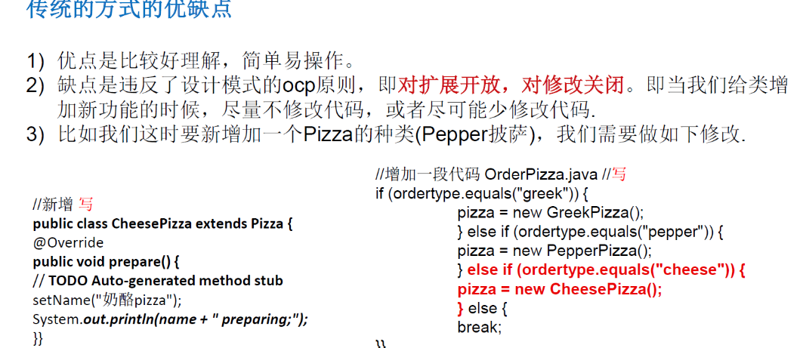

#### 改进的思路分析

    分析:修改代码可以接受，但是如果我们在其它的地方也有创建Pizza的代码，就意味着，也需要修改，而创建Pizza的代码，往往有多处。
    思路:把创建Pizza对象封装到一个类中，这样我们有新的Pizza种类时，只需要修改该类就可，其它有创建到Pizza对象的代码就不需要修改了.->简单工厂模式

###简单工厂模式
基本介绍

    1)简单工厂模式是属于创建型模式，是工厂模式的一种。简单工厂模式是由一个工厂对象决定创建出
    哪一种产品类的实例。简单工厂模式是工厂模式家族中最简单实用的模式
    2)简单工厂模式:定义了一个创建对象的类，由这个类来封装实例化对象的行为(代码)
    3)在软件开发中，当我们会用到大量的创建某种、某类或者某批对象时，就会使用到工厂模式.


简单工厂模式改进前：
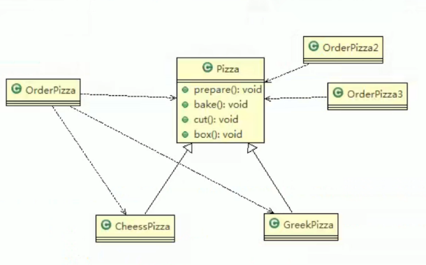


简单工厂模式改进后：
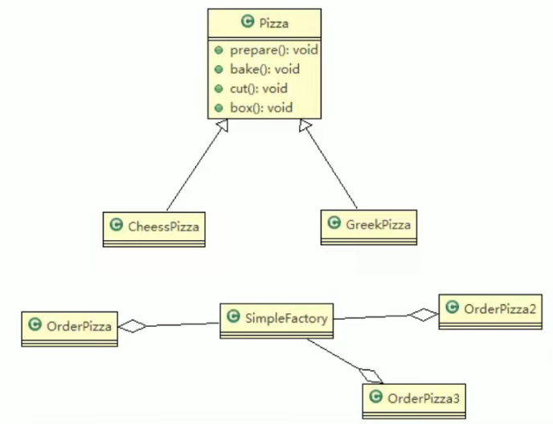

```java
import com.atguigu.factory.simplefactory.pizzastroe.SimpleFactory; 
```

简单工厂模式又叫静态工厂模式。因为创建工厂的方法又可以使用static 静态方法:
```java
import com.atguigu.factory.simplefactory.pizzastroe.SimpleFactory.createPizza2;

```
### 工厂方法模式：
工厂方法模式:定义了一个创建对象的抽象方法，由子类决定要实例化的类。【工厂方法模式将对象的实例化推迟到子类。】

工厂方法模式看一个新的需求

    披萨项目新的需求:客户在点披萨时，可以点不同口味的披萨，比如北京的奶酪pizza、北京的胡椒pizza或者是伦敦的奶酪pizza、伦敦的胡椒pizza。

    思路1：使用简单工厂模式，创建不同的简单工厂类，比如BJPizzaSimpleFactory、 LDPizzaSimpleFactory等等.
        从当前这个案例来说，也是可以的，但是考虑到项目的规模，以及软件的可维护性、可扩展性并不是特别好
    思路2：使用工厂方法模式

工厂方法模式设计方案:

    将披萨项目的实例化功能抽象成抽象方法，在不同的口味点餐子类中具体实现。

工厂方法模式:定义了一个创建对象的抽象方法，由子类决定要实例化的类。【工厂方法模式将对象的实例化推迟到子类】。

工厂方法模式应用案例

    披萨项目新的需求:
    客户在点披萨时，可以点不同口味的披萨，比如北京的奶酪pizza、北京的胡椒pizza或者是伦敦的奶酪pizza、伦敦的胡椒pizza

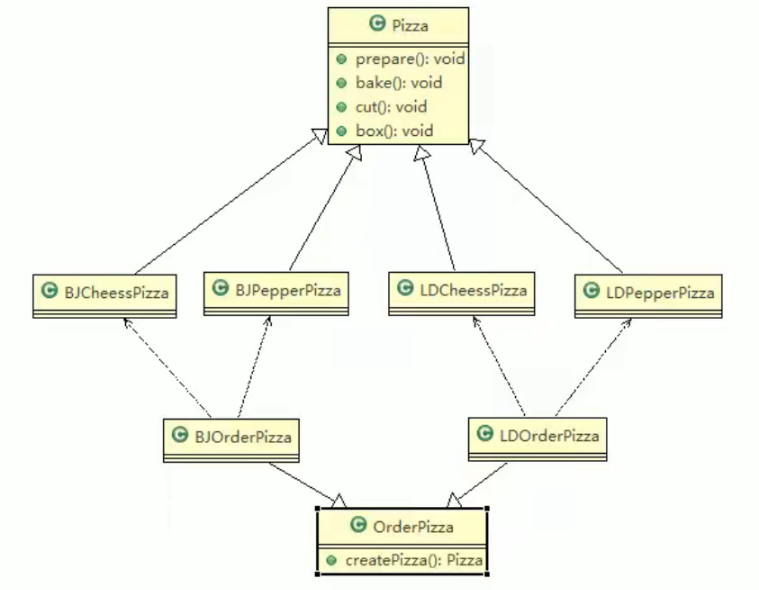

把创建的方法下沉到子类。让子类去关联对象

```java
import com.atguigu.factory.factorymethod.order.OrderPizza;
// 工厂方法模式将对象的实例化推迟到子类
import  com.atguigu.factory.factorymethod.order.LondonOrderPizza;
// 调用
import  com.atguigu.factory.factorymethod.pizzastore;
```
### 抽象工厂模式

    1)抽象工厂模式:定义了一个interface用于创建相关或有依赖关系的对象簇，而无需指明具体的类
    2)抽象工厂模式可以将简单工厂模式和工厂方法模式进行整合。
    3)从设计层面看，抽象工厂模式就是对简单工厂模式的改进(或者称为进一步的抽象)
    4)将工厂抽象成两层，AbsFactory(抽象工厂)和具体实现的工厂子类。程序员可以
    根据创建对象类型使用对应的工厂子类。这样将单个的简单工厂类变成了工厂簇,更利于代码的维护和扩展。


```java

```
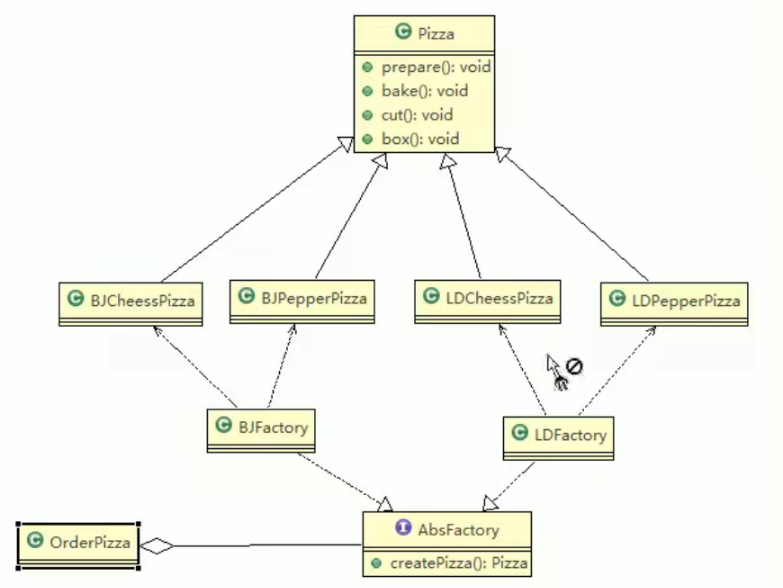

抽象工厂模式案例：
```java
import com.atguigu.factory.absfactory.PizzaAbstractFactory;
import com.atguigu.factory.absfactory.order.OrderPizza;
//调用
import com.atguigu.factory.absfactory.PizzaStore;
```
    简单工厂模式就一个工厂
    抽象工厂模式有很多工厂的子类。 如果产品的种类很多，抽象工厂模式很好用。如果产品种类不多，用简单工厂模式即可

####工厂模式源码分析：
 
```java
import java.util.Calendar;
```

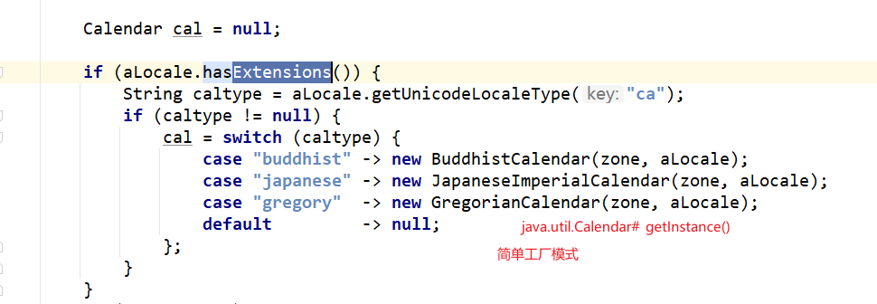
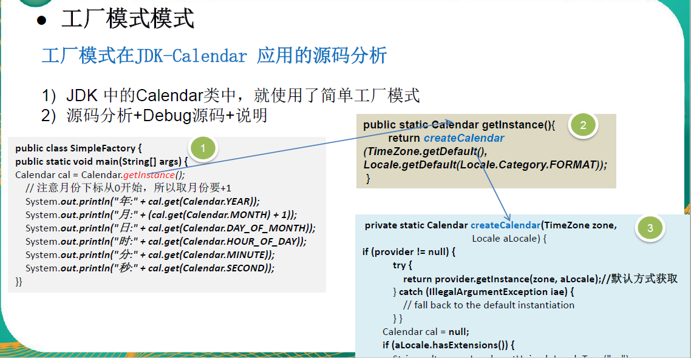

####工厂模式小结：
    1)工厂模式的意义
    将实例化对象的代码提取出来，放到一个类中统一管理和维护，达到 和主项目的依赖关系的解耦。从而提高项目的扩展和维护性。
    2)三种工厂模式：简单工厂模式(静态工厂模式)、工厂方法模式、抽象工厂模式
    3)设计模式的依赖抽象原则
    > 创建对象实例时，不要直接new类,而是把这个new类的动作放在一个工厂的方法中，并返回。
    > 有的书上说，变量不要直接持有具体类的引用。
    > 不要让类继承具体类，而是继承抽象类或者是实现interface(接口)
    >不要覆盖基类中已经实现的方法。

## 原型模式


## 适配器模式

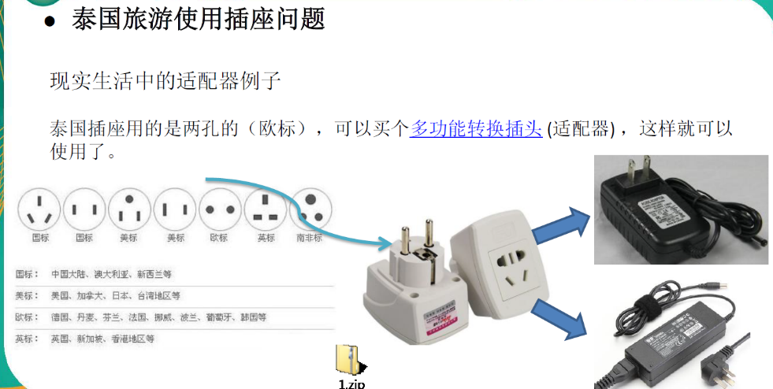

适配器模式基本介绍

    1）适配器模式(Adapter Pattern)将某个类的接口转换成客户端期望的另一个接口表示，
    主的目的是兼容性，让原本因接口不匹配不能一起工作的两个类可以协同工作。其别名为包装器(Wrapper)
    2)适配器模式属于结构型模式
    3)主要分为三类:类适配器模式、对象适配器模式、接口适配器模式

工作原理

    1）适配器模式:将一个类的接口转换成另一种接口.让原本接口不兼容的类可以兼容
    2)从用户的角度看不到被适配者，是解耦的
    3)用户调用适配器转化出来的目标接口方法，适配器再调用被适配者的相关接口
    方法
    4)用户收到反馈结果，感觉只是和目标接口交互，如图

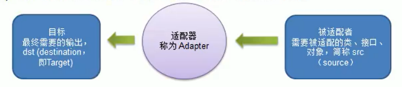
