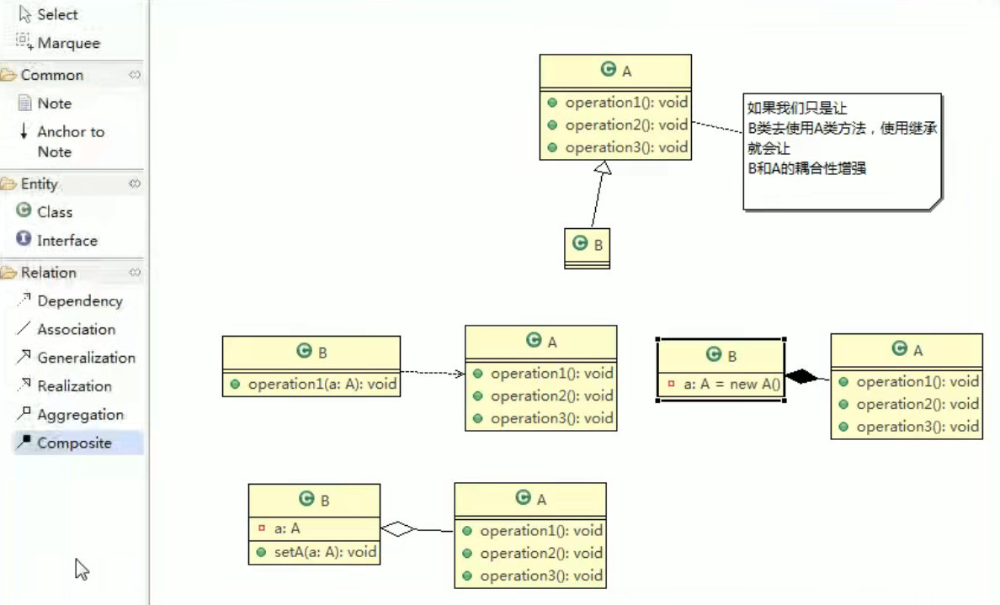

# 尚硅谷图解设计模式

设计模式是站在软件结构角度，可扩展性、稳定性 如果站在功能实现角度，或许这个功能的实现没必要用设计模式这么复杂。 prototype

#### 课程亮点和授课方式

    1)课程深入非蜻蜓点水
    2)课程成体系,非星星点灯
    3)高效而愉快的学习，设计模式很有用，其实也很好玩很像小时候搭积木。怎样搭建更加稳定，坚固
    4)设计模式很重要，因为包含很多编程思想，还是有一定难度的，我们努力做到通俗易懂
    5)采用应用场景->设计模式->剖析原理->分析实现步骤(图解)>代码实现>框架或项目源码分析(找到使用的地
    方)的步骤讲解[比如:建造者模式]
    6)课程目标:让大家掌握本质﹐达能在工作中灵活运用解决实际问题和优化程序结构的目的.

### 设计模式的七大原则

要求 1. 七大设计原则核心思想 2.能够以类图的说明涉及原则 3.在项目实际开发中哪里用到了ocp原则

    设计模式常用的七大原则：
    1.单一职责原则
    2.接口隔离原则
    3.依赖倒转原则
    4.里式替换原则
    5.开闭原则ocp
    6.迪米特法则
    7.合成复用原则

### > 原型设计模式问题:

    1)有请使用UML类图画出原型模式核心角色
    2)原型设计模式的深拷贝和浅拷贝是什么，并写出深拷贝的两种方式的源码(重写clone方法实现深拷贝、使用序列化来实现深拷贝)
    3)在Spring框架中哪里使用到原型模式，并对源码进行分析
    beans.xml
    bean id="id01" class="com.atguigu.spring.bean.Monster" scope="prototype"/>4) Spring 中原型bean 的创建，就是原型模式的应用

#### 先看几个经典的设计模式面试题

    金融借贷平台项目:借贷平台的订单，有审核-发布-抢单等等步骤，随着操作的不同,会改变订单的状态，
    项目中的这个模块实现就会使用到状态模式，请你使用状态模式进行设计，并完成实际代码


间题分析:

    这类代码难以应对变化，在添加一种状态时，我们需要手动添加if/else，在添加一种功能时，要对所有的状态进行判断。
    因此代码会变得越来越臃肿,并且一旦没有处理某个状态,便会发生极其严重的BUG，难以维护

##### 先看几个经典的设计模式面试题解释器设计模式

    1)介绍解释器设计模式是仕么?
    2)画出解释器设计模式的UML类图
        分析设计模式中的各个角色是什么?
    3)请说明Spring的框架中，哪里是用到了解释器设计模式，并做源码级别的分析

```java
    /** @see org.springframework.expression.spel.standard.SpelExpressionParser*/

import org.springframework.expression.spel.standard.SpelExpressionParser;

```

#### 单例设计模式一共有几种实现方式?请分别用代码实现，并说明各个实现方式的优点和缺点?

    单例设计模式一共有8种写法，后面我们会依次讲到
    1) 饿汉式两种
    2) 懒汉式三种
    3) 双重检查
    4) 静态内部类 
    5) 枚举

### 设计模式的重要性

    1)软件工程中，设计模式(design pattern）是对软件设计中普遍存在（反复出现)的各种问题，所提出的解决方案。
    这个术语是由埃里希·伽玛（Erich Gamma）等人在1990年代从建筑设计领域引入到计算机科学的
    
    2)大厦VS简易房
    
    3)拿实际工作经历来说，当一个项目开发完后，如果客户提出增新功能，怎么办?。（可扩展性，使用设计模式软件具有很好的扩展性）
    4)如果项目开发完后，原来程序员离职，你接手维护该项目怎么办?（维护性[可读性、规范性]）
    5)目前程序员门槛越来越高，一线IT公司(大厂)，都会问你在实际项目中使用过什么设计模式，怎样使用的，解决了什么问题。
    6)设计模式在软件中哪里? 面向对象（oo) ->功能模块[设计模式+算法(数据结构)]->框架->架构[服务器集群]
    7)如果想成为合格软件工程师，那就花时间来研究下设计模式是非常必要的.

### 设计模式的目的

编写软件过程中，程序员面临着来自耦合性，内聚性以及可维护性，可扩展性，重用性，灵活性等多方面的挑战， 设计模式是为了让程序(软件)，具有更好

    1)代码重用性(即:相同功能的代码，不用多次编写) 
    2)可读性(即:编程规范性，便于其他程序员的阅读和理解)
    3)可扩展性(即:当需要增加新的功能时，非常的方便，称为可维护)
    4)可靠性(即:当我们增加新的功能后，对原来的功能没有影响)
    5)使程序呈现 【高内聚，低耦合】 的特性
        分享金句:
        设计模式包含了面向对象的精髓，“懂了设计模式，你就懂了面向对象分析和设计（OOA/D）的精要”
        Scott Mayers 在其巨著《Effective C++》就曾经说过:C++老手和C++新手的区别就是前者手背上有很多伤疤(踩坑吃亏受伤)

## 设计模式七大原则

设计模式原则，其实就是程序员在编程时，应当遵守的原则，也是各种设计模式的 基础(即:设计模式为什么这样设计的依据)

### 1.单一职责原则：

对类来说的，即一个类应该只负责一项职责。 如类A负责两个不同职责:职责1，职责2。当职责1需求变更而改变A时，可能造成职责2执行错误，所以需要将类A的粒度分解为两个类：A1和A2

应用实例：

```java
    import com.atguigu.principle.singleresponsibility.SingleRsponsibility1;
import com.atguigu.principle.singleresponsibility.SingleRsponsibility2;
import com.atguigu.principle.singleresponsibility.SingleRsponsibility3;
```

#### 单一职责原则注意事项和细节

    1)降低类的复杂度，一个类只负责一项职责。
    2)提高类的可读性，可维护性
    3)降低变更引起的风险
    4)）通常情况下，我们应当遵守单一职责原则，只有逻辑足够简单例如方法很少(像上例的SingleRsponsibility3)，才可以在代码级违反单一职责原则;
        只有类中方法数量足够少，可以在方法级别保持单一职责原则

心得： if else 可以用 增加类、增加方法来代替，用来降低耦合度

### 2. 接口隔离原则

客户端不应该依赖它不需要的接口，即一个类对另一个类的依赖应该建立在最小的接口上

应用实例：


类A通过接口Interfacel依赖类B，类C通过接口Interfacel依赖类D，如果接口Interfacel对于类A和类C来说不是最小接口， 那么类B和类D必须去实现他们不需要的方法。 改进前：

```java
    import com.atguigu.principle.segregation.Segregation1;
```

按隔离原则应当这样处理:
将接口Interface1拆分为独立的几个接口(这里我们拆分成3个接口)，类A和类C分别与他们需要的接口建立依赖关系。也就是采用接口隔离原则

改进后：

    l)类A通过接口Interfacel依赖类B，类C通过接口Interfacel依赖类D，如果接口Interfacel对于类A和类C
    来说不是最小接口，那么类B和类D必须去实现他们不需要的方法
    2)将接口Interface1拆分为独立的几个接口，类A和类C分别与他们需要的接口建立依赖关系。也就是采用接口
    隔离原则
    3)接口 Interface1 中出现的方法，根据实际情况拆分为三个接口
    Interface1拆分以下接口 Interface1Plus，Interface2，Interface3，见：


```java
    import com.atguigu.principle.segregation.Segregation2;
```

通俗讲：希望我们依赖的 是最小的

### 3. 依赖倒转(依赖倒置)原则

    依赖倒转原则(Dependence Inversion Principle)是指:
    l)高层模块不应该依赖低层模块，二者都应该依赖其抽象
    2)抽象不应该依赖细节，细节应该依赖抽象
    3)依赖倒转(依赖倒置)的中心思想是面向接口编程
    4)依赖倒转原则是基于这样的设计理念:相对于细节的多变性，抽象的东西要稳定的多。以抽象为基础搭建的架
    构比以细节为基础的架构要稳定的多。在java中，抽象指的是接口或抽象类，细节就是具体的实现类
    5)使用接口或抽象类的目的是制定好规范，而不涉及任何具体的操作，把展现细节的任务交给他们的实现类去完成

应用案例：

```java
    // 优化前

import com.atguigu.principle.inversion.Person;
// 优化后
import com.atguigu.principle.inversion.PersonPlus;
import com.atguigu.principle.inversion.IReceiver;
```

依赖倒置原则 依赖传递 可以通过 接口方式、构造器方式、setter方式 三种方式。 第一种方式如上应用案例。第二第三种方式 使用“组合”:

```java
import com.atguigu.principle.inversion.PersonPlusConstructor;
import com.atguigu.principle.inversion.PersonPlusSetter;
```

依赖倒转原则的注意事项和细节:

    l)低层模块尽量都要有抽象类或接口，或者两者都有，程序稳定性更好.
    2)变量的声明类型尽量是抽象类或接口,这样我们的变量引用和实际对象间，就存在一个缓冲层，利于程序扩展和优化
    3)继承时遵循里氏替换原则

### 4. 里氏替换原则

基本介绍

    1)里氏替换原则(Liskov Substitution Principle)在1988年，由麻省理工学院的里斯科夫（Liskov）女士提出的。
    2)如果对每个类型为T1的对象o1，都有类型为T2的对象o2，使得以T1定义的所有程序
        P在所有的对象o1都代换成o2时，程序P的行为没有发生变化，那么类型T2是类型T1的子类型。
        换句话说，所有引用基类的地方必须能透明地使用其子类的对象。
    3)在使用继承时，遵循里氏替换原则，在子类中尽量不要重写父类的方法
    4)里氏替换原则告诉我们，继承实际上让两个类耦合性增强了，在适当的情况下，可以通过聚合,组合,依赖来解决问题。.

### 5. 开闭原则 OCP: Open Closed Principle

基本介绍

    1）开闭原则(Open Closed Principle）是编程中最基础、最重要的设计原则
    2)一个软件实体如类，模块和函数应该对扩展开放，对修改关闭。用抽象构建框架，用实现扩展细节。
    3)当软件需要变化时，尽量通过扩展软件实体的行为来实现变化，而不是通过修改已有的代码来实现变化。
    4)编程中遵循其它原则，以及使用设计模式的目的就是遵循开闭原则。

应用案例

```java
// 修改前
import com.atguigu.principle.ocp.Ocp;
// 发现新增一个三角形违背了开闭原则 OCP原则
import com.atguigu.principle.ocp.Triangle;
// 修改后，满足OCP原则
import com.atguigu.principle.ocp.OcpImprove;
// 新增一个其他图形。
import com.atguigu.principle.ocp.OtherGraphic;
```

### 6. 迪米特法则(最少知道原则)

基本介绍

    1)一个对象应该对其他对象保持最少的了解
    2)类与类关系越密切，耦合度越大
    3)迪米特法则(Demeter Principle)又叫最少知道原则，即一个类对自己依赖的类知道的越少越好。
      也就是说，对于被依赖的类不管多么复杂，都尽量将逻辑封装在类的内部。对外除了提供的public方法，不对外泄露任何信息
    4)迪米特法则还有个更简单的定义:只与直接的朋友通信
    5)直接的朋友:每个对象都会与其他对象由耦合关系，只要两个对象之间有耦合关系，我们就说这两个对象之间是朋友关系。
    耦合的方式很多，依赖，关联，组合，聚合等。其中，我们称出现成员变量，方法参数，方法返回值中的类为直接的朋友，
    而出现在局部变量中的类不是直接的朋友。也就是说，陌生的类最好不要以局部变量的形式出现在类的内部。

应用实例
    1)有一个学校，下属有各个学院和总部，现要求打印出学校总部员工ID和学院员工的id
    编程实现上面的功能,看代码演示
```java
// 改进前
// 77行代码分析
import com.atguigu.principle.demeter.SchoolManager;
// 改进后
import com.atguigu.principle.demeter.SchoolManagerPlus;
```

### 7. 合成复用原则(Composite Reuse Principle)
原则是尽量使用合成/聚合的方式，而不是使用继承

如果只是让 B类 去使用 A类 的方法，使用继承会让 B类 和 A类 的耦合性增强，这种情况继承不是一个好的选择 is a 改为 has a会更好


设计原则核心思想

    l)找出应用中可能需要变化之处，把它们独立出来，不要和那些不需要变化的代码混在一起。
    2)针对接口编程，而不是针对实现编程。
    3)为了交互对象之间的松耦合设计而努力


### UML类图
UML基本介绍

    I)UML——Unified modeling language UML(统一建模语言)，是一种用于软件系统分析和设计的语言工具，
      它用于帮助软件开发人员进行思考和记录思路的结果
    2)UML本身是一套符号的规定，就像数学符号和化学符号一样，这些符号用于描述软件模型中的各个元素和
      他们之间的关系，比如类、接口、实现、泛化、依赖、组合、聚合等，如下图:

    3) 使用UJML来建模，常用的工具有 RationalRose,也可以使用一些插件来建模
    [RationalRose 介绍](https://blog.csdn.net/gz153016/article/details/49641847)
说明：
    IDEA专业版右键DiaGrams。IDEA 社区版本暂不支持，正在搜索较好的插件中。。。

