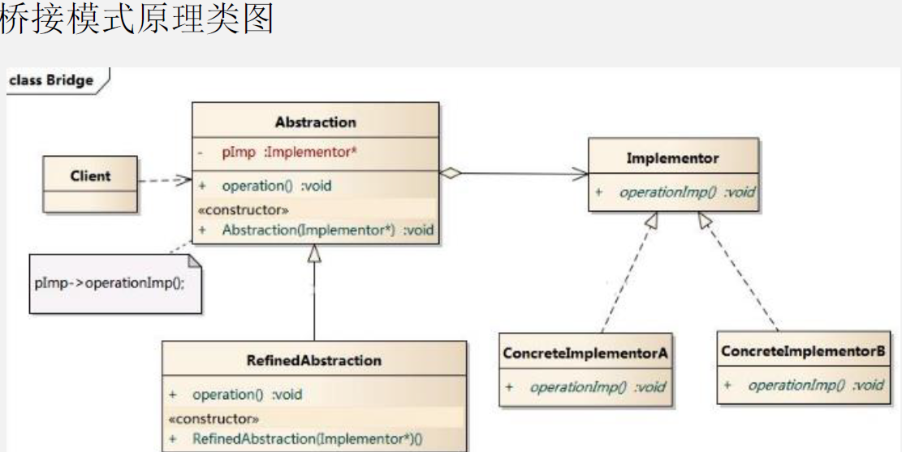
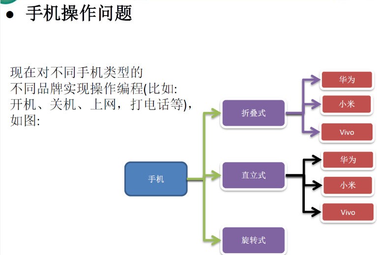
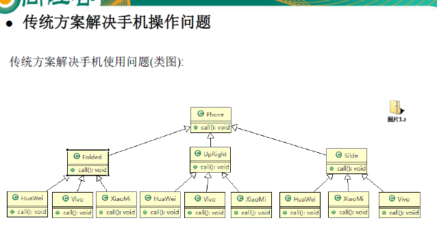
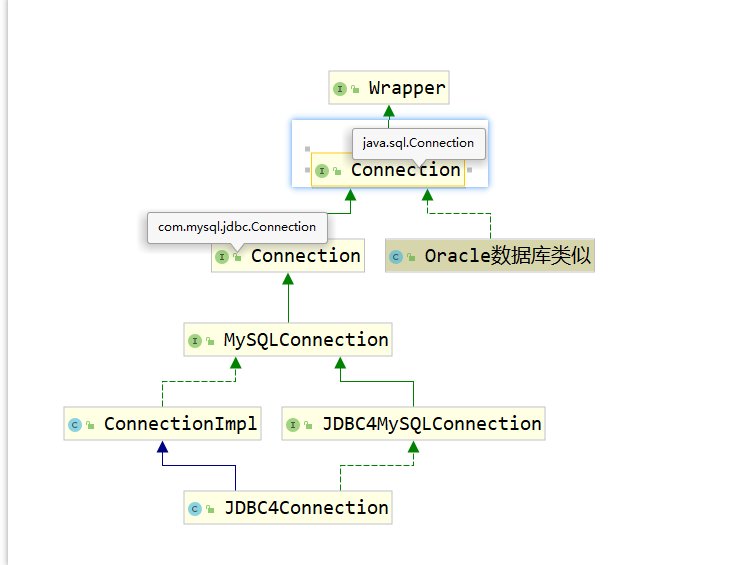

## 桥接模式 Bridge

桥接模式(Bridge)-基本介绍

基本介绍

    桥接模式(Bridge模式)是指:将实现与抽象放在两个不同的类层次中，使两个层次可以独立改变。
    是一种结构型设计模式
    Bridge模式基于类的最小设计原则，通过使用封装、聚合及继承等行为让不同的类承担
    不同的职责。它的主要特点是把抽象(Abstraction)与行为实现(Implementation)分离开来，
    从而可以保持各部分的独立性以及应对他们的功能扩展


原理类图说明：

    1. Client 类；桥接模式的调用者
    2. 抽象类（Abstraction）：维护了 Implementor 即它的实现类 ConcreteImplementorA 
    二者是聚合关系，Abstraction 充当了桥接类
    3. RefinedAbstraction：是 Abstraction 抽象类的子类
    4. Implementor：行为实现类的接口
    5. ConcreteImplementor A/B：行为的具体实现类
    6. 从UML图：这里的抽象类和接口是聚合的关系，其实是调用和被调用的关系

案例：





#### 传统方案解决手机操作问题分析

    1)扩展性问题(类爆炸)，如果我们再增加手机的样式(旋转式)，就需要增加各个品牌手机的类，
    同样如果我们增加一个手机品牌，也要在各个手机样式类下增加。
    2)违反了单一职责原则，当我们增加手机样式时，要同时增加所有品牌的手机，这样增加了代码维护成本.
    3)解决方案-使用桥接模式


```java
/**
 * 手机品牌接口
 *
 * @author pengtao
 * @createdate 2022/02/18 0018
 */
public interface PhoneBrand {

    /** 开机 */
    void open();
    /** 关机 */
    void close();
    /** 打电话 */
    void call();
}
```

实现了手机品牌接口的具体手机品牌类。  XiaoMi,Vivo, ....
```java
/**
 * 小米手机
 *
 * @author pengtao
 * @createdate 2022/02/18 0018
 */
public class XiaoMi implements PhoneBrand {
    @Override
    public void open() {
        System.out.println("小米手机开机");

    }

    @Override
    public void close() {
        System.out.println("小米手机关机");

    }

    @Override
    public void call() {
        System.out.println("小米手机打电话");
    }
}
```

手机抽象类

```java
/**
 * 手机
 *
 * @author pengtao
 * @createdate 2022/02/18 0018
 */
public abstract class Phone {

    /** 组合 手机品牌 */
    private PhoneBrand phoneBrand;

    public Phone(PhoneBrand phoneBrand) {
        this.phoneBrand = phoneBrand;
    }

    protected void open() {
        this.phoneBrand.open();
    }

    protected void close() {
        this.phoneBrand.close();
    }

    protected void call() {
        this.phoneBrand.call();
    }
}
```

继承了手机抽象类的 各种种类的手机：折叠屏手机FoldedPhone，直屏手机，...
```java
/**
 * 折叠屏 手机 继承了 手机抽象类
 *
 * @author pengtao
 * @createdate 2022/02/18 0018
 */
public class FoldedPhone extends Phone {

    public FoldedPhone(PhoneBrand phoneBrand) {
        super(phoneBrand);
    }

    @Override
    protected void open() {
        super.open();
        System.out.println("折叠样式手机开机");

    }

    @Override
    protected void close() {
        super.close();
        System.out.println("折叠样式手机关机");
    }

    @Override
    protected void call() {
        super.call();
        System.out.println("折叠样式手机打电话");
    }
}
```

桥接模式 客户端调用

```java
/**
 * 桥接模式 客户端调用
 * @author pengtao
 * @createdate 2022/02/18 0018
 */
public class BridgeClient {

    public static void main(String[] args) {

        // 获取折叠式手机（样式+品牌）
        Phone xiaomiFoldedPhone = new FoldedPhone(new XiaoMi());
        xiaomiFoldedPhone.open();
        xiaomiFoldedPhone.call();
        xiaomiFoldedPhone.close();

        System.out.println("----------");
        Phone foldedVivoPhone = new FoldedPhone(new Vivo());
        foldedVivoPhone.open();
        foldedVivoPhone.call();
        foldedVivoPhone.close();
    }
}
```
扩展另外一个样式的手机，就有了 一个样式，各种品牌的手机
扩展另外一个品牌的手机，就有了 一个品牌，各种样式的手机

#### 桥接模式 JDBC 源码

jdbc 的 Driver 接口
```java
/**
 * @see java.sql.Driver
 * @see java.sql.DriverManager
 * @see java.sql.DriverManager
 * @see java.sql.Connection
 * @see com.mysql.jdbc.Connection
 * @see com.mysql.jdbc.Connection
 */
```



#### 桥接模式的注意事项和细节

    桥接模式的注意事项和细节
    1)实现了抽象和实现部分的分离，从而极大的提供了系统的灵活性，让抽象部分和实现部分独立开来，
    这有助于系统进行分层设计，从而产生更好的结构化系统。
    2)对于系统的高层部分，只需要知道抽象部分和实现部分的接口就可以了，其它的部分由具体业务来完成。
    3)桥接模式替代多层继承方案，可以减少子类的个数，降低系统的管理和维护成本。
    4)桥接模式的引入增加了系统的理解和设计难度，由于聚合关联关系建立在抽象层,
    要求开发者针对抽象进行设计和编程
    5)桥接模式要求正确识别出系统中两个独立变化的维度，因此其使用范围有一定的局限性，
    即需要有这样的应用场景。

####桥接模式其它应用场景

    1)对于那些不希望使用继承或因为多层次继承导致系统类的个数急剧增加的系统，桥
    接模式尤为适用.

    2)常见的应用场景:
    -JDBC驱动程序
    -银行转账系统
    转账分类:网上转账，柜台转账，AMT转账
    转账用户类型:普通用户，银卡用户，金卡用户..
    -消息管理
    消息类型:即时消息，延时消息
    消息分类:手机短信，邮件消息，QQ消息..
