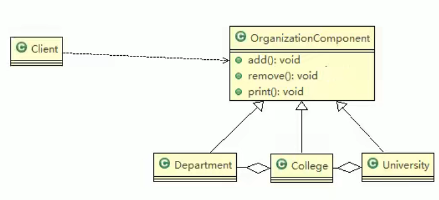
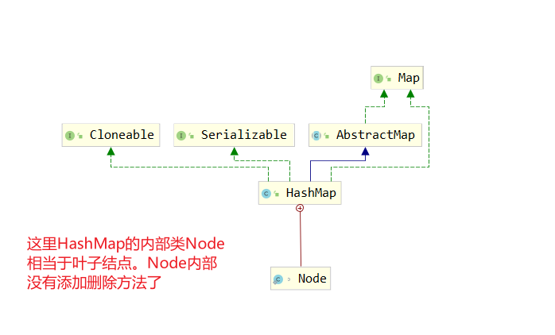

## 组合模式 Composite Pattern

组合模式基本介绍

    1)组合模式(Composite Pattern），又叫部分整体模式，它创建了对象组的树形结构，将对象组合成树状结构以表示“整体-部分”的层次关系。
    2)组合模式依据树形结构来组合对象，用来表示部分以及整体层次。
    3)这种类型的设计模式属于结构型模式。
    4)组合模式使得用户对单个对象和组合对象的访问具有一致性，即:组合能让客户以一致的方式处理个别对象以及组合对象


案例：学校院系展示需求
    
    看一个学校院系展示需求
    编写程序展示一个学校院系结构:需求是这样，要在一个页面中展示出学校的院系组成，一个学校有多个学院，一个学院有多个系。
    例如:

    ---清华大学---
    -------计算机学院-计算机科学与技术软件工程
    网络工程
    -------信息工程学院---
    通信工程
    信息工程

传统解决方案： 院系 继承 学院， 学院继承学校

传统方案解决学校院系展示问题分析

    1）将学院看做是学校的子类，系是学院的子类，这样实际上是站在组织大小来进行分层次的
    2)实际上我们的要求是:在一个页面中展示出学校的院系组成，一个学校有多个
    学院，一个学院有多个系，因此这种方案，不能很好实现的管理的操作，比如对学院、系的添加，删除，遍历等
    3)解决方案:把学校、院、系都看做是组织结构，他们之间没有继承的关系，而是
    一个树形结构，可以更好的实现管理操作。=>组合模式


组合模式
    组合模式（Composite Pattern），又叫部分整体模式，是用于把一组相似的对象当作一个单一的对象。
    组合模式依据树形结构来组合对象，用来表示部分以及整体层次。这种类型的设计模式属于结构型模式，它创建了对象组的树形结构。
    
    这种模式创建了一个包含自己对象组的类。该类提供了修改相同对象组的方式。
    
    我们通过下面的实例来演示组合模式的用法。实例演示了一个组织中员工的层次结构。
    
    介绍
    意图：将对象组合成树形结构以表示"部分-整体"的层次结构。组合模式使得用户对单个对象和组合对象的使用具有一致性。
    
    主要解决：它在我们树型结构的问题中，模糊了简单元素和复杂元素的概念，客户程序可以像处理简单元素一样来处理复杂元素，从而使得客户程序与复杂元素的内部结构解耦。
    
    何时使用： 1、您想表示对象的部分-整体层次结构（树形结构）。 2、您希望用户忽略组合对象与单个对象的不同，用户将统一地使用组合结构中的所有对象。
    
    如何解决：树枝和叶子实现统一接口，树枝内部组合该接口。
    
    关键代码：树枝内部组合该接口，并且含有内部属性 List，里面放 Component。
    
    应用实例： 1、算术表达式包括操作数、操作符和另一个操作数，其中，另一个操作数也可以是操作数、操作符和另一个操作数。 2、在 JAVA AWT 和 SWING 中，对于 Button 和 Checkbox 是树叶，Container 是树枝。
    
    优点： 1、高层模块调用简单。 2、节点自由增加。
    
    缺点：在使用组合模式时，其叶子和树枝的声明都是实现类，而不是接口，违反了依赖倒置原则。
    
    使用场景：部分、整体场景，如树形菜单，文件、文件夹的管理。
    
    注意事项：定义时为具体类。


#### 组合模式原理类图

对原理结构图的说明-即(组合模式的角色及职责)

1) Component :这是组合中对象声明接口s在适当情况下s实现所有类共有的接口默认行为,用于访问和管理Campnant子部件,Componeat可以是抽象类或者接口
2) Leaf :在组合中表示叶子节点,叶子节点没有子节点
3) Camposite :非叶子节点，用于存储子部件，在 Component 接口中实现子部件的相关操作,比如增加、删除


案例：



```java
package com.atguigu.compite;

import lombok.AllArgsConstructor;
import lombok.Data;

/**
 * 组合模式- Componet
 *
 * @author pengtao
 * @createdate 2022/02/19 0019
 */
@Data
@AllArgsConstructor
public abstract class OrganizationComponent {

    /** 名字 */
    private String name;

    /** 说明 */
    private String description;

    protected void add(OrganizationComponent organizationComponent) {
        // 默认实现： 不能写成抽象：因为有叶子结点 不需要实现 添加方法
        throw new UnsupportedOperationException();
    }

    protected void remove(OrganizationComponent organizationComponent) {
        // 默认实现： 不能写成抽象：因为有叶子结点 不需要实现 添加方法
        throw new UnsupportedOperationException();
    }

    /** 信息打印 */
    protected abstract void print();
}

```

// TODO

#### 组合模式在 JDK 集合的源码分析 ： HashMap

```java
package com.atguigu.compite;

/**
 * 组合模式在jdk的hashmap中的应用
 *
 * @author pengtao
 * @createdate 2022/02/19 0019
 */

import java.util.HashMap;
import java.util.Map;

public class HashMapCompositeClient {

    public static void main(String[] args) {

        //说明
        //1. Map 就是一个抽象的构建 (类似我们的Component)
        //2. HashMap是一个中间的构建(Composite), 实现/继承了相关方法
        //   put, putall
        //3. Node 是 HashMap的静态内部类，类似Leaf叶子节点, 这里就没有put, putall
        //   static class Node<K,V> implements Map.Entry<K,V>

        Map<Integer, String> hashMap = new HashMap<Integer, String>();
        hashMap.put(0, "东游记");//直接存放叶子节点(Node)

        Map<Integer,String> map=new HashMap<Integer,String>();
        map.put(1, "西游记");
        map.put(2, "红楼梦"); //..
        hashMap.putAll(map);
        System.out.println(hashMap);

    }
}


```
分析：

    Map 就是一个抽象的构建 (类似我们的Component)
    HashMap是一个中间的构建(Composite), 实现/继承了相关方法
       put, putall
    Node 是 HashMap的静态内部类，类似Leaf叶子节点, 这里就没有put, putall




#### 组合模式的注意事项和细节组合模式的注意事项和细节

    1)简化客户端操作。客户端只需要面对一致的对象而不用考虑整体部分或者节点叶子的问题。
    2具有较强的扩展性。当我们要更改组合对象时，我们只需要调整内部的层次关系，客户端不用做出任何改动.
    3)方便创建出复杂的层次结构。客户端不用理会组合里面的组成细节，容易添加节点或者叶子从而创建出复杂的树形结构
    4)需要遍历组织机构，或者处理的对象具有树形结构时，非常适合使用组合模式.
    5）要求较高的抽象性，如果节点和叶子有很多差异性的话，比如很多方法和属性都不一样，不适合使用组合模式
