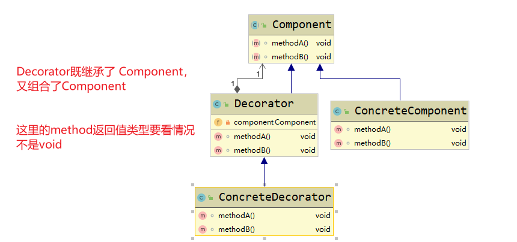
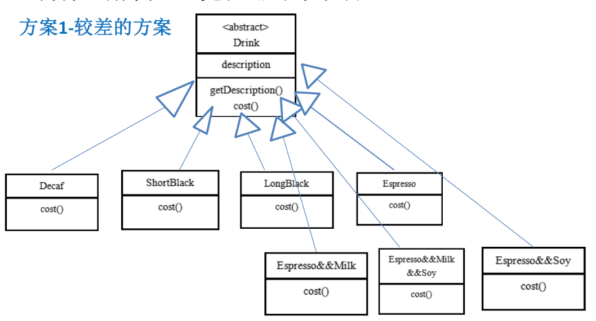
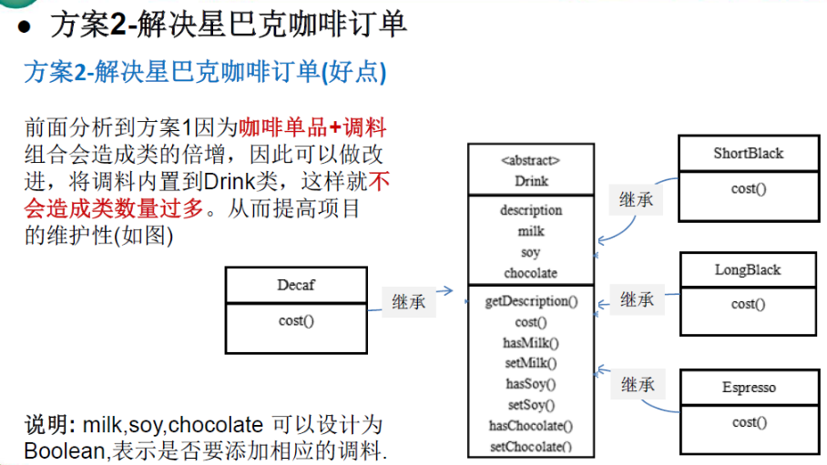
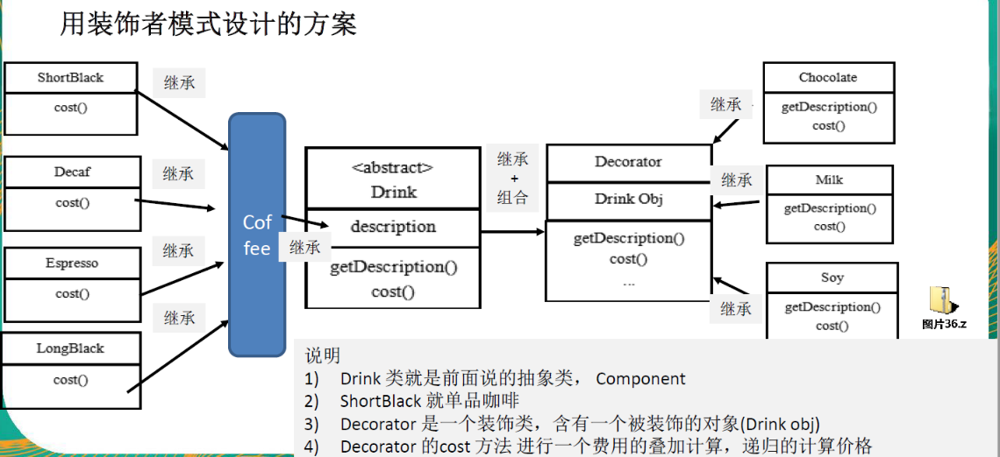
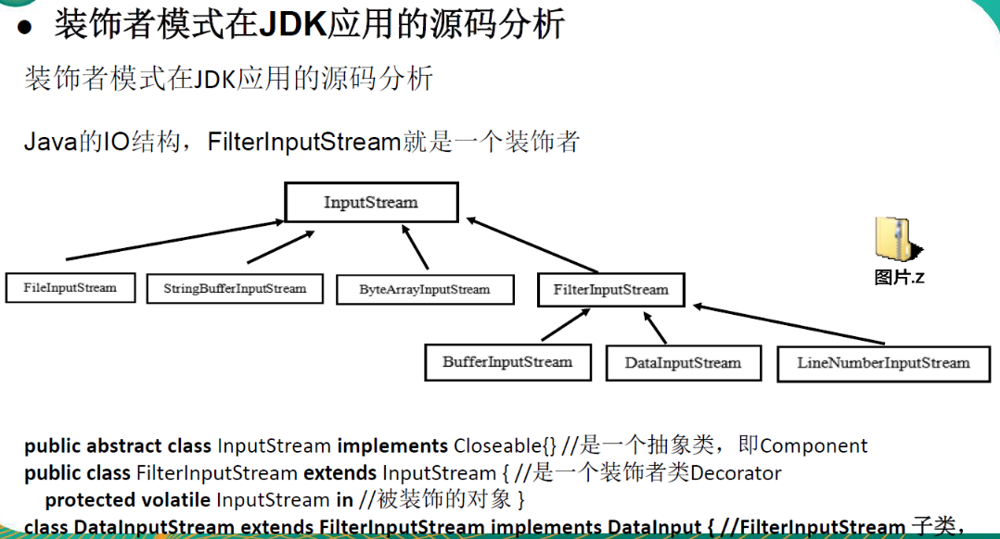
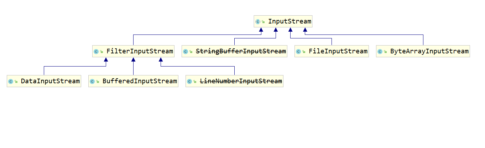

## 装饰者模式 Decorator Pattern

动态的将新功能附加到对象上。在对象功能扩展方面，它比继承更有弹性，装饰者模式也体现了开闭原则(ocp)

装饰者模式原理

      1 装饰者模式就像打包一个快递
      主体:比如:陶瓷、衣服(Component)//被装饰者
      包装:比如:报纸填充、塑料泡沫、纸板、木板(Decorator)
      2. ConcreteComponent和Decorator
      ConcreteComponent:具体的主体，比如下面案例的各个单品咖啡
      Decorator:装饰者，比如各调料
      3 在如图的Component与ConcreteComponent之间，如果ConcreteComponent类很多,还可以设计一个缓冲层，将共有的部分提取出来，抽象层一个类。  

装饰者模式原理图：




#### 案例：星巴克咖啡订单项目(咖啡馆) :

    1)咖啡种类/单品咖啡: Espresso(意 大利浓咖啡)、ShortBlack、 LongBlack(美式咖啡)、Decaf(无因咖啡)
    2)调料: Milk、 Soy(豆浆)、 Chocolate
    3)要求在扩展新的咖啡种类时，具有良好的扩展性、改动方便、维护方便
    4)使用0O的来计算不同种类咖啡的费用:客户可以点单品咖啡，也可以单品咖啡+调料组合。

解决方案一：



方案1-解决星巴克咖啡订单问题分析

    1. Drink是一个抽象类，表示饮料
    2. des就是对咖啡的描述，比如咖啡的名字
    3. cost() 方法就是计算费用，Drink类中做成一个抽象方法.
    4. Decaf就是单品咖啡，继承Drink,并实现cost
    5. Espress&&Milk就是单品咖啡+调料，这个组合很多
    6. 问题:这样设计，会有很多类，当我们增加一个单品咖啡，或者一个新的调料类的数量就会倍增，就会出现类爆炸

方案2-解决星巴克咖啡订单问题分析




##### 方案2-解决星巴克咖啡订单问题分析方案2-的问题分析

    1)方案2可以控制类的数量，不至于造成很多的类
    2)在增加或者删除调料种类时，代码的维护量很大
    3)考虑到用户可以添加多份调料时，可以将hasMilk返回一个对应int
    4)考虑使用装饰者模式

#### 装饰者模式：动态的将新功能附加到对象上。在对象功能扩展方面，它比继承更有弹性，装饰者模式也体现了开闭原则(ocp)



说明

    1) Drink 类就是前面说的抽象类，Component
    2) ShortBlack 就单品咖啡
    3) Decorator 是一个装饰类，含有一个被装饰的对象(Drink obj)
    4) Decorator 的 cost 方法进行一个费用的叠加计算，递归的计算价格

    LongBlack直译为【长黑】，国内也称为【澳黑】（澳式黑咖啡）
    ShortBlack 美式咖啡
    Espresso 意大利咖啡

#### 应用分析：





```java

/**
 * @see java.io.InputStream
 * @see java.io.FilterInputStream
 */
public class FilterInputStream extends InputStream {
    /**
     * The input stream to be filtered.
     */
    protected volatile InputStream in;

    /**
     * Creates a {@code FilterInputStream}
     * by assigning the  argument {@code in}
     * to the field {@code this.in} so as
     * to remember it for later use.
     *
     * @param   in   the underlying input stream, or {@code null} if
     *          this instance is to be created without an underlying stream.
     */
    protected FilterInputStream(InputStream in) {
        this.in = in;
    }
}

```
分析：

    InputStream 是抽象类， 可以看做 案例中的 Drink
    FileInputStream 是 InputStream 的子类， 类似于 咖啡子类 LongBlack澳式、ShortBlack美式
    FilterInputStream 是 InputStream 的子类，可以看做是装饰者 Decorator ,
    DataInputStream 是 FilterInputStream 的子类 是具体的装饰者 类似于 案例中的牛奶 Milk 、巧克力 调味品
    FilterInputStream 类中的 属性 protected volatile InputStream in, 是被装饰者 Componment 。
    

#### 装饰者模式---菜鸟教程
[](https://www.runoob.com/design-pattern/decorator-pattern.html)
    装饰器模式（Decorator Pattern）允许向一个现有的对象添加新的功能，同时又不改变其结构。这种类型的设计模式属于结构型模式，它是作为现有的类的一个包装。
    
    这种模式创建了一个装饰类，用来包装原有的类，并在保持类方法签名完整性的前提下，提供了额外的功能。
    
    我们通过下面的实例来演示装饰器模式的用法。其中，我们将把一个形状装饰上不同的颜色，同时又不改变形状类。
    
    介绍
    意图：动态地给一个对象添加一些额外的职责。就增加功能来说，装饰器模式相比生成子类更为灵活。
    
    主要解决：一般的，我们为了扩展一个类经常使用继承方式实现，由于继承为类引入静态特征，并且随着扩展功能的增多，子类会很膨胀。
    
    何时使用：在不想增加很多子类的情况下扩展类。
    
    如何解决：将具体功能职责划分，同时继承装饰者模式。
    
    关键代码： 1、Component 类充当抽象角色，不应该具体实现。 2、修饰类引用和继承 Component 类，具体扩展类重写父类方法。
    
    应用实例： 1、孙悟空有 72 变，当他变成"庙宇"后，他的根本还是一只猴子，但是他又有了庙宇的功能。 2、不论一幅画有没有画框都可以挂在墙上，但是通常都是有画框的，并且实际上是画框被挂在墙上。在挂在墙上之前，画可以被蒙上玻璃，装到框子里；这时画、玻璃和画框形成了一个物体。
    
    优点：装饰类和被装饰类可以独立发展，不会相互耦合，装饰模式是继承的一个替代模式，装饰模式可以动态扩展一个实现类的功能。
    
    缺点：多层装饰比较复杂。
    
    使用场景： 1、扩展一个类的功能。 2、动态增加功能，动态撤销。
    
    注意事项：可代替继承。
