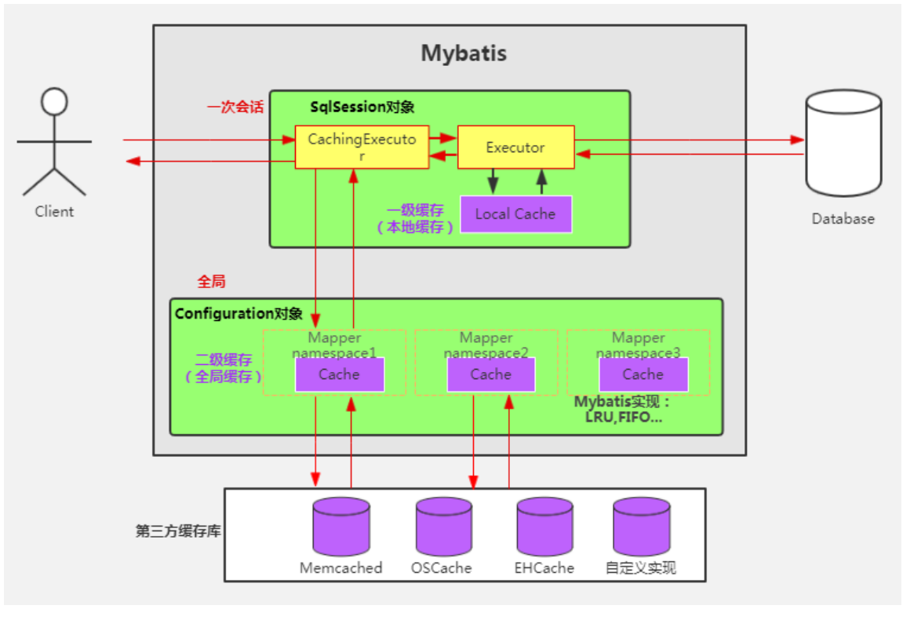
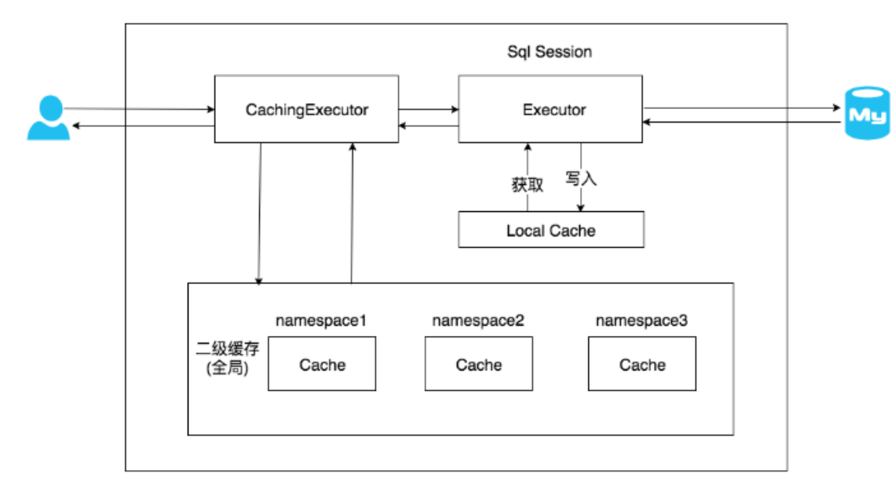
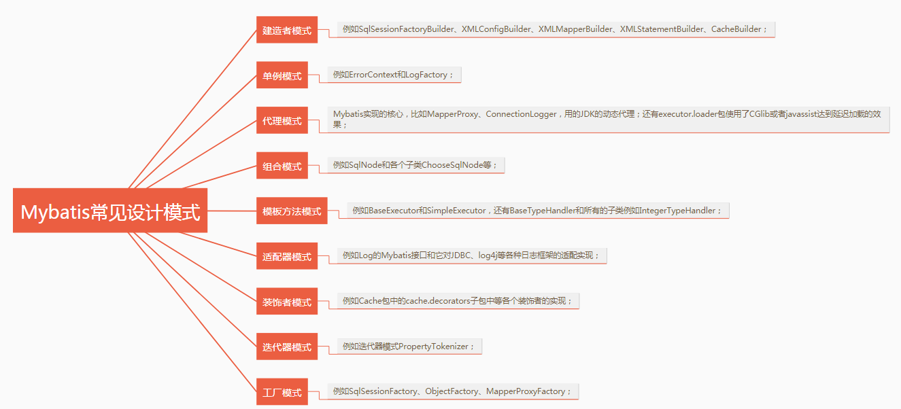

Mybatis面试题

# 1、什么是MyBatis  orm/定制化sql/ jdcb/ xml
1) MyBatis是一个半自动的对象关系映射ORM(Object Relation Mapping ）框架
2) 并且它是一个支持定制化SQL、存储过程以及高级映射的优秀的持久层框架。使程序员可以编写原生态sql，严格控制sql执行性能。并且灵活度高
3) MyBatis 内部封装了JDBC，避免了几乎所有的JDBC代码（不需要花费精力去处理加载驱动、创建连接、创建statement）、手动设置参数、结果集检索
4) MyBatis 使用简单的XML或注解用于配置和原始映射，将接口和Java的POJO (Plain Old JavaObjects，普通的Java对象）映射成数据库中的记录
  
# 2、说说MyBatis的优点和缺点 基于sql编程灵活、支持与jdbc比，兼容数据库，与spring集成，提供映射标签

优点：
1) 基于SQL语句编程，相当灵活，不会对应用程序或者数据库的现有设计造成任何影响， SQL 和 Java 编码分开，功能边界清晰。
  Java代码专注业务。SQL语句专注数据，写在XML里，使 sql 与程序代码的耦合度降低，便于统一管理；
  提供XML标签，支持编写动态SQL语句，并可重用。
2) 与JDBC相比，~~减少了50%以上的代码量，~~消除了JDBC大量冗余的代码，不需要手动开关连接；
3) 很好的与各种数据库兼容（因为MyBatis使用JDBC来连接数据库，所以只要JDBC支持的数据库MyBatis都支持）。
4) 能够与Spring很好的集成；
5) 提供映射标签，支持对象关系映射；提供对象关系映射标签，支持对象关系组件维护。
6) 轻量级，性能出色

缺点
1) SQL语句的编写工作量较大，尤其当字段多、关联表多时，对开发人员编写SQL语句的功底有一定要求。
2) SQL语句依赖于数据库，导致数据库移植性差，不能随意更换数据库。
3) 开发效率稍逊于Hibernate，但是完全能够接受

# 3、#{}和${}的区别是什么？ 预编译/替换 sql注入

- 井号是预编译处理，${}是字符串替换。
- Mybatis在处理#{}时，会将sql中的 井号大括号 替换为 问号，~~调用 PreparedStatement 的set方法来赋值；~~
- Mybatis在处理${}时，就是把${}替换成变量的值。
- 使用#{}可以有效的防止SQL注入，提高系统安全性。 井号和刀乐符使用的原则是，能用井号就不要使用刀乐符

# 4、当实体类中的属性名和表中的字段名不一样 ，怎么办 ？ 定义别名/resultMap标签
第1种： 通过在查询的sql语句中定义字段名的别名，让字段名的别名和实体类的属性名一致。

第2种： 通过 resultMap 标签 来映射字段名和实体类属性名的一一对应的关系。reulstMap标签中 result标签的属性property、column

```
    <resultMap id="empResultMap" type="Emp">
        <id property="eid" column="eid"></id>
        <result property="empName" column="emp_name"></result>
        <result property="age" column="age"></result>
        <result property="gender" column="gender"></result>
        <result property="email" column="email"></result>
    </resultMap>
```
# 5、Mybatis是如何进行分页的？分页插件的原理是什么？ RowBounds / Interceptor

Mybatis 使用 RowBounds 对象进行分页，它是针对 ResultSet 结果集执行的内存分页，而非物理分页。
可以在sql内直接拼写带有物理分页的参数来完成物理分页功能，也可以使用分页插件来完成物理分页，
比如：使用MySQL数据的时候，在原有SQL后面拼写limit。

分页插件的基本原理是使用Mybatis提供的插件接口 Interceptor ，实现自定义插件，在插件的拦截方法内拦截待执行的sql，
然后重写sql，~~根据dialect方言，~~添加对应的物理分页语句和物理分页参数。
例如 com.github.pagehelper 分页插件的 PageInterceptor 类 实现了 Interceptor 接口 

```java
/**
 * @see org.apache.ibatis.session.RowBounds
 * @see org.apache.ibatis.plugin.Interceptor
 * @see com.github.pagehelper.PageInterceptor
 */
```

# 6、Mybatis是如何将sql执行结果封装为目标对象并返回的？都有哪些映射形式？ resultMap标签
第1种： 通过在查询的sql语句中定义字段名的别名，让字段名的别名和实体类的属性名一致。

第2种： 通过 resultMap 标签 来映射字段名和实体类属性名的一一对应的关系。property、column

有了列名与属性名的映射关系后，Mybatis通过反射创建对象，同时使用反射给对象的属性逐一赋值并返回，那些找不到映射关系的属性，是无法完成赋值的。

# 7、 如何执行批量插入？
在 insert标签中 使用 foreach 标签。foreach 标签的 collection 可以设置需要循环的数组或集合
item 表示数组或集合中的每一个元素
separator 循环体之间的分隔符
open 设置foreach 标签所循环的所有内容的开始符
close 设置foreach 标签所循环的所有内容的结束符
```xml
<insert id="insertByList">
   insert into
     t_emp
   values
   <foreach collection="emps" item="emp" separator=",">
      (null,
      #{emp.empName},
      #{emp.age},
      #{emp.gender},
      #{emp.email},
      null
      )
   </foreach>
</insert>
```
```java
 /**
     * 通过list集合实现批量添加
     */
    int insertByList(@Param("emps") List<Emp> emps);
```
# 8、Xml映射文件中，除了常见的select|insert|updae|delete标签之外，还有哪些标签？

## resultMap标签若字段名和实体类中的属性名不一致，则可以通过resultMap设置自定义映射
 resultMap标签可以使用 association 标签来配置 “多对一映射处理”
             可以使用 collection 标签来配置 “一对多映射处理”
### association 标签使用 demo
```java
/**
 * 员工
 */
@Data
@NoArgsConstructor
@AllArgsConstructor
@ToString
public class Emp implements Serializable {
    
    private static final long serialVersionUID = 2518463530069815062L;
    private Integer eid;
    private String empName;
    private Integer age;
    private String gender;
    private String email;
    private Dept dept;
}
```

```
    /**
     * 查询员工以及员工所对应的部门信息
     * @param eid
     * @return
     */
    Emp getEmpAndDept(@Param("eid") Integer eid);
```

```
<!--    <select id="getEmpAndDept" resultMap="empAndDeptResultMap">-->
    <select id="getEmpAndDept" resultMap="empAndDeptResultMapAssocation">
        SELECT
             *
         FROM
             t_emp
         LEFT JOIN t_dept ON t_emp.did = t_dept.did
         WHERE
             t_emp.eid = #{eid}
    </select>


    <resultMap id="empAndDeptResultMapAssocation" type="emp">

        <id property="eid" column="eid"></id>
        <result property="empName" column="emp_name"></result>
        <result property="age" column="age"></result>
        <result property="gender" column="gender"></result>
        <result property="email" column="email"></result>
<!--   association: 处理多对一的映射关系
        property:需要处理多对的映射关系的属性名
        javaType:该属性的类型
-->
        <association property="dept" javaType="Dept">
            <id property="did" column="did"></id>
            <result property="deptName" column="dept_name"></result>
        </association>

    </resultMap>

```

### collection 标签使用 demo


## 动态sql标签

1. if 标签 ：根据标签中 test 属性所对应的表达式决定标签中的内容是否需要拼接到 SQL 中

2. where 标签: 当 where 标签中有内容时，会自动生成 where 关键字，并且将内容前多余的 and 或 or 去掉
   当 where 标签中没有内容时，此时where标签没有任何效果(不会生成where关键字)
   注意： where 标签不能将其中内容后面多余的and或or去掉

3. trim 标签：若标签中有内容时：
   prifix/suffix属性：将trim标签中内容前面或后面添加指定内容
   prefixOverrides/suffixOverrides: 将trim标签中内容前面或后面的内容去掉
   若标签中没有内容时，trim标签也没有任何效果
4. （用的较少）choose、when、otherwise 相当于 if...else if...else
   当时用了choose 标签，when 至少要有一个， otherwise 标签最多只能有一个

5. foreach 标签
   foreach标签的属性有：
   collection 可以设置需要循环的数组或集合
   item 表示数组或集合中的每一个元素
   separator 循环体之间的分隔符
   open 设置foreach 标签所循环的所有内容的开始符
   close 设置foreach 标签所循环的所有内容的结束符

6. sql标签 设置 SQL 片段
   声明、设置 SQL 片段：
```xml
<sql id="empColumns">eid, emp_name, age, gender, email</sql>
```
include标签引用 SQL 片段：
```xml
   <include refid="empColumns"></include>
```

# 9、MyBatis实现一对一有几种方式?具体怎么操作的？

有联合查询和嵌套查询：

（1）联合查询是几个表联合查询,只查询一次, 通过在resultMap里面配置 association节点配置一对一的类就可以完成；

（2）嵌套查询是先查一个表，根据这个表里面的结果的外键id，去再另外一个表里面查询数据,也是通过association配置，
但另外一个表的查询通过select属性配置。

# 10、Mybatis是否支持延迟加载？如果支持，它的实现原理是什么？
- Mybatis仅支持association关联对象和collection关联集合对象的延迟加载，association指的就是一对一或多对一，collection指的就是一对多查询。
- 在Mybatis核心配置文件中，可以配置是否启用延迟加载 `lazyLoadingEnabled`=true|false。

它的原理是，**使用CGLIB创建目标对象的代理对象**，当调用目标方法时，进入拦截器方法，比如调用a.getB().getName()，拦截器invoke()方法发现a.getB()
是null值，那么就会单独发送事先保存好的查询关联B对象的sql，把B查询上来，然后调用a.setB(b)，于是a的对象b属性就有值了，接着完成
a.getB().getName()方法的调用。这就是延迟加载的基本原理。
不光是Mybatis，几乎所有的包括Hibernate，支持延迟加载的原理都是一样的。

TODO **需要一个延迟加载demo**

# 11、说说Mybatis的缓存机制  一级缓存sqlSession级别、二级缓存 全局
缓存的作用是用来提高查询性能 从而达到提高项目效率的效果。mybatis的缓存机制有两级
一级缓存和二级缓存
一级缓存mybatis自动开启，不需要手动操作，无法关闭，可以手动清除缓存
二级缓存需要手动开启，它是全局级别的缓存

Mybatis整体：


## 一级缓存localCache
在应用运行过程中，我们有可能在一次数据库会话中，执行多次查询条件完全相同的 SQL，
MyBatis 提供了一级缓存的方案优化这部分场景，如果是相同的 SQL 语句，会优先命中一级缓存，避免直接对数据库进行查询，提高性能。
每个 SqlSession 中持有了 Executor，每个 Executor 中有一个 LocalCache。当用户发起查询时，
MyBatis 根据当前执行的语句生成 MappedStatement，在 Local Cache 进行查询，如果缓存命中的话，直接返回结果给用户，
如果缓存没有命中的话，查询数据库，结果写入 Local Cache，最后返回结果给用户。具体实现类的类关系图如下图所示：

1. MyBatis 一级缓存的生命周期和 SqlSession 一致。
2. MyBatis 一级缓存内部设计简单，只是一个没有容量限定的 HashMap，在缓存的功能性上有所欠缺。
3. MyBatis 的一级缓存最大范围是 SqlSession 内部，有多个 SqlSession 或者分布式的环境下，数据库写操作会引起脏数据，建议设定缓存级别为 Statement。

## 二级缓存
   在上文中提到的一级缓存中，其最大的共享范围就是一个 SqlSession 内部，如果多个 SqlSession 之间需要共享缓存，则需要使用到二级缓存。
   开启二级缓存后，会使用 CachingExecutor 类来装饰 Executor ，进入一级缓存的查询流程前，先在 CachingExecutor 进行二级缓存的查询，
   具体的工作 流程如下所示。

   二级缓存开启后，同一个 namespace 下的所有操作语句，都影响着同一个 Cache，即二级缓存被多个 SqlSession 共享，是一个全局的变量。
   当开启缓存后，数据的查询执行的流程为：
   二级缓存 -> 一级缓存 -> 数据库
1. MyBatis 的二级缓存相对于一级缓存来说，实现了 SqlSession 之间缓存数据的共享，同时粒度更加细，能够到 namespace 级别，
   通过 Cache 接口实现类不同的组合，对 Cache 的可控性也更强。
2. MyBatis 在多表查询时，极大可能会出现脏数据，有设计上的缺陷，安全使用二级缓存的条件比较苛刻。
3. 在分布式环境下，由于默认的 MyBatis Cache 实现都是基于本地的，分布式环境下必然会出现读取到脏数据，
   需要使用集中式缓存将 MyBatis 的 Cache 接口实现，有一定的开发成本，直接使用 Redis、Memcached 等分布式缓存可能成本更低，安全性也更高。



```java
/**
 * @see org.apache.ibatis.executor.CachingExecutor
 * @see org.apache.ibatis.executor.Executor
 */
```
#12、JDBC 编程有哪些步骤？驱动、连接、statement、执行、处理结果、释放资源
1. 加载相应的数据库的 JDBC 驱动：
Class.forName("com.mysql.jdbc.Driver");
2. 建立 JDBC 和数据库之间的 Connection 连接：
Connection c = DriverManager.getConnection("jdbc:mysql://127.0.0.1:3306/test? characterEncoding=UTF-8", "root", "123456");
3. 创建 Statement 或者 PreparedStatement 接口，执行 SQL 语句。
4. 处理和显示结果。
5. 释放资源。

#13、MyBatis 中见过什么设计模式？



TODO **设计模式的系统化复习和学习**

#14、MyBatis 中比如 UserMapper.java 是接口，为什么没有实现类还能调用？

MapperProxyFactory 映射代理工厂类，根据传入的DAO的接口，生成对应实现的动态代理类。 每个接口一个动态代理实现类
使用JDK动态代理 + MapperProxy 类 。本质上调用的是 MapperProxy 的 invoke() 方法。
```java

/**
 * @see org.apache.ibatis.session.SqlSessionManager.getMapper
 * @see org.apache.ibatis.binding.MapperProxy.invoke
 * @see org.apache.ibatis.binding.MapperProxyFactory#newInstance(org.apache.ibatis.binding.MapperProxy<T>)
 */
```
[具体参考](https://blog.csdn.net/markerhub/article/details/108924574)
/.

# 20、MyBatis实现一对多有几种方式,怎么操作的？ 联合查询和嵌套查询，嵌套查询又称分步查询 可以实现延迟加载
- 有联合查询和嵌套查询。联合查询是几个表联合查询,只查询一次,通过在resultMap里面的collection节点配置一对多的类就可以完成；

- 嵌套查询(分步查询)是先查一个表,根据这个表里面的 结果的外键id,去再另外一个表里面查询数据, 也是通过配置collection,但另外一个表的查询通过select节点配置。

```java
/**
 * @see 
 */
```

```xml
    <resultMap id="deptAndEmpByStepResultMap" type="Dept">
        <id property="did" column="did"></id>
        <result property="deptName" column="dept_name"></result>
        <!-- collection： 处理一对多的映射关系
             ofType: 表示该属性所对应的集合中存储数据的类型-->
        <!--    collection的 property 是 Dept实体类 的 empList 属性  ofType放的是 empList 属性的泛型 Emp
                column 分步查询的条件 根据部门id查询员工表
          -->
        <collection property="empList" select="com.atguigu.mybatis.mapper.EmpMapper.getDeptAndEmpByStepTwo" column="did"
        fetchType="eager">

        </collection>
    </resultMap>
    <select id="getDeptAndEmpByStepOne" resultMap="deptAndEmpByStepResultMap">
        select
            *
        from
            t_dept
        where
            did = #{did}
    </select>
```
