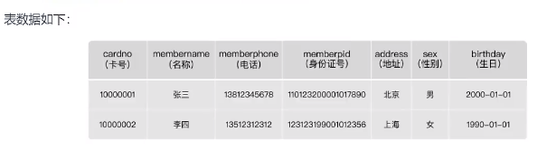

# 第 10 章_索引优化与查询优化

-  讲师：尚硅谷-宋红康（江湖人称：康师傅）

-  官网： http://www.atguigu.com

## 0. 都有哪些维度可以进行数据库调优？
数据库调优的维度，简言之：
- 索引失效、没有充分利用到索引一一索引建立
- 关联查询太多JON（设计缺陷或不得已的需求）一-SQL优化
- 服务器调优及各个参数设置(缓冲、线程数等)--调整my.cnf
- 数据过多一一分库分表

关于数据库调优的知识点非常分散。不同的DBMS,不同的公司，不同的职位，不同的项目遇到的问题都不尽相
同。这里我们分为三个章节进行细致讲解。
虽然SQL查询优化的技术有很多，但是大方向上完全可以分成物理查询优化和逻辑查询优化两大块。
。物理查询优化是通过索引和表连接方式等技术来进行优化，这里重点需要掌握索引的使用。
逻辑查询优化就是通过SQL等价变换提升查询效率，直白一点就是说，换一种查询写法执行效率可能更高。

## 1. 数据准备
[](/sql语法高级/06-索引优化与查询优化.sql)
- 学员表插 50 万条，班级表插 1 万条。
- 
## 2. 索引失效案例
MySQL中提高性能的一个最有效的方式是对数据表设计合理的索引。索引提供了高效访问数据的方法，并且加快
查询的速度，因此索引对查询的速度有着至关重要的影响。
。使用索引可以快速地定位表中的某条记录，从而提高数据库查询的速度，提高数据库的性能。
·如果查询时没有使用索引，查询语句就会扫描表中的所有记录。在数据量大的情况下，这样查询的速度会很
慢。
大多数情况下都（默认）采用B+树来构建索引。只是空间列类型的索引使用R-树，并且MEMORY表还支持hash
索引。
其实，用不用索引，最终都是优化器说了算。优化器是基于什么的优化器？基于c0st开销
(CostBase0 otimizer),它不是基于规则(Rule-BasedOptimizer),也不是基于语义。怎么样开销小就怎么
来。另外，**SQL语句是否使用索引，跟数据库版本、数据量、数据选择度都有关系**。

### 2. 1 全值匹配我最爱

### 2. 2 最佳左前缀法则
结论：MySQL可以为多个字段创建索引，一个索引可以包括16个字段。对于多列索引，
**过滤条件要使用索引必须按照索引建立时的顺序，依次满足，一旦跳过某个字段，索引后面的字段都无法被使用。
如果查询条件中没有使用这些字段中第1个字段时，多列（或联合）索引不会被使用。**

    拓展：Alibaba《Java开发手册》
    索引文件具有 B-Tree 的最左前缀匹配特性，如果左边的值未确定，那么无法使用此索引。

### 2. 3 主键插入顺序

如果此时再插入一条主键值为 9 的记录，那它插入的位置就如下图：

可这个数据页已经满了，再插进来咋办呢？我们需要把当前页面分裂成两个页面，把本页中的一些记录

移动到新创建的这个页中。页面分裂和记录移位意味着什么？意味着：性能损耗！所以如果我们想尽量

避免这样无谓的性能损耗，最好让插入的记录的主键值依次递增，这样就不会发生这样的性能损耗了。

所以我们建议：让主键具有AUTO_INCREMENT，让存储引擎自己为表生成主键，而不是我们手动插入 ，

比如：person_info表：

我们自定义的主键列id拥有AUTO_INCREMENT属性，在插入记录时存储引擎会自动为我们填入自增的

主键值。这样的主键占用空间小，顺序写入，减少页分裂。


### 2. 4 计算、函数、类型转换(自动或手动)导致索引失效

创建索引

第一种：索引优化生效

第二种：索引优化失效

```
EXPLAIN SELECT SQL_NO_CACHE * FROM student WHERE student.name LIKE 'abc%';
```
```
EXPLAIN SELECT SQL_NO_CACHE * FROM student WHERE LEFT(student.name, 3 ) = 'abc';
```
```
CREATE INDEX idx_name ON student(NAME);
```
```
mysql> EXPLAIN SELECT SQL_NO_CACHE * FROM student WHERE student.name LIKE 'abc%';
```
```
mysql>  SELECT SQL_NO_CACHE * FROM student WHERE student.name LIKE 'abc%';
+---------+---------+--------+------+---------+
| id | stuno | name | age | classId |
+---------+---------+--------+------+---------+
| 5301379 | 1233401 | AbCHEa | 164 | 259 |
| 7170042 | 3102064 | ABcHeB | 199 | 161 |
| 1901614 | 1833636 | ABcHeC | 226 | 275 |
| 5195021 | 1127043 | abchEC | 486 | 72 |
| 4047089 | 3810031 | AbCHFd | 268 | 210 |
| 4917074 | 849096 | ABcHfD | 264 | 442 |
| 1540859 | 141979 | abchFF | 119 | 140 |
| 5121801 | 1053823 | AbCHFg | 412 | 327 |
| 2441254 | 2373276 | abchFJ | 170 | 362 |
| 7039146 | 2971168 | ABcHgI | 502 | 465 |
| 1636826 | 1580286 | ABcHgK | 71 | 262 |
| 374344 | 474345 | abchHL | 367 | 212 |
| 1596534 | 169191 | AbCHHl | 102 | 146 |
...
| 5266837 | 1198859 | abclXe | 292 | 298 |
| 8126968 | 4058990 | aBClxE | 316 | 150 |
| 4298305 | 399962 | AbCLXF | 72 | 423 |
| 5813628 | 1745650 | aBClxF | 356 | 323 |
| 6980448 | 2912470 | AbCLXF | 107 | 78 |
| 7881979 | 3814001 | AbCLXF | 89 | 497 |
| 4955576 | 887598 | ABcLxg | 121 | 385 |
| 3653460 | 3585482 | AbCLXJ | 130 | 174 |
| 1231990 | 1283439 | AbCLYH | 189 | 429 |
| 6110615 | 2042637 | ABcLyh | 157 | 40 |
+---------+---------+--------+------+---------+
401 rows in set, 1 warning (0.01 sec)
```
```
mysql> EXPLAIN SELECT SQL_NO_CACHE * FROM student WHERE LEFT(student.name, 3 ) = 'abc';
```
```
mysql> SELECT SQL_NO_CACHE * FROM student WHERE LEFT(student.name, 3 ) = 'abc';
+---------+---------+--------+------+---------+
| id | stuno | name | age | classId |
```

type为“ALL”，表示没有使用到索引，查询时间为3.62秒，查询效率较之前低很多。

再举例：

student表的字段stuno上设置有索引

运行结果：

索引优化生效：

再举例：

student表的字段name上设置有索引

##+---------+---------+--------+------+---------+

```
| 5301379 | 1233401 | AbCHEa | 164 | 259 |
| 7170042 | 3102064 | ABcHeB | 199 | 161 |
| 1901614 | 1833636 | ABcHeC | 226 | 275 |
| 5195021 | 1127043 | abchEC | 486 | 72 |
| 4047089 | 3810031 | AbCHFd | 268 | 210 |
| 4917074 | 849096 | ABcHfD | 264 | 442 |
| 1540859 | 141979 | abchFF | 119 | 140 |
| 5121801 | 1053823 | AbCHFg | 412 | 327 |
| 2441254 | 2373276 | abchFJ | 170 | 362 |
| 7039146 | 2971168 | ABcHgI | 502 | 465 |
| 1636826 | 1580286 | ABcHgK | 71 | 262 |
| 374344 | 474345 | abchHL | 367 | 212 |
| 1596534 | 169191 | AbCHHl | 102 | 146 |
...
| 5266837 | 1198859 | abclXe | 292 | 298 |
| 8126968 | 4058990 | aBClxE | 316 | 150 |
| 4298305 | 399962 | AbCLXF | 72 | 423 |
| 5813628 | 1745650 | aBClxF | 356 | 323 |
| 6980448 | 2912470 | AbCLXF | 107 | 78 |
| 7881979 | 3814001 | AbCLXF | 89 | 497 |
| 4955576 | 887598 | ABcLxg | 121 | 385 |
| 3653460 | 3585482 | AbCLXJ | 130 | 174 |
| 1231990 | 1283439 | AbCLYH | 189 | 429 |
| 6110615 | 2042637 | ABcLyh | 157 | 40 |
+---------+---------+--------+------+---------+
401 rows in set, 1 warning (3.62 sec)
```
```
CREATE INDEX idx_sno ON student(stuno);
```
```
EXPLAIN SELECT SQL_NO_CACHE id, stuno, NAME FROM student WHERE stuno+ 1 = 900001 ;
```
```
EXPLAIN SELECT SQL_NO_CACHE id, stuno, NAME FROM student WHERE stuno = 900000 ;
```
```
CREATE INDEX idx_name ON student(NAME);
```
```
EXPLAIN SELECT id, stuno, name FROM student WHERE SUBSTRING(name, 1 , 3 )='abc';
```

### 2. 5 类型转换导致索引失效

下列哪个sql语句可以用到索引。（假设name字段上设置有索引）

name=123发生类型转换，索引失效。

### 2. 6 范围条件右边的列索引失效

将范围查询条件放置语句最后：

```
EXPLAIN SELECT id, stuno, NAME FROM student WHERE NAME LIKE 'abc%';
```
### 未使用到索引

```
EXPLAIN SELECT SQL_NO_CACHE * FROM student WHERE name= 123 ;
```
### 使用到索引

```
EXPLAIN SELECT SQL_NO_CACHE * FROM student WHERE name='123';
```
```
ALTER TABLE student DROP INDEX idx_name;
ALTER TABLE student DROP INDEX idx_age;
ALTER TABLE student DROP INDEX idx_age_classid;
```
```
EXPLAIN SELECT SQL_NO_CACHE * FROM student
WHERE student.age= 30 AND student.classId> 20 AND student.name = 'abc' ;
```
```
create index idx_age_name_classid on student(age,name,classid);
```
```
EXPLAIN SELECT SQL_NO_CACHE * FROM student WHERE student.age= 30 AND student.name =
'abc' AND student.classId> 20 ;
```

### 2.7 不等于(!= 或者<>)索引失效

### 2.8 is null可以使用索引，is not null无法使用索引

### 2.9 like以通配符%开头索引失效

拓展：Alibaba《Java开发手册》

【强制】页面搜索严禁左模糊或者全模糊，如果需要请走搜索引擎来解决。

### 2.10 OR 前后存在非索引的列，索引失效

### 2.11 数据库和表的字符集统一使用utf8mb

统一使用utf 8 mb 4 ( 5. 5. 3 版本以上支持)兼容性更好，统一字符集可以避免由于字符集转换产生的乱码。不

同的字符集进行比较前需要进行转换会造成索引失效。

## 3. 关联查询优化

```
EXPLAIN SELECT SQL_NO_CACHE * FROM student WHERE age IS NULL;
```
```
EXPLAIN SELECT SQL_NO_CACHE * FROM student WHERE age IS NOT NULL;
```
### 未使用到索引

```
EXPLAIN SELECT SQL_NO_CACHE * FROM student WHERE age = 10 OR classid = 100 ;
```
###使用到索引

```
EXPLAIN SELECT SQL_NO_CACHE * FROM student WHERE age = 10 OR name = 'Abel';
```
**一般性建议**：
·对于单列索引，尽量选择针对当前quey过滤性更好的索
。在选择组合索引的时候，当前quey中过滤性最好的字段在索引字段顺序中，位置越靠前越好。
·在选择组合索引的时候，尽量选择能够包含当前queryl中的where-子句中更多字段的索引。
·在选择组合索引的时候，如果某个字段可能出现范围查询时，尽量把这个字段放在索引次序的最后面。
总之，书写SQL,语句时，尽量避免造成索引失效的情况。

## 3.关联查询优化
### 3. 1 数据准备

### 3. 2 采用左外连接

下面开始 EXPLAIN 分析

结论：type 有All

添加索引优化

可以看到第二行的 type 变为了 ref，rows 也变成了优化比较明显。这是由左连接特性决定的。LEFT JOIN

条件用于确定如何从右表搜索行，左边一定都有，所以右边是我们的关键点,一定需要建立索引。

接着：

### 3. 3 采用内连接

换成 inner join（MySQL自动选择驱动表）

```
EXPLAIN SELECT SQL_NO_CACHE * FROM `type` LEFT JOIN book ON type.card = book.card;
```
```
ALTER TABLE book ADD INDEX Y ( card); #【被驱动表】，可以避免全表扫描
```
```
EXPLAIN SELECT SQL_NO_CACHE * FROM `type` LEFT JOIN book ON type.card = book.card;
```
```
ALTER TABLE `type` ADD INDEX X (card); #【驱动表】，无法避免全表扫描
```
```
EXPLAIN SELECT SQL_NO_CACHE * FROM `type` LEFT JOIN book ON type.card = book.card;
```
```
DROP INDEX Y ON book;
```
```
EXPLAIN SELECT SQL_NO_CACHE * FROM `type` LEFT JOIN book ON type.card = book.card;
```
```
drop index X on type;
drop index Y on book;（如果已经删除了可以不用再执行该操作）
```

添加索引优化

接着：

接着：

```
EXPLAIN SELECT SQL_NO_CACHE * FROM type INNER JOIN book ON type.card=book.card;
```
```
ALTER TABLE book ADD INDEX Y ( card);
```
```
EXPLAIN SELECT SQL_NO_CACHE * FROM type INNER JOIN book ON type.card=book.card;
```
```
ALTER TABLE type ADD INDEX X (card);
```
```
EXPLAIN SELECT SQL_NO_CACHE * FROM type INNER JOIN book ON type.card=book.card;
```
```
DROP INDEX X ON `type`;
```
```
EXPLAIN SELECT SQL_NO_CACHE * FROM TYPE INNER JOIN book ON type.card=book.card;
```
```
ALTER TABLE `type` ADD INDEX X (card);
```
```
EXPLAIN SELECT SQL_NO_CACHE * FROM `type` INNER JOIN book ON type.card=book.card;
```

### 3. 4 join语句原理

Index Nested-Loop Join

我们来看一下这个语句：

如果直接使用join语句，MySQL优化器可能会选择表t1或t2作为驱动表，这样会影响我们分析SQL语句的

执行过程。所以，为了便于分析执行过程中的性能问题，我改用straight_join让MySQL使用固定的

连接方式执行查询，这样优化器只会按照我们指定的方式去join。在这个语句里，t1 是驱动表，t2是被驱

动表。

可以看到，在这条语句里，被驱动表t2的字段a上有索引，join过程用上了这个索引，因此这个语句的执

行流程是这样的：

1. 从表t1中读入一行数据 R；

2. 从数据行R中，取出a字段到表t2里去查找；

3. 取出表t2中满足条件的行，跟R组成一行，作为结果集的一部分；

4. 重复执行步骤 1 到 3 ，直到表t1的末尾循环结束。

这个过程是先遍历表t1，然后根据从表t1中取出的每行数据中的a值，去表t2中查找满足条件的记录。在

形式上，这个过程就跟我们写程序时的嵌套查询类似，并且可以用上被驱动表的索引，所以我们称之为

“Index Nested-Loop Join”，简称NLJ。

它对应的流程图如下所示：

在这个流程里：

1. 对驱动表t1做了全表扫描，这个过程需要扫描 100 行；

2. 而对于每一行R，根据a字段去表t2查找，走的是树搜索过程。由于我们构造的数据都是一一对应

的，因此每次的搜索过程都只扫描一行，也是总共扫描 100 行；

3. 所以，整个执行流程，总扫描行数是 200 。

引申问题 1 ：能不能使用join?

引申问题 2 ：怎么选择驱动表？

比如：N扩大 1000 倍的话，扫描行数就会扩大 1000 倍；而M扩大 1000 倍，扫描行数扩大不到 10 倍。

```
EXPLAIN SELECT * FROM t1 STRAIGHT_JOIN t2 ON (t1.a=t2.a);
```

两个结论：

1. 使用join语句，性能比强行拆成多个单表执行SQL语句的性能要好；

2. 如果使用join语句的话，需要让小表做驱动表。

Simple Nested-Loop Join

Block Nested-Loop Join

这个过程的流程图如下：

执行流程图也就变成这样：


总结 1 ：能不能使用xxx join语句？

总结 2 ：如果要使用join，应该选择大表做驱动表还是选择小表做驱动表？

总结 3 ：什么叫作“小表”？

在决定哪个表做驱动表的时候，应该是两个表按照各自的条件过滤，过滤完成之后，计算参与join的各

个字段的总数据量，数据量小的那个表，就是“小表”，应该作为驱动表。

### 3. 5 小结

保证被驱动表的JOIN字段已经创建了索引

需要JOIN 的字段，数据类型保持绝对一致。

LEFT JOIN 时，选择小表作为驱动表，大表作为被驱动表。减少外层循环的次数。

INNER JOIN 时，MySQL会自动将小结果集的表选为驱动表。选择相信MySQL优化策略。

能够直接多表关联的尽量直接关联，不用子查询。(减少查询的趟数)

不建议使用子查询，建议将子查询SQL拆开结合程序多次查询，或使用 JOIN 来代替子查询。

衍生表建不了索引


## 4. 子查询优化

MySQL从4.1版本开始支持子查询，使用子查询可以进行SELECT语句的嵌套查询，即一个SELECT查询的结

果作为另一个SELECT语句的条件。子查询可以一次性完成很多逻辑上需要多个步骤才能完成的SQL操作。

子查询是 MySQL 的一项重要的功能，可以帮助我们通过一个 SQL 语句实现比较复杂的查询。但是，子

查询的执行效率不高。 原因：

① 执行子查询时，MySQL需要为内层查询语句的查询结果建立一个临时表，然后外层查询语句从临时表

中查询记录。查询完毕后，再撤销这些临时表。这样会消耗过多的CPU和IO资源，产生大量的慢查询。

② 子查询的结果集存储的临时表，不论是内存临时表还是磁盘临时表都不会存在索引，所以查询性能会

受到一定的影响。

③ 对于返回结果集比较大的子查询，其对查询性能的影响也就越大。

在MySQL中，可以使用连接（JOIN）查询来替代子查询。 连接查询不需要建立临时表，其速度比子查询

要快，如果查询中使用索引的话，性能就会更好。

结论：尽量不要使用NOT IN 或者 NOT EXISTS，用LEFT JOIN xxx ON xx WHERE xx IS NULL替代

## 5. 排序优化

### 5. 1 排序优化

问题： 在 WHERE 条件字段上加索引，但是为什么在 ORDER BY 字段上还要加索引呢？

优化建议：

1. SQL 中，可以在 WHERE 子句和 ORDER BY 子句中使用索引，目的是在 WHERE 子句中避免全表扫

描，在 ORDER BY 子句避免使用 FileSort 排序。当然，某些情况下全表扫描，或者 FileSort 排

序不一定比索引慢。但总的来说，我们还是要避免，以提高查询效率。

2. 尽量使用 Index 完成 ORDER BY 排序。如果 WHERE 和 ORDER BY 后面是相同的列就使用单索引列；

如果不同就使用联合索引。

3. 无法使用 Index 时，需要对 FileSort 方式进行调优。

```
INDEX a_b_c(a,b,c)
```
```
order by 能使用索引最左前缀
```
- ORDER BY a
- ORDER BY a,b
- ORDER BY a,b,c
- ORDER BY a DESC,b DESC,c DESC

```
如果WHERE使用索引的最左前缀定义为常量，则order by 能使用索引
```
- WHERE a = const ORDER BY b,c
- WHERE a = const AND b = const ORDER BY c
- WHERE a = const ORDER BY b,c
- WHERE a = const AND b > const ORDER BY b,c

##不能使用索引进行排序

- ORDER BY a ASC,b DESC,c DESC /* 排序不一致 */
- WHERE g = const ORDER BY b,c  /*丢失a索引*/
- WHERE a = const ORDER BY c  /*丢失b索引*/


### 5. 3 案例实战

ORDER BY子句，尽量使用Index方式排序，避免使用FileSort方式排序。

执行案例前先清除student上的索引，只留主键：

场景:查询年龄为 30 岁的，且学生编号小于 101000 的学生，按用户名称排序

查询结果如下：

结论：type 是 ALL，即最坏的情况。Extra 里还出现了 Using filesort,也是最坏的情况。优化是必须

的。

优化思路：

方案一: 为了去掉filesort我们可以把索引建成

方案二: 尽量让where的过滤条件和排序使用上索引

- WHERE a = const ORDER BY a,d  /*d不是索引的一部分*/
- WHERE a in (...) ORDER BY b,c /*对于排序来说，多个相等条件也是范围查询*/

```
DROP INDEX idx_age ON student;
DROP INDEX idx_age_classid_stuno ON student;
DROP INDEX idx_age_classid_name ON student;
```
###或者

```
call proc_drop_index('atguigudb2','student');
```
```
EXPLAIN SELECT SQL_NO_CACHE * FROM student WHERE age = 30 AND stuno < 101000 ORDER BY
NAME ;
```
```
mysql>  SELECT SQL_NO_CACHE * FROM student WHERE age = 30 AND stuno < 101000 ORDER BY
NAME ;
+---------+--------+--------+------+---------+
| id | stuno | name | age | classId |
+---------+--------+--------+------+---------+
| 922 | 100923 | elTLXD | 30 | 249 |
| 3723263 | 100412 | hKcjLb | 30 | 59 |
| 3724152 | 100827 | iHLJmh | 30 | 387 |
| 3724030 | 100776 | LgxWoD | 30 | 253 |
| 30 | 100031 | LZMOIa | 30 | 97 |
| 3722887 | 100237 | QzbJdx | 30 | 440 |
| 609 | 100610 | vbRimN | 30 | 481 |
| 139 | 100140 | ZqFbuR | 30 | 351 |
+---------+--------+--------+------+---------+
8 rows in set, 1 warning (3.16 sec)
```
###创建新索引

```
CREATE INDEX idx_age_name ON student(age,NAME);
```

建一个三个字段的组合索引：

结果竟然有 filesort的 sql 运行速度，超过了已经优化掉 filesort的 sql，而且快了很多，几乎一瞬间

就出现了结果。

结论：

1. 两个索引同时存在，mysql自动选择最优的方案。（对于这个例子，mysql选择

idx_age_stuno_name）。但是，随着数据量的变化，选择的索引也会随之变化的。

2. 当【范围条件】和【group by 或者 order by】的字段出现二选一时，优先观察条件字段的过

滤数量，如果过滤的数据足够多，而需要排序的数据并不多时，优先把索引放在范围字段

上。反之，亦然。

思考：这里我们使用如下索引，是否可行？

```
DROP INDEX idx_age_name ON student;
```
```
CREATE INDEX idx_age_stuno_name ON student (age,stuno,NAME);
```
```
EXPLAIN SELECT SQL_NO_CACHE * FROM student WHERE age = 30 AND stuno < 101000 ORDER BY
NAME ;
```
```
mysql> SELECT SQL_NO_CACHE * FROM student
-> WHERE age = 30 AND stuno < 101000 ORDER BY NAME ;
+-----+--------+--------+------+---------+
| id | stuno | name | age | classId |
+-----+--------+--------+------+---------+
| 167 | 100168 | AClxEF | 30 | 319 |
| 323 | 100324 | bwbTpQ | 30 | 654 |
| 651 | 100652 | DRwIac | 30 | 997 |
| 517 | 100518 | HNSYqJ | 30 | 256 |
| 344 | 100345 | JuepiX | 30 | 329 |
| 905 | 100906 | JuWALd | 30 | 892 |
| 574 | 100575 | kbyqjX | 30 | 260 |
| 703 | 100704 | KJbprS | 30 | 594 |
| 723 | 100724 | OTdJkY | 30 | 236 |
| 656 | 100657 | Pfgqmj | 30 | 600 |
| 982 | 100983 | qywLqw | 30 | 837 |
| 468 | 100469 | sLEKQW | 30 | 346 |
| 988 | 100989 | UBYqJl | 30 | 457 |
| 173 | 100174 | UltkTN | 30 | 830 |
| 332 | 100333 | YjWiZw | 30 | 824 |
+-----+--------+--------+------+---------+
15 rows in set, 1 warning (0.00 sec)
```
```
DROP INDEX idx_age_stuno_name ON student;
```
```
CREATE INDEX idx_age_stuno ON student(age,stuno);
```

### 5.4 filesort算法：双路排序和单路排序

双路排序 （慢）

MySQL 4.1之前是使用双路排序，字面意思就是两次扫描磁盘，最终得到数据， 读取行指针和

order by列，对他们进行排序，然后扫描已经排序好的列表，按照列表中的值重新从列表中读取

对应的数据输出

从磁盘取排序字段，在buffer进行排序，再从磁盘取其他字段。

取一批数据，要对磁盘进行两次扫描，众所周知，IO是很耗时的，所以在mysql4.1之后，出现了第二种

改进的算法，就是单路排序。

单路排序 （快）

从磁盘读取查询需要的所有列，按照order by列在buffer对它们进行排序，然后扫描排序后的列表进行输

出， 它的效率更快一些，避免了第二次读取数据。并且把随机IO变成了顺序IO，但是它会使用更多的空

间， 因为它把每一行都保存在内存中了。

结论及引申出的问题

由于单路是后出的，总体而言好过双路

但是用单路有问题

优化策略

1. 尝试提高 sort_buffer_size

2. 尝试提高 max_length_for_sort_data

3. Order by 时select * 是一个大忌。最好只Query需要的字段。

## 6. GROUP BY优化

group by 使用索引的原则几乎跟order by一致 ，group by 即使没有过滤条件用到索引，也可以直接

使用索引。

group by 先排序再分组，遵照索引建的最佳左前缀法则

当无法使用索引列，增大max_length_for_sort_data和sort_buffer_size参数的设置

where效率高于having，能写在where限定的条件就不要写在having中了

减少使用order by，和业务沟通能不排序就不排序，或将排序放到程序端去做。Order by、group

by、distinct这些语句较为耗费CPU，数据库的CPU资源是极其宝贵的。

包含了order by、group by、distinct这些查询的语句，where条件过滤出来的结果集请保持在 1000 行

以内，否则SQL会很慢。

## 7. 优化分页查询

优化思路一


在索引上完成排序分页操作，最后根据主键关联回原表查询所需要的其他列内容。

优化思路二

该方案适用于主键自增的表，可以把Limit 查询转换成某个位置的查询 。

## 8. 优先考虑覆盖索引

### 8. 1 什么是覆盖索引？

理解方式一 ：索引是高效找到行的一个方法，但是一般数据库也能使用索引找到一个列的数据，因此它

不必读取整个行。毕竟索引叶子节点存储了它们索引的数据；当能通过读取索引就可以得到想要的数

据，那就不需要读取行了。 **一个索引包含了满足查询结果的数据就叫做覆盖索引**。

理解方式二 ：非聚簇复合索引的一种形式，它包括在查询里的SELECT、JOIN和WHERE子句用到的所有列

（即**建索引的字段正好是覆盖查询条件中所涉及的字段**）。

**简单说就是，`索引列` + `主键 包含` `SELECT` 到 `FROM` 之间查询的 `列`。**

### 8. 2 覆盖索引的利弊

好处：
1. **避免Innodb表进行索引的二次查询（回表）**

   Innodb是以聚集索引的顺序来存储的，对于Innodb来说，二级索引在叶子节点中所保存的是行的主键信息，如果
   是用二级索引查询数据，在查找到相应的键值后，还需通过主键进行二次查询才能获取我们真实所需要的数据。
   在覆盖索引中，二级索引的键值中可以获取所要的数据，**避免了对主键的二次查询，减少了IO 操作，提升了查询
   效率**。

2. **可以把随机IO变成顺序IO加快查询效率**
   由于覆盖索引是按键值的顺序存储的，对于O密集型的范围查找来说，对比随机从磁盘读取每一行的数据 IO 要少
   的多，因此利用覆盖索引在访问时也可以把磁盘的随机读取的工0转变成索引查找的顺序IO。

弊端：

**索引字段的维护** 总是有代价的。因此，在建立冗余索引来支持覆盖索引时就需要权衡考虑了。这是业务

DBA，或者称为业务数据架构师的工作。

## 9. 如何给字符串添加索引

有一张教师表，表定义如下：

```
EXPLAIN SELECT * FROM student t,(SELECT id FROM student ORDER BY id LIMIT 2000000 , 10 )
a
WHERE t.id = a.id;
```
```
EXPLAIN SELECT * FROM student WHERE id > 2000000 LIMIT 10 ;
```

讲师要使用邮箱登录，所以业务代码中一定会出现类似于这样的语句：

如果email这个字段上没有索引，那么这个语句就只能做全表扫描。

### 9. 1 前缀索引

MySQL是支持前缀索引的。默认地，如果你创建索引的语句不指定前缀长度，那么索引就会包含整个字

符串。

这两种不同的定义在数据结构和存储上有什么区别呢？下图就是这两个索引的示意图。

以及

```
create table teacher(
ID bigint unsigned primary key,
email varchar( 64 ),
...
)engine=innodb;
```
```
mysql> select col1, col2 from teacher where email='xxx';
```
```
mysql> alter table teacher add index index1(email);
#或
mysql> alter table teacher add index index2(email( 6 ));
```

如果使用的是index1 （即email整个字符串的索引结构），执行顺序是这样的：

1. 从index1索引树找到满足索引值是’ zhangssxyz@xxx.com ’的这条记录，取得ID2的值；

2. 到主键上查到主键值是ID2的行，判断email的值是正确的，将这行记录加入结果集；

3. 取index1索引树上刚刚查到的位置的下一条记录，发现已经不满足email=' zhangssxyz@xxx.com ’的

条件了，循环结束。

这个过程中，只需要回主键索引取一次数据，所以系统认为只扫描了一行。

如果使用的是index2 （即email(6)索引结构），执行顺序是这样的：

1. 从index2索引树找到满足索引值是’zhangs’的记录，找到的第一个是ID1；

2. 到主键上查到主键值是ID1的行，判断出email的值不是’ zhangssxyz@xxx.com ’，这行记录丢弃；

3. 取index2上刚刚查到的位置的下一条记录，发现仍然是’zhangs’，取出ID2，再到ID索引上取整行然

后判断，这次值对了，将这行记录加入结果集；

4. 重复上一步，直到在idxe2上取到的值不是’zhangs’时，循环结束。

也就是说 使用前缀索引，定义好长度，就可以做到既节省空间，又不用额外增加太多的查询成本。 前面

已经讲过区分度，区分度越高越好。因为区分度越高，意味着重复的键值越少。

### 9. 2 前缀索引对覆盖索引的影响

结论：

使用前缀索引就用不上覆盖索引对查询性能的优化了，这也是你在选择是否使用前缀索引时需要考

虑的一个因素。

## 10. 索引下推（索引条件下推）

`Index Condition Pushdown` (ICP)是MySQL 5.6中新特性，是一种在存储引擎层使用索引过滤数据的
一种优化方式。ICP可以减少存储引擎访问基表的次数以及MySQL服务器访问存储引擎的次数。

- 如果没有ICP,存储引擎会遍历索引以定位基表中的行，并将它们返回给MySQL服务器，
由MySQL服务器评估WHERE后面的条件是否保留行。

- 启用ICP后，如果部分WHERE条件可以仅使用索引中的列进行筛选，则MySQL服务器会把这部分WHERE条件
放到存储引擎筛选。然后，存储引擎通过使用索引条目来筛选数据，并且只有在满足这一条件时才从表中读取行。
。好处：ICP可以减少存储引擎必须访问基表的次数和MySQL服务器必须访问存储引擎的次数。
。但是，ICP的加速效果取决于在存储引擎内通过ICP筛选掉的数据的比例。

避免回表数据过多， 过滤后再回表，  主要针对 联合索引
[](/sql语法高级/06-索引优化与查询优化.sql)   搜索 ICP 
[索引下推课程](https://www.bilibili.com/video/BV1iq4y1u7vj?p=148&spm_id_from=pageDriver&vd_source=bbcfa9c97b678f7863791a62aa7d0eb3)

### 10. 1 使用前后的扫描过程

在不使用ICP索引扫描的过程：

storage层：只将满足index key条件的索引记录对应的整行记录取出，返回给server层

server 层：对返回的数据，使用后面的where条件过滤，直至返回最后一行。


使用ICP扫描的过程：

storage层：

首先将index key条件满足的索引记录区间确定，然后在索引上使用index filter进行过滤。将满足的index

filter条件的索引记录才去回表取出整行记录返回server层。不满足index filter条件的索引记录丢弃，不回

表、也不会返回server层。

server 层：

对返回的数据，使用table filter条件做最后的过滤。


使用前后的成本差别

使用前，存储层多返回了需要被index filter过滤掉的整行记录

使用ICP后，直接就去掉了不满足index filter条件的记录，省去了他们回表和传递到server层的成本。

ICP的加速效果取决于在存储引擎内通过ICP筛选掉的数据的比例。

### 10. 2 ICP的使用条件

ICP的使用条件：

① 只能用于二级索引(secondary index)

②explain显示的执行计划中type值（join 类型）为range、 ref、 eq_ref或者ref_or_null。

③ 并非全部where条件都可以用ICP筛选，如果where条件的字段不在索引列中，还是要读取整表的记录

到server端做where过滤。

④ ICP可以用于MyISAM和InnnoDB存储引擎

⑤ MySQL 5.6版本的不支持分区表的ICP功能，5.7版本的开始支持。

⑥ 当SQL使用覆盖索引时，不支持ICP优化方法。


### 10. 3 ICP使用案例

案例 1

案例 2

```
SELECT * FROM tuser
WHERE NAME LIKE '张%'
AND age = 10
AND ismale = 1 ;
```

## 11. 普通索引 vs 唯一索引

从性能的角度考虑，你选择唯一索引还是普通索引呢？选择的依据是什么呢？

假设，我们有一个主键列为ID的表，表中有字段k，并且在k上有索引，假设字段 k 上的值都不重复。

这个表的建表语句是：

表中R 1 ~R 5 的(ID,k)值分别为( 100 , 1 )、( 200 , 2 )、( 300 , 3 )、( 500 , 5 )和( 600 , 6 )。

```
mysql> create table test(
id int primary key,
k int not null,
name varchar( 16 ),
index (k)
)engine=InnoDB;
```

### 11.1 查询过程

假设，执行查询的语句是 select id from test where k=5。

对于普通索引来说，查找到满足条件的第一个记录(5,500)后，需要查找下一个记录，直到碰到第一

个不满足k=5条件的记录。

对于唯一索引来说，由于索引定义了唯一性，查找到第一个满足条件的记录后，就会停止继续检

索。

那么，这个不同带来的性能差距会有多少呢？答案是，微乎其微。

### 11.2 更新过程

为了说明普通索引和唯一索引对更新语句性能的影响这个问题，介绍一下change buffer。

当需要更新一个数据页时，如果数据页在内存中就直接更新，而如果这个数据页还没有在内存中的话，

在不影响数据一致性的前提下，InooDB会将这些更新操作缓存在change buffer中，这样就不需要从磁

盘中读入这个数据页了。在下次查询需要访问这个数据页的时候，将数据页读入内存，然后执行change

buffer中与这个页有关的操作。通过这种方式就能保证这个数据逻辑的正确性。

将change buffer中的操作应用到原数据页，得到最新结果的过程称为merge。除了访问这个数据页会触

发merge外，系统有后台线程会定期merge。在数据库正常关闭（shutdown）的过程中，也会执行merge

操作。

如果能够将更新操作先记录在change buffer，减少读磁盘，语句的执行速度会得到明显的提升。而且，

数据读入内存是需要占用 buffer pool 的，所以这种方式还能够避免占用内存，提高内存利用率。

唯一索引的更新就不能使用change buffer，实际上也只有普通索引可以使用。

如果要在这张表中插入一个新记录( 4 , 400 )的话，InnoDB的处理流程是怎样的？

### 11.3 change buffer的使用场景

1. 普通索引和唯一索引应该怎么选择？其实，这两类索引在查询能力上是没差别的，主要考虑的是

对更新性能的影响。所以，建议你尽量选择普通索引。

2. 在实际使用中会发现，普通索引和change buffer的配合使用，对于数据量大的表的更新优化

还是很明显的。

3. 如果所有的更新后面，都马上伴随着对这个记录的查询，那么你应该关闭change buffer。而在

其他情况下，change buffer都能提升更新性能。

4. 由于唯一索引用不上change buffer的优化机制，因此如果业务可以接受，从性能角度出发建议优

先考虑非唯一索引。但是如果"业务可能无法确保"的情况下，怎么处理呢？

首先，业务正确性优先。我们的前提是“业务代码已经保证不会写入重复数据”的情况下，讨论性能

问题。如果业务不能保证，或者业务就是要求数据库来做约束，那么没得选，必须创建唯一索引。

这种情况下，本节的意义在于，如果碰上了大量插入数据慢、内存命中率低的时候，给你多提供一

个排查思路。

然后，在一些“归档库”的场景，你是可以考虑使用唯一索引的。比如，线上数据只需要保留半年，

然后历史数据保存在归档库。这时候，归档数据已经是确保没有唯一键冲突了。要提高归档效率，

可以考虑把表里面的唯一索引改成普通索引。

## 12. 其它查询优化策略


### 12. 1 EXISTS 和 IN 的区分

问题：

不太理解哪种情况下应该使用 EXISTS，哪种情况应该用 IN。选择的标准是看能否使用表的索引吗？

### 12. 2 COUNT(*)与COUNT(具体字段)效率

问：在 MySQL 中统计数据表的行数，可以使用三种方式：SELECT COUNT(*)、SELECT COUNT(1)和

SELECT COUNT(具体字段)，使用这三者之间的查询效率是怎样的？

答：
前提：如果你要统计的是某个字段的非空数据行数，则另当别论，毕竟比较执行效率的前提是结果一样才可以。
环节1:COUNT(*)和C0UNT(1)都是对所有结果进行COUNT,C0UNT(*)和COUNT(1)本质上并没有区别（二者
执行时间可能略有差别，不过你还是可以把它俩的执行效率看成是相等的）。如果有 WHERE 子句，则是对所有
符合筛选条件的数据行进行统计；如果没有 WHERE 子句，则是对数据表的数据行数进行统计。

环节2：如果是MyISAM存储引擎，统计数据表的行数只需要0(1)的复杂度，这是因为每张MyISAM的数据表都
有一个meta信息存储了row_count值，而一致性则由表级锁来保证。
如果是InnoDB存储引擎，因为InnoDB支持事务，采用行级锁和MVCc机制，所以无法像MyISAM一样，维护一
个row_cout变量，因此需要采用扫描全表，进行循环+计数的方式来完成统计。
环节3：在InnoDB引擎中，如果采用c0UNT（具体字段）来统计数据行数，要尽量采用二级索引。因为主键采用的
索引是聚簇索引，聚簇索引包含的信息多，明显会大于二级索引（非聚簇索引）。对于C0UNT(*)和C0UNT(1)
来说，它们不需要查找具体的行，只是统计行数，系统会自动采用占用空间更小的二级索引来进行统计。


### 12. 3 关于SELECT(*)

在表查询中，建议明确字段，不要使用 * 作为查询的字段列表，推荐使用SELECT <字段列表> 查询。原

因：

① MySQL 在解析的过程中，会通过查询数据字典将"*"按序转换成所有列名，这会大大的耗费资源和时

间。

② 无法使用覆盖索引

### 12. 4 LIMIT 1 对优化的影响

针对的是会扫描全表的 SQL 语句，如果你可以确定结果集只有一条，那么加上LIMIT 1的时候，当找

到一条结果的时候就不会继续扫描了，这样会加快查询速度。

如果数据表已经对字段建立了唯一索引，那么可以通过索引进行查询，不会全表扫描的话，就不需要加

上LIMIT 1了。

### 12. 5 多使用COMMIT

只要有可能，在程序中尽量多使用 COMMIT，这样程序的性能得到提高，需求也会因为 COMMIT 所释放

的资源而减少。

COMMIT 所释放的资源：

回滚段上用于恢复数据的信息

被程序语句获得的锁

redo / undo log buffer 中的空间

管理上述 3 种资源中的内部花费

## 13. 淘宝数据库，主键如何设计的？

聊一个实际问题：淘宝的数据库，主键是如何设计的？

某些错的离谱的答案还在网上年复一年的流传着，甚至还成为了所谓的MySQL军规。其中，一个最明显
的错误就是关于MySQL的主键设计。
大部分人的回答如此自信：用 8 字节的 BIGINT 做主键，而不要用INT。错！


这样的回答，只站在了数据库这一层，而没有 `从业务的角度` 思考主键。主键就是一个自增ID吗？站在
2022 年的新年档口，用自增做主键，架构设计上可能连及格都拿不到。

### 13. 1 自增ID的问题

自增ID做主键，简单易懂，几乎所有数据库都支持自增类型，只是实现上各自有所不同而已。自增ID除

了简单，其他都是缺点，总体来看存在以下几方面的问题：

1. 可靠性不高

存在自增ID回溯的问题，这个问题直到最新版本的MySQL 8.0才修复。

2. 安全性不高

对外暴露的接口可以非常容易猜测对应的信息。比如：/User/1/这样的接口，可以非常容易猜测用户ID的

值为多少，总用户数量有多少，也可以非常容易地通过接口进行数据的爬取。

3. 性能差

自增ID的性能较差，需要在数据库服务器端生成。

4. 交互多

业务还需要额外执行一次类似last_insert_id()的函数才能知道刚才插入的自增值，这需要多一次的

网络交互。在海量并发的系统中，多 1 条SQL，就多一次性能上的开销。

5. 局部唯一性

最重要的一点，自增ID是局部唯一，只在当前数据库实例中唯一，而不是全局唯一，在任意服务器间都

是唯一的。对于目前分布式系统来说，这简直就是噩梦。

### 13. 2 业务字段做主键

为了能够唯一地标识一个会员的信息，需要为会员信息表设置一个主键。那么，怎么为这个表设置主

键，才能达到我们理想的目标呢？ 这里我们考虑 `业务字段做主键`。

表数据如下：



在这个表里，哪个字段比较合适呢？

选择卡号（cardno）

会员卡号（cardno）看起来比较合适，因为会员卡号不能为空，而且有唯一性，可以用来 标识一条会员记录。


不同的会员卡号对应不同的会员，字段“cardno”唯一地标识某一个会员。如果都是这样，会员卡号与会

员一一对应，系统是可以正常运行的。

但实际情况是，会员卡号可能存在重复使用的情况。比如，张三因为工作变动搬离了原来的地址，不再

到商家的门店消费了 （退还了会员卡），于是张三就不再是这个商家门店的会员了。但是，商家不想让

这个会 员卡空着，就把卡号是“ 10000001 ”的会员卡发给了王五。

从系统设计的角度看，这个变化只是修改了会员信息表中的卡号是“ 10000001 ”这个会员 信息，并不会影

响到数据一致性。也就是说，修改会员卡号是“ 10000001 ”的会员信息， 系统的各个模块，都会获取到修

改后的会员信息，不会出现“有的模块获取到修改之前的会员信息，有的模块获取到修改后的会员信息，

而导致系统内部数据不一致”的情况。因此，从信息系统层面上看是没问题的。

但是从使用系统的业务层面来看，就有很大的问题 了，会对商家造成影响。

比如，我们有一个销售流水表（trans），记录了所有的销售流水明细。 2020 年 12 月 01 日，张三在门店

购买了一本书，消费了 89 元。那么，系统中就有了张三买书的流水记录，如下所示：

接着，我们查询一下 2020 年 12 月 01 日的会员销售记录：

如果会员卡“ 10000001 ”又发给了王五，我们会更改会员信息表。导致查询时：

```
mysql> CREATE TABLE demo.membermaster
-> (
-> cardno CHAR( 8 ) PRIMARY KEY, -- 会员卡号为主键
-> membername TEXT,
-> memberphone TEXT,
-> memberpid TEXT,
-> memberaddress TEXT,
-> sex TEXT,
-> birthday DATETIME
-> );
Query OK, 0 rows affected (0.06 sec)
```
```
mysql> SELECT b.membername,c.goodsname,a.quantity,a.salesvalue,a.transdate
-> FROM demo.trans AS a
-> JOIN demo.membermaster AS b
-> JOIN demo.goodsmaster AS c
-> ON (a.cardno = b.cardno AND a.itemnumber=c.itemnumber);
+------------+-----------+----------+------------+---------------------+
| membername | goodsname | quantity | salesvalue | transdate |
+------------+-----------+----------+------------+---------------------+
| 张三 | 书 | 1.000 | 89.00 | 2020 - 12 - 01 00 :00:00 |
+------------+-----------+----------+------------+---------------------+
1 row in set (0.00 sec)

##1550672064762308113

##1481195847180308113

##1431156171142308113

##1431146631521308113
```

这次得到的结果是：王五在 2020 年 12 月 01 日，买了一本书，消费 89 元。显然是错误的！结论：千万

不能把会员卡号当做主键。

选择会员电话 或 身份证号

会员电话可以做主键吗？不行的。在实际操作中，手机号也存在被运营商收回，重新发给别人用的情

况。

那身份证号行不行呢？好像可以。因为身份证决不会重复，身份证号与一个人存在一一对 应的关系。可

问题是，身份证号属于个人隐私，顾客不一定愿意给你。要是强制要求会员必须登记身份证号，会把很

多客人赶跑的。其实，客户电话也有这个问题，这也是我们在设计会员信息表的时候，允许身份证号和

电话都为空的原因。

所以，建议尽量不要用跟业务有关的字段做主键。毕竟，作为项目设计的技术人员，我们谁也无法预测

在项目的整个生命周期中，哪个业务字段会因为项目的业务需求而有重复，或者重用之类的情况出现。

经验：

刚开始使用 MySQL 时，很多人都很容易犯的错误是喜欢用业务字段做主键，想当然地认为了解业

务需求，但实际情况往往出乎意料，而更改主键设置的成本非常高。

### 13. 3 淘宝的主键设计

在淘宝的电商业务中，订单服务是一个核心业务。请问，订单表的主键淘宝是如何设计的呢？是自增ID

吗？

打开淘宝，看一下订单信息：

```
mysql> SELECT b.membername,c.goodsname,a.quantity,a.salesvalue,a.transdate
-> FROM demo.trans AS a
-> JOIN demo.membermaster AS b
-> JOIN demo.goodsmaster AS c
-> ON (a.cardno = b.cardno AND a.itemnumber=c.itemnumber);
+------------+-----------+----------+------------+---------------------+
| membername | goodsname | quantity | salesvalue | transdate |
+------------+-----------+----------+------------+---------------------+
| 王五 | 书 | 1.000 | 89.00 | 2020 - 12 - 01 00 :00:00 |
+------------+-----------+----------+------------+---------------------+
1 row in set (0.01 sec)
```

从上图可以发现，订单号不是自增ID！我们详细看下上述 4 个订单号：

订单号是 19 位的长度，且订单的最后 5 位都是一样的，都是 08113 。且订单号的前面 14 位部分是单调递增

的。

大胆猜测，淘宝的订单ID设计应该是：

这样的设计能做到全局唯一，且对分布式系统查询及其友好。

### 13. 4 推荐的主键设计

非核心业务：对应表的主键自增ID，如告警、日志、监控等信息。

核心业务： 主键设计至少应该是全局唯一且是单调递增 。全局唯一保证在各系统之间都是唯一的，单调

递增是希望插入时不影响数据库性能。

这里推荐最简单的一种主键设计：UUID。

UUID的特点：

**全局唯一，占用 36 字节，数据无序，插入性能差。**


##订单ID = 时间 + 去重字段 + 用户ID后 6 位尾号


认识UUID：

为什么UUID是全局唯一的？

为什么UUID占用 36 个字节？

为什么UUID是无序的？

MySQL数据库的UUID组成如下所示：

我们以UUID值e0ea12d4-6473-11eb-943c-00155dbaa39d举例：

#为什么UUID是全局唯一的？

在UUID中时间部分占用 60 位，存储的类似TIMESTAMP的时间戳，但表示的是从1582-10-15 00： 00 ：00.00

到现在的100ns的计数。可以看到UUID存储的时间精度比TIMESTAMPE更高，时间维度发生重复的概率降

低到1/100ns。

时钟序列是为了避免时钟被回拨导致产生时间重复的可能性。MAC地址用于全局唯一。

#为什么UUID占用 36 个字节？

UUID根据字符串进行存储，设计时还带有无用"-"字符串，因此总共需要 36 个字节。

#为什么UUID是随机无序的呢？

因为UUID的设计中，将时间低位放在最前面，而这部分的数据是一直在变化的，并且是无序。

改造UUID

若将时间高低位互换，则时间就是单调递增的了，也就变得单调递增了。MySQL 8.0可以更换时间低位和

时间高位的存储方式，这样UUID就是有序的UUID了。

MySQL 8.0还解决了UUID存在的空间占用的问题，除去了UUID字符串中无意义的"-"字符串，并且将字符

串用二进制类型保存，这样存储空间降低为了 16 字节。

可以通过MySQL8.0提供的uuid_to_bin函数实现上述功能，同样的，MySQL也提供了bin_to_uuid函数进行

转化：

##UUID = 时间+UUID版本（ 16 字节）- 时钟序列（ 4 字节） - MAC地址（ 12 字节）

```
SET @uuid = UUID();
```
```
SELECT @uuid,uuid_to_bin(@uuid),uuid_to_bin(@uuid,TRUE);
```

通过函数uuid_to_bin(@uuid,true)将UUID转化为有序UUID 了。全局唯一 + 单调递增，这不就是我们想要

的主键！

4 、有序UUID性能测试

16 字节的有序UUID，相比之前 8 字节的自增ID，性能和存储空间对比究竟如何呢？

我们来做一个测试，插入 1 亿条数据，每条数据占用 500 字节，含有 3 个二级索引，最终的结果如下所示：

从上图可以看到插入 1 亿条数据有序UUID是最快的，而且在实际业务使用中有序UUID在业务端就可以生

成。还可以进一步减少SQL的交互次数。

另外，虽然有序UUID相比自增ID多了 8 个字节，但实际只增大了 3 G的存储空间，还可以接受。

在当今的互联网环境中，非常不推荐自增ID作为主键的数据库设计。更推荐类似有序UUID的全局

唯一的实现。

另外在真实的业务系统中，主键还可以加入业务和系统属性，如用户的尾号，机房的信息等。这样

的主键设计就更为考验架构师的水平了。

如果不是MySQL8.0 肿么办？

手动赋值字段做主键！

比如，设计各个分店的会员表的主键，因为如果每台机器各自产生的数据需要合并，就可能会出现主键

重复的问题。

可以在总部 MySQL 数据库中，有一个管理信息表，在这个表中添加一个字段，专门用来记录当前会员编

号的最大值。

门店在添加会员的时候，先到总部 MySQL 数据库中获取这个最大值，在这个基础上加 1 ，然后用这个值

作为新会员的“id”，同时，更新总部 MySQL 数据库管理信息表中的当 前会员编号的最大值。

这样一来，各个门店添加会员的时候，都对同一个总部 MySQL 数据库中的数据表字段进 行操作，就解

决了各门店添加会员时会员编号冲突的问题。


