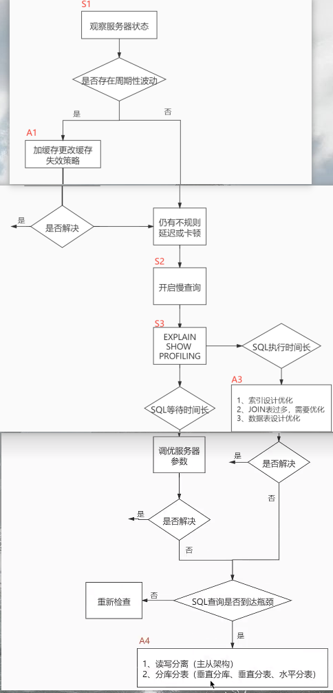
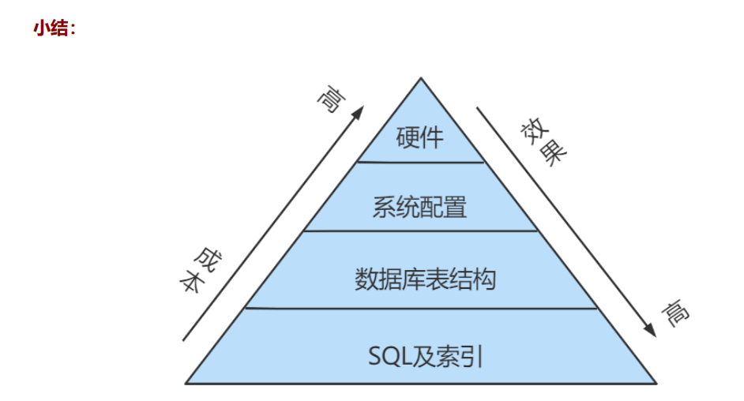

MySQL篇

### 1 、数据库的三范式是什么? 列不可再分/行可以被唯一的区分，主键约束 /表的非主属性不能依赖与其他表的非主属性，外键约束

**在关系型数据库中，数据表设计的基本原则、规则就称为范式**。可以理解为，一张数据表的设计结构需要满足的某种设计标准的级别。
要想设计一个结构合理的关系型数据库，必须满足一定的范式。 范式的英文名称是`Normal Form`,简称NF。
范式是关系数据库理论的基础，也是我们在设计数据库结构过程中所要遵循的规则和指导方法。

- 第一范式：列不可再分 。数据表中的每个字段的值不可再次拆分（具有原子性）
- 第二范式：行可以唯一区分，主键约束 。就是说 数据表里的每一条数据记录都是可唯一标识的，并且`非主键字段` 必须完全依赖于`主键`
- 第三范式：表的非主属性不能依赖与其他的非主属性 外键约束 。要求数据表中的**所有非主键字段不能依赖于其他非主键字段**，
            所有非主键属性之间不能有依赖关系，必须相互独立。
（第一范式告诉我们字段属性需要是原子性的，而第二范式告诉我们一张表就是一个独立的对象，一张表只表达一个意思。）
**高阶范式一定是满足低阶范式的要求，三大范式是一级一级依赖的，第二范式建立在第一范式上，第三范式建立第一第二范式上。**

~~它是英国人E.F.Codd在上个世纪7o年代提出关系数据库模型后总结出来的。~~
### 2 、MySQL数据库引擎有哪些? MyISAM、InnoDB、Memory、MERGE

mysql常用引擎包括：MyISAM、InnoDB、Memory、MERGE

- MYISAM：**全表锁，拥有较高的执行速度，不支持事务，不支持外键，并发性能差，占用空间相对较小，对事务完整性没有要求**，以select、insert为主的应用基本上可以使用这引擎
- Innodb: **行级锁，提供了具有提交、回滚和崩溃恢复能力的事务安全，支持自动增长列，支持外键约束，并发能力强，占用空间是MYISAM的2.5倍，处理效率相对会差一些**
- Memory: 全表锁，存储在内容中，速度快，但会占用和数据量成正比的内存空间且数据在mysql重启时会丢失，默认使用HASH索引，检索效率非常高，但不适用于精确查找，主要用于那些内容变化不频繁的代码表
- MERGE：是一组MYISAM表的组合

查看mysql提供的所有存储引擎

```
mysql> show engines;
+--------------------+---------+----------------------------------------------------------------------------------+--------------+------+------------+
| Engine             | Support | Comment                                                                          | Transactions | XA   | Savepoints |
+--------------------+---------+----------------------------------------------------------------------------------+--------------+------+------------+
| CSV                | YES     | Stores tables as CSV files                                                       | NO           | NO   | NO         |
| MRG_MyISAM         | YES     | Collection of identical MyISAM tables                                            | NO           | NO   | NO         |
| MEMORY             | YES     | Hash based, stored in memory, useful for temporary tables                        | NO           | NO   | NO         |
| MyISAM             | YES     | Non-transactional engine with good performance and small data footprint          | NO           | NO   | NO         |
| SEQUENCE           | YES     | Generated tables filled with sequential values                                   | YES          | NO   | YES        |
| InnoDB             | DEFAULT | Supports transactions, row-level locking, foreign keys and encryption for tables | YES          | YES  | YES        |
| Aria               | YES     | Crash-safe tables with MyISAM heritage                                           | NO           | NO   | NO         |
| PERFORMANCE_SCHEMA | YES     | Performance Schema                                                               | NO           | NO   | NO         |
+--------------------+---------+----------------------------------------------------------------------------------+--------------+------+------------+
```

### 3 、说说InnoDB与MyISAM的区别? 

**1.是否支持行级锁** MyISAM 只有表级锁(table-level locking)，而 InnoDB 支持行级锁(row-level locking)和表级锁,默认为行级锁。InnoDB 在并发写的时候，性能更好 ~~也就说，MyISAM 一锁就是锁住了整张表，这在并发写的情况下是多么滴憨憨啊！这也是为什么~~ 

**2.是否支持事务** MyISAM 不提供事务支持。InnoDB 提供事务支持，具有提交(commit)和回滚(rollback)事务的能力。

**3.是否支持外键** MyISAM 不支持，而 InnoDB 支持。

**4.是否支持数据库异常崩溃后的安全恢复** MyISAM 不支持，而 InnoDB 支持。使用 InnoDB 的数据库在异常崩溃后，数据库重新启动时会保证数据库恢复到崩溃前的状态。恢复的过程依赖于 `redo log` 。

**5. 是否支持多版本并发控制(MVCC)**  MyISAM 不支持，而 InnoDB 支持。

~~讲真，这个对比有点废话，毕竟 MyISAM 连行级锁都不支持。~~
MVCC 可以看作是行级锁的一个升级，可以有效减少加锁操作，提供性能。


[什么是MVCC](https://blog.csdn.net/yajie_12/article/details/80453863)
```
MVCC，Multi-Version Concurrency Control，多版本并发控制。MVCC 是一种并发控制的方法，一般在数据库管理系统中，实现对数据库的并发访问；在编程语言中实现事务内存。
如果有人从数据库中读数据的同时，有另外的人写入数据，有可能读数据的人会看到『半写』或者不一致的数据。有很多种方法来解决这个问题，叫做并发控制方法。
最简单的方法，通过加锁，让所有的读者等待写者工作完成，但是这样效率会很差。MVCC 使用了一种不同的手段，每个连接到数据库的读者，在某个瞬间看到的是数据库的一个快照，
写者写操作造成的变化在写操作完成之前（或者数据库事务提交之前）对于其他的读者来说是不可见的。
```

```
🌈 拓展一下：
一般我们也是不建议在数据库层面使用外键的，应用层面可以解决。不过，这样会对数据的一致性造成威胁。具体要不要使用外键还是要根据你的项目来决定。
```
### 4 、数据库的事务? 多条sql语句，要么全部成功，要么全部失败。ACID

什么是事务？： 多条sql语句，要么全部成功，要么全部失败。

##### 数据库事务特性：原子性(Atomic)、一致性(Consistency)、隔离性(Isolation)、持久性(Durabiliy)。简称ACID。

- 原子性：组成一个事务的多个数据库操作是一个不可分割的原子单元，只有所有操作都成功，整个事务才会提交。任何一个操作失败，已经执行的任何操作都必须撤销，让数据库返回初始状态。
- 一致性：事务操作成功后，数据库所处的状态和它的业务规则是一致的。即数据不会被破坏。 如A转账 100 元给B，不管操作是否成功，A和B的账户总额是不变的。
- 隔离性：在并发数据操作时，不同的事务拥有各自的数据空间，它们的操作不会对彼此产生干扰
- 持久性：一旦事务提交成功，事务中的所有操作都必须持久化到数据库中。

### 数据事务的实现原理呢？

以 MySQL 的 InnoDB 引擎为例来简单说一下。

MySQL InnoDB 引擎 **使用 重做日志 `redo log` 保证事务的持久性，使用 回滚日志 `undo log` 来保证事务的原子性**。

MySQL InnoDB 引擎通过 **锁机制**、**MVCC** 等手段来保证事务的隔离性（ 默认支持的隔离级别是 **`REPEATABLE-READ`** ）。

保证了事务的持久性、原子性、隔离性之后，一致性才能得到保障。

### 6 、SQL优化手段有哪些
建立正确的索引
对SQL语句进行优化

1. 查询语句中不要使用select *
2. 尽量减少子查询，使用关联查询（left join,right join,inner join）替代
3. 减少使用IN或者NOT IN ,使用 `exists`，`not exists`或者关联查询语句替代
4. or 的查询尽量用 `union` 或者 `union all` 代替(在确认没有重复数据或者不用剔除重复数据时，union all会更好)
5. 应尽量避免在 where 子句中使用!=或<>操作符，否则将引擎放弃使用索引而进行全表扫描。
6. 应尽量避免在 where 子句中对字段进行 null 值判断，否则将导致引擎放弃使用索引而进行全表扫描，
如： select id from t where num is null 可以在num上设置默认值 0 ，确保表中num列没有null值，然后这样查询： select id from t where num=0
7. 避免在where 子句中进行表达式操作
8. 联合索引遵循最左前缀原则


### 7 、简单说一说drop、delete与truncate的区别

SQL中的drop、delete、truncate 都表示删除，但是三者有一些差别

delete和truncate只删除表的数据不删除表的结构 速度,一般来说: drop> truncate >delete 
delete 语句是dml,这个操作会放到rollback segement中, 事务提交之后才生效; 如果有相应的trigger,执行的时候将被触发. truncate,
drop是ddl, 操作立即生效,原数据不放到rollback segment中,不能回滚.操作不触发trigger.

### 8 、什么是视图

1. 视图，可以看做是一个虚拟表，本身是不存储数据的。 视图的本质，就可以看做是**存储起来的SELECT语句**
2. 视图中SELECT语句中涉及到的表，称为基表
3. 针对视图做DML(增删改)操作，会影响到对应的基表中的数据。针对基表做增删改操作，也会影响到视图中的数据
4. 视图本身的删除，不会导致基表中数据的删除。 
5. 视图的应用场景：针对于小型项目，不推荐使用视图。针对于大型项目，可以考虑使用视图。 
6. 视图的优点：简化查询; 控制数据的访问


### 9 、 什么是内联接、左外联接、右外联接？

- 内联接（Inner Join）：匹配 2 张表中相关联的记录。
- 左外联接（Left Outer Join）：除了匹配 2 张表中相关联的记录外，还会匹配左表中剩余的记录，右表中未匹配到的字段用NULL表示。
- 右外联接（Right Outer Join）：除了匹配 2 张表中相关联的记录外，还会匹配右表中剩余的记录，左表中未匹配到的字段用NULL表示。
  
在判定左表和右表时，要根据表名出现在 Join 的左右位置关系。

### 10 、并发事务带来哪些问题?

在典型的应用程序中，多个事务并发运行，经常会操作相同的数据来完成各自的任务（多个用户对同一数据进行操作）。并发虽然是必须的，但可能会导致以下的问题。

- **脏读（Dirty read）**: 当一个事务正在访问数据并且对数据进行了修改，而**这种修改还没有提交到数据库中，这时另外一个事务也访问了这个数据**，然后使用了这个数据。
  因为这个数据是还没有提交的数据，那么另外一个事务读到的这个数据是“脏数据”，依据“脏数据”所做的操作可能是不正确的。
- **丢失修改（Lost to modify）**: 指在一个事务读取一个数据时，另外一个事务也访问了该数据，那么在第一个事务中修改了这个数据后，第二个事务也修改了这个数据。
  这样第一个事务内的修改结果就被丢失，因此称为丢失修改。 例如：事务 1 读取某表中的数据A=20，事务 2 也读取A=20，事务 1 修改A=A-1，事务 2 也修改A=A-1，最终结果A=19，事务 1 的修改被丢失。
- **不可重复读（Unrepeatableread）**: 指在一个事务内多次读同一数据。在这个事务还没有结束时，另一个事务也访问该数据。那么，在**第一个事务中的两次读数据之间，
  由于第二个事务的修改导致第一个事务两次读取的数据不一样**。这就发生了在一个事务内两次读到的数据是不一样的情况，因此称为不可重复读。
- **幻读（Phantom read）**: 幻读与不可重复读类似。**第一个事务中的两次读数据之间，由于第二个事务的插入或删除insert/delete操作导致第一个事务两次读取的数据不一样，第二次发现记录增多或减少了**
  ~~它发生在一个事务（T1）读取了几行数据，接着另一个并发事务（T2）插入了一些数据时。在随后的查询中，第一个事务（T1）就会发现多了一些原本不存在的记录，就好像发生了幻觉一样，所以称为幻读。~~

不可重复读和幻读区别：
**不可重复读的重点是修改**比如多次读取一条记录发现其中某些列的值被修改，**幻读的重点在于新增或者删除**比如多次读取一条记录发现记录增多或减少了。

### 12 ，大表如何优化？

当MySQL单表记录数过大时，数据库的CRUD性能会明显下降，一些常见的优化措施如下：

1. **限定数据的范围务**, 必禁止不带任何限制数据范围条件的查询语句。比如：我们当用户在查询订单历史的时候，可以控制在一个月的范围内；

2. 读/写分离 **经典的数据库拆分方案，主库负责写，从库负责读**；

3. 垂直分区  简单来说垂直拆分是指数据表列的拆分，把一张列比较多的表拆分为多张表。 
   根据数据库里面数据表的相关性进行拆分。 例如，用户表中既有用户的登录信息又有用户的基本信息，可以将用户表拆分成两个单独的表，甚至放到单独的库做分库。

```
垂直拆分的优点： 可以使得列数据变小，在查询时减少读取的Block数，减少I/O次数。此外，垂直分区可以简化表的结构，易于维护。
垂直拆分的缺点： 主键会出现冗余，需要管理冗余列，并会引起Join操作，可以通过在应用层进行Join来解决。此外，垂直分区会让事务变得更加复杂；
```
4. 水平分区： 水平拆分是指数据表行的拆分，一张表列不变，对数据进行拆分

```
保持数据表结构不变，通过某种策略存储数据分片。这样每一片数据分散到不同的表或者库中，达到了分布式的目的。 水平拆分可以支撑非常大的数据量。
水平拆分是指数据表行的拆分，表的行数超过 200 万行时，就会变慢，这时可以把一张的表的数据拆成多张表来存放。举个例子：我们可以将用户信息表拆分成多个用户信息表，这样就可以避免单
一表数据量过大对性能造成影响。


水平拆分可以支持非常大的数据量。需要注意的一点是：分表仅仅是解决了单一表数据过大的问题，但由于表的数据还是在同一台机器上，其实对于提升MySQL并发能力没有什么意义，所以 水平拆分最好分库 。

水平拆分能够 支持非常大的数据量存储，应用端改造也少，但 分片事务难以解决 ，跨节点Join性能 较差，逻辑复杂。《Java工程师修炼之道》的作者推荐尽量不要对数据进行分片，
因为拆分会带来逻辑、部署、运维的各种复杂度 ，一般的数据表在优化得当的情况下支撑千万以下的数据量是没有太大问题的。如果实在要分片，尽量选择客户端分片架构，这样可以减少一次和中间件的网络I/O。

```
下面补充一下数据库分片的两种常见方案：

```
客户端代理： 分片逻辑在应用端，封装在jar包中，通过修改或者封装JDBC层来实现。 当当网的 Sharding-JDBC 、阿里的TDDL是两种比较常用的实现。
中间件代理： 在应用和数据中间加了一个代理层。分片逻辑统一维护在中间件服务中。 我们现在谈的 Mycat 、 360 的Atlas、网易的DDB等等都是这种架构的实现。
```
详细内容可以参考：[MySQL大表优化方案](https://segmentfault.com/a/1190000006158186)


### 13 、分库分表之后,id 主键如何处理？

因为要是分成多个表之后，每个表都是从 1 开始累加，这样是不对的，我们需要一个全局唯一的 id 来支持。

生成全局 id 有下面这几种方式：

- UUID：不适合作为主键，因为太长了，并且无序不可读，查询效率低。比较适合用于生成唯一的名字的标示比如文件的名字。
- 数据库自增 id : 两台数据库分别设置不同步长，生成不重复ID的策略来实现高可用。这种方式 生成的 id 有序，但是需要独立部署数据库实例，成本高，还会有性能瓶颈。
- 利用 redis 生成 id : 性能比较好，灵活方便，不依赖于数据库。但是，引入了新的组件造成系统更加复杂，可用性降低，编码更加复杂，增加了系统成本。
- Twitter的snowflake算法 ：Github 地址：https://github.com/twitter-archive/snowflake。
- 美团的Leaf分布式ID生成系统 ：Leaf 是美团开源的分布式ID生成器，能保证全局唯一性、趋势递增、单调递增、信息安全，里面也提到了几种分布式方案的对比，但也需要依赖关系数据库、Zookeeper等中间件。感觉还不错。
[美团技术团队的一篇文章](https://tech.meituan.com/2017/04/21/mt-leaf.html)

### 14 、 说说在 MySQL 中一条查询 SQL 是如何执行的？
> 1.获取MySQL连接；2。查询缓存；3.分析器进行SQL解析语法校验；4.优化器进行优化，比如索引和连接时的优化；5执行器检查权限，进行SQL语句的执行及结果返回

##### 比如下面这条SQL语句：
```
select name from t_user where id= 1
```

1. **取得链接**，使用到 MySQL 中的连接器。
2. **查询缓存**，key 为 SQL 语句，value 为查询结果，如果查到就直接返回。不建议使用，在 MySQL 8.0 版本已经将查询缓存删除，也就是说 MySQL 8.0 版本后不存在此功能。
3. **分析器(解析器)**，分为词法分析和语法分析。此阶段只是**做一些 SQL 解析，语法校验**。所以一般语法错误在此阶段。
4. **优化器**，是在表里有多个索引的时候，决定使用哪个索引；或者一个语句中存在多表关联的时候（join），决定各个表的连接顺序。**选择最好的执行计划并生成执行计划给执行器**
   比如查询优化可以分为 `逻辑查询优化` 和 `物理查询优化`
    - 物理查询优化则是通过 `索引` 和 `表连接方式` 等技术来进行优化，这里重点需要掌握索引的使用。
    - 逻辑查询优化就是通过SQL等价变换提升查询效率，直白一点就是说，换一种查询写法执行效率可能更高。
   
5. **执行器，执行语句**。执行语句的时候还要判断是否具备此权限，没有权限就直接返回提示没有权限的错误；有权限则打开表，根据表的引擎定义，
   去使用这个引擎提供的接口，获取这个表的第一行，判断 id 是都等于 1 。如果是，直接返回；如果不是继续调用引擎接口去下一行，重复相同的判断，
   直到取到这个表的最后一行，最后返回。

```
分析器先做“ 词法分析 ”。你输入的是由多个字符串和空格组成的一条 SQL 语句，MySQL 需要识别出 SQL语句里面的字符串分别是什么，代表什么。
识别 SQL关键字、列名，表名 
MySQL 从你输入的"select"这个关键字识别出来，这是一个查询语句。
接着，要做“ 语法分析 ”。根据词法分析的结果，语法分析器（比如：Bison）会根据语法规则，判断你输入的这个 SQL 语句是否 满足 MySQL 语法 。 
如果SQL语句正确，则会生成一个语法树
```
### 15 、索引有什么优缺点？

##### 什么是索引？

索引（Index）是帮助 MySQL **高效获取数据**的 `数据结构`。更通俗的说，索引好比是一本书的目录，能加快数据库的查询速度。
索引的本质：索引是数据结构。可以简单理解为“排好序的快速查找数据结构”，满足特定查找算法。
这些数据结构以某种方式指向数据， 这样就可以在这些数据结构的基础上实现 高级查找算法 。

索引是存储在磁盘上的文件中的（可能存储在单独的索引文件中，也可能和数据一起存储在数据文件中）。
通常所说的索引，包括聚集索引、覆盖索引、组合索引、前缀索引、唯一索引等，没有特别说明，默认都是使用B+树结构组织（多路搜索树，并不一定是二叉的）的索引。
常见的索引结构有: B 树， B+树和 Hash。**

```
索引的作用就相当于目录的作用。打个比方: 我们在查字典的时候，如果没有目录，那我们就只能一页一页的去找我们需要查的那个字，速度很慢。
如果有目录了，我们只需要先去目录里查找字的位置，然后直接翻到那一页就行了。
```
##### 索引的优点
> 提高数据检索的效率，降低数据库的IO成本; 唯一索引可以保证每行数据的唯一性; 加速表和表之间的链接;
>
1. 类似大学图书馆建书目索引，**提高数据检索的效率，降低数据库的IO成本** ，这也是创建索引最主要的原因。 
2. 通过创建唯一索引，可以保证数据库表中每一行数据的唯一性 。 
3. 在实现数据的参考完整性方面，可以 **加速表和表之间的连接** 。换句话说，对于有依赖关系的子表和父表联合查询时，可以提高查询速度。 
4. **在使用分组和排序子句进行数据查询时，可以显著减少查询中分组和排序的时间 ，降低了CPU的消耗**。

#####  缺点
> 创建索引和维护索引要 耗费时间; 占磁盘空间; 降低更新表（增删改）的速度

增加索引也有许多不利的方面，主要表现在如下几个方面： 
1. **创建索引和维护索引要 耗费时间** ，并且随着数据量的增加，所耗费的时间也会增加。 
2. 索引需要 **占磁盘空间** ，除了数据表占数据空间之外，每一个索引还要占一定的物理空间，存储在磁盘上 ，
如果有大量的索引，索引文件就可能比数据文件更快达到最大文件尺寸。 
3. 虽然索引大大提高了查询速度，同时却会**降低更新表（增删改）的速度** 。当对表中的数据进行增加、删除和修改的时候，索引也要动态地维护，这样就降低了数据的维护速度。

因此，选择使用索引时，需要综合考虑索引的优点和缺点。

### 16 、 MySQL 中 varchar 与 char 的区别？varchar(30) 中的 30 代表的涵义？

varchar 与 char 的区别，char 是一种固定长度的类型，varchar 则是一种可变长度的类型。
varchar(30) 中 30 的涵义最多存放 30 个字符。varchar(30) 和 (130) 存储 hello 所占空间一样，
但后者在排序时会消耗更多内存，因为 ORDER BY col 采用 fixed_length 计算 col 长度~~（memory 引擎也一样）。~~
对效率要求高用 char，对空间使用要求高用 varchar。

### 17 、 int(11) 中的 11 代表什么涵义？

int(11) 中的 11 ，不影响字段存储的范围，只影响展示效果。

### 18 、 为什么 SELECT COUNT(*) FROM table 在 InnoDB 比MyISAM 慢？ InnoDB 是去实时统计结果，会全表扫描；而 MyISAM 内部维持了一个计数器，预存了结果，所以直接返回即可

对于 SELECT COUNT(*) FROM table 语句，在没有 WHERE 条件的情况下，InnoDB 比 MyISAM 可能会慢很多，尤其在大表的情况下。
因为，**InnoDB 是去实时统计结果，会全表扫描；而 MyISAM 内部维持了一个计数器，预存了结果，所以直接返回即可**。


### 20 、MySQL 索引类型有哪些？

- 主键索引: 索引列中的值必须是唯一的，不允许有空值。

- 普通索引: MySQL中基本索引类型，没有什么限制，允许在定义索引的列中插入重复值和空值。

- 唯一索引: 索引列中的值必须是唯一的，但是允许为空值。

- 全文索引: 只能在文本类型CHAR,VARCHAR,TEXT类型字段上创建全文索引。字段长度比较大时，如果创建普通索引，在进行like模糊查询时效率比较低，
  这时可以创建全文索引。MyISAM和InnoDB中都可以使用全文索引。

- 空间索引 MySQL在5.7之后的版本支持了空间索引，而且支持OpenGIS几何数据模型。MySQL在空间索引这方面遵循OpenGIS几何数据模型规则。

- 前缀索引 在文本类型如CHAR,VARCHAR,TEXT类列上创建索引时，可以指定索引列的长度，但是数值类型不能指定。


其他（按照索引列数量分类）

1. 单列索引

2. 组合索引（联合索引）

组合索引的使用，需要遵循最左前缀匹配原则（最左匹配原则）。一般情况下在条件允许的情

况下使用组合索引替代多个单列索引使用。

### 21 、什么时候不要使用索引？

1. 经常增删改的列不要建立索引；

2. 有大量重复的列不建立索引；

3. 表记录太少不要建立索引。

### 22 、说说什么是 MVCC？

多版本并发控制（MVCC=Multi-Version Concurrency Control），是一种用来解决读 - 写冲突的无锁并发控制。也就是为事务分配单向增长的时间戳，为每个修改保存一个版本。
版本与事务时间戳关联，读操作只读该事务开始前的数据库的快照（复制了一份数据）。这样在读操作不用阻塞写操作，写操作不用阻塞读操作的同时，避免了脏读和不可重复读。

### 23 、MVCC 可以为数据库解决什么问题？

在并发读写数据库时，**可以做到在读操作时不用阻塞写操作，写操作也不用阻塞读操作，提高了数据库并发读写的性能**。同时还可以解决脏读、幻读、不可重复读等事务隔离问题，但不能解决更新丢失问题。

### 24 、说说 MVCC 的实现原理

MVCC 的目的就是多版本并发控制，在数据库中的实现，就是为了解决读写冲突，`MVCC` 的实现依赖于：**隐藏字段、Read View、undo log**。
在内部实现中，`InnoDB` 通过数据行的 `DB_TRX_ID` 和 `Read View` 来判断数据的可见性，如不可见，则通过数据行的 `DB_ROLL_PTR` 找到 `undo log` 中的历史版本。
每个事务读到的数据版本可能是不一样的，在同一个事务中，用户只能看到该事务创建 `Read View` 之前已经提交的修改和该事务本身做的修改


### 26 、 请说说 MySQL 数据库的锁？

关于 MySQL 的锁机制，可能会问很多问题，不过这也得看面试官在这方面的知识储备。

MySQL 中有共享锁和排它锁，也就是读锁和写锁。

1. 共享锁：不堵塞，多个用户可以同一时刻读取同一个资源，相互之间没有影响。
2. 排它锁：一个写操作阻塞其他的读锁和写锁，这样可以只允许一个用户进行写入，防止其他用户读取正在写入的资源。
3. 表锁：系统开销最小，会锁定整张表，MyISAM 使用表锁。
4. 行锁：容易出现死锁，发生冲突概率低，并发高，InnoDB 支持行锁（必须有索引才能实现，否则会自动锁全表，那么就不是行锁了）。

### 27 、说说什么是锁升级？

MySQL 行锁只能加在索引上，如果操作不走索引，就会升级为表锁。因为 InnoDB 的行锁是加在索引上的，如果不走索引，自然就没法使用行锁了，
原因是 InnoDB 是将 primary key index 和相关的行数据共同放在 B+ 树的叶节点。InnoDB 一定会有一个 primary key，secondary
index 查找的时候，也是通过找到对应的 primary，再找对应的数据行。
当非唯一索引上记录数超过一定数量时，行锁也会升级为表锁。测试发现当非唯一索引相同的内容不少于整个表记录的二分之一时会升级为表锁。
因为当非唯一索引相同的内容达到整个记录的二分之一时，索引需要的性能比全文检索还要大，查询语句优化时会选择不走索引，造成索引失效，行锁自然就会升级为表锁。

### 28 、说说悲观锁和乐观锁

###### 悲观锁

说的是数据库被外界（包括本系统当前的其他事物以及来自外部系统的事务处理）修改保持着保守态度，
因此在整个数据修改过程中，将数据处于锁状态。
**悲观的实现往往是依靠数据库提供的锁机制，也只有数据库层面提供的锁机制才能真正保证数据访问的排他性**，
否则，即使在本系统汇总实现了加锁机制，
也是没有办法保证系统不会修改数据。

在悲观锁的情况下，为了保证事务的隔离性，就需要一致性锁定读。读取数据时给加锁，
其它事务无法修改这些数据。修改删除数据时也要加锁，其它事务无法读取这些数据。

###### 乐观锁

相对悲观锁而言，乐观锁机制采取了更加宽松的加锁机制。悲观锁大多数情况下依靠数据库的锁机制实现，
以保证操作最大程度的独占性。
但随之而来的就是数据库性能的大量开销，特别是对长事务而言，这样的开销往往无法承受。


而乐观锁机制在一定程度上解决了这个问题。乐观锁，大多是基于**数据版本（Version）记录机制**实现。
何谓数据版本？即为数据增加一个版本标识，
在基于数据库表的版本解决方案中，一般是通过为数据库表增加一个“version”字段来实现。读取出数据时，
将此版本号一同读出，之后更新时，
对此版本号加一。此时，将提交数据的版本数据与数据库表对应记录的当前版本信息进行比对，
如果提交的数据版本号大于数据库表当前版本号，则予以更新，否则认为是过期数据。

### 29 、怎样尽量避免死锁的出现？

1. 设置获取锁的超时时间，至少能保证最差情况下，可以退出程序，不至于一直等待导致死锁；
2. 设置按照同一顺序访问资源，类似于串行执行；
3. 避免事务中的用户交叉；
4. 保持事务简短并在一个批处理中；
5. 使用低隔离级别；
6. 使用绑定链接。

### 30 、使用 MySQL 的索引应该注意些什么？
1. 经常增删改的列不要建立索引；

2. 有大量重复的列不建立索引；

3. 表记录太少不要建立索引。

4. 查询时避免索引失效。比如不要在索引列进行计算、in、or、!=、<>, null 判断


### 31 、CHAR 和 VARCHAR 的区别？

CHAR 和VARCHAR 类型在存储和检索方面有所不同

CHAR 列长度固定为创建表时声明的长度，长度值范围是 1 到 255 当 CHAR 值被存储时，它们被用空格填充到特定长度，
检索CHAR 值时需删除尾随空格。


### 32 、主键和候选键有什么区别？

表格的每一行都由主键唯一标识,一个表只有一个主键。主键也是候选键。按照惯例，候选键可以被指定为主键，并且可以用于任何外键引用。


### 33 、主键与索引有什么区别？

主键一定会创建一个唯一索引，但是有唯一索引的列不一定是主键；

主键不允许为空值，唯一索引列允许空值；

一个表只能有一个主键，但是可以有多个唯一索引；

主键可以被其他表引用为外键，唯一索引列不可以；

主键是一种约束，而唯一索引是一种索引，是表的冗余数据结构，两者有本质区别

### 34 、 MySQL 如何做到高可用方案？

MySQL 高可用，意味着不能一台 MySQL 出了问题，就不能访问了。

```
1. MySQL 高可用：分库分表，通过 MyCat 连接多个 MySQL
2. MyCat 也得高可用：Haproxy，连接多个 MyCat
3. Haproxy 也得高可用：通过 keepalived 辅助 Haproxy
```

### 35 ，事务隔离级别有哪些?MySQL的默认隔离级别是?

SQL 标准定义了四个隔离级别：

- **READ-UNCOMMITTED(读取未提交)：** 最低的隔离级别，允许读取尚未提交的数据变更，**可能会导致脏读、幻读或不可重复读**。
- **READ-COMMITTED(读取已提交)：** 允许读取并发事务已经提交的数据，**可以阻止脏读，但是幻读或不可重复读仍有可能发生**。
- **REPEATABLE-READ(可重复读)：** 对同一字段的多次读取结果都是一致的，除非数据是被本身事务自己所修改，
  **可以阻止脏读和不可重复读，但幻读仍有可能发生**。
  InnoDB 存储引擎在 REPEATABLE-READ（可重读） 事务隔离级别下使用的是`Next-Key Lock `锁算法
  达到了 SQL标准的 SERIALIZABLE(可串行化) 隔离级别
- **SERIALIZABLE(可串行化)：** 最高的隔离级别，完全服从 ACID 的隔离级别。所有的事务依次逐个执行，这样事务之间就完全不可能产生干扰，也就是说，**`可串行化`可以防止脏读、不可重复读以及幻读**。


| 隔离级别          | 脏读    | 不可重复读   | 幻读     |
|------------------|--------|-------------|----------|
| READ-UNCOMMITTED | √      | √           | √        |
| READ-COMMITTED   | ×      | √           | √        |
| REPEATABLE-READ  | ×      | ×           | √        |
| SERIALIZABLE     | ×      | ×           | ×        |


MySQL InnoDB 存储引擎的默认支持的隔离级别是 REPEATABLE-READ（可重读）。可以通过 `SELECT @@tx_isolation` 命令来查看

```
mysql> SELECT @@tx_isolation;
+-----------------+
| @@tx_isolation |
+-----------------+
| REPEATABLE-READ |
+-----------------+
```
这里需要注意的是：与 SQL 标准不同的地方在于 InnoDB 存储引擎在 REPEATABLE-READ（可重读） 事务隔离级别下使用的是`Next-Key Lock `锁算法，
因此**可以避免幻读的产生**，这与其他数据库系统(如 SQL Server) 是不同的。所以说
**InnoDB 存储引擎的默认支持的隔离级别是 REPEATABLE-READ（可重读） 已经可以完全保证事务的隔离性要求，
即达到了 SQL标准的 SERIALIZABLE(可串行化) 隔离级别**。因为隔离级别越低，事务请求的锁越少，所以大部分数据库系统的隔离级别都是READ-COMMITTED(读取提交内容) ，
但是是 InnoDB 存储引擎默认使用 REPEAATABLE-READ（可重读） 并不会有任何性能损失。

InnoDB 存储引擎在 分布式事务 的情况下一般会用到 SERIALIZABLE(可串行化) 隔离级别。

### 36.mysql 最左匹配原则

面试官：建过索引嘛？
我有一个朋友：见过呀！
面试官：那你知道MySQL的执行计划嘛？
我有一个朋友：啊？！！
面试官：那你肯定知道最左匹配原则吧。
我有一个朋友：额。。。
想必大家面试时都被问到过这样问题，其实mysql的知识点不管是面试作为考点还是工作中使用，都占有很重要的一部分。
**MySQL的执行优化器，主要说一说联合索引的最左匹配原则**。

[https://blog.csdn.net/qq_41389354/article/details/111352242](https://blog.csdn.net/qq_41389354/article/details/111352242)

### 37.mysql 索引失效

1. 查询条件中有or,即使有部分条件带索引也会失效 
2. like查询是以 %开头
3. 如果列类型是字符串，那在查询条件中需要将数据用引号引用起来，否则不走索引
4. 索引列上参与计算会导致索引失效
5. 违背最左匹配原则

### 38.什么是最左匹配？最左前缀原则

MySQL可以为多个字段创建索引，一个索引可以包括16个字段。对于多列索引，
**过滤条件要使用索引必须按照索引建立时的顺序，依次满足，一旦跳过某个字段，索引后面的字段都无法被使用。
如果查询条件中没有使用这些字段中第1个字段时，多列（或联合）索引不会被使用。**
比如以  字段1，字段2，字段3 建立f的联合索引，
如果where过滤条件中  没有使用字段1，联合索引就不会被使用
如果依次使用了字段1，字段3，联合索引会使用一部分。


### 39.什么情况下适合创建索引？
适合建立索引的情况有：

1. **字段的数值有唯一性的限制**
2. **频繁作为 WHERE 查询条件的字段**
3. **经常 GROUP BY 和 ORDER BY 的列**
4. UPDATE、DELETE 的 WHERE 条件列
5. **DISTINCT 字段需要创建索引** 
6. 多表 JOIN 连接操作时，创建索引注意事项
   - **连接表的数量尽量不要超过 3 张**，因为每增加一张表就相当于增加了一次嵌套的循环，数量级增
       长会非常快，严重影响查询的效率。
   - 对 **WHERE 条件创建索引**，因为 WHERE 才是对数据条件的过滤。如果在数据量非常大的情况下，
        没有 WHERE 条件过滤是非常可怕的。
   - 最后，**对用于连接的字段创建索引，并且该字段在多张表中的类型必须一致**。比如 course_id 在
      student_info 表和 course 表中都为 int(11) 类型，而不能一个为 int 另一个为 varchar 类型。
        举个例子，如果我们只对 student_id 创建索引，执行 SQL 语句：
       运行结果（ 1 条数据，运行时间 0.189s）：
      这里我们对 name 创建索引，再执行上面的 SQL 语句，运行时间为 0.002s。
7. 区分度高(散列性高)的列适合作为索引
8. 使用联合索引的话，**使用最频繁的列放到联合索引的左侧**

### 40. 什么情况下适合不创建索引
1. 在 `where` 条件或是 `group by` 、`order by` 里用不到的字段不需要创建索引，索引的价值是快速定位，
  也就是说如果起不到定位的字段通常不需要创建索引
2. 数据量小的表最好不要使用索引
   **如果表记录太少，比如少于1000个，那么是不需要创建索引的**。表记录太少，是否创建索引对查询效率的影响并不大。
   甚至说，查询花费的时间可能比遍历索引的时间还要短，索引可能不会产生优化效果。
3. **有大量重复数据的列**上不要建立索引
4. 避免对经常更新的表创建过多的索引
5. 不建议用无序的值作为索引
6. 删除不再使用或者很少使用的索引
7. 不要定义冗余或重复的索引


### 41.什么情况下索引会失效？ 

索引失效的情况：

4. 计算、函数、类型转换(自动或手动)导致索引失效
5. 类型转换导致索引失效
6. 以索引创建时 `列` 的顺序为准， 范围条件右边的列索引失效
    **联合查询的非等值过滤条件 后面的部分用不到联合索引，前面以及非等值可以用到索引**
    如果 index(c1, c2, c3)   where 条件是   c1 = '' and c2 > '' and c3 = ''。
                              where 条件是   c1 = '' and c3 = '', and c2 > ''。
    以上两个c2可以用到索引，但是c2右边的c3就用不到了联合索引， 
    这个以**索引建立的顺序** 为主，例如 index(c1,c2,c3)

 
    应用开发中范围查询，例如：金额查询，日期查询往往都是范围查询。应将查询条件放置where语句最后。
    【创建的联合索引中，务必把范围涉及到的字段写在最后）

7. 不等于判断(!= 或者<>)会使索引失效
8. `is null `可以使用索引，`is not null` 无法使用索引

   结论：最好在设计数据表的时候就将字段设置为N0T NULL约束，比如你可以将INT类型的字段，默认值
   设置为0。将字符类型的默认值设置为空字符串 ''。
   拓展：同理，在查询中使用 not like 也无法使用索引，导致全表扫描。
   
9. `like` 以通配符 `%开头` 索引失效
10. OR 前后存在非索引的列，索引失效
11.
最佳左前缀法则

结论：MySQL可以为多个字段创建索引，一个索引可以包括16个字段。对于多列索引，
**过滤条件要使用索引必须按照索引建立时的顺序，依次满足，一旦跳过 `索引建立时的顺序` 的 某个字段，索引后面的字段都无法被使用。（就是联合索引只能使用到一部分）
如果查询条件中没有使用这些字段中第1个字段时，多列（或联合）索引不会被使用。**

12. 数据库和表的字符集统一使用utf8mb4

### 42.什么是覆盖索引？
**简单说就是，`索引列` + `主键 ` 包含了 `SELECT` 到 `FROM` 之间查询的 `列`。**

理解方式一 ：索引是高效找到行的一个方法，但是一般数据库也能使用索引找到一个列的数据，因此它

不必读取整个行。毕竟索引叶子节点存储了它们索引的数据；当能通过读取索引就可以得到想要的数据，
那就不需要读取行了。 **一个索引包含了满足查询结果的数据就叫做覆盖索引**。

理解方式二 ：非聚簇复合索引的一种形式，它包括在查询里的SELECT、JOIN和WHERE子句用到的所有列

（即**建索引的字段正好是覆盖查询条件中所涉及的字段**）。


### 数据库优化步骤
参考流程图：
观察 Show status 和行动 Action 两部分， S代表观察（会使用相应的分析工具）， A代表行动（对应分析可以采取的行动）

1. 首先观察服务器的状态，看它是否存在周期性波动
2. 如果存在，是否可以增加缓存以及更改缓存失效策略
3. 如果不存在周期性波动仍有延迟或者卡顿，开启慢查询：定义一个Long Query Time，超过这个阈值判断它是一个
执行比较慢的sql语句。
4. 找到后使用一些工具比如 EXPLAIN 查看执行计划,  SHOW PROFILING 查看每个步骤的时间成本
5. 通过第4步，分析出到底是 SQL等待时间长还是SQL执行时间长
6. 如果是SQL等待时间比较长，那么可以做一些服务器调优的参数: 比如增加缓冲池
7. 如果是SQL执行时间比较长：
   - 考虑索引的设计优化
   - 考虑是否 JOIN链接表过多，是否需要优化
   - 数据表的设计优化
   
8.查看是否解决，如果没有，查看是否SQL查询达到了瓶颈，如果是的话
考虑：
  - 1.读写分离（主从架构）
  - 2.分库分表（垂直分库、垂直分表、水评分表等）



具体：
我们可以通过观察了解数据库整体的运行状态，通过性能分析工具可以让我们了解执行慢的SQL都有哪些，查看
具体的SQL执行计划，甚至是SQL执行中的每一步的成本代价，这样才能定位问题所在，找到了问题，再采取相
应的行动。 ~~详细解释一下这张图：~~

首先在S1部分，我们需要观察服务器的状态是否存在周期性的波动。如果存在周龃性波动，有可能是周期性节点
的原因，比如双十一、促销活动等。这样的话，我们可以通过A1这一步骤解决，也就是加缓存，或者更改缓存
失效策略。
如果缓存策略没有解决，或者不是周期性波动的原因，我们就需要进一步分析查锦延迟和卡顿的原因。接下来进入
S2这一步，我们需要开启慢查询。慢查询可以帮我们定位执行慢的SQL语句。我们可以通过设置
long_query-time参数定义“慢”的阈值，如果SQL执行时间超过了（ong_query._time,则会认为是慢查询。当收
集上来这些慢查询之后，我们就可以通过分析工具对慢查询日志进行分析。
在S3这一步骤中，我们就知道了执行慢的SQL,这样就可以针对性地用EXPLAIN查看对应SQL语句的执行计
划，或者使用show profi1.e查看SQL中每一个步骤的时间成本。这样我们就可以了解SQL查询慢是因为执行
时间长，还是等待时间长。
如果是SQL等待时间长，我们进入A2步骤。在这一步骤中，我们可以调优服务器的参数，比如适当增加数据库
缓冲池等。如果是SQL执行时间长，就进入A3步骤，这一步中我们需要考虑是索引设计的问题？还是查询关联
的数据表过多？还是因为数据表的字段设计问题导致了这一现象。然后在这些维度上进行对应的调整。
如果A2和A3都不能解决问题，我们需要考虑数据库自身的SQL查询性能是否已经达到了瓶颈，如果确认没有达
到性能瓶颈，就需要重新检查，重复以上的步骤。如果已经达到了性能瓶颈，进入A4阶设，需要考虑增加服务
需，采用碳写分哥的架构，或者考虑对数据库进行分军分表，比如垂直分库、垂直分表和水平分表等。

如果A2和A3都不能解决问题，我们需要考虑数据库自身的SQL查询性能是否已经达到了瓶颈，如果确认没有达
到性能瓶颈，就需要重新检查，重复以上的步骤。如果已经达到了`性能瓶颈`，进入A4阶段，需要考虑增**加服务
器**，采用`读写分离`的架构，或者考虑对数据库进行`分库分表`，比如垂直分库、垂直分表和水平分表等。
以上就是数据库调优的流程思路。如果我们发现执行SQL时存在不规则延迟或卡顿的时候，就可以采用分析工具
帮我们定位有问题的SQL,这三种分析工具你可以理解是SQL调优的三个步骤：`慢查询`、`EXPLAIN` 
和 `SHOW PROFILING`。



```


### 二叉树

**二叉树**（Binary tree）是树形结构的一个重要类型。许多实际问题抽象出来的数据结构往往是二叉树形式，即使是一般的树也能简单地转换为二叉树，
而且二叉树的存储结构及其算法都较为简单，因此二叉树显得特别重要。
二叉树 特点是**每个节点最多只能有两棵子树，且有左右之分** 。

**二叉查找树**：简单说：左子节点比父节点小，右子节点比左子节点大。

定义：
二叉排序树（Binary Sort Tree），又称二叉查找树（Binary Search Tree），亦称二叉搜索树。是数据结构中的一类
在一般情况下，查询效率比链表结构要高。
一棵空树，或者是具有下列性质的二叉树：
（1）若左子树不空，则左子树上所有结点的值均小于它的根结点的值；
（2）若右子树不空，则右子树上所有结点的值均大于它的根结点的值；
（3）左、右子树也分别为二叉排序树
```
二叉树举例：
```
        34
        /\
        22  89
        /\    /\
        5  23 77 91
```

红黑树也是一种特殊的二叉查找树


###  Hash结构效率高，那为什么索引结构要设计成树型呢？
原因1:**Hsh索引仅能满足(=)(<>)和N查询。如果进行范围查询，哈希型的索引，时间复杂度会退化为
O(n);而树型的有序”特性，依然能够保持 O(log2N)的高效率。**

原因2:**Hash索引还有一个缺陷，数据的存储是`没有顺序的`，在ORDER BY的情况下，使用Hash索引还需要对数
据重新排序。**

原因3：对于联合索引的情况，Hash值是将联合索引键合并后一起来计算的，无法对单独的一个键或者几个索
键进行查询。

原因4：**对于等值查询来说，通常Hsh索引的效率更高，不过也存在一种情况，就是索引列的重复值如果很多，效
率就会降低。这是因为遇到Hash冲突时，需要遍历桶中的行指针来进行比较，找到查询的关键字，非常耗时。所
以，Hsh索引通常不会用到重复值多的列上，比如列为性别、年龄的情况等。**
