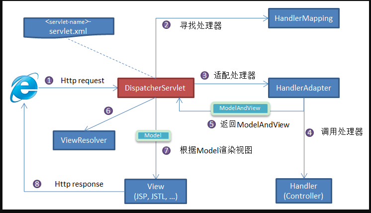
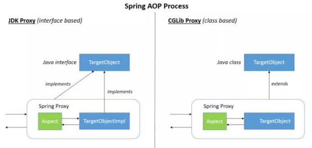
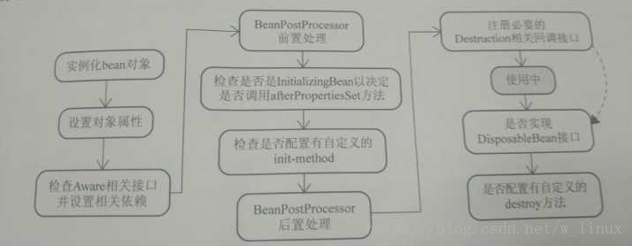

# 1.什么是spring?
我们一般说 Spring 指的是 Spring Framework、Spring框架, 它是一款开源的轻量级 Java 开发框架，目的是提高开发人员的开发效率以及系统的可维护性。
它是很多模块的集合，使用这些模块可以很方便地协助我们进行开发。
比如说 Spring 提供的核心功能主要是 IoC 控制反转（Inverse of Control） 和 AOP 面向切面编程(Aspect-Oriented Programming)、
可以很方便地对数据库进行访问、可以很方便地集成第三方组件（电子邮件，任务，调度，缓存等等）、对单元测试支持比较好、支持 RESTful Java 应用程序的开发。

Spring 最核心的思想就是不重新造轮子，开箱即用！

Spring 主要由以下几个模块组成：
Spring Core：核心类库，提供IOC服务；
Spring Context：提供框架式的Bean访问方式，以及企业级功能（JNDI、定时任务等）；
Spring AOP：AOP服务；
Spring DAO：对JDBC的抽象，简化了数据访问异常的处理；
Spring ORM：对现有的ORM框架的支持；
Spring Web：提供了基本的面向Web的综合特性，例如多方文件上传；
Spring MVC：提供面向Web应用的Model-View-Controller实现。

# 2.你们项目中为什么使用Spring框架？
说Spring有以下特点：
**轻量**：Spring 是轻量的，基本的版本大约2MB。
**IOC控制反转**：Spring通过控制反转实现了松散耦合，对象们给出它们的依赖，而不是创建或查找依赖的对象们。
**面向切面编程(AOP)**：Spring支持面向切面的编程，并且把 业务逻辑 和 系统服务 分开。
**容器**：Spring 包含并管理应用中对象的生命周期和配置。
**MVC框架**：Spring的WEB框架是个精心设计的框架，是Web框架的一个很好的替代品。
**事务管理**：Spring 提供一个持续的事务管理接口，可以扩展到 本地事务、全局事务（JTA）。可以通过@Transational 注解快速使用
**异常处理**：Spring 提供方便的API把具体技术相关的异常（比如由JDBC，Hibernate or JDO抛出的）转化为一致的unchecked 异常。

# 3. Autowired和Resource关键字的区别？

- `@Autowired` 是 Spring 提供的注解，`@Resource` 是 JDK 提供的注解。
- `Autowired` 默认的注入方式为根据类型进行匹配（`byType`），`@Resource`默认注入方式为 根据名称进行匹配（`byName`）。
- 当一个接口存在多个实现类的情况下，`@Autowired` 和`@Resource`都需要通过名称才能正确匹配到对应的 Bean。
 `Autowired` 可以通过 `@Qualifier` 注解来显示指定名称，`@Resource`可以通过 `name` 属性来显示指定名称。

# 4.依赖注入的方式有几种，各是什么? （TODO如果考到再完善）
一、构造器注入 将被依赖对象通过构造函数的参数注入给依赖对象，并且在初始化对象的时候注入。
二、setter方法注入
三、接口注入 

# 5.什么是Spring?
与问题1 重复
 
# 6.说说你对Spring MVC的理解
M-Model 模型（完成业务逻辑：有javaBean构成，service+dao+entity）
V-View 视图（做界面的展示 jsp，html……）
C-Controller 控制器（接收请求—>调用模型—>根据结果派发页面）
SpringMVC 是~~spring的一个后续产品，其实就是spring在原有基础上，又提供了web应用的MVC模块，可以简单的把springMVC理解为是spring的一个模块（类似AOP，IOC这样的模块），
网络上经常会说springMVC和spring无缝集成，其实springMVC就~~是spring的一个子模块，所以根本不需要同spring进行整合。
SpringMVC的组件有：
**前端控制器（DispatcherServlet）**：接收请求，响应结果，~~相当于电脑的CPU。~~
**处理器映射器（HandlerMapping）**：根据URL去查找处理器
**处理器（Handler）**：（需要程序员去写代码处理逻辑的）
**处理器适配器（HandlerAdapter）**：会把处理器包装成适配器，这样就可以支持多种类型的处理器，类比笔记本的适配器（适配器模式的应用）
**视图解析器（ViewResovler）**：进行视图解析，多返回的字符串，进行处理，可以解析成对应的页面
再回答 SpringMVC的工作原理

# 7.1.SpringMVC 工作原理了解吗?

**Spring MVC 原理如下图所示：**

> SpringMVC 工作原理图解

**流程说明（重要）：**

1. 客户端（浏览器）发送请求，直接请求到 前端控制器`DispatcherServlet`。
2. 前端控制器`DispatcherServlet` 根据请求信息调用 处理器映射器`HandlerMapping`，处理器映射器根据xml配置或注解，解析请求对应的处理器 `Handler`。
3. 解析到对应的 `Handler`（也就是我们平常说的 `Controller` 控制器）后，开始由 处理器适配器`HandlerAdapter`处理。
4. 处理器适配器`HandlerAdapter` 经过适配调用具体的处理器`Handler`来处理请求，并处理相应的业务逻辑。
5. 处理器处理完业务后，执行完成会返回一个 `ModelAndView` 对象，`Model` 是返回的数据对象，`View` 是个逻辑上的 `View`。
6. 视图解析器`ViewResolver`  会根据逻辑 `View` 查找实际的 `View`。
7. 前端控制器`DispaterServlet` 把返回的 `Model` 传给 `View`（视图渲染）。
8. 把 `View` 返回给请求者（浏览器）

# 7.2 SpringMVC 组件?
以下组件通常使用框架提供实现：
**DispatcherServlet**：作为前端控制器，整个流程控制的中心，控制其它组件执行，统一调度，降低组件之间的耦合性，提高每个组件的扩展性。
**HandlerMapping**：通过扩展处理器映射器实现不同的映射方式，例如：配置文件方式，实现接口方式，注解方式等。
**HandlAdapter**：通过扩展处理器适配器，支持更多类型的处理器。
**处理器（Handler）**：（需要程序员去写代码处理逻辑的）
**ViewResolver**：通过扩展视图解析器，支持更多类型的视图解析，例如：jsp、freemarker、pdf、 excel等。

总结：
前端控制器（DispatcherServlet）：接收请求，响应结果，相当于电脑的CPU。
处理器映射器（HandlerMapping）：根据URL去查找处理器。
处理器（Handler）：需要程序员去写代码处理逻辑的。
处理器适配器（HandlerAdapter）：会把处理器包装成适配器，这样就可以支持多种类型的处理
器，类比笔记本的适配器（适配器模式的应用）。
视图解析器（ViewResovler）：进行视图解析，多返回的字符串，进行处理，可以解析成对应的页
面。

# 7.SpringMVC常用的注解有哪些？

@RequestMapping：用于处理请求 url 映射的注解，可用于类或方法上。用于类上，则表示类中的所有响应请求的方法都是以该地址作为父路径。
@RequestBody：注解实现接收http请求的json数据，将json转换为java对象。
@ResponseBody：注解实现将controller 方法返回对象转化为json对象响应给客户。

# 8.谈谈你对Spring的AOP理解

AOP(Aspect-Oriented Programming:面向切面编程)能够将那些**与业务无关，很多业务模块所共同调用的逻辑或责任**（例如事务处理、日志管理、权限控制等）
封装起来，便于减少系统的重复代码，降低模块间的耦合度，并有利于未来的可拓展性和可维护性。

Spring AOP 就是基于动态代理的，
如果要代理的对象，实现了某个接口，那么 Spring AOP 会使用 **JDK Proxy**，去创建代理对象，
如果要代理的对象没有实现接口，这时候 Spring AOP 会使用 **Cglib** 生成一个被代理对象的子类来作为代理，如下图所示：

# 9.Spring AOP和AspectJ AOP有什么区别？
Spring AOP是属于运行时增强，而AspectJ是编译时增强。Spring AOP基于代理（Proxying），而AspectJ基于字节码操作（Bytecode Manipulation）。
Spring AOP已经集成了AspectJ，AspectJ应该算得上是Java生态系统中最完整的AOP框架了。
AspectJ相比于Spring AOP功能更加强大，但是Spring AOP相对来说更简单。
如果我们的切面比较少，那么两者性能差异不大。但是，当切面太多的话，最好选择AspectJ，它比SpringAOP快很多。

# 9.1 在Spring AOP 中，关注点和横切关注的区别是什么？
关注点是应用中一个模块的行为，一个关注点可能会被定义成一个我们想实现的一个功能。 横切关注点是一个关注点，此关注点是整个应用都会使用的功能，
并影响整个应用，比如日志，安全和数据传输，几乎应用的每个模块都需要的功能。因此这些都属于横切关注点。
# 9.2 那什么是连接点呢？
连接点代表一个应用程序的某个位置，在这个位置我们可以插入一个AOP切面，它实际上是个应用程序执行Spring AOP的位置。
# 9.3 切入点是什么？
切入点是一个或一组连接点，通知将在这些位置执行。可以通过表达式或匹配的方式指明切入点

# 9.44 Spring AOP 的通知是什么？有哪些类型呢？
Spring AOP的通知是 **在方法执行前或执行后要做的动作**，实际上是程序执行时要通过SpringAOP框架触发的代码段。

Spring切面可以应用五种类型的通知：
before：前置通知，在一个方法执行前被调用。
after: 在方法执行之后调用的通知，无论方法执行是否成功。
after-returning: 仅当方法成功完成后执行的通知。
after-throwing: 在方法抛出异常退出时执行的通知。
around: 在方法执行之前和之后调用的通知

# 10. 说说你对Spring的IOC是怎么理解的？

**IoC（Inverse of Control:控制反转）** 是一种设计思想，而不是一个具体的技术实现。
IoC 的思想就是将原本在程序中手动创建对象的控制权，交由 Spring 框架来管理。
**为什么叫控制反转？**
- **控制** ：指的是创建对象的权力，也就是实例化对象、管理对象的权利
- **反转** ：控制权交给外部环境，在这里也就是Spring 框架、Spring的IoC 容器

将对象之间的相互依赖关系交给 IoC 容器来管理，并由 IoC 容器完成对象的注入。这样可以很大程度上简化应用的开发，把应用从复杂的依赖关系中解放出来。
IoC 容器就像是一个工厂一样，当我们需要创建一个对象的时候，只需要配置好配置文件/注解即可，完全不用考虑对象是如何被创建出来的。
在 Spring 中， IoC 容器是 Spring 用来实现 IoC 的载体， IoC 容器实际上就是个 Map（key，value），Map 中存放的是各种对象。

~~在实际项目中一个 Service 类可能依赖了很多其他的类，假如我们需要实例化这个 Service，你可能要每次都要搞清这个 Service 所有底层类的构造函数，
这可能会把人逼疯。如果利用 IoC 的话，你只需要配置好，然后在需要的地方引用就行了，这大大增加了项目的可维护性且降低了开发难度。~~
~~Spring 时代我们一般通过 XML 文件来配置 Bean，后来开发人员觉得 XML 文件来配置不太好，于是 SpringBoot 注解配置就慢慢开始流行起来。~~

答案二：
（1）IOC就是控制反转，是指创建对象的控制权的转移。以前创建对象的主动权和时机是由自己把控的，而现在这种权力转移到Spring容器中，
并由容器根据配置文件去创建实例和管理各个实例之间的依赖关系。对象与对象之间松散耦合，也利于功能的复用。
DI依赖注入，和控制反转是同一个概念的不同角度的描述，即 应用程序在运行时依赖IoC容器来动态注入对象需要的外部资源。
（2）最直观的表达就是，IOC让对象的创建不用去new了，可以由spring自动生产，使用java的反射机制，根据配置文件在运行时动态的去创建对象以及管理对象，
并调用对象的方法的。
（3）Spring的IOC有三种注入方式 ：构造器注入、setter方法注入、根据注解注入。
IoC让相互协作的组件保持松散的耦合，而AOP编程允许你把遍布于应用各层的功能分离出来形成可重用的功能组件。

# 11.解释一下 spring bean 的生命周期: 配置文件、反射实例化、set()、BeanNameAware

- Bean 容器找到配置文件中 Spring Bean 的定义。
- Bean 容器利用 反射机制 实例化bean对象。
- 如果涉及到一些属性值 利用 `set()`方法设置一些属性值。
- 如果 Bean 实现了 `BeanNameAware` 接口，调用 `setBeanName()`方法，传入 Bean 的名字。
- 如果 Bean 实现了 `BeanClassLoaderAware` 接口，调用 `setBeanClassLoader()`方法，传入 `ClassLoader`对象的实例。
- 如果 Bean 实现了 `BeanFactoryAware` 接口，调用 `setBeanFactory()`方法，传入 `BeanFactory`对象的实例。
- 与上面的类似，如果实现了其他 `*.Aware`接口，就调用相应的方法。
- 如果有和加载这个 Bean 的 Spring 容器相关的 `BeanPostProcessor` 对象，执行`postProcessBeforeInitialization()` 方法
- 如果 Bean 实现了`InitializingBean`接口，执行`afterPropertiesSet()`方法。
- 如果 Bean 在配置文件中的定义包含 init-method 属性，执行指定的方法。
- 如果有和加载这个 Bean 的 Spring 容器相关的 `BeanPostProcessor` 对象，执行`postProcessAfterInitialization()` 方法
- 当要销毁 Bean 的时候，如果 Bean 实现了 `DisposableBean` 接口，执行 `destroy()` 方法。
- 当要销毁 Bean 的时候，如果 Bean 在配置文件中的定义包含 destroy-method 属性，执行指定的销毁方法。
- 

> 改题的的内容整理自：<https://yemengying.com/2016/07/14/spring-bean-life-cycle/> ，
> 除了这篇文章，再推荐一篇很不错的文章 ：<https://www.cnblogs.com/zrtqsk/p/3735273.html> 。

# 12.解释Spring支持的几种bean的作用域？

- **singleton** : 唯一 bean 实例，Spring 中的 bean 默认都是单例的，对单例设计模式的应用。
- **prototype** : 每次请求都会创建一个新的 bean 实例。
- **request** : 每一次 HTTP 请求都会产生一个新的 bean，该 bean 仅在当前 HTTP request 内有效。
- **session** : 每一次来自新 session 的 HTTP 请求都会产生一个新的 bean，该 bean 仅在当前 HTTP session 内有效。
- **global-session** ： 全局 session 作用域，仅仅在基于 portlet 的 web 应用中才有意义，Spring5 已经没有了。
Portlet 是能够生成语义代码(例如：HTML)片段的小型 Java Web 插件。它们基于 portlet 容器，可以像 servlet 一样处理 HTTP 请求。
- 但是，与 servlet 不同，每个 portlet 都有不同的会话。

# 13.Spring基于xml注入bean的几种方式?
（1）Set方法注入；
（2）构造器注入

# 14.Spring框架中都用到了哪些设计模式？

- **工厂设计模式** : Spring 使用工厂模式通过 `BeanFactory`、`ApplicationContext` 创建 bean 对象。
- **代理设计模式** : Spring AOP 功能的实现。
- **单例设计模式** : Spring 中的 Bean 默认都是单例的。
- **模板方法模式** : Spring 中 `jdbcTemplate`、`hibernateTemplate` 等以 Template 结尾的对数据库操作的类，它们就使用到了模板模式。
- **包装器设计模式** : 我们的项目需要连接多个数据库，而且不同的客户在每次访问中根据需要会去访问不同的数据库。这种模式让我们可以根据客户的需求能够动态切换不同的数据源。
- **观察者模式:** Spring 事件驱动模型就是观察者模式很经典的一个应用。
- **适配器模式** : Spring AOP 的增强或通知(Advice)使用到了适配器模式、spring MVC 中也是用到了适配器模式适配`Controller`。
- 
不仅要回设计模式，还要知道每个设计模式在Spring中是如何使用的。

**简单工厂模式**：Spring 中的 BeanFactory 就是简单工厂模式的体现。根据传入一个唯一的标识来获得 Bean 对象，但是在传入参数后创建还是传入参数前创建，要根据具体情况来定。
**工厂模式**：Spring 中的 FactoryBean 就是典型的工厂方法模式，实现了 FactoryBean 接口的 bean 是一类叫做 factory 的 bean。
其特点是，spring 在使用 getBean() 调用获得该 bean 时，会自动调用该 bean 的 getObject() 方法，所以返回的不是 factory 这个 bean，
而是这个 bean.getOjbect()方法的返回值。
**单例模式**：在 spring 中用到的单例模式有： scope="singleton" ，注册式单例模式，bean 存放于Map 中。bean name 当做 key，bean 当做 value。
**原型模式**：在 spring 中用到的原型模式有： scope="prototype" ，每次获取的是通过克隆生成的新实例，对其进行修改时对原有实例对象不造成任何影响。
**迭代器模式**：在 Spring 中有个 CompositeIterator 实现了 Iterator，Iterable 接口和 Iterator 接口，这两个都是迭代相关的接口。
可以这么认为，实现了 Iterable 接口，则表示某个对象是可被迭代的。Iterator 接口相当于是一个迭代器，实现了 Iterator 接口，
等于具体定义了这个可被迭代的对象时如何进行迭代的。

**代理模式**：Spring 中经典的 AOP，就是使用动态代理实现的，分 JDK 和 CGlib 动态代理。
**适配器模式**：Spring 中的 AOP 中 AdvisorAdapter 类，它有三个实现：
MethodBeforAdviceAdapter、AfterReturnningAdviceAdapter、ThrowsAdviceAdapter。Spring会根据不同的 AOP 配置来使用对应的 Advice，
与策略模式不同的是，一个方法可以同时拥有多个Advice。Spring 存在很多以 Adapter 结尾的，大多数都是适配器模式。

**观察者模式**：Spring 中的 Event 和 Listener。spring 事件：ApplicationEvent，该抽象类继承了
EventObject 类，JDK 建议所有的事件都应该继承自 EventObject。spring 事件监听器：
ApplicationListener，该接口继承了 EventListener 接口，JDK 建议所有的事件监听器都应该继承
EventListener。

**模板模式**：Spring 中的 org.springframework.jdbc.core.JdbcTemplate 就是非常经典的模板模式的应用，里面的 execute 方法，把整个算法步骤都定义好了。

**责任链模式**：DispatcherServlet 中的 doDispatch() 方法中获取与请求匹配的处理器
HandlerExecutionChain，this.getHandler() 方法的处理使用到了责任链模式。

# 15.说说Spring 中 ApplicationContext 和 BeanFactory 的区别

# 16、Spring 框架中的单例 Bean 是线程安全的么？

# 17.Spring 是怎么解决循环依赖的？

# 20.Spring 事务实现方式
编程式事务管理：这意味着你可以通过编程的方式管理事务，这种方式带来了很大的灵活性，但很难维护。
声明式事务管理：这种方式意味着你可以将事务管理和业务代码分离。你只需要通过注解或者XML配置管理事务
