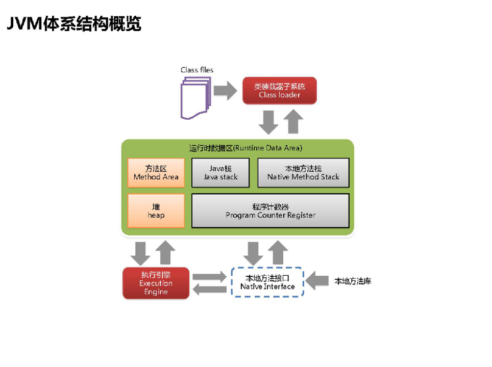
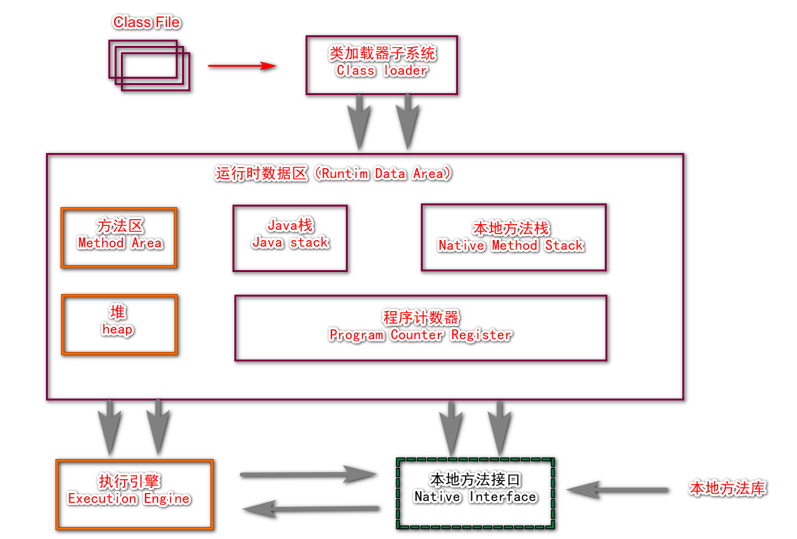
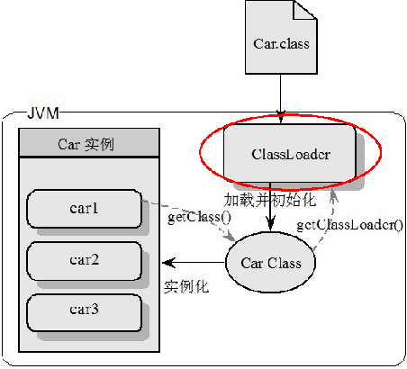
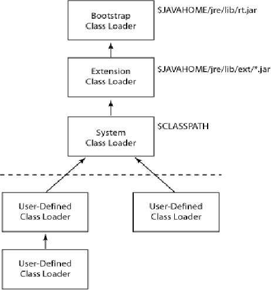

说明：笔记来自：
哔哩哔哩的尚硅谷视频课程：
[2020权威_juc 与 jvm _并发编程_ Java 必学_阳哥- 尚硅谷](https://www.bilibili.com/video/BV1vE411D7KE?p=13)

1.JVM体系结构概述

2.堆体系结构概述

3.堆参数调优入门

4.总结

##  JVM体系结构




## 类装载器ClassLoader

类装载器 ClassLoader 负责加载class文件，**class文件在文件开头有特定的文件标示**，将class文件字节码内容加载到内存中，
并将这些内容转换成方法区中的运行时数据结构并且 **ClassLoader 只负责 class 文件的加载**，
至于它是否可以运行，则由Execution Engine决定 

方法区： 放类的描述信息（模板）的地方。 而不是说放java的方法



car1/car2/car3来自同一个模板 Car Class.

## ClassLoader分类：

- 虚拟机自带的加载器
    启动类加载器（Bootstrap）C++
    扩展类加载器（Extension）Java
    应用程序类加载器（AppClassLoader）Java  也叫系统类加载器，加载当前应用的classpath的所有类

- 用户自定义加载器  继承了抽象类Java.lang.ClassLoader的子类，用户可以定制类的加载方式



        // G:\jdk1.8.0_45\jre\lib\rt.jar\java\lang\
        // 为什么Object，String ArrayList等可以直接使用： 因为 rt.jar被 bootstrap 类加载器在 启动的时候就 加载进了 JVM里面

 javax 开头的 x就是代表 extention java扩展包。

// G:\jdk1.8.0_45\jre\lib\ext\

JVM相关调用的入口程序是：sun.misc.Launcher
```java
package jvm;

/**
 * 打印类加载器
 */
public class ClassLoaderDemo {

    public static void main(String[] args) {
        Object obj = new Object();
        ClassLoader classLoader = obj.getClass().getClassLoader();
        System.out.println(classLoader); //结果为： null 。
        // 因为 BootStrapClassLoader是 C++语言写的，所以打印的是null

        ClassLoaderDemo classLoaderDemo = new ClassLoaderDemo();
        ClassLoader myClassLoader = classLoaderDemo.getClass().getClassLoader();

        System.out.println(myClassLoader);// sun.misc.Launcher$AppClassLoader@14dad5dc

        // G:\jdk1.8.0_45\jre\lib\rt.jar\java\lang\
        // 为什么Object，String ArrayList等可以直接使用： 因为 rt.jar被 bootstrap 类加载器在 启动的时候就 加载进了 JVM里面

        System.out.println("----------------");
        System.out.println(myClassLoader); // sun.misc.Launcher$AppClassLoader@14dad5dc
        System.out.println(myClassLoader.getParent()); //sun.misc.Launcher$ExtClassLoader@4517d9a3
        System.out.println(myClassLoader.getParent().getParent()); // null  因为 BootStrapClassLoader是 C++语言写的，所以打印的是null

        System.out.println("============");
        System.out.println(classLoader);
        // System.out.println(classLoader.getParent()); //盘古开天辟地。 Bootstrap就是盘古，盘古就是祖先，不存在其父辈
        // System.out.println(classLoader.getParent().getParent()); // //盘古开天辟地。 Bootstrap就是盘古，盘古就是祖先，不存在其父辈，更不存在父辈的父辈
    }
}

```

## 什么是：类加载器的双亲委派机制

我爸是李刚，有事找我爹


