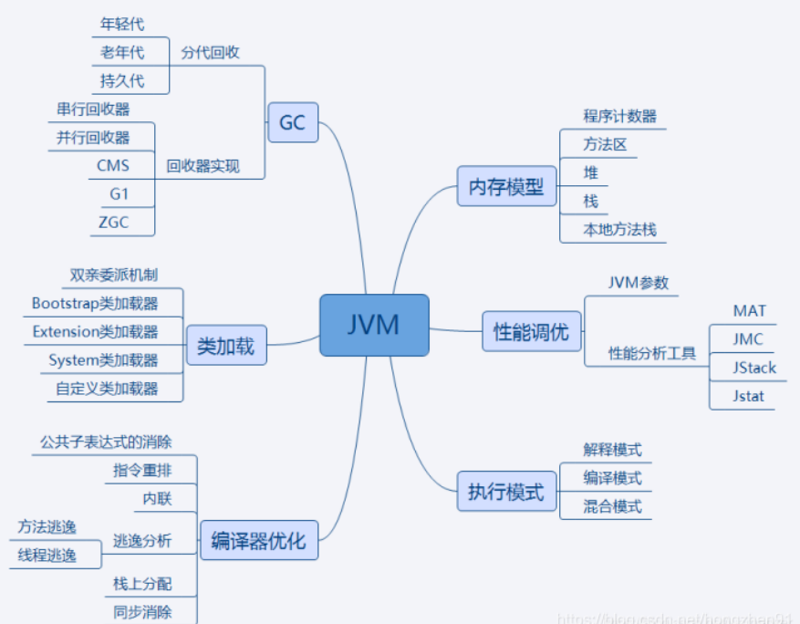

#JVM篇


### 1 、知识点汇总



JVM是Java运行基础,面试时一定会遇到JVM的有关问题,内容相对集中,但对只是深度要求较高.

其中内存模型,类加载机制,GC是重点方面.性能调优部分更偏向应用,重点突出实践能力.编译器优化 和执行模式部分偏向于理论基础,重点掌握知识点.

 需了解 
 - 内存模型各部分作用,保存哪些数据.

 - 类加载双亲委派加载机制,常用加载器分别加载哪种类型的类.

 - GC分代回收的思想和依据以及不同垃圾回收算法的回收思路和适合场景.

 - 性能调优常有JVM优化参数作用,参数调优的依据,常用的JVM分析工具能分析哪些问题以及使用方法.

 - 执行模式解释/编译/混合模式的优缺点,Java7提供的分层编译技术,JIT即时编译技术,OSR栈上替换,C1/C2编译器针对的场景,C2针对的是server模式,优化更激进.新技术方面Java10的graal编译器

 - 编译器优化javac的编译过程,ast抽象语法树,编译器优化和运行器优化.

### 2 、知识点详解：

> **JVM内存模型**线程私有:栈,本地方法栈,程序计数器 线程共享:堆,方法区
线程私有区：
1. **栈**：又称方法栈,线程私有的,线程执行方法是都会创建一个栈阵,用来**存储局部变量表,操作栈,动态链接,方法出口等信息**.调用方法时执行入栈,方法返回时执行出栈.
2. **本地方法栈**：与栈类似,也是用来保存执行方法的信息.执行Java方法是使用栈,执行Native方法时使用本地方法栈.
3. **程序计数器**：**保存着当前线程执行的字节码位置,每个线程工作时都有独立的计数器,只为执行Java方法服务**,执行 `Native` 方法时,程序计数器为空.
线程共享区：
4. **堆**：JVM内存管理最大的一块,堆被线程共享,目的是存放对象的实例,几乎所有的对象实例都会放在这里,当堆没有可用空间时,会抛出OOM异常.
   根据对象的存活周期不同,JVM把对象进行分代管理,由垃圾回收器进行垃圾的回收管理
5. **方法区**： 又称非堆区,用于**存储已被虚拟机加载的类信息,常量,静态变量,即时编译器优化后的代码等数据**.JDK1.7的永久代和JDK1.8的元空间都是方法区的一种实现
   

 JMM内存可见性
 JMM是定义程序中变量的访问规则,线程对于变量的操作只能在自己的工作内存中进行,而不能直接对主内存操作.由于指令重排序,读写的顺序会被打乱,因此JMM需要提供原子性,可见性,有序性保证.

### 3 、说说类加载与卸载 ？ 加载，验证，准备，解析，初始化，使用，卸载**

从类被加载到虚拟机内存中开始，到释放内存总共有7个步骤：

**加载，验证，准备，解析，初始化，使用，卸载**。其中 **验证，准备，解析三个部分统称为连接**

#### 1.加载
通过类的完全限定名,查找此类字节码文件,利用字节码文件创建Class对象.

#### 2 验证，3准备，4.解析。  
2. 验证：**确保加载的类符合 JVM 规范和安全**，保证被校验类的方法在运行时不会做出危害虚拟机的事件，其实就是一个安全检查
3. 准备：为 `static` 变量在方法区中分配内存空间，**设置` 静态变量` 的初始值**，例如 static int a = 3 （注意：准备阶段只设置类中的静态变量（方法区中），不包括实例变量（堆内存中），实例变量是对象初始化时赋值的）
4. 解析：虚拟机**将常量池内的符号引用替换为直接引用的过程**（符号引用比如我现在import java.util.ArrayList这就算符号引用，**直接引用就是指针或者对象地址**，注意引用对象一定是在内存进行）
```
   验证确保Class文件符合当前虚拟机的要求,不会危害到虚拟机自身安全.
   准备进行内存分配,为static修饰的类变量分配内存,并设置初始值(0或null).不包含final修饰的静态变量,因为final变量在编译时分配.
   解析将常量池中的符号引用替换为直接引用的过程.直接引用为直接指向目标的指针或者相对偏移量等.
```
   
#### 5. 初始化
初始化**主要完成静态块执行以及静态变量的赋值**. 先初始化父类,再初始化当前类.只有对类主动使用时才会初始化.

触发条件包括,创建类的实例时,访问类的静态方法或静态变量的时候,使用Class.forName反射类的时候,或者某个子类初始化的时候.

```
   Java自带的加载器加载的类,在虚拟机的生命周期中是不会被卸载的,只有用户自定义的加载器加载的类才可以被卸.
   初始化其实就是执行类构造器方法的`<clinit>()`的过程，而且要保证执行前父类的`<clinit>()`方法执行完毕。这个方法由编译器收集，
   顺序执行所有类变量（static修饰的成员变量）显式初始化和静态代码块中语句。此时准备阶段时的那个 `static int a` 由默认初始化的0变成了显式初始化的3。 由于执行顺序缘故，
   初始化阶段类变量如果在静态代码块中又进行了更改，会覆盖类变量的显式初始化，最终值会为静态代码块中的赋值。
   >注意：字节码文件中初始化方法有两种，非静态资源初始化的`<init>`和静态资源初始化的`<clinit>`，类构造器方法`<clinit>()`不同于类的构造器，这些方法都是字节码文件中只能给JVM识别的特殊方法。
```

#### 7. 卸载
GC将无用对象从内存中卸载

### 类的加载机制
**加载机制-双亲委派模式**

双亲委派模式,即

- 如果一个`类加载器`收到了**类加载请求**，它并不会自己先去加载，而是把这个请求**委托给父类的加载器**去执行；
- 如果父类加载器还存在其父类加载器，则**进一步向上委托，依次递归**，请求最终将到达顶层的启动类加载器；
- 如果父类加载器可以完成类加载任务，就成功返回，**倘若父类加载器无法完成此加载任务，子加载器才会尝试自己去加载**，这就是双亲委派模式。

 优点:
 1. 避免类的重复加载
 2. 避免Java的核心API被篡改

##### 分代回收

分代回收基于两个事实:大部分对象很快就不使用了,还有一部分不会立即无用,但也不会持续很长时间.

 **年轻代-> 标记-复制** **老年代->标记-清除**

 3 、回收算法

a、G1算法

1.9后默认的垃圾回收算法,特点保持高回收率的同时减少停顿.采用每次只清理一部分,而不是清理全部的增量式清理,以保证停顿时间不会过长

其取消了年轻代与老年代的物理划分,但仍属于分代收集器,算法将堆分为若干个逻辑区域(region),一
部分用作年轻代,一部分用作老年代,还有用来存储巨型对象的分区.

同CMS相同,会遍历所有对象,标记引用情况,清除对象后会对区域进行复制移动,以整合碎片空间.

年轻代回收: 并行复制采用复制算法,并行收集,会 StopTheWorld.

老年代回收: 会对年轻代一并回收

初始标记完成堆root对象的标记,会StopTheWorld. 并发标记 GC线程和应用线程并发执行. 最终标记完成三色标记周期,会StopTheWorld. 复制/清楚会优先对可回收空间加大的区域进行回收

b、ZGC算法

前面提供的高效垃圾回收算法,针对大堆内存设计,可以处理TB级别的堆,可以做到10ms以下的回收停顿时间.

 着色指针

 读屏障

 并发处理

```
基于region
内存压缩(整理)
```
roots标记：标记root对象,会StopTheWorld. 并发标记：利用读屏障与应用线程一起运行标记,可能会发生StopTheWorld. 清除会清理标记为不可用的对象. roots重定位：是对存活的对象进行移动,
以腾出大块内存空间,减少碎片产生.重定位最开始会StopTheWorld,却决于重定位集与对象总活动集的比例. 并发重定位与并发标记类似.

### 4 、简述一下JVM的内存模型
答案总结：
JVM的内存模型有类加载子系统、运行时数据区、执行引擎、本地方法接口

JVM定义了不同`运行时数据区`，他们是用来执行应用程序的。某些区域随着JVM启动及销毁，另外一些区域的数据是线程性独立的，随着线程创建和销毁。可以分为两大部分，线程私有区和共享区
**线程私有区有**：
- 程序计数器: **程序计数器会存储当前线程正在执行的Java方法的JVM指令地址,就是将要执行的指令代码 **
- 虚拟机栈（Java栈） ： Java 虚拟机栈是由一个个栈帧组成，而每个栈帧中都拥有：局部变量表、操作数栈、动态链接、方法出口信息。
- 本地方法栈: 用于管理本地方法的调用，native方法

**线程共享区有**：
- 方法区 : 在jdk7及以前，习惯上把方法区，称为永久代。jdk8开始，使用元空间取代了永久代。 方法区用于存储已被虚拟机加载的类型信息、常量、静态变量、即时编译器编译后的代码缓存等
- 堆： 几乎所有的对象实例以及数组都应当在运行时分配在堆上，堆是执行垃圾回收的重点区域

执行引擎（Execution Engine）的任务就是将字节码指令解释/编译为对应平台上的本地机器指令才可以。简单来说，**JVM中的执行引擎充当了将高级语言翻译为机器语言的译者**。
本地接口的作用是融合不同的编程语言为Java所用，它的初衷是融合C/C++程序。

----------以上概括， 以下具体-----------------
1.JVM内存模型简介

JVM定义了不同运行时数据区，他们是用来执行应用程序的。某些区域随着JVM启动及销毁，另外一些区域的数据是线程性独立的，随着线程创建和销毁。jvm内存模型总体架构图如下：


JVM在执行Java程序时，会把它管理的内存划分为若干个的区域，每个区域都有自己的用途和 创建、销毁时间。如下图所示，可以分为两大部分，线程私有区和共享区。

JVM内存模型架构图：


JVM内存分为**线程私有区** （上图白色）和 **线程共享区** （上图橙色）

#### 线程私有区

##### 1.程序计数器: **程序计数器会存储当前线程正在执行的Java方法的JVM指令地址,就是将要执行的指令代码 **
JVM中的程序计数寄存器（Program Counter Register）中，Register的命名源于CPU的寄存器，寄存器存储指令相关的现场信息。CPU只有把数据装载到寄存器才能够运行。
这里，并非是广义上所指的物理寄存器，或许将其翻译为PC计数器（或指令计数器）会更加贴切（也称为程序钩子），并且也不容易引起一些不必要的误会。

JVM中的PC寄存器是对物理PC寄存器的一种抽象模拟。
它是一块很小的内存空间，几乎可以忽略不记。也是运行速度最快的存储区域。

在JVM规范中，每个线程都有它自己的程序计数器，是线程私有的，生命周期与线程的生命周期保持一致。

**任何时间一个线程都只有一个方法在执行，也就是所谓的当前方法**。**程序计数器会存储当前线程正在执行的Java方法的JVM指令地址**；或者，如果是在执行native方法，则是未指定值（undefned）。

它是程序控制流的指示器，分支、循环、跳转、异常处理、线程恢复等基础功能都需要依赖这个计数器来完成。字节码解释器工作时就是通过改变这个计数器的值来选取下一条需要执行的字节码指令。

它是唯一一个在Java虚拟机规范中没有规定任何 outofMemoryError 情况的区域。

###### 作用

PC寄存器用来**存储指向下一条指令的地址**，也即将要执行的指令代码。由执行引擎读取下一条指令。

当同时进行的线程数超过CPU数或其内核数时，就要通过时间片轮询分派CPU的时间资源，不免发生线程切换。这时，每个线程就需要一个属于自己的计数器来记录下一条要运行的指令。
如果执行的是JAVA方法，计数器记录正在执行的java字节码地址，如果执行的是native方法，则计数器为空。

###### PC寄存器为什么被设定为私有的？

我们都知道所谓的多线程在一个特定的时间段内只会执行其中某一个线程的方法，CPU会不停地做任务切换，这样必然导致经常中断或恢复，如何保证分毫无差呢？
为了能够准确地记录各个线程正在执行的当前字节码指令地址，最好的办法自然是为每一个线程都分配一个PC寄存器，这样一来各个线程之间便可以进行独立计算，从而不会出现相互干扰的情况。

由于CPU时间片轮限制，众多线程在并发执行过程中，任何一个确定的时刻，一个处理器或者多核处理器中的一个内核，只会执行某个线程中的一条指令。

这样必然导致经常中断或恢复，如何保证分毫无差呢？每个线程在创建后，都会产生自己的程序计数器和栈帧，程序计数器在各个线程之间互不影响。

##### 2.虚拟机栈（Java栈） VM stack或 java stack： Java 虚拟机栈是由一个个栈帧组成，而每个栈帧中都拥有：局部变量表、操作数栈、动态链接、方法出口信息。

**与程序计数器一样，Java 虚拟机栈也是线程私有的，它的生命周期和线程相同，描述的是 Java 方法执行的内存模型，每次方法调用的数据都是通过栈传递的。**

**Java 内存可以粗糙的区分为堆内存（Heap）和栈内存 (Stack)，其中栈就是现在说的虚拟机栈，或者说是虚拟机栈中局部变量表部分。
** （实际上，**Java 虚拟机栈是由一个个栈帧组成，而每个栈帧中都拥有：局部变量表、操作数栈、动态链接、方法出口信息。**）

**局部变量表主要存放了编译期可知的各种数据类型**（boolean、byte、char、short、int、float、long、double）、**对象引用**（reference 类型，它不同于对象本身，
可能是一个指向对象起始地址的引用指针，也可能是指向一个代表对象的句柄或其他与此对象相关的位置）。

**Java 虚拟机栈会出现两种错误：`StackOverFlowError` 和 `OutOfMemoryError`。**

- **`StackOverFlowError`：** 若 Java 虚拟机栈的内存大小不允许动态扩展，那么当线程请求栈的深度超过当前 Java 虚拟机栈的最大深度的时候，就抛出 StackOverFlowError 错误。
- **`OutOfMemoryError`：** Java 虚拟机栈的内存大小可以动态扩展， 如果虚拟机在动态扩展栈时无法申请到足够的内存空间，则抛出`OutOfMemoryError`异常。


线程私有区，与线程在同一时间创建。管理JAVA方法执行的内存模型。每个方法执行时都会创建一个桢栈来存储方法的的变量表、操作数栈、动态链接方法、返回值、返回地址等信息。栈的大小决
定了方法调用的可达深度（递归多少层次，或嵌套调用多少层其他方法，-Xss参数可以设置虚拟机栈大小）。栈的大小可以是固定的，或者是动态扩展的。如果请求的栈深度大于最大可用深度，则
抛出stackOverflowError；如果栈是可动态扩展的，但没有内存空间支持扩展，则抛出 OutofMemoryError。 使用jclasslib工具可以查看class类文件的结构。下图为栈帧结构图：


##### 3.本地方法栈: 用于管理本地方法的调用

与虚拟机栈作用相似。但它不是为Java方法服务的，而是本地方法（C语言）。由于规范对这块没有强制要求，不同虚拟机实现方法不同。

Java虚拟机栈于管理Java方法的调用，而**本地方法栈用于管理本地方法的调用**。本地方法栈也是线程私有的。

允许被实现成固定或者是可动态扩展的内存大小。（在内存溢出方面是相同的）

- 如果线程请求分配的栈容量超过本地方法栈允许的最大容量，Java虚拟机将会抛出一个stackoverflowError 异常。
- 如果本地方法栈可以动态扩展，并且在尝试扩展的时候无法申请到足够的内存，或者在创建新的线程时没有足够的内存去创建对应的本地方法栈，那么Java虚拟机将会抛出一个outofMemoryError异常。

本地方法是使用C语言实现的。

它的具体做法是Native Method Stack中登记native方法，在Execution Engine 执行时加载本地方法库。

当某个线程调用一个本地方法时，它就进入了一个全新的并且不再受虚拟机限制的世界。它和虚拟机拥有同样的权限。
- 本地方法可以通过本地方法接口来访问虚拟机内部的运行时数据区。
- 它甚至可以直接使用本地处理器中的寄存器
- 直接从本地内存的堆中分配任意数量的内存。

并不是所有的JVM都支持本地方法。因为Java虚拟机规范并没有明确要求本地方法栈的使用语言、具体实现方式、数据结构等。如果JVM产品不打算支持native方法，也可以无需实现本地方法栈。
在Hotspot JVM中，直接将本地方法栈和虚拟机栈合二为一。

#### 线程共享区

##### 1.方法区 : 在jdk7及以前，习惯上把方法区，称为永久代。jdk8开始，使用元空间取代了永久代。 方法区用于存储已被虚拟机加载的类型信息、常量、静态变量、即时编译器编译后的代码缓存等

《深入理解Java虚拟机》书中对方法区（Method Area）存储内容描述如下：**方法区用于存储已被虚拟机加载的类型信息、常量、静态变量、即时编译器编译后的代码缓存等**。

在jdk7及以前，习惯上把方法区，称为永久代。jdk8开始，使用元空间取代了永久代。

- JDK 1.8后，元空间存放在堆外内存中

- 元空间的本质和永久代类似，都是对JVM规范中方法区的实现。不过元空间与永久代最大的区别在于：元空间不在虚拟机设置的内存中，而是使用本地内存永久代、元空间二者并不只是名字变了，内部结构也调整了

  
- 
根据《Java虚拟机规范》的规定，如果方法区无法满足新的内存分配需求时，将抛出OOM异常

##### 2.堆： 几乎所有的对象实例以及数组都应当在运行时分配在堆上，堆是执行垃圾回收的重点区域
《Java虚拟机规范》中对Java堆的描述是：所有的对象实例以及数组都应当在运行时分配在堆上。（The heap is the run-time data area from which memory for all class instances and arrays is allocated）

我要说的是：“几乎”所有的对象实例都在这里分配内存。—从实际使用角度看的。

- 因为还**有一些对象是在栈上分配的**

数组和对象可能永远不会存储在栈上，因为栈帧中保存引用，这个引用指向对象或者数组在堆中的位置。

在方法结束后，堆中的对象不会马上被移除，仅仅在垃圾收集的时候才会被移除。

- 也就是触发了GC的时候，才会进行回收
- 如果堆中对象马上被回收，那么用户线程就会收到影响，因为有stop the word

堆，是GC（Garbage Collection，垃圾收集器）执行垃圾回收的重点区域。


### 5 、说说堆和栈的区别

 栈是运行时单位，代表着逻辑，内含基本数据类型和堆中对象引用，所在区域连续，没有碎片；
 **Java 虚拟机栈是由一个个栈帧组成，而每个栈帧中都拥有：局部变量表、操作数栈、动态链接、方法出口信息。**
 堆是存储单位，代表着数据，可被多个栈共享（包括成员中基本数据类型、引用和引用对象）**，
 所在区域不连续，会有碎片**。几乎所有的对象实例以及数组都应当在运行时分配在堆上

- 栈解决程序的运行问题，即程序如何执行，或者说如何处理数据。
- 堆解决的是数据存储的问题，即数据怎么放，放哪里

 ##### 1. 功能不同
**栈内存用来存储局部变量和方法调用**，而堆内存用来存储Java中的对象。无论是成员变量，局部变量，
还是类变量，它们指向的对象都存储在堆内存中。

#####  2. 共享性不同
栈内存是线程私有的。 堆内存是所有线程共有的。

##### 3. 异常错误不同
如果栈内存或者堆内存不足都会抛出异常。 栈空间不足：java.lang.StackOverFlowError。 堆空间不足：java.lang.OutOfMemoryError。

##### 4. 空间大小
栈的空间大小远远小于堆的。

栈也叫栈内存，是Java程序的运行区，是在线程创建时创建，它的生命期是跟随线程的生命期，线程结束栈内存也就释放，**对于栈来说不存在垃圾回收问题，只要线程一结束，该栈就 Over**

### 6、什么时候会触发 FullGC ?

**Minor GC触发条件：当Eden区满时，触发 `Minor GC `。**

**Full GC触发条件**：

1. 调用 `System.gc()` 时，系统建议执行Full GC，但是不必然执行
2. 老年代空间不足
3. 方法区空间不足（jdk1.7及以前的永久代空间不足）
4. 通过Minor GC 后进入老年代的平均大小 大于 `老年代的可用内存`
5. 由 `Eden` 区、`From Space` 区 向 `To Space` 区复制时，对象大小大于 `To Space` 可用内存，则把该对象转存到老年代，且老年代的可用内存小于该对象大小

[什么时候会触发 FullGC](https://blog.csdn.net/YHYR_YCY/article/details/52566105)

Minor GC/Young GC
**指发生在新生代的垃圾收集动作**,因为Java对象大多都具备朝生暮死的特性,所以 Minor GC非常频繁,一般回收速度也比較快。
新生代非常适合复制算法，新建 Java 对象优先放到 Eden 区，当 Eden 区的空间耗尽时， Java 虚拟机便会触发一次 Minor GC，来收集新生代的垃圾。
Eden 区和 from 指向的 Survivor 区中的存活对象会被复制到 to 指向的 Survivor 区中，然后交换 from 和 to 指针，以保证下一次 Minor GC 时，to 指向的 Survivor 区还是空的。

Major GC/Old GC
**指目标只是老年代的垃圾收集**。目前只有 CMS 垃圾收集器会有单独的收集老年代的行为。

在不同的资料上，Major GC和 Full GC存在混淆情况，本文采取《深入理解Java虚拟机：JVM高级特性与最佳实践第3版》的说法。

Full GC
**一般指整个 Java 堆和方法区的垃圾回收。**
出现了 Full GC，一般会伴随至少一次的Minor GC。 Full GC 的速度一般会比 Minor GC 慢10倍以上。

同时最糟糕的是 Full GC 为了枚举 GC Roots 不得不 stop the world（STW）。
JVM 目前来说最大的缺点一方面是占用内存较多，另一方面就是这个 STW 了。
目前越来越多的大数据框架比如 Spark,Flink 等都是使用直接内存避免用 JVM 管理内存。
————————————————
版权声明：本文为CSDN博主「Shockang」的原创文章，遵循CC 4.0 BY-SA版权协议，转载请附上原文出处链接及本声明。

[Minor GC和Full GC有什么区别？](https://blog.csdn.net/Shockang/article/details/116905502)

除直接调用System.gc外，触发Full GC执行的情况有如下四种。 
1. 旧生代空间不足 旧生代空间只有在新生代对象转入及创建为大对象、大数组时才会出现不足的现象，当执行Full GC后空间仍然不足，则抛出如下错误：
  java.lang.OutOfMemoryError: Java heap space 
   
  为避免以上两种状况引起的FullGC，调优时应尽量做到让对象在Minor GC阶段被回收、让对象在新生代多存活一段时间及不要创建过大的对象及数组。

3. Permanet Generation空间满 PermanetGeneration中存放的为一些class的信息等，当系统中要加载的类、反射的类和调用的方法较多时，
   Permanet Generation可能会被占满，在未配置为采用CMS GC的情况下会执行Full GC。如果经过Full GC仍然回收不了，
   那么JVM会抛出如下错误信息： java.lang.OutOfMemoryError: PermGen space 为避免Perm Gen占满造成Full GC现象，可采用的方法为增大Perm Gen空间或转为使用CMS GC。


3. CMS GC时出现promotion failed和concurrent mode failure 对于采用CMS进行旧生代GC的 程序而言，尤其要注意GC日志中是否有promotion failed和concurrent mode failure两种状况，
  当这两种状况出现时可能会触发Full GC。 promotionfailed是在进行Minor GC时，survivor space放不下、对象只能放入旧生代，而此时旧生代也放不下造成的；concurrent mode failure是在执行
   CMS GC的过程中同时有对象要放入旧生代，而此时旧生代空间不足造成的。 应对措施为：增大 survivorspace、旧生代空间或调低触发并发GC的比率，但在JDK 5.0+、6.0+的版本中有可能会由
   于JDK的bug29导致CMS在remark完毕后很久才触发sweeping动作。对于这种状况，可通过设置 - XX:CMSMaxAbortablePrecleanTime=5（单位为ms）来避免。

4. 统计得到的Minor GC晋升到旧生代的平均大小大于旧生代的剩余空间 这是一个较为复杂的触发情况，Hotspot为了避免由于新生代对象晋升到旧生代导致旧生代空间不足的现象，在进行Minor
   GC时，做了一个判断，如果之前统计所得到的Minor GC晋升到旧生代的平均大小大于旧生代的剩余空间，那么就直接触发Full GC。 例如程序第一次触发MinorGC后，有6MB的对象晋升到旧生
   代，那么当下一次Minor GC发生时，首先检查旧生代的剩余空间是否大于6MB，如果小于6MB， 则执行Full GC。 当新生代采用PSGC时，方式稍有不同，PS GC是在Minor GC后也会检查，例如上
   面的例子中第一次Minor GC后，PS GC会检查此时旧生代的剩余空间是否大于6MB，如小于，则触发对旧生代的回收。 除了以上 4 种状况外，对于使用RMI来进行RPC或管理的Sun JDK应用而言，默
   认情况下会一小时执行一次Full GC。可通过在启动时通过- java -Dsun.rmi.dgc.client.gcInterval=3600000来设置Full GC执行的间隔时间或通过-XX:+DisableExplicitGC来禁止RMI调用System.gc。

### 7 、什么是Java虚拟机？为什么Java被称作是“平台无关的编程语言”？

Java虚拟机是一个`可以执行Java字节码的虚拟机进程`。Java源文件被编译成能被Java虚拟机执行的字节码文件。 Java被设计成允许应用程序可以运行在任意的平台，
而不需要程序员为每一个平台单独重写或者是重新编译。Java虚拟机让这个变为可能，因为它知道底层硬件平台的指令长度和其他特性。

### 8 、Java内存结构

Java内存结构可以分为线程共享区和线程私有区
`方法区`和 `堆` 是所有线程共享的内存区域；而`java栈`、`本地方法栈`和`程序员计数器`是运行是线程私有的内存区域。

- Java堆（Heap）,是Java虚拟机所管理的内存中最大的一块。Java堆是被所有线程共享的一块内存区域，在虚拟机启动时创建。此内存区域的唯一目的就是存放对象实例，几乎所有的对象实例都在这里分配内存。
- 方法区（Method Area）,方法区（Method Area）与Java堆一样，是各个线程共享的内存区域，它用于存储已被虚拟机加载的类信息、常量、静态变量、即时编译器编译后的代码等数据。

- 程序计数器（Program Counter Register）,程序计数器（Program Counter Register）是一块较小的内存空间，它的作用可以看做是当前线程所执行的字节码的行号指示器。
- JVM栈（JVM Stacks）,与程序计数器一样，Java虚拟机栈（Java Virtual Machine Stacks）也是线程私有的，它的生命周期与线程相同。 
  虚拟机栈描述的是Java方法执行的内存模型：每个方法被执行的时候都会同时创建一个栈帧（Stack Frame）用于存储局部变量表、操作栈、动态链接、方法出口等信息。
  每一个方法被调用直至执行完成的过程，就对应着一个栈帧在虚拟机栈中从入栈到出栈的过程。
- 本地方法栈（Native Method Stacks）,本地方法栈（Native Method Stacks）与虚拟机栈所发挥的作用是非常相似的，其区别不过是虚拟机栈为虚拟机执行Java方法（也就是字节码）服务，而本地方法栈则是为虚拟机使用到的Native方法服务。

JVM定义了不同`运行时数据区`，他们是用来执行应用程序的。某些区域随着JVM启动及销毁，另外一些区域的数据是线程性独立的，随着线程创建和销毁。可以分为两大部分，线程私有区和共享区
**线程私有区有**：

- 程序计数器: **程序计数器会存储当前线程正在执行的Java方法的JVM指令地址,就是将要执行的指令代码 **
- 虚拟机栈（Java栈） ： Java 虚拟机栈是由一个个栈帧组成，而每个栈帧中都拥有：局部变量表、操作数栈、动态链接、方法出口信息。
- 本地方法栈: 用于管理本地方法的调用，native方法

**线程共享区有**：
- 方法区 : 在jdk7及以前，习惯上把方法区，称为永久代。jdk8开始，使用元空间取代了永久代。 方法区用于存储已被虚拟机加载的类型信息、常量、静态变量、即时编译器编译后的代码缓存等
- 堆： 几乎所有的对象实例以及数组都应当在运行时分配在堆上，堆是执行垃圾回收的重点区域

### 9 、说说对象分配规则

对象优先分配在 `Eden` 区，如果Eden区没有足够的空间时，虚拟机执行一次 `Minor GC`。大对象直接进入老年代（大对象是指需要大量连续内存空间的对象）。
这样做的目的是避免在Eden区和两个Survivor区之间发生大量的
内存拷贝（新生代采用复制算法收集内存）。 长期存活的对象进入老年代。虚拟机为每个对象定义了一个年龄计数器，如果对象经过了 1 次 Minor GC那么对象会进入Survivor区，
之后每经过一次Minor GC那么对象的年龄加 1 ，
直到达到阀值对象进入老年区。

动态判断对象的年龄。如果Survivor区中相同年龄的所有对象大小的总和大于Survivor空间的一半，年龄大于或等于该年龄的对象可以直接进入老年代。空间分配担保。每次进行Minor GC时，
JVM会计算Survivor区移至老年区的对象的平均大小，如果这个值大于老年区的剩余值大小则进行一次Full GC，如果小于检查 HandlePromotionFailure 设置，
如果true则只进行 `Minor GC`,如果false则进行` Full GC`。

### 10 、描述一下JVM加载class文件的原理机制？ 7个步骤和双亲委派模型叙述

JVM中类的装载是由类加载器（ClassLoader）和它的子类来实现的，Java中的类加载器是一个重要的Java运行时系统组件，它负责在运行时查找和装入类文件中的类。 

由于Java的跨平台性，经过编译的Java源程序并不是一个可执行程序，而是一个或多个类文件。当Java程序需要使用某个类时， JVM会确保这个类已经被加载、连接（验证、准备和解析）和初始化。

类的加载是指把类的.class文件中的数据读入到内存中，通常是创建一个字节数组读入.class文件，然后产生与所加载类对应的Class对象。
加载完成后，Class对象还不完整，所以此时的类还不可用。当类被加载后就进入连接阶段，这一阶段包括验证、准备（为静态变量分配内存并设置默认的初始值）和解析（将符号引用替换为直接引用）三个步骤。
最后JVM对类进行初始化，包括：
1)如果类存在直接的父类并且这个类还没有被初始化，那么就先初始化父类；
2)如果类中存在初始化语句，就依次执行这些初始化语句。 类的加载是由类加载器完成的，类加载器包括：根加载器（BootStrap）、扩展加载器（Extension）、系统加载器（System）和用户自定义类加载器（java.lang.ClassLoader的子
类）。从Java 2（JDK 1.2）开始，类加载过程采取了父亲委托机制（PDM）。PDM更好的保证了 Java平台的安全性，在该机制中，JVM自带的Bootstrap是根加载器，其他的加载器都有且仅有一个父类加载器。
类的加载首先请求父类加载器加载，父类加载器无能为力时才由其子类加载器自行加载。JVM不会向Java程序提供对Bootstrap的引用。下面是关于几个类加载器的说明：

Bootstrap：一般用本地代码实现，负责加载JVM基础核心类库（rt.jar）；
Extension：从java.ext.dirs系统属性所指定的目录中加载类库，它的父加载器是Bootstrap；
System：又叫应用类加载器，其父类是Extension。它是应用最广泛的类加载器。它从环境变量classpath或者系统属性java.class.path所指定的目录中记载类，是用户自定义加载器的默认父加载器。

### 11 、说说Java对象创建过程

1. JVM遇到一条新建对象的指令时首先去检查这个指令的参数是否能在常量池中定义到一个类的符号引用。然后加载这个类（类加载过程在后边讲）
2. 为对象分配内存。一种办法“指针碰撞”、一种办法“空闲列表”，最终常用的办法“本地线程缓冲分配(TLAB)”
3. 将除对象头外的对象内存空间初始化为 0
4. 对对象头进行必要设置

### 12 、知道类的生命周期吗？(回答类的加载过程)

 类的生命周期包括这几个部分，加载、连接、初始化、使用和卸载，其中前三部是类的加载的过程,

 如下图；

 

1. 加载，查找并加载类的二进制数据，在Java堆中也创建一个java.lang.Class类的对象
2. 验证，文件格式、元数据、字节码、符号引用验证；
3. 准备，为类的静态变量分配内存，并将其初始化为默认值；
4. 解析，把类中的符号引用转换为直接引用
   连接，连接又包含三块内容：验证、准备、初始化
5. 初始化，为类的静态变量赋予正确的初始值,执行构造方法
6. 使用，new出对象程序中使用
7. 卸载，执行垃圾回收

从类被加载到虚拟机内存中开始，到释放内存总共有7个步骤：

**加载，验证，准备，解析，初始化，使用，卸载**。其中 **验证，准备，解析三个部分统称为连接**

#### 1.加载
通过类的完全限定名,查找此类字节码文件,利用字节码文件创建Class对象.

#### 2 验证，3准备，4.解析。
2. 验证：**确保加载的类符合 JVM 规范和安全**，保证被校验类的方法在运行时不会做出危害虚拟机的事件，其实就是一个安全检查
3. 准备：为 `static` 变量在方法区中分配内存空间，**设置` 静态变量` 的初始值**，例如 static int a = 3 （注意：准备阶段只设置类中的静态变量（方法区中），不包括实例变量（堆内存中），实例变量是对象初始化时赋值的）
4. 解析：虚拟机**将常量池内的符号引用替换为直接引用的过程**（符号引用比如我现在import java.util.ArrayList这就算符号引用，**直接引用就是指针或者对象地址**，注意引用对象一定是在内存进行）

#### 5. 初始化：**主要完成静态块执行以及静态变量的赋值**. 先初始化父类,再初始化当前类.只有对类主动使用时才会初始化.
     触发条件包括,创建类的实例时,访问类的静态方法或静态变量的时候,使用Class.forName反射类的时候,或者某个子类初始化的时候.
#### 7. 卸载：GC将无用对象从内存中卸载


### 13 、简述Java的对象结构

Java对象由三个部分组成：**对象头、实例数据、对齐填充**。


 对象头由两部分组成，第一部分存储对象自身的运行时数据：哈希码、GC分代年龄、锁标识状态、

线程持有的锁、偏向线程ID（一般占32/64 bit）。第二部分是指针类型，指向对象的类元数据类型（即对象代表哪个类）。如果是数组对象，则对象头中还有一部分用来记录数组长度。

实例数据用来存储对象真正的有效信息（包括父类继承下来的和自己定义的）

对齐填充：JVM要求对象起始地址必须是 8 字节的整数倍（ 8 字节对齐）

### 14 、如何判断对象可以被回收？

 判断对象是否存活一般有两种方式：

- 引用计数：**每个对象有一个引用计数属性**，新增一个引用时计数加 1 ，引用释放时计数减 1 ，计数为 0 时可以回收。此方法简单，无法解决对象相互循环引用的问题。
- **可达性分析（Reachability Analysis）：从GC Roots开始向下搜索，搜索所走过的路径称为引用链。当一个对象到GC Roots没有任何引用链相连时，则证明此对象是不可用的，不可达对象**。

[具体参考](/学习记录/JVM/1_内存与垃圾回收篇/15_垃圾回收相关算法/垃圾回收相关算法.md)

### 15 、JVM的永久代中会发生垃圾回收么？

垃圾回收不会发生在永久代，如果永久代满了或者是超过了临界值，会触发完全垃圾回收(Full GC)。如果你仔细查看垃圾收集器的输出信息，就会发现永久代也是被回收的。
这就是为什么正确的永久代大小对避免Full GC是非常重要的原因。请参考下Java8：
从永久代到元数据区 (注：Java8 中已经移除了永久代，新加了一个叫做元数据区的native内存区)

### 16 、你知道哪些垃圾收集算法

 GC最基础的算法有三种： `标记-清除算法`、`复制算法`、`标记-压缩算法`，我们常用的垃圾回收器一般都采用分代收集算法。

- **标记-清除算法**，“标记-清除”（Mark-Sweep）算法，如它的名字一样，算法分为“标记”和“清除”两个阶段：首先标记出所有需要回收的对象，在标记完成后统一回收掉所有被标记的对象。

- **复制算法**，“复制”（Copying）的收集算法，它将可用内存按容量划分为大小相等的两块，每次只使用其中的一块。当这一块的内存用完了，就将还存活着的对象复制到另外一块上面，然后再把已使用过的内存空间一次清理掉。
  
- **标记-压缩算法**，标记过程仍然与“标记-清除”算法一样，但后续步骤不是直接对可回收对象进行清理，而是让所有存活的对象都向一端移动，然后直接清理掉端边界以外的内存

- 分代收集算法，“分代收集”（Generational Collection）算法，把Java堆分为新生代和老年代，这样就可以根据各个年代的特点采用最适当的收集算法。

### 17 、调优命令有哪些？

Sun JDK监控和故障处理命令有jps jstat jmap jhat jstack jinfo

- jps，JVM Process Status Tool,显示指定系统内所有的HotSpot虚拟机进程。
- jstat，JVM statistics Monitoring是用于监视虚拟机运行时状态信息的命令，
   它可以显示出虚拟机进程中的类装载、内存、垃圾收集、JIT编译等运行数据。
- jmap，JVM Memory Map命令用于生成heap dump文件
- jhat，JVM Heap Analysis Tool命令是与jmap搭配使用，用来分析jmap生成的dump，
  jhat内置了一个微型的HTTP/HTML服务器，生成dump的分析结果后，可以在浏览器中查看
- jstack，用于生成java虚拟机当前时刻的线程快照。
- jinfo，JVM Configuration info 这个命令作用是实时查看和调整虚拟机运行参数。

### 18 、常见调优工具有哪些

常用调优工具分为两类,jdk自带监控工具：jconsole和jvisualvm，第三方有：MAT(Memory Analyzer Tool)、GChisto。

- jconsole，Java Monitoring and Management Console是从java5开始，在JDK中自带的java监控和管理控制台，用于对JVM中内存，线程和类等的监控

- jvisualvm，jdk自带全能工具，可以分析内存快照、线程快照；监控内存变化、GC变化等。

- MAT，Memory Analyzer Tool，一个基于Eclipse的内存分析工具，是一个快速、功能丰富的

- Java heap分析工具，它可以帮助我们查找内存泄漏和减少内存消耗

- GChisto，一款专业分析gc日志的工具

### 19 、Minor GC与Full GC分别在什么时候发生？

 新生代内存不够用时候发生MGC也叫YGC，JVM内存不够的时候发生FGC

### 20 、你知道哪些JVM性能调优参数？（简单版回答）

 设定堆内存大小

-Xmx：堆内存最大限制。

设定新生代大小。 新生代不宜太小，否则会有大量对象涌入老年代
-XX:NewSize：新生代大小

-XX:NewRatio 新生代和老生代占比

-XX:SurvivorRatio：伊甸园空间和幸存者空间的占比

设定垃圾回收器 年轻代用 -XX:+UseParNewGC 年老代用-XX:+UseConcMarkSweepGC

### 21 、 对象一定分配在堆中吗？有没有了解逃逸分析技术？

不一定，JVM通过 `逃逸分析`，那些逃不出方法的对象会在栈上分配。


> 什么是逃逸分析？

逃逸分析(Escape Analysis)，是一种可以有效减少Java 程序中同步负载和内存堆分配压力的跨函数全局数据流分析算法。通过逃逸分析，Java Hotspot编译器能够
分析出一个新的对象的引用的使用范围，从而决定是否要将这个对象分配到堆上。

逃逸分析是指分析指针动态范围的方法，它同编译器优化原理的指针分析和外形分析相关联。当变量（或者对象）在方法中分配后，其指针有可能被返回或者被全局引用，
这样就会被其他方法或者线程所引用，这种现象称作指针（或者引用）的逃逸(Escape)。通俗点讲，如果一个对象的指针被多个方法或者线程引用时，那么我们就称这个对象的指针发生了逃逸。

> 逃逸分析的好处

栈上分配，可以降低垃圾收集器运行的频率。
同步消除，如果发现某个对象只能从一个线程可访问，那么在这个对象上的操作可以不需要同
步。
标量替换，把对象分解成一个个基本类型，并且内存分配不再是分配在堆上，而是分配在栈
上。这样的好处有，一、减少内存使用，因为不用生成对象头。二、程序内存回收效率高，并
且GC频率也会减少。

### 22 、虚拟机为什么使用元空间替换了永久代？

##### 什么是元空间？什么是永久代？为什么用元空间代替永久代？」 我们先回顾一下「方法区」吧,看看虚拟机运行时数据内存图，如下:

 方法区 是各个线程共享的内存区域，它用于存储已被虚拟机加载的类信息、常量、静态变量、即时编译后的代码等数据。

 

##### 什么是永久代？它和方法区有什么关系呢？

如果在HotSpot虚拟机上开发、部署，很多程序员都把方法区称作永久代。可以说方法区是规范，永久代是Hotspot针对该规范进行的实现。
在Java7及以前的版本，方法区都是永久代实现的。

##### 什么是元空间？它和方法区有什么关系呢？

对于Java8，HotSpots取消了永久代，取而代之的是元空间(Metaspace)。换句话说，就是方
法区还是在的，只是实现变了，从永久代变为元空间了。

##### 为什么使用元空间替换了永久代？

永久代的方法区，和堆使用的物理内存是连续的。

 `永久代` 是通过以下这两个参数配置大小的~

-XX:PremSize：设置永久代的初始大小
-XX:MaxPermSize: 设置永久代的最大值，默认是64M

对于「永久代」，如果动态生成很多class的话，就很可能出现「java.lang.OutOfMemoryError:PermGen space错误」，因为永久代空间配置有限嘛。最典型的场景是，
在web开发比较多jsp页面的时候。

**JDK8之后，方法区存在于元空间(Metaspace)。物理内存不再与堆连续，而是直接存在于本地内存中，理论上`机器内存有多大，元空间就有多大` 。**

可以通过以下的参数来设置元空间的大小：

-XX:MetaspaceSize，初始空间大小，达到该值就会触发垃圾收集进行类型卸载，同时GC会对该值进行调整：如果释放了大量的空间，就适当降低该值；如果释放了很少的空间，
                  那么在不超过MaxMetaspaceSize时，适当提高该值。
-XX:MaxMetaspaceSize，最大空间，默认是没有限制的。
-XX:MinMetaspaceFreeRatio，在GC之后，最小的Metaspace剩余空间容量的百分比，减少为分配空间所导致的垃圾收集
-XX:MaxMetaspaceFreeRatio，在GC之后，最大的Metaspace剩余空间容量的百分比，减少为释放空间所导致的垃圾收集

##### 所以，为什么使用元空间替换永久代？

表面上看是为了避免OOM异常。因为通常使用PermSize和MaxPermSize设置永久代的大小就决定了永久代的上限，但是不是总能知道应该设置为多大合适, 
如果使用默认值很容易遇到OOM错误。当使用元空间时，可以加载多少类的元数据就不再由MaxPermSize控制, 而由系统的实际可用空间来控制啦。

### 23 、什么是Stop The World? 什么是OopMap？什么是安全点？

进行垃圾回收的过程中，会涉及对象的移动。为了保证对象引用更新的正确性，必须暂停所有的用户线程，像这样的停顿，虚拟机设计者形象描述为「Stop The World」。也简称为STW。

在HotSpot中，有个数据结构（映射表）称为「OopMap」。一旦类加载动作完成的时候，HotSpot就会把对象内什么偏移量上是什么类型的数据计算出来，记录到OopMap。
在即时编译过程中，也会在「特定的位置」生成 OopMap，记录下栈上和寄存器里哪些位置是引用。

这些特定的位置主要在：

   1.循环的末尾（非 counted 循环）
   2.方法临返回前 / 调用方法的call指令后
   3.可能抛异常的位置

这些位置就叫作 `安全点(safepoint)`。 用户程序执行时并非在代码指令流的任意位置都能够在停顿下来开始垃圾收集，而是必须是执行到安全点才能够暂停。

### 24 、说一下JVM 的主要组成部分及其作用？


 JVM包含两个子系统和两个组件，分别为

- Class loader(类装载子系统)
- Execution engine(执行引擎子系统)；
- Runtime data area(运行时数据区组件)
- Native Interface(本地接口组件)。
- Class loader(类装载)：根据给定的全限定名类名(如：java.lang.Object)来装载class文件到运行时数据区的方法区中。

- Execution engine（执行引擎）」：执行class的指令。
- Native Interface(本地接口)：」 与native lib交互，是其它编程语言交互的接口。
- Runtime data area(运行时数据区域)」：即我们常说的JVM的内存。

首先通过编译器把 Java源代码转换成字节码，Class loader(类装载)再把字节码加载到内存中，将其放在运行时数据区的方法区内，而字节码文件只是 JVM 的一套指令集规范，
并不能直接交给底层操作系统去执行，因此需要特定的命令解析器执行引擎（Execution Engine），将字节码翻译成底层系统指令，再交由 CPU 去执行，
而这个过程中需要调用其他语言的本地库接口（Native Interface）来实现整个程序的功能。

### 25 、什么是指针碰撞？ 

> 一种Java虚拟机开始为新生对象分配内存分配方式

一般情况下，JVM的对象都放在堆内存中（发生逃逸分析除外）。当类加载检查通过后，Java虚拟机开始为新生对象分配内存。如果Java堆中内存是绝对规整的，
所有被使用过的的内存都被放到一边，空闲的内存放到另外一边，中间放着一个指针作为分界点的指示器，
所分配内存仅仅是把那个指针向空闲空间方向挪动一段与对象大小相等的实例，这种分配方式就是 指针碰撞。


### 26 ，什么是空闲列表？

如果Java堆内存中的内存并不是规整的，已被使用的内存和空闲的内存相互交错在一起，不可以进行指针碰撞啦，虚拟机必须维护一个列表，记录哪些内存是可用的，
在分配的时候从列表找到一块大的空间分配给对象实例，并更新列表上的记录，这种分配方式就是空闲列表。

### 27 ，什么是TLAB？

可以把内存分配的动作按照线程划分在不同的空间之中进行，每个线程在Java堆中预先分配一小块内存,这就是TLAB（**Thread Local Allocation Buffer**，本地线程分配缓存） 。
虚拟机通过 `-XX:UseTLAB` 设定它的。

### 28 、(Hotspot虚拟机中，对象在内存中布局) `对象头`具体都包含哪些内容？

在我们常用的Hotspot虚拟机中，对象在内存中布局实际包含 3 个部分：

1. 对象头
2. 实例数据
3. 对齐填充

而对象头包含两部分内容，Mark Word中的内容会随着锁标志位而发生变化，所以只说存储结构就好了。

  1. 对象自身运行时所需的数据，也被称为Mark Word，也就是用于轻量级锁和偏向锁的关键点。
     具体的内容包含对象的hashcode、分代年龄、轻量级锁指针、重量级锁指针、GC标记、偏向锁线程ID、偏向锁时间戳。
  2. 存储类型指针，也就是指向类的元数据的指针，通过这个指针才能确定对象是属于哪个类的实例。

如果是数组的话，则还包含了数组的长度。

### 29 、你知道哪些JVM调优参数？

##### 堆栈内存相关

```
-Xms 设置初始堆的大小
-Xmx 设置最大堆的大小
-Xmn 设置年轻代大小，相当于同时配置-XX:NewSize和-XX:MaxNewSize为一样的值
-Xss 每个线程的堆栈大小
-XX:NewSize 设置年轻代大小(for 1.3/1.4)
-XX:MaxNewSize 年轻代最大值(for 1.3/1.4)
-XX:NewRatio 年轻代与年老代的比值(除去持久代)
-XX:SurvivorRatio Eden区与Survivor区的的比值
-XX:PretenureSizeThreshold 当创建的对象超过指定大小时，直接把对象分配在老年代。
-XX:MaxTenuringThreshold设定对象在Survivor复制的最大年龄阈值，超过阈值转移到老年代
```

##### 垃圾收集器相关

```
-XX:+UseParallelGC：选择垃圾收集器为并行收集器。
-XX:ParallelGCThreads=20：配置并行收集器的线程数
-XX:+UseConcMarkSweepGC：设置年老代为并发收集。
-XX:CMSFullGCsBeforeCompaction=5 由于并发收集器不对内存空间进行压缩、整理，
所以运行一段时间以后会产生“碎片”，使得运行效率降低。此值设置运行 5 次GC以后对内
存空间进行压缩、整理。
-XX:+UseCMSCompactAtFullCollection：打开对年老代的压缩。可能会影响性能，但是
可以消除碎片
```
##### 辅助信息相关

```
-XX:+PrintGCDetails 打印GC详细信息
-XX:+HeapDumpOnOutOfMemoryError让JVM在发生内存溢出的时候自动生成内存快照,
排查问题用
-XX:+DisableExplicitGC禁止系统System.gc()，防止手动误触发FGC造成问题.
-XX:+PrintTLAB 查看TLAB空间的使用情况
```
### 30 、说一下 JVM 有哪些垃圾回收器？


 如果说垃圾收集算法是内存回收的方法论，那么垃圾收集器就是内存回收的具体实现。下图展示了7 种作用于不同分代的收集器，
 其中用于回收新生代的收集器包括Serial、PraNew、Parallel Scavenge，回收老年代的收集器包括Serial Old、Parallel Old、CMS，还有用于回收整个Java堆的
G1收集器。不同收集器之间的连线表示它们可以搭配使用。


- Serial收集器（复制算法): 新生代单线程收集器，标记和清理都是单线程，优点是简单高效；
- ParNew收集器 (复制算法): 新生代收并行集器，实际上是Serial收集器的多线程版本，在多核CPU环境下有着比Serial更好的表现；
- Parallel Scavenge收集器 (复制算法): 新生代并行收集器，追求高吞吐量，高效利用 CPU。吞吐量 = 用户线程时间/(用户线程时间+GC线程时间)，高吞吐量可以高效率的利用CPU时间,
  尽快完成程序的运算任务，适合后台应用等对交互相应要求不高的场景；
- Serial Old收集器 (标记-整理算法): 老年代单线程收集器，Serial收集器的老年代版本；
- Parallel Old收集器 (标记-整理算法)： 老年代并行收集器，吞吐量优先，Parallel Scavenge收集器的老年代版本；
- CMS(Concurrent Mark Sweep)收集器（标记-清除算法）： 老年代并行收集器，以获取最短回收停顿时间为目标的收集器，具有高并发、低停顿的特点，追求最短GC回收停顿时间。
- G1(Garbage First)收集器 (标记-整理算法)： Java堆并行收集器，G1收集器是JDK1.7提供的一个新收集器，G1收集器基于“标记-整理”算法实现，也就是说不会产生内存碎片。此外，G1收
  集器不同于之前的收集器的一个重要特点是：G1回收的范围是整个Java堆(包括新生代，老年代)，而前六种收集器回收的范围仅限于新生代或老年代。
- ZGC（Z Garbage Collector）是一款由Oracle公司研发的，以低延迟为首要目标的一款垃圾收集器。它是基于动态Region内存布局，（暂时）不设年龄分代，使用了读屏障、染色指针和
  内存多重映射等技术来实现可并发的标记-整理算法的收集器。在JDK 11新加入，还在实验阶段，主要特点是：回收TB级内存（最大4T），停顿时间不超过10ms。优点：低停顿，高吞吐量，
  ZGC收集过程中额外耗费的内存小。缺点：浮动垃圾目前使用的非常少，真正普及还是需要写时间的。
  
- 新生代收集器：Serial、ParNew、Parallel Scavenge

老年代收集器：CMS、Serial Old、Parallel Old

整堆收集器：G1，ZGC(因为不涉年代不在图中)。

### 31 、如何选择垃圾收集器？

 1. 如果你的堆大小不是很大（比如 100MB），选择串行收集器一般是效率最高的。
参数：-XX:+UseSerialGC。
 2. 如果你的应用运行在单核的机器上，或者你的虚拟机核数只有单核，选择串行收集器依然是合适的，这时候启用一些并行收集器没有任何收益。
参数：-XX:+UseSerialGC。
 3. 如果你的应用是“吞吐量”优先的，并且对较长时间的停顿没有什么特别的要求。选择并行收集器是比较好的。
参数：-XX:+UseParallelGC。
 4. 如果你的应用对响应时间要求较高，想要较少的停顿。甚至 1 秒的停顿都会引起大量的请求失败，那么选择G1、ZGC、CMS都是合理的。虽然这些收集器的 GC 停顿通常都比较短，但它需要一些额外的资源去处理这些工作，通常吞吐量会低一些。

 参数：
- XX:+UseConcMarkSweepGC、
- XX:+UseG1GC、
- XX:+UseZGC 等。

从上面这些出发点来看，我们平常的 Web 服务器，都是对响应性要求非常高的。选择性其实就集中在 CMS、G1、ZGC上。而对于某些定时任务，使用并行收集器，是一个比较好的选择。

### 32 、 什么是类加载器？

类加载器是一个用来加载类文件的类。Java 源代码通过 javac 编译器编译成类 文件。然后 JVM 来执
行类文件中的字节码来执行程序。类加载器负责加载文件 系统、网络或其他来源的类文件。

### 33 、什么是 tomcat 类加载机制？

在 tomcat 中类的加载稍有不同，如下图：

当 tomcat启动时，会创建几种类加载器： Bootstrap 引导类加载器 加载 JVM启动所需的类，以及标准扩展类（位于jre/lib/ext 下） System 系统类加载器 加载 tomcat 启动的类，
比如 bootstrap.jar，通常在 catalina.bat 或者 catalina.sh中指定。位于CATALINA_HOME/bin下。

Common 通用类加载器


### 34. JVM调优
#### 你说你做过JVM调优和参数配置，请问如何盘点查看JVM系统默认值

使用jps和jinfo进行查看

#### jinfo -flag InitialHeapSize 进程号 查看进程的初始化的堆大小
jps -l 查看进程号
jinfo -flag InitialHeapSize 进程号

#### 查看JVM标配参数的命令： java -XX:+PrintCommandLineFlags -version

打印出JVM的默认的简单初始化参数

#### jinfo -flag MaxHeapSize 进程号 查看进程最大堆大小
jps -l 查看进程号
jinfo -flag MaxHeapSize 进程号

java -XX:+PrintFlagsInitial/PrintFlagsFinal

#### 两个经典参数：-Xms  和 -Xmx，这两个参数 如何解释

这两个参数，还是属于XX参数，因为取了别名

- -Xms  等价于 -XX:InitialHeapSize  ：初始化堆内存（默认只会用最大物理内存的64分1）
- -Xmx 等价于 -XX:MaxHeapSize    ：最大堆内存（默认只会用最大物理内存的4分1）


Full GC大部分发生在养老区

Java堆 从GC的角度还可以细分为：新生代（新生代包括Eden区/From Survivor区/To Survivor区。 内存比例为8:1:1）和 老年代
新生代 占在Java堆的空间的 1/3 老年代占Java堆的空间的 2/3
