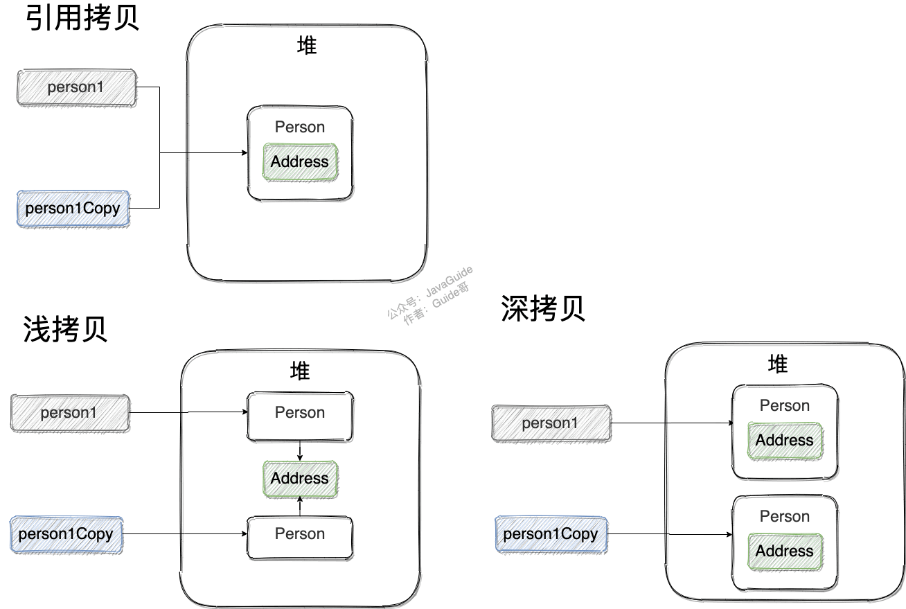

## 基础篇
### i++和 ++i 有什么区别？ i++ 是原子操作么

i++ 先赋值在运算
++i 先运算在赋值

在 i = 1 的时候 执行 int a = i++; 打印 a的值为1
在 i = 1 的时候 执行 int b = ++i; 打印 b的值为2

```java
/**
 * @see 
 */
```
### 1 、 Java语言有哪些特点

1. 简单易学、有丰富的类库
2. 面向对象（Java最重要的特性，让程序耦合度更低，内聚性更高）
3. 与平台无关性（JVM是Java跨平台使用的根本）
4. 可靠安全
5. 支持多线程

### 2 、面向对象和面向过程的区别

面向过程：是**分析解决问题的步骤，然后用函数把这些步骤一步一步地实现，然后在使用的时候一一调用则可**。性能较高，所以单片机、嵌入式开发等一般采用面向过程开发

面向对象：是把**构成问题的事物分解成各个对象**，而建立对象的目的也不是为了完成一个个步骤，而是为了描述某个事物在解决整个问题的过程中所发生的行为。

面向对象有封装、继承、多态的特性，所以易维护、易复用、易扩展。可以设计出低耦合的系统。 但是性能上来说，比面向过程要低。

两者的主要区别在于解决问题的方式不同：

- 面向过程把解决问题的过程拆成一个个方法，通过一个个方法的执行解决问题。
- 面向对象会先抽象出对象，然后用对象执行方法的方式解决问题。

另外，面向对象开发的程序一般更易维护、易复用、易扩展。

### 3 、八种基本数据类型的大小，以及他们的封装类
Java 中有 8 种基本数据类型，分别为：

1. 6 种数字类型：
    - 4 种整数型：`byte`、`short`、`int`、`long`
    - 2 种浮点型：`float`、`double`
2. 1 种字符类型：`char`
3. 1 种布尔型：`boolean`。

这八种基本类型都有对应的包装类分别为：`Byte`、`Short`、`Integer`、`Long`、`Float`、`Double`、`Character`、`Boolean` 。

包装类型不赋值就是 `Null` ，而基本类型有默认值且不是 `Null`。

另外，这个问题建议还可以先从 JVM 层面来分析。

基本数据类型直接存放在 **Java 虚拟机栈**中的 `局部变量表` 中，而包装类型属于对象类型，我们知道对象实例都存在于堆中。**相比于对象类型， 基本数据类型占用的空间非常小**。


### 4 、标识符的命名规则。

标识符的含义： 是指在**程序中，我们自己定义的内容**，譬如，类的名字，方法名称以及变量名称等等，都是标识符。

命名规则：（硬性要求） 标识符可以包含英文字母，0-9的数字，$以及_ 标识符不能以数字开头 标识符不是关键字

命名规范：（非硬性要求） 类名规范：首字符大写，后面每个单词首字母大写（大驼峰式）。 

变量名规范：首字母小写，后面每个单词首字母大写（小驼峰式）。 方法名规范：同变量名。

### 5 、instanceof 关键字的作用

`instanceof` 是**Java中的一个双目运算符，用来测试一个对象是否为一个类的实例**，
用法为：
```
boolean result = obj instanceof Class
```
其中 obj 为一个对象，Class 表示一个类或者一个接口，当 obj 为 Class 的对象，或者是其直接或间接子类，或者是其接口的实现类，结果result 都返回 true，否则返回false。

注意：编译器会检查 obj 是否能转换成右边的class类型，如果不能转换则直接报错，如果不能确定类型，则通过编译，具体看运行时定。


### 6 、Java自动装箱与拆箱

装箱就是自动将基本数据类型转换为包装器类型（int-->Integer）；调用方法：Integer的valueOf(int) 方法

拆箱就是自动将包装器类型转换为基本数据类型（Integer-->int）。调用方法：Integer的 intValue方法

在Java SE5之前，如果要生成一个数值为 10 的Integer对象，必须这样进行：

而在从Java SE5开始就提供了自动装箱的特性，如果要生成一个数值为 10 的Integer对象，只需要
这样就可以了：


### 7 、 重载和重写的区别

| 区别点     | 重载方法 | 重写方法                                                         |
| :--------- | :------- | :--------------------------------------------------------------- |
| 发生范围   | 同一个类 | 子类                                                             |
| 参数列表   | 必须修改 | 一定不能修改                                                     |
| 返回类型   | 可修改   | 子类方法返回值类型应比父类方法返回值类型更小或相等               |
| 异常       | 可修改   | 子类方法声明抛出的异常类应比父类方法声明抛出的异常类更小或相等； |
| 访问修饰符 | 可修改   | 一定不能做更严格的限制（可以降低限制）                           |
| 发生阶段   | 编译期   | 运行期                                                           |


- 重载就是 **同一个类中多个同名方法根据不同的传参来执行不同的逻辑处理。**
- 重写就是 当子类继承自父类的相同方法，**子类对父类方法的重新改造**，外部样子不能改变，内部逻辑可以改变

**重载**

发生在同一个类中（或者父类和子类之间），方法名必须相同，参数类型不同、个数不同、顺序不同，方法返回值和访问修饰符可以不同。

《Java 核心技术》这本书是这样介绍重载的：

 如果多个方法(比如 `StringBuilder` 的构造方法)有相同的名字、不同的参数， 便产生了重载。

 ```
 StringBuilder sb = new StringBuilder();
 StringBuilder sb2 = new StringBuilder("HelloWorld");
```

 编译器必须挑选出具体执行哪个方法，它通过用各个方法给出的参数类型与特定方法调用所使用的值类型进行匹配来挑选出相应的方法。 如果编译器找不到匹配的参数， 就会产生编译时错误， 因为根本不存在匹配， 
 或者没有一个比其他的更好(这个过程被称为重载解析(overloading resolution))。

 Java 允许重载任何方法， 而不只是构造器方法。

综上：重载就是同一个类中多个同名方法根据不同的传参来执行不同的逻辑处理。

**重写**

重写发生在运行期，是子类对父类的允许访问的方法的实现过程进行重新编写。

1. 方法名、参数列表必须相同，子类方法返回值类型应比父类方法返回值类型更小或相等，抛出的异常范围小于等于父类，访问修饰符范围大于等于父类。
2. 如果父类方法访问修饰符为 `private/final/static` 则子类就不能重写该方法，但是被 `static` 修饰的方法能够被再次声明。
3. 构造方法无法被重写

综上：**重写就是子类对父类方法的重新改造，外部样子不能改变，内部逻辑可以改变。**


**方法的重写要遵循“两同两小一大”**（以下内容摘录自《疯狂 Java 讲义》，[issue#892](https://github.com/Snailclimb/JavaGuide/issues/892) ）：

- “两同”即方法名相同、形参列表相同；
- “两小”指的是子类方法返回值类型应比父类方法返回值类型更小或相等，子类方法声明抛出的异常类应比父类方法声明抛出的异常类更小或相等；
- “一大”指的是子类方法的访问权限应比父类方法的访问权限更大或相等。

⭐️ 关于 **重写的返回值类型** 这里需要额外多说明一下，上面的表述不太清晰准确：如果方法的返回类型是 void 和基本数据类型，则返回值重写时不可修改。但是如果方法的返回值是引用类型，重写时是可以返回该引用类型的子类的。

```java
public class Hero {
    public String name() {
        return "超级英雄";
    }
}
public class SuperMan extends Hero{
    @Override
    public String name() {
        return "超人";
    }
    public Hero hero() {
        return new Hero();
    }
}

public class SuperSuperMan extends SuperMan {
    public String name() {
        return "超级超级英雄";
    }

    @Override
    public SuperMan hero() {
        return new SuperMan();
    }
}
```


重写 总结： 
1. 发生在父类与子类之间 
2. 方法名，参数列表，返回类型（除过子类中方法的返回类型是父类中返回类型的子类）必须相同 
3. 访问修饰符的限制一定要大于被重写方法的访问修饰符 （public>protected>default>private) 
4. 重写方法一定不能抛出新的检查异常或者比被重写方法申明更加宽泛的检查型异常

重载（Overload）

在一个类中，同名的方法如果有不同的参数列表（参数类型不同、参数个数不同甚至是参数顺序不
同）则视为重载。同时，重载对返回类型没有要求，可以相同也可以不同，但不能通过返回类型是
否相同来判断重载。

重载 总结： 
1. 重载Overload是一个类中多态性的一种表现 
2. 重载要求同名方法的参数列表不同(参数类型，参数个数甚至是参数顺序) 
3. 重载的时候，返回值类型可以相同也可以不相同。无法以返回 型别作为重载函数的区分标准

### 8 、 equals与==的区别

**`==`** 对于基本类型和引用类型的作用效果是不同的：

- 对于基本数据类型来说，`==` 比较的是值。
- 对于引用数据类型来说，`==` 比较的是对象的内存地址。

`equals()` 方法存在两种使用情况：

- **类没有重写 `equals()`方法** ：通过`equals()`比较该类的两个对象时，等价于通过 `==` 比较这两个对象，使用的默认是 `Object`类`equals()`方法。
- **类重写了 `equals()`方法** ：一般我们都重写 `equals()`方法来比较两个对象中的属性是否相等；若它们的属性相等，则返回 true(即，认为这两个对象相等)。

------------------------------------------------------------------------------------------------------------------------------------------------

> 因为 Java 只有值传递，所以，对于 == 来说，不管是比较基本数据类型，还是引用数据类型的变量，其本质比较的都是值，只是引用类型变量存的值是对象的地址。

**`equals()`** 不能用于判断基本数据类型的变量，只能用来判断两个对象是否相等。`equals()`方法存在于`Object`类中，而`Object`类是所有类的直接或间接父类，因此所有的类都有`equals()`方法。

`Object` 类 `equals()` 方法：

```java
public boolean equals(Object obj) {
     return (this == obj);
}
```

`equals()` 方法存在两种使用情况：

- **类没有重写 `equals()`方法** ：通过`equals()`比较该类的两个对象时，等价于通过“==”比较这两个对象，使用的默认是 `Object`类`equals()`方法。
- **类重写了 `equals()`方法** ：一般我们都重写 `equals()`方法来比较两个对象中的属性是否相等；若它们的属性相等，则返回 true(即，认为这两个对象相等)。

举个例子（这里只是为了举例。实际上，你按照下面这种写法的话，像 IDEA 这种比较智能的 IDE 都会提示你将 `==` 换成 `equals()` ）：

```java
String a = new String("ab"); // a 为一个引用
String b = new String("ab"); // b为另一个引用,对象的内容一样
String aa = "ab"; // 放在常量池中
String bb = "ab"; // 从常量池中查找
System.out.println(aa == bb);// true
System.out.println(a == b);// false
System.out.println(a.equals(b));// true
System.out.println(42 == 42.0);// true
```

`String` 中的 `equals` 方法是被重写过的，因为 `Object` 的 `equals` 方法是比较的对象的内存地址，而 `String` 的 `equals` 方法比较的是对象的值。

当创建 `String` 类型的对象时，虚拟机会在常量池中查找有没有已经存在的值和要创建的值相同的对象，如果有就把它赋给当前引用。如果没有就在常量池中重新创建一个 `String` 对象。

`String`类`equals()`方法：

```java
public boolean equals(Object anObject) {
    if (this == anObject) {
        return true;
    }
    if (anObject instanceof String) {
        String anotherString = (String)anObject;
        int n = value.length;
        if (n == anotherString.value.length) {
            char v1[] = value;
            char v2[] = anotherString.value;
            int i = 0;
            while (n-- != 0) {
                if (v1[i] != v2[i])
                    return false;
                i++;
            }
            return true;
        }
    }
    return false;
}
```


### 9 、 Hashcode 的作用

#### hashCode() 有什么用？

`hashCode()` 的作用是**获取哈希码（`int` 整数），也称为散列码。这个哈希码的作用是确定该对象在哈希表中的索引位置。**

`hashCode()`定义在 JDK 的 `Object` 类中，这就意味着 Java 中的任何类都包含有 `hashCode()` 函数。 `Object` 的 `hashCode()` 方法是本地方法，也就是用 C 语言或 C++ 实现的，
该方法通常用来将对象的内存地址转换为整数之后返回。

```java
public native int hashCode();
```

散列表存储的是键值对(key-value)，它的特点是：**能根据“键”快速的检索出对应的“值”。这其中就利用到了散列码！（可以快速找到所需要的对象）**

#### 为什么要有 hashCode？

我们以“`HashSet` 如何检查重复”为例子来说明为什么要有 `hashCode`？

下面这段内容摘自我的 Java 启蒙书《Head First Java》:

> 当你把对象加入 `HashSet` 时，`HashSet` 会先计算对象的 `hashCode` 值来判断对象加入的位置，同时也会与其他已经加入的对象的 `hashCode` 值作比较，如果没有相符的 `hashCode`，`HashSet` 会假设对象没有重复出现。但是如果发现有相同 `hashCode` 值的对象，这时会调用 `equals()` 方法来检查 `hashCode` 相等的对象是否真的相同。如果两者相同，`HashSet` 就不会让其加入操作成功。如果不同的话，就会重新散列到其他位置。这样我们就大大减少了 `equals` 的次数，相应就大大提高了执行速度。

其实， `hashCode()` 和 `equals()`都是用于比较两个对象是否相等。

**那为什么 JDK 还要同时提供这两个方法呢？**

这是因为在一些容器（比如 `HashMap`、`HashSet`）中，有了 `hashCode()` 之后，判断元素是否在对应容器中的效率会更高（参考添加元素进`HastSet`的过程）！

我们在前面也提到了添加元素进`HastSet`的过程，如果 `HashSet` 在对比的时候，同样的 `hashCode` 有多个对象，它会继续使用 `equals()` 来判断是否真的相同。也就是说 `hashCode` 帮助我们大大缩小了查找成本。

**那为什么不只提供 `hashCode()` 方法呢？**

这是因为两个对象的`hashCode` 值相等并不代表两个对象就相等。

**那为什么两个对象有相同的 `hashCode` 值，它们也不一定是相等的？**

因为 `hashCode()` 所使用的哈希算法也许刚好会让多个对象传回相同的哈希值。越糟糕的哈希算法越容易碰撞，但这也与数据值域分布的特性有关（所谓哈希碰撞也就是指的是不同的对象得到相同的 `hashCode` )。

总结下来就是 ：

- 如果两个对象的`hashCode` 值相等，那这两个对象不一定相等（哈希碰撞）。
- 如果两个对象的`hashCode` 值相等并且`equals()`方法也返回 `true`，我们才认为这两个对象相等。
- 如果两个对象的`hashCode` 值不相等，我们就可以直接认为这两个对象不相等。

相信大家看了我前面对 `hashCode()` 和 `equals()` 的介绍之后，下面这个问题已经难不倒你们了。

java的集合有两类，一类是List，还有一类是Set。前者有序可重复，后者无序不重复。当我们在set 中插入的时候怎么判断是否已经存在该元素呢，可以通过equals方法。但是如果元素太多，
用这样的方法就会比较慢。

于是出现了哈希算法来提高集合中查找元素的效率。 这种方式将集合分成若干个存储区域，每个对象可以计算出一个哈希码，可以将哈希码分组，每组分别对应某个存储区域，根据一个对象的哈希码就可以确定该对象应该存储的那个区域。

hashCode方法可以这样理解：它返回的就是根据对象的内存地址换算出的一个值。这样一来，当集合要添加新的元素时，先调用这个元素的 `hashCode` 方法，就一下子能定位到它应该放置的物理位置上。
如果这个位置上没有元素，它就可以直接存储在这个位置上，不用再进行任何比较了；如果这个位置上已经有元素了，就调用它的equals方法与新元素进行比较，相同的话就不存了，不相同就散列其它的地址。
这样一来实际调用equals方法的次数就大大降低了，几乎只需要一两次。

### 10 、String、String StringBuffer 和 StringBuilder 的区别是什么?

String是只读字符串，它并不是基本数据类型，而是一个对象。从底层源码来看是一个final类型的字符数组，所引用的字符串不能被改变，一经定义，无法再增删改。
每次对String的操作都会生成新的String对象。

每次+操作 ： 隐式在堆上new了一个跟原字符串相同的StringBuilder对象，再调用append方法 拼接+后面的字符。

`StringBuffer` 和 `StringBuilder` 他们两都继承了AbstractStringBuilder抽象类，从 `AbstractStringBuilder` 抽象类中我们可以看到

他们的底层都是可变的字符数组，所以在进行频繁的字符串操作时，建议使用 `StringBuffer` 和 `StringBuilder` 来进行操作。 另外StringBuffer 对方法加了同步锁或者对调用的方法加了同步锁，所
以是线程安全的。StringBuilder 并没有对方法进行加同步锁，所以是非线程安全的。

### 11 、`ArrayList` 和 `LinkedList` 的区别

1. **是否保证线程安全：** `ArrayList` 和 `LinkedList` 都是不同步的，也就是不保证线程安全；
2. **底层数据结构：** `Arraylist` 底层使用的是 **`Object` 数组**；
`LinkedList` 底层使用的是 **双向链表** 数据结构（JDK1.6 之前为循环链表，JDK1.7 取消了循环。
3. **插入和删除是否受元素位置的影响：** ① **`ArrayList` 采用数组存储，
所以插入和删除元素的时间复杂度受元素位置的影响。** 比如：执行`add(E e)`方法的时候，
`ArrayList` 会默认在将指定的元素追加到此列表的末尾，这种情况时间复杂度就是 O(1)。
但是如果要在指定位置 i 插入和删除元素的话（`add(int index, E element)`）时间复杂度就为 O(n-i)。
因为在进行上述操作的时候集合中第 i 和第 i 个元素之后的(n-i)个元素都要执行向后位/向前移一位的操作。 
② **`LinkedList` 采用链表存储，所以对于`add(E e)`方法的插入，删除元素时间复杂度不受元素位置的影响，近似 O(1)，如果是要在指定位置`i`插入和删除元素的话（`(add(int index, E element)`） 时间复杂度近似为`o(n))`因为需要先移动到指定位置再插入。**
4. **是否支持快速随机访问：** `LinkedList` 不支持高效的随机元素访问，而 `ArrayList` 支持。
快速随机访问就是通过元素的序号快速获取元素对象(对应于`get(int index)`方法)。
5. **内存空间占用：** `ArrayList` 的空 间浪费主要体现在在 list 列表的结尾会预留一定的容量空间，
而 `LinkedList` 的空间花费则体现在它的每一个元素都需要消耗比 `ArrayList` 更多的空间
（因为要存放直接后继和直接前驱以及数据）。


Array（数组）是基于索引(index)的数据结构，它使用索引在数组中搜索和读取数据是很快的。

Array获取数据的时间复杂度是O(1),但是要删除数据却是开销很大，因为这需要重排数组中的所有数据,
(因为删除数据以后, 需要把后面所有的数据前移)

缺点: 数组初始化必须指定初始化的长度, 否则报错

ArrayList底层的实现是Array, 数组扩容实现

LinkList是一个双链表,在添加和删除元素时具有比ArrayList更好的性能.
但在get与set方面弱于 ArrayList.当然,这些对比都是指数据量很大或者操作很频繁。


例如:

List—是一个有序的集合，可以包含重复的元素，提供了按索引访问的方式，它继承Collection。

List有两个重要的实现类：ArrayList和LinkedList

ArrayList: 可以看作是能够自动增长容量的数组

ArrayList的toArray方法返回一个数组

ArrayList的asList方法返回一个列表

```
private final char value[];
```
```
/**
* The value is used for character storage.
*/
char[] value;
```
```
int[] a = new int[ 4 ];//推介使用int[] 这种方式初始化
```
```
int c[] = { 23 , 43 , 56 , 78 };//长度： 4 ，索引范围：[0,3]
```

ArrayList底层的实现是Array, 数组扩容实现

LinkList是一个双链表,在添加和删除元素时具有比ArrayList更好的性能.但在get与set方面弱于
ArrayList.当然,这些对比都是指数据量很大或者操作很频繁。

### 12 .HashMap 和 Hashtable 的区别

1. **线程是否安全：** `HashMap` 是非线程安全的，`Hashtable` 是线程安全的,因为 `Hashtable` 内部的方法基本都经过`synchronized` 修饰。（如果你要保证线程安全的话,更推荐使用 `ConcurrentHashMap` ）；
2. **效率：** 因为线程安全的问题，`HashMap` 要比 `Hashtable` 效率高一点。另外，`Hashtable` 基本被淘汰，不要在代码中使用它；
3. **对 Null key 和 Null value 的支持：** `HashMap` 可以存储 null 的 key 和 value，但 null 作为键只能有一个，null 作为值可以有多个；Hashtable 不允许有 null 键和 null 值，否则会抛出 `NullPointerException`。
4. **初始容量大小和每次扩充容量大小的不同 ：** ① 创建时如果不指定容量初始值，`Hashtable` 默认的初始大小为 11，之后每次扩充，容量变为原来的 2n+1。`HashMap` 默认的初始化大小为 16。之后每次扩充，容量变为原来的 2 倍。② 创建时如果给定了容量初始值，那么 Hashtable 会直接使用你给定的大小，而 `HashMap` 会将其扩充为 2 的幂次方大小（`HashMap` 中的`tableSizeFor()`方法保证，下面给出了源代码）。也就是说 `HashMap` 总是使用 2 的幂作为哈希表的大小,后面会介绍到为什么是 2 的幂次方。
5. **底层数据结构：** JDK1.8 以后的 `HashMap` 在解决哈希冲突时有了较大的变化，当链表长度大于阈值（默认为 8）（将链表转换成红黑树前会判断，如果当前数组的长度小于 64，那么会选择先进行数组扩容，而不是转换为红黑树）时，将链表转化为红黑树，以减少搜索时间。Hashtable 没有这样的机制。


### 13 、 Collection包结构，与 Collections 的区别

Collection是集合类的上级接口，子接口有 Set、List、LinkedList、ArrayList、Vector、Stack、Set；


Collections是集合类的一个帮助类， 它包含有各种有关集合操作的静态多态方法，用于实现对各种集合的搜索、排序、线程安全化等操作。此类不能实例化，就像一个工具类，服务于Java的Collection框架。

### 14 、 Java的四种引用，强弱软虚

引用类型主要分为强软弱虚四种：

- 强引用 :java中绝大部分都是强引用，就算报OOM，GC时也不回收
- 软引用 SoftReference：为了降低OOM发生概率。GC时，内存够就不回收，内存不够就回收
- 弱引用 WeakReference：只要发生GC就回收
- 虚引用：如果一个对象持有虚引用，那么它就和没有任何引用一样，在任何时候都可能被垃圾回收器回收，它不能单独使用也不能通过它访问对象，虚引用必须和引用队列 ReferenceQueue 联合使用

### 15 、 泛型常用特点

泛型是Java SE 1.5之后的特性， 《Java 核心技术》中对泛型的定义是： “泛型” 意味着编写的代码可以被不同类型的对象所重用。
“泛型”，顾名思义，“泛指的类型”。我们提供了泛指的概念，但具体执行的时候却可以有具体的规则
来约束，比如我们用的非常多的ArrayList就是个泛型类，ArrayList作为集合可以存放各种元素，如
Integer, String，自定义的各种类型等，但在我们使用的时候通过具体的规则来约束，如我们可以约
束集合中只存放Integer类型的元素，如

使用泛型的好处？

以集合来举例，使用泛型的好处是我们不必因为添加元素类型的不同而定义不同类型的集合，如整

型集合类，浮点型集合类，字符串集合类，我们可以定义一个集合来存放整型、浮点型，字符串型

数据，而这并不是最重要的，因为我们只要把底层存储设置了Object即可，添加的数据全部都可向
上转型为Object。 更重要的是我们可以通过规则按照自己的想法控制存储的数据类型。

### 16 、Java创建对象有几种方式？
四种：
- new创建新对象
- 通过反射机制
- 采用clone机制
- 通过序列化机制


### 17 、有没有可能两个不相等的对象有相同的hashcode

有可能.在产生hash冲突时,两个不相等的对象就会有相同的 hashcode 值.当hash冲突产生时,一般有以下几种方式来处理:

拉链法:每个哈希表节点都有一个next指针,多个哈希表节点可以用next指针构成一个单向链
表，被分配到同一个索引上的多个节点可以用这个单向链表进行存储.
开放定址法:一旦发生了冲突,就去寻找下一个空的散列地址,只要散列表足够大,空的散列地址总
能找到,并将记录存入
```
List<Integer> iniData = new ArrayList<>()
```

再哈希:又叫双哈希法,有多个不同的Hash函数.当发生冲突时,使用第二个,第三个....等哈希函数计算地址,直到无冲突.
### 18 、深拷贝和浅拷贝的区别是什么?

浅拷贝:被复制对象的所有变量都含有与原来的对象相同的值,而所有的对其他对象的引用仍然指

向原来的对象.换言之,浅拷贝仅仅复制所考虑的对象,而不复制它所引用的对象.

深拷贝:被复制对象的所有变量都含有与原来的对象相同的值.而那些引用其他对象的变量将指向

被复制过的新对象.而不再是原有的那些被引用的对象.换言之.深拷贝把要复制的对象所引用的

对象都复制了一遍.

### 19 、final有哪些用法?

final也是很多面试喜欢问的地方,但我觉得这个问题很无聊,通常能回答下以下 5 点就不错了:

被final修饰的类不可以被继承
被final修饰的方法不可以被重写
被final修饰的变量不可以被改变.如果修饰引用,那么表示引用不可变,引用指向的内容可变.
被final修饰的方法,JVM会尝试将其内联,以提高运行效率
被final修饰的常量,在编译阶段会存入常量池中.
除此之外,编译器对final域要遵守的两个重排序规则更好:

在构造函数内对一个final域的写入,与随后把这个被构造对象的引用赋值给一个引用变量,这两个操作之间不能重排序 初次读一个包含final域的对象的引用,与随后初次读这个final域,这两个操作之间不能重排序.

### 20 、static 都有哪些用法?
**`static` 关键字主要有以下四种使用场景：**

1. **修饰成员变量和成员方法:** 被 static 修饰的成员属于类，不属于单个这个类的某个对象，被类中所有对象共享，可以并且建议通过类名调用。被 static 声明的成员变量属于静态成员变量，静态变量 存放在 Java 内存区域的方法区。
  调用格式：`类名.静态变量名` `类名.静态方法名()`
2. **静态代码块:** 静态代码块定义在类中方法外, 静态代码块在非静态代码块之前执行(静态代码块—>非静态代码块—>构造方法)。 该类不管创建多少对象，静态代码块只执行一次.
3. **静态内部类（static 修饰类的话只能修饰内部类）：** 静态内部类与非静态内部类之间存在一个最大的区别: 非静态内部类在编译完成之后会隐含地保存着一个引用，该引用是指向创建它的外围类，
  但是静态内部类却没有。没有这个引用就意味着：1. 它的创建是不需要依赖外围类的创建。2. 它不能使用任何外围类的非 static 成员变量和方法。
4. **静态导包(用来导入类中的静态资源，1.5 之后的新特性):** 格式为：`import static` 这两个关键字连用可以指定导入某个类中的指定静态资源，并且不需要使用类名调用类中静态成员，可以直接使用类中静态成员变量和成员方法。


### 21 、3*0.1==0.3返回值是什么

false,因为有些浮点数不能完全精确的表示出来.

### 22 、a=a+b与a+=b有什么区别吗?

`+= `操作符会进行隐式自动类型转换,此处a+=b隐式的将加操作的结果类型强制转换为持有结果的类型,而a=a+b则不会自动进行类型转换.如：

以下代码是否有错,有的话怎么改？

有错误.short类型在进行运算时会自动提升为int类型,也就是说s1+1的运算结果是int类型,而s1是
short类型,此时编译器会报错.

正确写法：

+=操作符会对右边的表达式结果强转匹配左边的数据类型,所以没错.

### 23 、try catch finally，try里有return，finally还执行么？

执行，并且finally的执行早于try 里面的 return

结论：

1. 不管有木有出现异常，finally块中代码都会执行；
2. 当try和catch中有return时，finally仍然会执行；
3. finally是在return后面的表达式运算后执行的（此时并没有返回运算后的值，而是先把要返回的值保存起来，管finally中的代码怎么样，返回的值都不会改变，任然是之前保存的值），
  所以函数返回值是在finally执行前确定的；
4. finally 中最好不要包含 return，否则程序会提前退出，返回值不是try或catch中保存的返回值。

### 24 、 Excption与 Error 包结构


在 Java 中，所有的异常都有一个共同的祖先 `java.lang` 包中的 `Throwable` 类。`Throwable` 类有两个重要的子类:

- **`Exception`** :程序本身可以处理的异常，可以通过 `catch` 来进行捕获。`Exception` 又可以分为 Checked Exception (受检查异常，必须处理) 和 Unchecked Exception (不受检查异常，可以不处理)。
- **`Error`** ：`Error` 属于程序无法处理的错误 ，我们没办法通过 `catch` 来进行捕获 。例如Java 虚拟机运行错误（`Virtual MachineError`）、虚拟机内存不够错误(`OutOfMemoryError`)、类定义错误（`NoClassDefFoundError`）等 。这些异常发生时，Java 虚拟机（JVM）一般会选择线程终止。

### Checked Exception 和 Unchecked Exception 有什么区别？

**Checked Exception** 即受检查异常，Java 代码在编译过程中，如果受检查异常没有被 捕获或抛出 （`catch` 或 `throw`) 处理的话，就没办法通过编译 。

除了`RuntimeException`及其子类以外，其他的`Exception`类及其子类都属于受检查异常 。常见的受检查异常有： IO 相关的异常、`ClassNotFoundException` 、`SQLException`...。

**Unchecked Exception** 即 **不受检查异常** ，Java 代码在编译过程中 ，我们即使不处理不受检查异常也可以正常通过编译。

`RuntimeException` 及其子类都统称为非受检查异常，例如：`NullPointerException`、`NumberFormatException`（字符串转换为数字）、`ArrayIndexOutOfBoundsException`（数组越界）、`ClassCastException`（类型转换错误）、`ArithmeticException`（算术错误）等。


### 25 、OOM你遇到过哪些情况，SOF你遇到过哪些情况

OOM：

1 ，OutOfMemoryError异常

除了程序计数器外，虚拟机内存的其他几个运行时区域都有发生OutOfMemoryError(OOM)异常的可能。

Java Heap 溢出：

一般的异常信息：java.lang.OutOfMemoryError:Java heap spacess。

java堆用于存储对象实例，我们只要不断的创建对象，并且保证GC Roots到对象之间有可达路径来
避免垃圾回收机制清除这些对象，就会在对象数量达到最大堆容量限制后产生内存溢出异常。


出现这种异常，一般手段是先通过内存映像分析工具(如Eclipse Memory Analyzer)对dump出来的
堆转存快照进行分析，重点是确认内存中的对象是否是必要的，先分清是因为内存泄漏(Memory
Leak)还是内存溢出(Memory Overflow)。

如果是内存泄漏，可进一步通过工具查看泄漏对象到GCRoots的引用链。于是就能找到泄漏对象是
通过怎样的路径与GC Roots相关联并导致垃圾收集器无法自动回收。

如果不存在泄漏，那就应该检查虚拟机的参数(-Xmx与-Xms)的设置是否适当。

2 ，虚拟机栈和本地方法栈溢出

如果线程请求的栈深度大于虚拟机所允许的最大深度，将抛出StackOverflowError异常。

如果虚拟机在扩展栈时无法申请到足够的内存空间，则抛出OutOfMemoryError异常

这里需要注意当栈的大小越大可分配的线程数就越少。

3 ，运行时常量池溢出

异常信息：java.lang.OutOfMemoryError:PermGenspace

如果要向运行时常量池中添加内容，最简单的做法就是使用String.intern()这个Native方法。该方法
的作用是：如果池中已经包含一个等于此String的字符串，则返回代表池中这个字符串的String对
象；否则，将此String对象包含的字符串添加到常量池中，并且返回此String对象的引用。由于常量
池分配在方法区内，我们可以通过-XX:PermSize和-XX:MaxPermSize限制方法区的大小，从而间接
限制其中常量池的容量。

4 ，方法区溢出

方法区用于存放Class的相关信息，如类名、访问修饰符、常量池、字段描述、方法描述等。也有可
能是方法区中保存的class对象没有被及时回收掉或者class信息占用的内存超过了我们配置。

异常信息：java.lang.OutOfMemoryError:PermGenspace

方法区溢出也是一种常见的内存溢出异常，一个类如果要被垃圾收集器回收，判定条件是很苛刻
的。在经常动态生成大量Class的应用中，要特别注意这点。

SOF（堆栈溢出StackOverflow）：

StackOverflowError 的定义：当应用程序递归太深而发生堆栈溢出时，抛出该错误。

因为栈一般默认为1-2m，一旦出现死循环或者是大量的递归调用，在不断的压栈过程中，造成栈容
量超过1m而导致溢出。

栈溢出的原因：递归调用，大量循环或死循环，全局变量是否过多，数组、List、map数据过大。

### 26 、 简述线程、程序、进程的基本概念。以及他们之间关系是什么?


线程与进程相似，但线程是一个比进程更小的执行单位。一个进程在其执行的过程中可以产生多个

线程。与进程不同的是同类的多个线程共享同一块内存空间和一组系统资源，所以系统在产生一个

线程，或是在各个线程之间作切换工作时，负担要比进程小得多，也正因为如此，线程也被称为轻

量级进程。

程序是含有指令和数据的文件，被存储在磁盘或其他的数据存储设备中，也就是说程序是静态的代

码。

进程是程序的一次执行过程，是系统运行程序的基本单位，因此进程是动态的。系统运行一个程序

即是一个进程从创建，运行到消亡的过程。简单来说，一个进程就是一个执行中的程序，它在计算

机中一个指令接着一个指令地执行着，同时，每个进程还占有某些系统资源如 CPU 时间，内存空

间，文件，输入输出设备的使用权等等。换句话说，当程序在执行时，将会被操作系统载入内存

中。 线程是进程划分成的更小的运行单位。线程和进程最大的不同在于基本上各进程是独立的，而

各线程则不一定，因为同一进程中的线程极有可能会相互影响。从另一角度来说，进程属于操作系

统的范畴，主要是同一段时间内，可以同时执行一个以上的程序，而线程则是在同一程序内几乎同

时执行一个以上的程序段。

### 27 、Java 序列化中如果有些字段不想进行序列化，怎么办？

对于不想进行序列化的变量，使用 transient 关键字修饰。

transient 关键字的作用是：阻止实例中那些用此关键字修饰的的变量序列化；当对象被反序列化
时，被 transient 修饰的变量值不会被持久化和恢复。transient 只能修饰变量，不能修饰类和方
法。

### 28 、说说Java 中 IO 流

Java 中 IO 流分为几种?

```
按照流的流向分，可以分为输入流和输出流；
按照操作单元划分，可以划分为字节流和字符流；
按照流的角色划分为节点流和处理流。
```
Java Io 流共涉及 40 多个类，这些类看上去很杂乱，但实际上很有规则，而且彼此之间存在非常紧
密的联系， Java I0 流的 40 多个类都是从如下 4 个抽象类基类中派生出来的。

```
InputStream/Reader: 所有的输入流的基类，前者是字节输入流，后者是字符输入流。
OutputStream/Writer: 所有输出流的基类，前者是字节输出流，后者是字符输出流。
```
按操作方式分类结构图：


按操作对象分类结构图：


### 29 、 Java IO与 NIO的区别（补充）

NIO即New IO，这个库是在JDK1.4中才引入的。NIO和IO有相同的作用和目的，但实现方式不同，
NIO主要用到的是块，所以NIO的效率要比IO高很多。在Java API中提供了两套NIO，一套是针对标
准输入输出NIO，另一套就是网络编程NIO。

### 30 、java反射的作用于原理

1 、定义：

反射机制是在运行时，对于任意一个类，都能够知道这个类的所有属性和方法；对于任意个对象，

都能够调用它的任意一个方法。在java中，只要给定类的名字，就可以通过反射机制来获得类的所
有信息。

```
这种动态获取的信息以及动态调用对象的方法的功能称为Java语言的反射机制。
```
2 、哪里会用到反射机制？

jdbc就是典型的反射

```
Class.forName('com.mysql.jdbc.Driver.class');//加载MySQL的驱动类
```

这就是反射。如hibernate，struts等框架使用反射实现的。

3 、反射的实现方式：

第一步：获取Class对象，有 4 中方法： 1 ）Class.forName(“类的路径”)； 2 ）类名.class 3）对象
名.getClass() 4）基本类型的包装类，可以调用包装类的Type属性来获得该包装类的Class对象

4 、实现Java反射的类：

1 ）Class：表示正在运行的Java应用程序中的类和接口 注意： 所有获取对象的信息都需要Class类
来实现。 2 ）Field：提供有关类和接口的属性信息，以及对它的动态访问权限。 3 ）Constructor：
提供关于类的单个构造方法的信息以及它的访问权限 4 ）Method：提供类或接口中某个方法的信息

5 、反射机制的优缺点：

优点： 1 ）能够运行时动态获取类的实例，提高灵活性； 2 ）与动态编译结合 缺点： 1 ）使用反射
性能较低，需要解析字节码，将内存中的对象进行解析。 解决方案： 1 、通过setAccessible(true)
关闭JDK的安全检查来提升反射速度； 2 、多次创建一个类的实例时，有缓存会快很多 3 、
ReflectASM工具类，通过字节码生成的方式加快反射速度 2 ）相对不安全，破坏了封装性（因为通
过反射可以获得私有方法和属性）

### 31 、说说List,Set,Map三者的区别？

```
List(对付顺序的好帮手)： List接口存储一组不唯一（可以有多个元素引用相同的对象），有序
的对象
Set(注重独一无二的性质): 不允许重复的集合。不会有多个元素引用相同的对象。
Map(用Key来搜索的专家): 使用键值对存储。Map会维护与Key有关联的值。两个Key可以引
用相同的对象，但Key不能重复，典型的Key是String类型，但也可以是任何对象。
```
### 32.、Object 有哪些常用方法？大致说一下每个方法的含义

java.lang.Object


下面是对应方法的含义。

clone 方法

保护方法，实现对象的浅复制，只有实现了 Cloneable 接口才可以调用该方法，否则抛出
CloneNotSupportedException 异常，深拷贝也需要实现 Cloneable，同时其成员变量为引用类型
的也需要实现 Cloneable，然后重写 clone 方法。

finalize 方法

该方法和垃圾收集器有关系，判断一个对象是否可以被回收的最后一步就是判断是否重写了此方
法。

equals 方法

该方法使用频率非常高。一般 equals 和 == 是不一样的，但是在 Object 中两者是一样的。子类一
般都要重写这个方法。

hashCode 方法

该方法用于哈希查找，重写了 equals 方法一般都要重写 hashCode 方法，这个方法在一些具有哈
希功能的 Collection 中用到。

一般必须满足 obj1.equals(obj2)==true。可以推出 obj1.hashCode()==obj2.hashCode()，但是
hashCode 相等不一定就满足 equals。不过为了提高效率，应该尽量使上面两个条件接近等价。

```
JDK 1.6、1.7 默认是返回随机数；
JDK 1.8 默认是通过和当前线程有关的一个随机数 + 三个确定值，运用 Marsaglia’s xorshift
scheme 随机数算法得到的一个随机数。
```
wait 方法


配合 synchronized 使用，wait 方法就是使当前线程等待该对象的锁，当前线程必须是该对象的拥
有者，也就是具有该对象的锁。wait() 方法一直等待，直到获得锁或者被中断。wait(long timeout)
设定一个超时间隔，如果在规定时间内没有获得锁就返回。

调用该方法后当前线程进入睡眠状态，直到以下事件发生。

```
1. 其他线程调用了该对象的 notify 方法；
2. 其他线程调用了该对象的 notifyAll 方法；
3. 其他线程调用了 interrupt 中断该线程；
4. 时间间隔到了。
```
此时该线程就可以被调度了，如果是被中断的话就抛出一个 InterruptedException 异常。

notify 方法

配合 synchronized 使用，该方法唤醒在该对象上等待队列中的某个线程（同步队列中的线程是给
抢占 CPU 的线程，等待队列中的线程指的是等待唤醒的线程）。

notifyAll 方法

配合 synchronized 使用，该方法唤醒在该对象上等待队列中的所有线程。

总结

只要把上面几个方法熟悉就可以了，toString 和 getClass 方法可以不用去讨论它们。该题目考察的
是对 Object 的熟悉程度，平时用的很多方法并没看其定义但是也在用，比如说：wait() 方法，
equals() 方法等。

大致意思：Object 是所有类的根，是所有类的父类，所有对象包括数组都实现了 Object 的方法。

### 33 、Java 创建对象有几种方式？

这题目看似简单，要好好回答起来还是有点小复杂的，我们来看看，到底有哪些方式可以创建对

象？

使用 new 关键字，这也是我们平时使用的最多的创建对象的方式，示例：

使用反射方式创建对象，使用 newInstance()，但是得处理两个异常 InstantiationException、
IllegalAccessException：

```
Class Object is the root of the class hierarchy.Every class has Object as a
superclass. All objects, including arrays, implement the methods of this class.
```
```
User user=new User();
```

```
User user=User.class.newInstance();
Object object=(Object)Class.forName("java.lang.Object").newInstance()
```
使用 clone 方法，前面题目中 clone 是 Object 的方法，所以所有对象都有这个方法。

使用反序列化创建对象，调用 ObjectInputStream 类的 readObject() 方法。

我们反序列化一个对象，JVM 会给我们创建一个单独的对象。JVM 创建对象并不会调用任何构造函
数。一个对象实现了 Serializable 接口，就可以把对象写入到文件中，并通过读取文件来创建对
象。

总结

创建对象的方式关键字：new、反射、clone 拷贝、反序列化。

### 34 、获取一个类Class对象的方式有哪些？

搞清楚类对象和实例对象，但都是对象。

第一种：通过类对象的 getClass() 方法获取，细心点的都知道，这个 getClass 是 Object 类里面的
方法。

第二种：通过类的静态成员表示，每个类都有隐含的静态成员 class。

第三种：通过 Class 类的静态方法 forName() 方法获取。

### 35 、ArrayList 和 LinkedList 的区别有哪些？

ArrayList

```
优点：ArrayList 是实现了基于动态数组的数据结构，因为地址连续，一旦数据存储好了，查询
操作效率会比较高（在内存里是连着放的）。
缺点：因为地址连续，ArrayList 要移动数据，所以插入和删除操作效率比较低。
```
LinkedList

```
User user=new User();
//clazz就是一个User的类对象
Class<?> clazz=user.getClass();
```
```
//clazz就是一个User的类对象
Class<?> clazz=User.class;
```
```
Class<?> clazz = Class.forName("com.tian.User");
```

```
优点：LinkedList 基于链表的数据结构，地址是任意的，所以在开辟内存空间的时候不需要等
一个连续的地址。对于新增和删除操作，LinkedList 比较占优势。LinkedList 适用于要头尾操
作或插入指定位置的场景。
缺点：因为 LinkedList 要移动指针，所以查询操作性能比较低。
```
适用场景分析

```
当需要对数据进行对随机访问的时候，选用 ArrayList。
当需要对数据进行多次增加删除修改时，采用 LinkedList。
```
如果容量固定，并且只会添加到尾部，不会引起扩容，优先采用 ArrayList。

当然，绝大数业务的场景下，使用 ArrayList 就够了，但需要注意避免 ArrayList 的扩容，以及非顺
序的插入。

### 36 、用过 ArrayList 吗？说一下它有什么特点？

只要是搞 Java 的肯定都会回答“用过”。所以，回答题目的后半部分——ArrayList 的特点。可以从这
几个方面去回答：

Java 集合框架中的一种存放相同类型的元素数据，是一种变长的集合类，基于定长数组实现，当加
入数据达到一定程度后，会实行自动扩容，即扩大数组大小。

底层是使用数组实现，添加元素。

```
如果 add(o)，添加到的是数组的尾部，如果要增加的数据量很大，应该使用 ensureCapacity()
方法，该方法的作用是预先设置 ArrayList 的大小，这样可以大大提高初始化速度。
如果使用 add(int,o)，添加到某个位置，那么可能会挪动大量的数组元素，并且可能会触发扩
容机制。
```
高并发的情况下，线程不安全。多个线程同时操作 ArrayList，会引发不可预知的异常或错误。

ArrayList 实现了 Cloneable 接口，标识着它可以被复制。注意：ArrayList 里面的 clone() 复制其实
是浅复制。

### 37 、有数组了为什么还要搞个 ArrayList 呢？

通常我们在使用的时候，如果在不明确要插入多少数据的情况下，普通数组就很尴尬了，因为你不

知道需要初始化数组大小为多少，而 ArrayList 可以使用默认的大小，当元素个数到达一定程度
后，会自动扩容。

可以这么来理解：我们常说的数组是定死的数组，ArrayList 却是动态数组。

### 38 、说说什么是 fail-fast？


fail-fast 机制是 Java 集合（Collection）中的一种错误机制。当多个线程对同一个集合的内容进行
操作时，就可能会产生 fail-fast 事件。

例如：当某一个线程 A 通过 iterator 去遍历某集合的过程中，若该集合的内容被其他线程所改变
了，那么线程 A 访问集合时，就会抛出 ConcurrentModificationException 异常，产生 fail-fast 事
件。这里的操作主要是指 add、remove 和 clear，对集合元素个数进行修改。

解决办法：建议使用“java.util.concurrent 包下的类”去取代“java.util 包下的类”。

可以这么理解：在遍历之前，把 modCount 记下来 expectModCount，后面 expectModCount 去
和 modCount 进行比较，如果不相等了，证明已并发了，被修改了，于是抛出
ConcurrentModificationException 异常。

### 39 、说说Hashtable 与 HashMap 的区别

本来不想这么写标题的，但是无奈，面试官都喜欢这么问 HashMap。

```
1. 出生的版本不一样，Hashtable 出生于 Java 发布的第一版本 JDK 1.0，HashMap 出生于 JDK
1.2。
2. 都实现了 Map、Cloneable、Serializable（当前 JDK 版本 1.8）。
3. HashMap 继承的是 AbstractMap，并且 AbstractMap 也实现了 Map 接口。Hashtable 继承
Dictionary。
4. Hashtable 中大部分 public 修饰普通方法都是 synchronized 字段修饰的，是线程安全的，
HashMap 是非线程安全的。
5. Hashtable 的 key 不能为 null，value 也不能为 null，这个可以从 Hashtable 源码中的 put 方
法看到，判断如果 value 为 null 就直接抛出空指针异常，在 put 方法中计算 key 的 hash 值之
前并没有判断 key 为 null 的情况，那说明，这时候如果 key 为空，照样会抛出空指针异常。
6. HashMap 的 key 和 value 都可以为 null。在计算 hash 值的时候，有判断，如果
key==null，则其 hash=0；至于 value 是否为 null，根本没有判断过。
7. Hashtable 直接使用对象的 hash 值。hash 值是 JDK 根据对象的地址或者字符串或者数字算出
来的 int 类型的数值。然后再使用除留余数法来获得最终的位置。然而除法运算是非常耗费时
间的，效率很低。HashMap 为了提高计算效率，将哈希表的大小固定为了 2 的幂，这样在取
模预算时，不需要做除法，只需要做位运算。位运算比除法的效率要高很多。
8. Hashtable、HashMap 都使用了 Iterator。而由于历史原因，Hashtable 还使用了
Enumeration 的方式。
9. 默认情况下，初始容量不同，Hashtable 的初始长度是 11 ，之后每次扩充容量变为之前的
2n+1（n 为上一次的长度）而 HashMap 的初始长度为 16 ，之后每次扩充变为原来的两倍。
```
另外在 Hashtable 源码注释中有这么一句话：


```
Hashtable is synchronized. If a thread-safe implementation is not needed, it is
recommended to use HashMap in place of Hashtable. If a thread-safe highly-
concurrent implementation is desired, then it is recommended to use
ConcurrentHashMap in place of Hashtable.
```
大致意思：Hashtable 是线程安全，推荐使用 HashMap 代替 Hashtable；如果需要线程安全高并
发的话，推荐使用 ConcurrentHashMap 代替 Hashtable。

这个回答完了，面试官可能会继续问：HashMap 是线程不安全的，那么在需要线程安全的情况下
还要考虑性能，有什么解决方式？

这里最好的选择就是 ConcurrentHashMap 了，但面试官肯定会叫你继续说一下
ConcurrentHashMap 数据结构以及底层原理等。

### 40 、HashMap 中的 key 我们可以使用任何类作为 key 吗？

平时可能大家使用的最多的就是使用 String 作为 HashMap 的 key，但是现在我们想使用某个自定
义类作为 HashMap 的 key，那就需要注意以下几点：

```
如果类重写了 equals 方法，它也应该重写 hashCode 方法。
类的所有实例需要遵循与 equals 和 hashCode 相关的规则。
如果一个类没有使用 equals，你不应该在 hashCode 中使用它。
咱们自定义 key 类的最佳实践是使之为不可变的，这样，hashCode 值可以被缓存起来，拥有
更好的性能。不可变的类也可以确保 hashCode 和 equals 在未来不会改变，这样就会解决与
可变相关的问题了。
```
### 41 、HashMap 的长度为什么是 2 的 N 次方呢？

为了能让 HashMap 存数据和取数据的效率高，尽可能地减少 hash 值的碰撞，也就是说尽量把数
据能均匀的分配，每个链表或者红黑树长度尽量相等。

我们首先可能会想到 % 取模的操作来实现。

下面是回答的重点哟：

`取余（%）`操作中如果除数是 2 的幂次，则等价于与其除数减一的与（&）操作（也就是说 hash % length == hash &(length - 1) 的前提是 length 是 2 的 n 次方）。并且，采用二进制位操作 &，相对于 % 能够提高运算效率。
这就是为什么 HashMap 的长度需要 2 的 N 次方了。

### 42 、HashMap 与 ConcurrentHashMap 的异同

1. 都是 key-value 形式的存储数据；
2. HashMap 是线程不安全的，ConcurrentHashMap 是 JUC 下的线程安全的；

3. HashMap 底层数据结构是数组 + 链表（JDK 1.8 之前）。JDK 1.8 之后是数组 + 链表 + 红黑树。当链表中元素个数达到 8 的时候，链表的查询速度不如红黑树快，链表会转为红黑树，红黑树查询速度快；
4. HashMap 初始数组大小为 16 （默认），当出现扩容的时候，以 0.75 * 数组大小的方式进行扩容；
5. **ConcurrentHashMap 在 JDK 1.8 之前是采用分段锁来现实的 Segment + HashEntry**， Segment 数组大小默认是 16 ， 2 的 n 次方；JDK 1.8 之后，采用 `Node` + `CAS` + `Synchronized` 来保证并发安全进行实现。

###43 、红黑树有哪几个特征？

**红黑树特点** :

1. 每个节点非红即黑；
2. 根节点总是黑色的；
3. 每个叶子节点都是黑色的空节点（NIL节点）；
4. 如果节点是红色的，则它的子节点必须是黑色的（反之不一定）；
5. 从根节点到叶节点或空子节点的每条路径，必须包含相同数目的黑色节点（即相同的黑色高度）。

**红黑树的应用** ：TreeMap、TreeSet以及JDK1.8的HashMap底层都用到了红黑树。

**为什么要用红黑树？** 简单来说红黑树就是为了解决二叉查找树的缺陷，因为二叉查找树在某些情况下会退化成一个线性结构。详细了解可以查看 
[漫画：什么是红黑树？(也介绍到了二叉查找树，非常推荐)](https://juejin.im/post/5a27c6946fb9a04509096248#comment)

**相关阅读** ：[《红黑树深入剖析及Java实现》-美团点评技术团队](https://zhuanlan.zhihu.com/p/24367771)


### 44 、说说你平时是怎么处理 Java 异常的 ?


try-catch-finally

##### try-catch-finally 如何使用？

- **`try`块：** 用于捕获异常。其后可接零个或多个 `catch` 块，如果没有 `catch` 块，则必须跟一个 `finally` 块。
- **`catch`块：** 用于处理 try 捕获到的异常。
- **`finally` 块：** 无论是否捕获或处理异常，`finally` 块里的语句都会被执行。当在 `try` 块或 `catch` 块中遇到 `return` 语句时，`finally` 语句块将在方法返回之前被执行。


抛出异常→捕获异常→捕获成功（当 catch 的异常类型与抛出的异常类型匹配时，捕获成功）
→异常被处理，程序继续运行 抛出异常→捕获异常→捕获失败（当 catch 的异常类型与抛出异
常类型不匹配时，捕获失败）→异常未被处理，程序中断运行

在开发过程中会使用到`自定义异常`，在通常情况下，程序很少会自己抛出异常，因为异常的类名通常也包含了该异常的有用信息，所以在选择抛出异常的时候，
应该选择合适的异常类，从而可以明确地描述该异常情况，所以这时候往往都是自定义异常。

自定义异常通常是通过继承 java.lang.Exception 类，如果想自定义 Runtime 异常的话，可以继承java.lang.RuntimeException 类，实现一个无参构造和一个带字符串参数的有参构造方法。

在业务代码里，可以 `针对性的使用自定义异常`。 比如说：该用户不具备某某权限、余额不足等。

### 45 、说说深拷贝和浅拷贝？

关于深拷贝和浅拷贝区别，我这里先给结论：

- **浅拷贝**：浅拷贝会在堆上创建一个新的对象（区别于引用拷贝的一点），
  不过，如果**原对象内部的属性是引用类型的话，浅拷贝会直接复制内部对象的引用地址，也就是说拷贝对象和原对象共用同一个内部对象**。
- **深拷贝** ：**深拷贝会完全复制整个对象，包括这个对象所包含的内部对象**。

具体的案例！

**浅拷贝**

浅拷贝的示例代码如下，我们这里实现了 `Cloneable` 接口，并重写了 `clone()` 方法。

`clone()` 方法的实现很简单，直接调用的是父类 `Object` 的 `clone()` 方法。

```java
public class Address implements Cloneable{
    private String name;
    // 省略构造函数、Getter&Setter方法
    @Override
    public Address clone() {
        try {
            return (Address) super.clone();
        } catch (CloneNotSupportedException e) {
            throw new AssertionError();
        }
    }
}

public class Person implements Cloneable {
    private Address address;
    // 省略构造函数、Getter&Setter方法
    @Override
    public Person clone() {
        try {
            Person person = (Person) super.clone();
            return person;
        } catch (CloneNotSupportedException e) {
            throw new AssertionError();
        }
    }
}
```

测试 ：

```
Person person1 = new Person(new Address("武汉"));
Person person1Copy = person1.clone();
// true
System.out.println(person1.getAddress() == person1Copy.getAddress());
```

从输出结构就可以看出， `person1` 的克隆对象和 `person1` 使用的仍然是同一个 `Address` 对象。

**深拷贝**

这里我们简单对 `Person` 类的 `clone()` 方法进行修改，连带着要把 `Person` 对象内部的 `Address` 对象一起复制。

```
@Override
public Person clone() {
    try {
        Person person = (Person) super.clone();
        person.setAddress(person.getAddress().clone());
        return person;
    } catch (CloneNotSupportedException e) {
        throw new AssertionError();
    }
}
```

测试 ：

```
Person person1 = new Person(new Address("武汉"));
Person person1Copy = person1.clone();
// false
System.out.println(person1.getAddress() == person1Copy.getAddress());
```

从输出结构就可以看出，虽然 `person1` 的克隆对象和 `person1` 包含的 `Address` 对象已经是不同的了。

**那什么是引用拷贝呢？** 简单来说，引用拷贝就是两个不同的引用指向同一个对象。

描述浅拷贝、深拷贝、引用拷贝：

