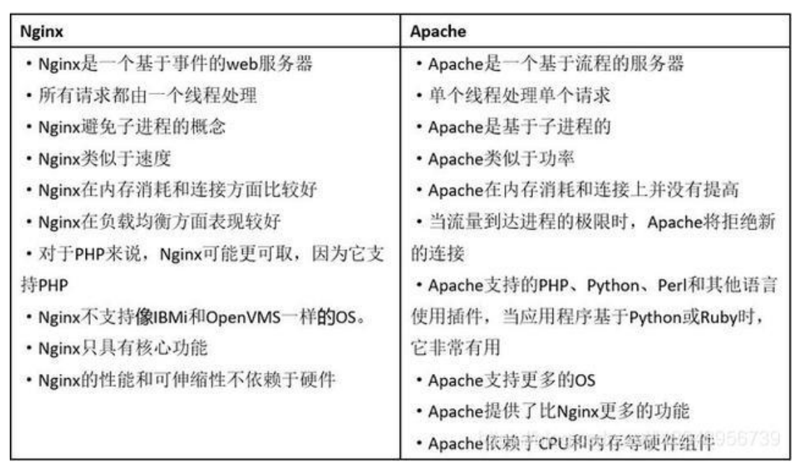

#1、简述一下什么是Nginx,它有什么优势和功能？

Nginx ("engine x") 是一个高性能的 HTTP 和反向代理服务器,特点是占有内存少，并发能力强，
它的并发能力确实在同类型的网页服务器中表现较好，中国大陆使用 nginx网站用户有很多，例如百度、京东、新浪、网易、腾讯、淘宝等
Nginx 可以作为静态页面的 web 服务器，可以进行正向代理、反向代理、负载均衡

#2、Nginx是如何处理一个HTTP请求的呢？ 多进程机制和异步机制
Nginx 是一个高性能的 Web 服务器，能够同时处理大量的并发请求。它结合多进程机制和异步非阻塞机制 ，异步机制使用的是异步非阻塞方式 ，
Nginx 的多线程机制和异步非阻塞 机制 。 
## 1、多进程机制
服务器每当收到一个客户端时，就有 服务器主进程 （ master process ）生成一个 子进程（ worker process ）出来和客户端建立连接进行交互，
直到连接断开，该子进程就结束了。
**使用进程的好处是各个进程之间相互独立，不需要加锁，减少了使用锁对性能造成影响，同时降低编程的复杂度，降低开发成本**。
其次，**采用独立的进程，可以让进程互相之间不会影响 ，如果一个进程发生异常退出时，其它进程正常工作**，
master 进程则很快启动新的 工作（worker）进程，确保服务不会中断，从而将风险降到最低。
缺点是操作系统生成一个子进程需要进行 内存复制等操作，在资源和时间上会产生一定的开销。当有大量请求时，会导致系统性能下降 。 

## 2、异步非阻塞机制
每个工作进程 使用 异步非阻塞方式 ，可以处理 多个客户端请求 。
当某个 工作进程 接收到客户端的请求以后，调用 IO 进行处理，如果不能立即得到结果，就去 处理其他请求 （即为 非阻塞 ）；
而 由于异步非阻塞机制，客户端 在此期间也 无需等待响应 ，可以去处理其他事情~~（即为 异 步 ）~~。
当 IO 返回时，就会通知此 工作进程 ；该进程得到通知，暂时 挂起 当前处理的事务去 响应客户端请求 。

#3、列举一些Nginx的特性

Nginx服务器的特性包括：
1. 反向代理/L7负载均衡器
2. 嵌入式Perl解释器
3. 动态二进制升级
4. 可用于重新编写URL，具有非常好的PCRE支持

#4、请列举Nginx和Apache之间的不同点
考到再说

#5、在Ngix中，如何使用未定义的服务器名称来阻止处理请求？
Server {
    listen 80;
    server_name "" ;
    return 444;
}
服务器名被保留为一个空字符串，它将在没有“主机”头字段的情况下匹配请求，而一个 特殊的Nginx的非标准代码444被返回，从而终止连接。

#6、请解释Nginx服务器上的 Master 和 Worker 进程分别是什么？
主程序 Master process 启动后，通过一个 for 循环来 接收 和 处理外部信号 ；
主进程通过 fork() 函数产生 worker 子进程 ，每个子进程执行一个 for循环来实现Nginx服务器 对事件的接收和处理 。

#7、请解释代理中的正向代理和反向代理
正向代理：如果把局域网外的 Internet 想象成一个巨大的资源库，则局域网中的客户端要访问 Internet，则需要通过代理服务器来访问，这种代理服务就称为正向代理

    【百度百科】意思是一个位于客户端和原始服务器(origin server)之间的服务器，
    为了从原始服务器取得内容，客户端向代理发送一个请求并指定目标(原始服务器)，
    然后代理向原始服务器转交请求并将获得的内容返回给客户端。客户端才能使用正向代理。

反向代理: 其实客户端对反向代理是无感知的，因为客户端不需要任何配置就可以访问，我们只需要将请求发送到反向代理服务器，
由反向代理服务器去选择目标服务器获取数据后，在返回给客户端，此时反向代理服务器和目标服务器对外就是一个服务器，暴露的是代理服务器地址，
隐藏了真实服务器 IP 地址。

#8、解释Nginx用途
正向代理
反向代理
负载均衡
动静分离

~~Nginx服务器的最佳用法是在网络上部署动态HTTP内容，使用SCGI、WSGI应用程序服务器、用于脚本的FastCGI处理程序。它还可以作为负载均衡器。~~

# 9.一个 master 和多个 woker 有好处
（1）可以使用 nginx –s reload 热部署，利用 nginx 进行热部署操作
（2）每个 woker 是独立的进程，如果有其中的一个 woker 出现问题，其他 woker 独立的，
继续进行争抢，实现请求过程，不会造成服务中断、

# 10.设置多少个 woker 合适
worker 数和服务器的 cpu 数相等是最为适宜的

# 11.连接数 worker_connection
第一个：发送请求，占用了 worker 的几个连接数？
答案：2 或者 4 个
第二个：nginx 有一个 master，有四个 woker，每个 woker 支持最大的连接数 1024，支持的最大并发数是多少？
 普通的静态访问最大并发数是： worker_connections * worker_processes /2， 
 而如果是 HTTP 作 为反向代理来说，最大并发数量应该是 worker_connections * worker_processes/4。
4* 1024 / 2 = 2048
4* 1024 / 4 = 1024
所以支持的最大并发数是 1024 或 2048
