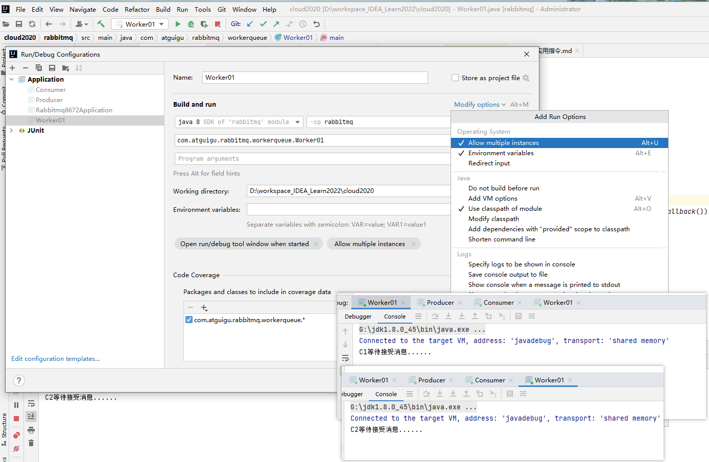

### 什么是MQ message queue

MQ(message queue)，从字面意思上看，本质是个队列，FIFO 先入先出，只不过队列中存放的内容是
message 而已，还是一种跨进程的通信机制，用于上下游传递消息。在互联网架构中，MQ 是一种非常常
见的上下游“逻辑解耦+物理解耦”的消息通信服务。使用了 MQ 之后，消息发送上游只需要依赖 MQ，不
用依赖其他服务。
### 为什么要用MQ
##### 1.流量消峰

    举个例子，如果订单系统最多能处理一万次订单，这个处理能力应付正常时段的下单时绰绰有余，正
    常时段我们下单一秒后就能返回结果。但是在高峰期，如果有两万次下单操作系统是处理不了的，只能限
    制订单超过一万后不允许用户下单。
**使用消息队列做缓冲，我们可以取消这个限制，把一秒内下的订单分散成一段时间来处理，这时有些用户可能在下单十几秒后才能收到下单成功的操作，
但是比不能下单的体验要好。**

##### 2.应用解耦

    以电商应用为例，应用中有订单系统、库存系统、物流系统、支付系统。用户创建订单后，如果耦合
    调用库存系统、物流系统、支付系统，任何一个子系统出了故障，都会造成下单操作异常。当转变成基于
    消息队列的方式后，系统间调用的问题会减少很多，比如物流系统因为发生故障，需要几分钟来修复。在
    这几分钟的时间里，物流系统要处理的内存被缓存在消息队列中，用户的下单操作可以正常完成。当物流
    系统恢复后，继续处理订单信息即可，中单用户感受不到物流系统的故障，提升系统的可用性。


##### 3.异步处理

    有些服务间调用是异步的，例如 A 调用 B，B 需要花费很长时间执行，但是 A 需要知道 B 什么时候可
    以执行完，以前一般有两种方式，
A 过一段时间去调用 B 的查询 api 查询。

或者 A 提供一个 callback api，B 执行完之后调用 api 通知 A 服务。

这两种方式都不是很优雅，
**使用消息总线，可以很方便解决这个问题**：
    A 调用 B 服务后，只需要监听 B 处理完成的消息，当 B 处理完成后，会发送一条消息给 MQ，MQ 会将此
    消息转发给 A 服务。这样 A 服务既不用循环调用 B 的查询 api，也不用提供 callback api。同样 B 服务也不
    用做这些操作。A 服务还能及时的得到异步处理成功的消息。


### MQ的分类

1.ActiveMQ
优点：单机吞吐量万级，时效性 ms 级，可用性高，基于主从架构实现高可用性，消息可靠性。较低的概率丢失数据
缺点:官方社区现在对 ActiveMQ 5.x 维护越来越少，高吞吐量场景较少使用。

2.Kafka
大数据的杀手锏，谈到大数据领域内的消息传输，则绕不开 Kafka，这款为大数据而生的消息中间件，以其百万级 TPS 的吞吐量名声大噪，迅速成为**大数据领域**的宠儿，在数据采集、传输、存储的过程中发挥
着举足轻重的作用。目前已经被 LinkedIn，Uber, Twitter, Netflix 等大公司所采纳。

优点: 性能卓越，单机写入 TPS 约在百万条/秒，**最大的优点，就是吞吐量高**。时效性 ms 级可用性非常高，
kafka 是分布式的，一个数据多个副本，少数机器宕机，不会丢失数据，不会导致不可用,消费者采用 Pull 方式获取消息, 消息有序, 通过控制能够保证所有消息被消费且仅被消费一次;
有优秀的第三方 Kafka Web 管理界面 Kafka-Manager；在日志领域比较成熟，被多家公司和多个开源项目使用；
功能支持： 功能较为简单，主要支持简单的 MQ 功能，在大数据领域的实时计算以及日志采集被大规模使用

缺点：Kafka 单机超过 64 个队列/分区，Load 会发生明显的(CPU)飙高现象，队列越多，load 越高，发送消息响应时间变长，使用短轮询方式，实时性取决于轮询间隔时间，
消费失败不支持重试；支持消息顺序，但是一台代理宕机后，就会产生消息乱序，社区更新较慢；

3.RocketMQ

**RocketMQ 出自阿里巴巴**的开源产品，用 Java 语言实现，在设计时参考了 Kafka，并做出了自己的一些改进。被阿里巴巴广泛应用在
订单，交易，充值，流计算，消息推送，日志流式处理，binglog 分发等场景。

优点:单机吞吐量十万级,可用性非常高，分布式架构,消息可以做到 0 丢失,MQ 功能较为完善，还是分布式的，扩展性好,支持 10 亿级别的消息堆积，
不会因为堆积导致性能下降,源码是 java 我们可以自己阅读源码，定制自己公司的 MQ

缺点：支持的客户端语言不多，目前是 java 及 c++，其中 c++不成熟；社区活跃度一般,没有在 MQ 核心中去实现 JMS 等接口,有些系统要迁移需要修改大量代码

4.RabbitMQ
2007 年发布，是一个在 AMQP(高级消息队列协议)基础上完成的，可复用的企业消息系统，是当前最主流的消息中间件之一。
优点:**由于 erlang 语言的高并发特性，性能较好；吞吐量到万级，MQ 功能比较完备,健壮、稳定、易用、跨平台、支持多种语言** 
如：Python、Ruby、.NET、Java、JMS、C、PHP、ActionScript、XMPP、STOMP等，支持 AJAX 文档齐全；
开源提供的管理界面非常棒，用起来很好用,社区活跃度高；更新频率相当高

[](https://www.rabbitmq.com/news.html)
缺点：商业版需要收费,学习成本较高
### MQ 的选择
1.Kafka
Kafka 主要特点是基于 Pull 的模式来处理消息消费，追求高吞吐量，一开始的目的就是用于日志收集
和传输，适合产生大量数据的互联网服务的数据收集业务。大型公司建议可以选用，如果有日志采集功能，
肯定是首选 kafka 了。 [尚硅谷官网 kafka 视频链接](http://www.gulixueyuan.com/course/330/tasks)

2.RocketMQ
天生为金融互联网领域而生，对于可靠性要求很高的场景，尤其是电商里面的订单扣款，以及业务削峰，在大量交易涌入时，
后端可能无法及时处理的情况。RoketMQ 在稳定性上可能更值得信赖，这些业务场景在阿里双 11 已经经历了多次考验，
如果你的业务有上述并发场景，建议可以选择 RocketMQ。
3.RabbitMQ
结合 erlang 语言本身的并发优势，性能好**时效性微秒级，社区活跃度也比较高**，管理界面用起来十分
方便，如果你的**数据量没有那么大**，中小型公司优先选择功能比较完备的 RabbitMQ。

## RabbitMQ

### RabbitMQ 的概念

RabbitMQ 是一个消息中间件：它接受并转发消息。你可以把它当做一个快递站点，当你要发送一个包裹时，你把你的包裹放到快递站，
快递员最终会把你的快递送到收件人那里，按照这种逻辑 RabbitMQ 是一个快递站，一个快递员帮你传递快件。
**RabbitMQ** 与快递站的主要区别在于，**它不处理快件而是接收，存储和转发消息数据。**

### 四大核心概念 ： 生产者、交换机、队列、消费者
**生产者**

    产生数据发送消息的程序是生产者
**交换机**

    交换机是 RabbitMQ 非常重要的一个部件，一方面它接收来自生产者的消息，另一方面它将消息
    推送到队列中。交换机必须确切知道如何处理它接收到的消息，是将这些消息推送到特定队列还是推
    送到多个队列，亦或者是把消息丢弃，这个得有交换机类型决定
**队列**

    队列是 RabbitMQ 内部使用的一种数据结构，尽管消息流经 RabbitMQ 和应用程序，但它们只能存
    储在队列中。队列仅受主机的内存和磁盘限制的约束，本质上是一个大的消息缓冲区。许多生产者可
    以将消息发送到一个队列，许多消费者可以尝试从一个队列接收数据。这就是我们使用队列的方式
**消费者**

    消费类似接收。消费者大多时候是一个等待接收消息的程序。请注意生产者，消费者和
    消息中间件很多时候并不在同一机器上。同一个应用程序既可以是生产者又是可以是消费者。


RabttiMQ 六大模式(六大核心部分)


工作原理


**Broker**：接收和分发消息的应用，RabbitMQ Server 就是 Message Broker

Virtual host：出于多租户和安全因素设计的，把 AMQP 的基本组件划分到一个虚拟的分组中，类似
于网络中的 namespace 概念。当多个不同的用户使用同一个 RabbitMQ server 提供的服务时，可以划分出
多个 vhost，每个用户在自己的 vhost 创建 exchange／queue 等

**Connection**：publisher／consumer 和 broker 之间的 TCP 连接

**Channel**：如果每一次访问 RabbitMQ 都建立一个 Connection，在消息量大的时候建立 TCP

Connection 的开销将是巨大的，效率也较低。Channel 是在 connection 内部建立的逻辑连接，如果应用程
序支持多线程，通常每个 thread 创建单独的 channel 进行通讯，AMQP method 包含了 channel id 帮助客
户端和 message broker 识别 channel，所以 channel 之间是完全隔离的。Channel 作为轻量级的
Connection 极大减少了操作系统建立 TCP connection 的开销

**Exchange**：message 到达 broker 的第一站，根据分发规则，匹配查询表中的 routing key，分发
消息到 queue 中去。常用的类型有：direct (point-to-point), topic (publish-subscribe) and fanout
(multicast)

**Queue**：消息最终被送到这里等待 consumer 取走

**Binding**：exchange 和 queue 之间的虚拟连接，binding 中可以包含 routing key，Binding 信息被保
存到 exchange 中的查询表中，用于 message 的分发依据

[rabiitmq安装]()


添加开机启动 RabbitMQ 服务
chkconfig rabbitmq-server on
启动服务
/sbin/service rabbitmq-server start
查看服务状态
/sbin/service rabbitmq-server status

systemctl status rabbitmq-server
systemctl stop rabbitmq-server
systemctl start rabbitmq-server


##### rabbitmq web添加一个新的用户
创建账号 账号密码都是admin

    rabbitmqctl add_user admin admin
设置用户角色
    
rabbitmqctl set_user_tags admin administrator
设置用户权限
set_permissions [-p <vhostpath>] <user> <conf> <write> <read>
    
    rabbitmqctl set_permissions -p "/" admin ".*" ".*" ".*"
用户 user_admin 具有/vhost1 这个 virtual host 中所有资源的配置、写、读权限
查看当前用户和角色

    rabbitmqctl list_users
5.再次利用 admin 用户登录

[rabbitmqweb 台式机](http://192.168.220.128:15672/#/)


### 如何使用 rabbitmq


#### Work Queues
工作队列(又称任务队列)的主要思想是避免立即执行资源密集型任务，而不得不等待它完成。 相反我们安排任务在之后执行。我们把任务封装为消息并将其发送到队列。
在后台运行的工作进程将弹出任务并最终执行作业。当有多个工作线程时，这些工作线程将一起处理这些任务。

##### 轮训分发消息
在这个案例中我们会启动两个工作线程，一个消息发送线程，我们来看看他们两个工作线程是如何工作的。

注意事项：
**一个消息只能被处理一次，不可以处理多次。  避免消息被重复消费**


启动第一个线程
```java
/**
 * @see com.atguigu.rabbitmq.workerqueue.Worker01;
 */
```

IDEA edit configurations



然后 启动一个生产者大量发消息。 worker01 和 另一个工作线程worker01  轮询接受
rabbitmq工作队列模式演示：


### 消息应答
3.2.1. 概念
消费者完成一个任务可能需要一段时间，如果其中一个消费者处理一个长的任务并仅只完成了部分突然它挂掉了，会发生什么情况。RabbitMQ 一旦向消费者传递了
一条消息， 便立即将该消息标记为删除。在这种情况下，突然有个消费者挂掉了，我们将丢失正在处理的消息。以及后续 发送给该消费这的消息，因为它无法接收到。
为了保证消息在发送过程中不丢失，rabbitmq 引入消息应答机制，
**消息应答就是:消费者在接收到消息并且处理该消息之后，告诉 rabbitmq 它已经处理了，rabbitmq 可以把该消息删除了。**

3.2.2. 自动应答
消息发送后立即被认为已经传送成功，这种模式需要在**高吞吐量和数据传输安全性方面做权衡**,因为这种模式如果消息在接收到之前，消费者那边出现连接或者
channel 关闭，那么消息就丢失了,当然另一方面这种模式消费者那边可以传递过载的消息，没有对传递的消息数量进行限制，
当然这样有可能使得消费者这边由于接收太多还来不及处理的消息，导致这些消息的积压，最终使得内存耗尽，最终这些消费者线程被操作系统杀死，
**所以自动应答这种模式仅适用在消费者可以高效并以某种速率能够处理这些消息的情况下使用**

3.2.3. (手动应答)消息应答的方法

A.Channel.basicAck(用于**肯定确认**)
RabbitMQ 已知道该消息并且成功的处理消息，可以将其丢弃了
B.Channel.basicNack(用于否定确认) C.Channel.basicReject(用于否定确认) 与 Channel.basicNack 相比少一个参数不处理该消息了直接拒绝，
可以将其丢弃了

#### Multiple 的解释

```java
/**
 * @see com.rabbitmq.client.Channel#basicAck
 * 
 */

public interface Channel extends ShutdownNotifier, AutoCloseable {
    /**
     * Acknowledge one or several received
     * messages. Supply the deliveryTag from the {@link com.rabbitmq.client.AMQP.Basic.GetOk}
     * or {@link com.rabbitmq.client.AMQP.Basic.Deliver} method
     * containing the received message being acknowledged.
     * @see com.rabbitmq.client.AMQP.Basic.Ack
     * @param deliveryTag the tag from the received {@link com.rabbitmq.client.AMQP.Basic.GetOk} or {@link com.rabbitmq.client.AMQP.Basic.Deliver}
     * @param multiple true to acknowledge all messages up to and
     * including the supplied delivery tag; false to acknowledge just
     * the supplied delivery tag.
     * @throws java.io.IOException if an error is encountered
     */
    void basicAck(long deliveryTag, boolean multiple) throws IOException;
}
```
手动应答的好处是可以批量应答并且减少网络拥堵
multiple 的 true 和 false 代表不同意思 true 代表批量应答 channel 上未应答的消息
比如说 channel 上有传送 tag 的消息 5,6,7,8 当前 tag 是 8 那么此时 5-8 的这些还未应答的消息都会被确认收到消息应答
false 同上面相比 只会应答 tag=8 的消息 5,6,7 这三个消息依然不会被确认收到消息应答


开发时建议是建议不开启批量应答。  否则 5,6,7 的处理过程中可能会有处理失败的情况下。会有消息丢失的可能


#### 3.2.5 消息的自动重新入队

如果消费者由于某些原因失去连接(其通道已关闭，连接已关闭或 TCP 连接丢失)，导致消息未发送 ACK 确认，RabbitMQ 将了解到消息未完全处理，
并将对其重新排队。如果此时其他消费者可以处理，它将很快将其重新分发给另一个消费者。这样，即使某个消费者偶尔死亡，也可以确保不会丢失任何消息。


P25 
#### 消息手动应答
消息在手动应答时是不丢失、放回队列中重新消费
手动 manualack

```java
package com.atguigu.rabbitmq.manualack;

import com.atguigu.rabbitmq.util.RabbitmqUtil;
import com.rabbitmq.client.AMQP;
import com.rabbitmq.client.Channel;
import lombok.extern.slf4j.Slf4j;

import java.io.IOException;
import java.nio.charset.StandardCharsets;
import java.util.Scanner;
import java.util.concurrent.TimeoutException;

/**
 * 消息手动应答-生产者
 *
 * 消息在手动应答时是不丢失的，放回队列中重新消费
 */
@Slf4j
public class Task2 {

    // 队列名称
    public static final String TASK_QUEUE_NAME = "ACK_QUEUE";

    public static void main(String[] args) throws IOException, TimeoutException {
        Channel channel = RabbitmqUtil.getChannel();

        // 声明队列
        AMQP.Queue.DeclareOk declareOk = channel.queueDeclare(TASK_QUEUE_NAME, false, false, false, null);

        // 从控制台中输入信息

        Scanner scanner = new Scanner(System.in);
        while (scanner.hasNext()) {
            String message = scanner.next();
            channel.basicPublish("", TASK_QUEUE_NAME, null, message.getBytes(StandardCharsets.UTF_8));
            log.info("生产者发出消息：{}", message);
        }
    }
}

```

```java
package com.atguigu.rabbitmq.manualack;

import cn.hutool.core.thread.ThreadUtil;
import com.atguigu.rabbitmq.util.RabbitmqUtil;
import com.rabbitmq.client.Channel;
import com.rabbitmq.client.DeliverCallback;
import lombok.extern.slf4j.Slf4j;

import java.io.IOException;
import java.util.concurrent.TimeoutException;

/**
 * 消息手动应答-消费者1
 *
 *  * 消息在手动应答时是不丢失的，放回队列中重新消费
 */
@Slf4j
public class Work03 {
    // 队列名称
    public static final String TASK_QUEUE_NAME = "ACK_QUEUE";

    public static void main(String[] args) throws IOException, TimeoutException {
        Channel channel = RabbitmqUtil.getChannel();
        log.info("C1 等待接受消息处理时间较短");

        // 采用手动应答
        boolean autoAck = false;
        DeliverCallback deliverCallBack = ((consumerTag, message) -> {
            // 沉睡一秒钟
            ThreadUtil.sleep(1000);
            log.info("接收到的消息： {}", new String(message.getBody(), "UTF-8"));

            //手动应答的代码
            /**
             * 1.消息的标记 tag
             * 2. 是否批量应答(不应该，否则可能有消息丢失的风险) false 不批量应答信道中的消息
             */
            channel.basicAck(message.getEnvelope().getDeliveryTag(), false);
        });
        channel.basicConsume(TASK_QUEUE_NAME, autoAck, deliverCallBack, (consumerTag -> {
            log.info("消费者取消消费接口回调逻辑");
        }));
    }
}

```

```java
package com.atguigu.rabbitmq.manualack;

import cn.hutool.core.thread.ThreadUtil;
import com.atguigu.rabbitmq.util.RabbitmqUtil;
import com.rabbitmq.client.Channel;
import com.rabbitmq.client.DeliverCallback;
import lombok.extern.slf4j.Slf4j;

import java.io.IOException;
import java.util.concurrent.TimeoutException;

/**
 * 消息手动应答-消费者2
 *
 *  * 消息在手动应答时是不丢失的，放回队列中重新消费
 */
@Slf4j
public class Work04 {
    // 队列名称
    public static final String TASK_QUEUE_NAME = "ACK_QUEUE";

    public static void main(String[] args) throws IOException, TimeoutException {
        Channel channel = RabbitmqUtil.getChannel();
        log.info("C2 等待接受消息处理时间较长");

        // 采用手动应答
        boolean autoAck = false;
        DeliverCallback deliverCallBack = ((consumerTag, message) -> {
            // 沉睡15秒钟
            ThreadUtil.sleep(15000);
            log.info("接收到的消息： {}", new String(message.getBody(), "UTF-8"));

            //手动应答的代码
            /**
             * 1.消息的标记 tag
             * 2. 是否批量应答(不应该，否则可能有消息丢失的风险) false 不批量应答信道中的消息
             */
            channel.basicAck(message.getEnvelope().getDeliveryTag(), false);
        });
        channel.basicConsume(TASK_QUEUE_NAME, autoAck, deliverCallBack, (consumerTag -> {
            log.info("消费者取消消费接口回调逻辑");
        }));
    }
}

```

启动生产者 Task2， 消费者1：Work03 ，消费者2：Work04


当发送消息  ee 和 ff。 本应该  消费者2 本应该轮询接收消息 ff。但是消费者2停掉了。 此时 消息ff 会回到队列
并被 消费者1 消费。
结论：

在发送者发送消息 dd，发出消息之后的把 C2 消费者停掉，按理说该 C2 来处理该消息，但是由于它处理时间较长，在还未处理完，
也就是说 C2 还没有执行 ack 代码的时候，C2 被停掉了，此时会看到消息被 C1 接收到了，说明消息 dd 被重新入队，然后分配给能处理消息的 C1 处理了

#### rabbitmq 队列持久化：
```java
package com.atguigu.rabbitmq.manualack;

import com.atguigu.rabbitmq.util.RabbitmqUtil;
import com.rabbitmq.client.AMQP;
import com.rabbitmq.client.Channel;
import lombok.extern.slf4j.Slf4j;

import java.io.IOException;
import java.nio.charset.StandardCharsets;
import java.util.Scanner;
import java.util.concurrent.TimeoutException;

/**
 * 消息手动应答-生产者
 *
 * 消息在手动应答时是不丢失的，放回队列中重新消费
 */
@Slf4j
public class Task2 {

    // 队列名称
    public static final String TASK_QUEUE_NAME = "ACK_QUEUE";

    public static void main(String[] args) throws IOException, TimeoutException {
        Channel channel = RabbitmqUtil.getChannel();
        // 需要持久化
        boolean durable = true;
        // 声明队列
        AMQP.Queue.DeclareOk declareOk = channel.queueDeclare(TASK_QUEUE_NAME, durable, false, false, null);

        // 从控制台中输入信息

        Scanner scanner = new Scanner(System.in);
        while (scanner.hasNext()) {
            String message = scanner.next();
            channel.basicPublish("", TASK_QUEUE_NAME, null, message.getBytes(StandardCharsets.UTF_8));
            log.info("生产者发出消息：{}", message);
        }
    }
}

```
队列持久化关键代码  boolean durable  = true;
AMQP.Queue.DeclareOk declareOk = channel.queueDeclare(TASK_QUEUE_NAME, durable, false, false, null);

之前我们创建的队列都是非持久化的，rabbitmq 如果重启的化，该队列就会被删除掉，如果要队列实现持久化 需要在声明队列的时候把 durable 参数设置为持久化
但是**需要注意的就是如果之前声明的队列不是持久化的，需要把原先队列先删除，或者重新
创建一个持久化的队列，不然就会出现错误**
报错：
Caused by: com.rabbitmq.client.ShutdownSignalException: channel error; protocol method: #method<channel.close>(reply-code=406, reply-text=PRECONDITION_FAILED - inequivalent arg 'durable' for queue 'HELLO' in vhost '/': received 'true' but current is 'false', class-id=50, method-id=10)


web界面删除队列


#### rabbitmq 消息持久化

要想让消息实现持久化需要在消息生产者修改代码，MessageProperties.PERSISTENT_TEXT_PLAIN 添加这个属性。

    // 设置生产者发送消息为持久化消息(要求保存到磁盘上) 否则保存在内存中
    AMQP.BasicProperties persistentTextPlain = MessageProperties.PERSISTENT_TEXT_PLAIN;
    channel.basicPublish("", TASK_QUEUE_NAME, persistentTextPlain, message.getBytes(StandardCharsets.UTF_8));

将消息标记为持久化并不能完全保证不会丢失消息。尽管它告诉 RabbitMQ 将消息保存到磁盘，但是这里依然存在当消息刚准备存储在磁盘的时候 
但是还没有存储完，消息还在缓存的一个间隔点。此时并没有真正写入磁盘。**持久性保证并不强**，
但是对于我们的简单任务队列而言，这已经绰绰有余了。如果需要更强有力的持久化策略，参考后边课件发布确认章节


#### 不公平分发 （能者多劳。 建议采用不公平分发原则）

在最开始的时候我们学习到 RabbitMQ 分发消息采用的轮训分发，但是在某种场景下这种策略并不是很好，比方说有两个消费者在处理任务，
其中有个消费者 1 处理任务的速度非常快，而另外一个消费者 2 处理速度却很慢，这个时候我们还是采用轮训分发的化就会到这处理速度快的这个消费者很大
一部分时间处于空闲状态，而处理慢的那个消费者一直在干活，这种分配方式在这种情况下其实就不太好，但是 RabbitMQ 并不知道这种情况它依然很公平的进行分发。
为了避免这种情况，我们可以设置参数 channel.basicQos(1)

消费者的信道对象
// 设置不公平分发
channel.basicQos(1);


#### 预取值 prefetch

本身消息的发送就是异步发送的，所以在任何时候，channel 上肯定不止只有一个消息另外来自消费者的手动确认本质上也是异步的。
因此这里就存在一个未确认的消息缓冲区，因此希望开发人员能**限制此缓冲区的大小，以避免缓冲区里面无限制的未确认消息问题**。
这个时候就可以通过使用 basic.qos 方法设置“预取计数”值来完成的。**该值定义通道上允许的未确认消息的最大数量**。一旦数量达到配置的数量，
RabbitMQ 将停止在通道上传递更多消息，除非至少有一个未处理的消息被确认，例如，假设在通道上有未确认的消息 5、6、7，8，
并且通道的预取计数设置为 4，此时 RabbitMQ 将不会在该通道上再传递任何消息，除非至少有一个未应答的消息被 ack。
比方说 tag=6 这个消息刚刚被确认 ACK，RabbitMQ 将会感知这个情况到并再发送一条消息。消息应答和 QoS 预取值对用户吞吐量有重大影响。
通常，增加预取将提高向消费者传递消息的速度。**虽然自动应答传输消息速率是最佳的，但是，在这种情况下已传递但尚未处理的消息的数量也会增加，
从而增加了消费者的 RAM 消耗**(随机存取存储器)应该小心使用具有无限预处理的自动确认模式或手动确认模式，消费者消费了大量的消息如果没有确认的话，
会导致消费者连接节点的内存消耗变大，所以找到合适的预取值是一个反复试验的过程，不同的负载该值取值也不同 100 到 300 范围内的值通常可提供最佳的
吞吐量，并且不会给消费者带来太大的风险。预取值为 1 是最保守的。当然这将使吞吐量变得很低，特别是消费者连接延迟很严重的情况下，
特别是在消费者连接等待时间较长的环境中。对于大多数应用来说，稍微高一点的值将是最佳的。


上图的预取值指定后，不管处理速度。 c1一定最后消费2条  c2一定最后消费5条


### 4 发布确认

生产者将信道设置成 confirm 模式，一旦信道进入 confirm 模式，所有在该信道上面发布的消息都将会被指派一个唯一的 ID(从 1 开始)，
一旦消息被投递到所有匹配的队列之后，broker 就会发送一个确认给生产者(包含消息的唯一 ID)，这就使得生产者知道消息已经正确到达目的队列了，
如果消息和队列是可持久化的，那么确认消息会在将消息写入磁盘之后发出，broker 回传给生产者的确认消息中 delivery-tag 域包含了确认消息的序列号，
此外 broker 也可以设置basic.ack 的 multiple 域，表示到这个序列号之前的所有消息都已经得到了处理。confirm 模式最大的好处在于他是异步的，
一旦发布一条消息，生产者应用程序就可以在等信道返回确认的同时继续发送下一条消息，当消息最终得到确认之后，生产者应用便可以通过回调方法来处理该确认消息，
如果 RabbitMQ 因为自身内部错误导致消息丢失，就会发送一条 nack 消息，生产者应用程序同样可以在回调方法中处理该 nack 消息。


1. 设置要求队列必须持久化
2. 设置要求队列中的消息也必须持久化
3. 发布确认


#### 发布确认的策略
4.2.1. 开启发布确认的方法
发布确认默认是没有开启的，如果要开启需要调用方法 confirmSelect，每当你要想使用发布确认，都需要在 channel 上调用该方法

```java
package com.atguigu.rabbitmq.manualack;

import cn.hutool.core.thread.ThreadUtil;
import com.atguigu.rabbitmq.util.RabbitmqUtil;
import com.rabbitmq.client.Channel;
import com.rabbitmq.client.DeliverCallback;
import lombok.extern.slf4j.Slf4j;

import java.io.IOException;
import java.util.concurrent.TimeoutException;

/**
 * 消息手动应答-消费者1
 *
 *  * 消息在手动应答时是不丢失的，放回队列中重新消费
 */
@Slf4j
public class Work03 {
    // 队列名称
    public static final String TASK_QUEUE_NAME = "ACK_QUEUE";

    public static void main(String[] args) throws IOException, TimeoutException {
        Channel channel = RabbitmqUtil.getChannel();
        // 开启发布确认
        channel.confirmSelect();
        log.info("C1 等待接受消息处理时间较短");

        // 设置公平分发
        // channel.basicQos(0);

        // 设置不公平分发
        // channel.basicQos(1);
        // 设置预取值
        channel.basicQos(2);
        // 采用手动应答
        boolean autoAck = false;
        DeliverCallback deliverCallBack = ((consumerTag, message) -> {
            // 沉睡一秒钟
            ThreadUtil.sleep(1000);
            log.info("接收到的消息： {}", new String(message.getBody(), "UTF-8"));

            //手动应答的代码
            /**
             * 1.消息的标记 tag
             * 2. 是否批量应答(不应该，否则可能有消息丢失的风险) false 不批量应答信道中的消息
             */
            channel.basicAck(message.getEnvelope().getDeliveryTag(), false);
        });

        channel.basicConsume(TASK_QUEUE_NAME, autoAck, deliverCallBack, (consumerTag -> {
            log.info("消费者取消消费接口回调逻辑");
        }));
    }
}

```
#### 4.2.2单个发布确认
这是一种简单的确认方式，它是一种同步确认发布的方式，也就是发布一个消息之后只有它被确认发布，后续的消息才能继续发布,waitForConfirmsOrDie(long)这个方法只有
在消息被确认的时候才返回，如果在指定时间范围内这个消息没有被确认那么它将抛出异常。 这种确认方式有一个最大的缺点就是:发布速度特别的慢，因为如果没有确认发布的消息就会
阻塞所有后续消息的发布，这种方式最多提供每秒不超过数百条发布消息的吞吐量。当然对于某些应用程序来说这可能已经足够了。

```java
package com.atguigu.rabbitmq.confirm;

import com.atguigu.rabbitmq.util.RabbitmqUtil;
import com.rabbitmq.client.Channel;
import lombok.extern.slf4j.Slf4j;

import java.io.IOException;
import java.util.UUID;
import java.util.concurrent.TimeoutException;

/**
 * 发布确认模式
 * 使用的时间 比较哪种确认方式是最好的
 *
 * 1.单个确认模式
 * 2.批量确认模式
 * 3.异步确认
 */
@Slf4j
public class ConfirmMessage {

    // 批量发消息的个数
    public static final int MESSAGE_COUNT = 1000;

    public static void main(String[] args) throws Exception {
        // 1. 单个确认
        // publicMessageIndividually(); //
        // 22:01:52.420 [main] INFO com.atguigu.rabbitmq.confirm.ConfirmMessage - 发布 1000 个单独确认消息，耗时 705 毫秒(ms)

    }

    /**
     * 单个确认
     */
    public static void publicMessageIndividually() throws IOException, TimeoutException, InterruptedException {
        Channel channel = RabbitmqUtil.getChannel();
        // 队列的声明
        String queueName = UUID.randomUUID().toString();
        channel.queueDeclare(queueName, true, false, false,  null);
        // 开启发布确认
        channel.confirmSelect();
        // 开始时间
        long begin = System.currentTimeMillis();

        // 批量发消息
        for (int i = 0; i < MESSAGE_COUNT; i++) {
            String message = i + "";
            channel.basicPublish("", queueName, null, message.getBytes());
            // 单个消息就马上进行发布确认
            boolean confirmed = channel.waitForConfirms();
            if (confirmed) {
                log.info("消息发送成功");
            }
        }

        long end = System.currentTimeMillis();
        log.info("发布 {} 个 批量确认消息，耗时 {} 毫秒(ms)", MESSAGE_COUNT, end-begin);

    }

}

```
#### 4.23. 批量发布确认

上面那种方式非常慢，与单个等待确认消息相比，先发布一批消息然后一起确认可以极大地
提高吞吐量，当然这种方式的缺点就是:当发生故障导致发布出现问题时，不知道是哪个消息出现
问题了，我们必须将整个批处理保存在内存中，以记录重要的信息而后重新发布消息。当然这种
方案仍然是同步的，也一样阻塞消息的发布。

```java
package com.atguigu.rabbitmq.confirm;

import com.atguigu.rabbitmq.util.RabbitmqUtil;
import com.rabbitmq.client.Channel;
import lombok.extern.slf4j.Slf4j;

import java.io.IOException;
import java.util.UUID;
import java.util.concurrent.TimeoutException;

/**
 * 发布确认模式
 * 使用的时间 比较哪种确认方式是最好的
 *
 * 1.单个确认模式
 * 2.批量确认模式
 * 3.异步确认
 */
@Slf4j
public class ConfirmMessage {

    // 批量发消息的个数
    public static final int MESSAGE_COUNT = 1000;

    public static void main(String[] args) throws Exception {
        // 1. 单个确认
        // publicMessageIndividually(); //
        // 22:01:52.420 [main] INFO com.atguigu.rabbitmq.confirm.ConfirmMessage - 发布 1000 个单独确认消息，耗时 705 毫秒(ms)

        // 2. 批量确认
        publicMessageBatch(); // 弊端：无法确认哪个消息没有被确认
        // 22:10:23.019 [main] INFO com.atguigu.rabbitmq.confirm.ConfirmMessage - 发布 1000 个单独确认消息，耗时 148 毫秒(ms)

        // 3. 异步批量确认

    }

    /**
     * 批量发布确认
     */
    public static void publicMessageBatch() throws Exception {
        Channel channel = RabbitmqUtil.getChannel();
        // 队列的声明
        String queueName = UUID.randomUUID().toString();
        channel.queueDeclare(queueName, true, false, false,  null);
        // 开启发布确认
        channel.confirmSelect();
        // 开始时间
        long begin = System.currentTimeMillis();

        // 批量确认消息的大小
        int batchSize = 100;

        // 批量发送消息 批量发布确认
        for (int i = 0; i < MESSAGE_COUNT; i++) {

            String message = i + "";
            channel.basicPublish("", queueName, null, message.getBytes());
            // 发布确认

            // 判断达到100条消息的时候 批量确认一次
            if (i % batchSize == 0) {
                channel.waitForConfirms();
            }

        }
        long end = System.currentTimeMillis();
        log.info("发布 {} 个单独确认消息，耗时 {} 毫秒(ms)", MESSAGE_COUNT, end-begin);
    }
}

```
#### 4.2.4. 异步确认发布
异步确认虽然编程逻辑比上两个要复杂，但是性价比最高，无论是可靠性还是效率都没得说，他是利用回调函数来达到消息可靠性传递的，
这个中间件也是通过函数回调来保证是否投递成功，解异步确认是怎么实现的：


```java
package com.atguigu.rabbitmq.confirm;

import com.atguigu.rabbitmq.util.RabbitmqUtil;
import com.rabbitmq.client.Channel;
import com.rabbitmq.client.ConfirmCallback;
import lombok.extern.slf4j.Slf4j;

import java.io.IOException;
import java.util.UUID;
import java.util.concurrent.TimeoutException;

/**
 * 发布确认模式
 * 使用的时间 比较哪种确认方式是最好的
 *
 * 1.单个确认模式
 * 2.批量确认模式
 * 3.异步确认
 */
@Slf4j
public class ConfirmMessage {

    // 批量发消息的个数
    public static final int MESSAGE_COUNT = 1000;

    public static void main(String[] args) throws Exception {
        // 1. 单个确认
        // publicMessageIndividually(); //
        // 22:01:52.420 [main] INFO com.atguigu.rabbitmq.confirm.ConfirmMessage - 发布 1000 个单独确认消息，耗时 705 毫秒(ms)

        // 2. 批量确认
        // publicMessageBatch(); // 弊端：无法确认哪个消息没有被确认
        // 22:10:23.019 [main] INFO com.atguigu.rabbitmq.confirm.ConfirmMessage - 发布 1000 个单独确认消息，耗时 148 毫秒(ms)

        // 3. 异步批量确认
        publishMessageAsync();
        // 22:43:55.025 [main] INFO com.atguigu.rabbitmq.confirm.ConfirmMessage - 发布 1000 个 异步发布确认消息，耗时 47 毫秒(ms)
    }

    /**
     * 单个确认
     */
    public static void publicMessageIndividually() throws IOException, TimeoutException, InterruptedException {
        Channel channel = RabbitmqUtil.getChannel();
        // 队列的声明
        String queueName = UUID.randomUUID().toString();
        channel.queueDeclare(queueName, true, false, false,  null);
        // 开启发布确认
        channel.confirmSelect();
        // 开始时间
        long begin = System.currentTimeMillis();

        // 批量发消息
        for (int i = 0; i < MESSAGE_COUNT; i++) {
            String message = i + "";
            channel.basicPublish("", queueName, null, message.getBytes());
            // 单个消息就马上进行发布确认
            boolean confirmed = channel.waitForConfirms();
            if (confirmed) {
                log.info("消息发送成功");
            }
        }

        long end = System.currentTimeMillis();
        log.info("发布 {} 个 批量确认消息，耗时 {} 毫秒(ms)", MESSAGE_COUNT, end-begin);

    }

    /**
     * 批量发布确认
     */
    public static void publicMessageBatch() throws Exception {
        Channel channel = RabbitmqUtil.getChannel();
        // 队列的声明
        String queueName = UUID.randomUUID().toString();
        channel.queueDeclare(queueName, true, false, false,  null);
        // 开启发布确认
        channel.confirmSelect();
        // 开始时间
        long begin = System.currentTimeMillis();

        // 批量确认消息的大小
        int batchSize = 100;

        // 批量发送消息 批量发布确认
        for (int i = 0; i < MESSAGE_COUNT; i++) {

            String message = i + "";
            channel.basicPublish("", queueName, null, message.getBytes());
            // 发布确认

            // 判断达到100条消息的时候 批量确认一次
            if (i % batchSize == 0) {
                channel.waitForConfirms();
            }

        }
        long end = System.currentTimeMillis();
        log.info("发布 {} 个单独确认消息，耗时 {} 毫秒(ms)", MESSAGE_COUNT, end-begin);
    }

    /**
     * 异步发布确认
     */
    public static void publishMessageAsync() throws Exception {
        Channel channel = RabbitmqUtil.getChannel();
        // 队列的声明
        String queueName = UUID.randomUUID().toString();
        channel.queueDeclare(queueName, true, false, false,  null);
        // 开启发布确认
        channel.confirmSelect();
        // 开始时间
        long begin = System.currentTimeMillis();

        // 准备消息的监听器 监听哪些消息成功了，哪些消息失败了
        //消息确认成功 回调函数
        com.rabbitmq.client.ConfirmCallback ackCallback = (deliveryTag,  multiple) -> {
            log.info("确认的消息： {}", deliveryTag);
        };
        // 消息确认失败 回调函数
        /**
         * 1. deliveryTag 消息的标记
         * 2. multiple 是否为批量确认
         */
        ConfirmCallback nackCallback = (deliveryTag,  multiple) -> {
            log.info("未确认的消息： {}", deliveryTag);
        };
        /**
         * 监听哪些消息成功了
         * 监听哪些消息失败了
         */
        channel.addConfirmListener(ackCallback, nackCallback); //监听是 异步的通知
        // 批量发送消息
        for (int i = 0; i < MESSAGE_COUNT; i++) {

            String message = "消息" + i;
            channel.basicPublish("", queueName, null, message.getBytes());
            // 发布确认
        }

        long end = System.currentTimeMillis();
        log.info("发布 {} 个 异步发布确认消息，耗时 {} 毫秒(ms)", MESSAGE_COUNT, end-begin);

    }
}

```

#### 4.2.5 如何处理异步未确认消息
最好的解决的解决方案就是把未确认的消息放到一个基于内存的能被发布线程访问的队列，比如说用 **ConcurrentLinkedQueue** 这个队列在 
confirm callbacks 与发布线程之间进行消息的传递。

// 发布确认
// 1.此处记录下所有要发送的消息 消息的总和
// 2.删除掉已经确认的消息 剩下的就是未确认的消息 (确认消息回调函数中处理 本demo中为：ackCallback)
// 3.打印一下未确认的消息都有哪些  (未确认消息回调函数中处理，本demo中为：nackCallback)

```java
package com.atguigu.rabbitmq.confirm;

import com.atguigu.rabbitmq.util.RabbitmqUtil;
import com.rabbitmq.client.Channel;
import com.rabbitmq.client.ConfirmCallback;
import lombok.extern.slf4j.Slf4j;

import java.io.IOException;
import java.util.UUID;
import java.util.concurrent.ConcurrentNavigableMap;
import java.util.concurrent.ConcurrentSkipListMap;
import java.util.concurrent.TimeoutException;

/**
 * 发布确认模式
 * 使用的时间 比较哪种确认方式是最好的
 *
 * 1.单个确认模式
 * 2.批量确认模式
 * 3.异步确认
 */
@Slf4j
public class ConfirmMessage {

    // 批量发消息的个数
    public static final int MESSAGE_COUNT = 1000;

    public static void main(String[] args) throws Exception {
        // 1. 单个确认
        // publicMessageIndividually(); //
        // 22:01:52.420 [main] INFO com.atguigu.rabbitmq.confirm.ConfirmMessage - 发布 1000 个单独确认消息，耗时 705 毫秒(ms)

        // 2. 批量确认
        // publicMessageBatch(); // 弊端：无法确认哪个消息没有被确认
        // 22:10:23.019 [main] INFO com.atguigu.rabbitmq.confirm.ConfirmMessage - 发布 1000 个单独确认消息，耗时 148 毫秒(ms)

        // 3. 异步批量确认
        publishMessageAsync();
        // 22:43:55.025 [main] INFO com.atguigu.rabbitmq.confirm.ConfirmMessage - 发布 1000 个 异步发布确认消息，耗时 47 毫秒(ms)
    }

    /**
     * 单个确认
     */
    public static void publicMessageIndividually() throws IOException, TimeoutException, InterruptedException {
        Channel channel = RabbitmqUtil.getChannel();
        // 队列的声明
        String queueName = UUID.randomUUID().toString();
        channel.queueDeclare(queueName, true, false, false,  null);
        // 开启发布确认
        channel.confirmSelect();
        // 开始时间
        long begin = System.currentTimeMillis();

        // 批量发消息
        for (int i = 0; i < MESSAGE_COUNT; i++) {
            String message = i + "";
            channel.basicPublish("", queueName, null, message.getBytes());
            // 单个消息就马上进行发布确认
            boolean confirmed = channel.waitForConfirms();
            if (confirmed) {
                log.info("消息发送成功");
            }
        }

        long end = System.currentTimeMillis();
        log.info("发布 {} 个 批量确认消息，耗时 {} 毫秒(ms)", MESSAGE_COUNT, end-begin);

    }

    /**
     * 批量发布确认
     */
    public static void publicMessageBatch() throws Exception {
        Channel channel = RabbitmqUtil.getChannel();
        // 队列的声明
        String queueName = UUID.randomUUID().toString();
        channel.queueDeclare(queueName, true, false, false,  null);
        // 开启发布确认
        channel.confirmSelect();
        // 开始时间
        long begin = System.currentTimeMillis();

        // 批量确认消息的大小
        int batchSize = 100;

        // 批量发送消息 批量发布确认
        for (int i = 0; i < MESSAGE_COUNT; i++) {

            String message = i + "";
            channel.basicPublish("", queueName, null, message.getBytes());
            // 发布确认

            // 判断达到100条消息的时候 批量确认一次
            if (i % batchSize == 0) {
                channel.waitForConfirms();
            }

        }
        long end = System.currentTimeMillis();
        log.info("发布 {} 个单独确认消息，耗时 {} 毫秒(ms)", MESSAGE_COUNT, end-begin);
    }

    /**
     * 异步发布确认
     */
    public static void publishMessageAsync() throws Exception {
        Channel channel = RabbitmqUtil.getChannel();
        // 队列的声明
        String queueName = UUID.randomUUID().toString();
        channel.queueDeclare(queueName, true, false, false,  null);
        // 开启发布确认
        channel.confirmSelect();

        /**
         * 线程安全有序的一个哈希表 适用于高并发的情况下
         * 1.轻松地将序号与消息进行关联
         * 2.轻松地批量删除条目 只要给到序号
         * 3.支持高并发(多线程)
         */
        ConcurrentSkipListMap<Long, String> outstandingConfirms =
                new ConcurrentSkipListMap<>();

        //消息确认成功 回调函数
        com.rabbitmq.client.ConfirmCallback ackCallback = (deliveryTag,  multiple) -> {
            // 2.删除掉已经确认的消息 剩下的就是未确认的消息
            if (multiple) {
                ConcurrentNavigableMap<Long, String> longStringConcurrentNavigableMap =
                        outstandingConfirms.headMap(deliveryTag);
            } else {
                outstandingConfirms.remove(deliveryTag);
            }
            log.info("确认的消息： {}", deliveryTag);

        };
        // 消息确认失败 回调函数
        /**
         * 1. deliveryTag 消息的标记
         * 2. multiple 是否为批量确认
         */
        ConfirmCallback nackCallback = (deliveryTag,  multiple) -> {
            // 3.打印一下未确认的消息都有哪些
            log.info("未确认的消息： {}", deliveryTag);
            String message = outstandingConfirms.get(deliveryTag);
            log.info("未确认的消息是：{}， 未确认的消息tag: {}", message, deliveryTag);
        };

        /**
         * 监听哪些消息成功了
         * 监听哪些消息失败了
         */
        // 准备消息的监听器 监听哪些消息成功了，哪些消息失败了
        channel.addConfirmListener(ackCallback, nackCallback); //监听是 异步的通知

        // 开始时间
        long begin = System.currentTimeMillis();
        // 批量发送消息
        for (int i = 0; i < MESSAGE_COUNT; i++) {

            String message = "消息" + i;
            channel.basicPublish("", queueName, null, message.getBytes());
            // 发布确认
            // 1.此处记录下所有要发送的消息 消息的总和
            // 2.删除掉已经确认的消息 剩下的就是未确认的消息 (确认消息回调函数中处理 本demo中为：ackCallback)
            // 3.打印一下未确认的消息都有哪些  (未确认消息回调函数中处理，本demo中为：nackCallback)
            outstandingConfirms.put(channel.getNextPublishSeqNo(), message);

        }

        long end = System.currentTimeMillis();
        log.info("发布 {} 个 异步发布确认消息，耗时 {} 毫秒(ms)", MESSAGE_COUNT, end-begin);

    }
}

```

运行结果：
    20:46:05.163 [AMQP Connection 192.168.220.128:5672] INFO com.atguigu.rabbitmq.confirm.ConfirmMessage - 确认的消息： 69
    20:46:05.173 [main] INFO com.atguigu.rabbitmq.confirm.ConfirmMessage - 发布 1000 个 异步发布确认消息，耗时 41 毫秒(ms)
    20:46:05.180 [AMQP Connection 192.168.220.128:5672] INFO com.atguigu.rabbitmq.confirm.ConfirmMessage - 确认的消息： 71
    20:46:05.180 [AMQP Connection 192.168.220.128:5672] INFO com.atguigu.rabbitmq.confirm.ConfirmMessage - 确认的消息： 72
    ...


#### 以上 3 种发布确认速度对比
通过测试： 异步批量确认性能最高
单独发布消息
    同步等待确认，简单，但吞吐量非常有限。
批量发布消息
    批量同步等待确认，简单，合理的吞吐量，一旦出现问题但很难推断出是那条消息出现了问题。

异步处理：（最好，性价比最高的，企业开发中推荐使用异步处理）
最佳性能和资源使用，在出现错误的情况下可以很好地控制，但是实现起来稍微难些

### 5. 交换机 Exchanges

在上一节中，我们创建了一个工作队列。我们假设的是工作队列背后，每个任务都恰好交付给一个消费者(工作进程)。
在这一部分中，我们将做一些完全不同的事情：
**将消息传达给多个消费者。这种模式称为 ”发布/订阅”**.

为了说明这种模式，我们将构建一个简单的日志系统。它将由两个程序组成:第一个程序将发出日志消息，第二个程序是消费者。
其中我们会启动两个消费者，其中一个消费者接收到消息后把日志存储在磁盘，另外一个消费者接收到消息后把消息打印在屏幕上，
事实上第一个程序发出的日志消息将广播给所有消费者者
**原则：一个队列中的消息只能被消费一次** (两个队列中的消息各自只能被消费一次)


##### 5.1.1. Exchanges 概念
RabbitMQ 消息传递模型的核心思想是: **生产者生产的消息从不会直接发送到队列**。实际上，通常生产者甚至都不知道这些消息传递传递到了哪些队列中。

相反，**生产者只能将消息发送到交换机(exchange)**，**交换机工作的内容非常简单，一方面它接收来自生产者的消息，另一方面将它们推入队列。**
交换机必须确切知道如何处理收到的消息。是应该把这些消息放到**特定队列**还是说把他们到**许多队列中**还是说应该**丢弃**它们。这就的**由交换机的类型来决定**

##### 5.1.2 Exchanges 交换机的类型
总共有以下类型：
**直接(direct), 主题(topic) ,标题(headers) , 扇出(fanout)**

##### 5.1.3. 无名 （默认类型交换机）exchange：AMQP default
前面部分我们对 exchange 一无所知，但仍然能够将消息发送到队列。之前能实现的原因是因为我们使用的是**默认交换**(Exchange: AMQP default)，我们通过空字符串(“”)进行标识。

    channel.basicPublish("", "hello", null, message.getBytes())

第一个参数是交换机的名称。空字符串表示默认或无名称交换机：消息能路由发送到队列中其实是由 routingKey(bindingkey)绑定 key 指定的，如果它存在的话

#### 5.2 临时队列 （不带持久化功能的队列， Features 无 D）

之前的章节我们使用的是具有特定名称的队列(还记得 hello 和 ack_queue 吗？)。队列的名称我们来说至关重要-我们需要指定我们的消费者去消费哪个队列的消息。
每当我们连接到 Rabbit 时，我们都需要一个全新的空队列，为此我们可以创建一个**具有随机名称的队列**，或者能让服务器为我们选择一个随机队列名称那就更好了。
其次**一旦我们断开了消费者的连接，队列将被自动删除。**
创建临时队列的方式如下:

    String queueName = channel.queueDeclare().getQueue();
创建出来之后长成这样:


Durable持久化
#### 5.3 绑定 

binding 其实是 exchange 和 queue 之间的桥梁，它告诉我们 exchange 和那个队列进行了绑定关系。


#### 5.4 Fanout 扇出

Fanout 这种类型非常简单。正如从名称中猜到的那样，它是将接收到的所有消息广播到它知道的所有队列中。
系统中默认有些 exchange 类型

##### 5.4.2 Fanout 实战

```java
package com.atguigu.rabbitmq.fanout;

import com.atguigu.rabbitmq.util.RabbitmqUtil;
import com.rabbitmq.client.AMQP;
import com.rabbitmq.client.CancelCallback;
import com.rabbitmq.client.Channel;
import com.rabbitmq.client.DeliverCallback;

import java.io.IOException;
import java.util.concurrent.TimeoutException;

/**
 * 扇出模式实战-  消息接受
 */
public class ReceiveLog1 {

    private static String EXCHANGENAME = "logs";

    public static void main(String[] args) throws IOException, TimeoutException {
        Channel channel = RabbitmqUtil.getChannel();
        // 声明一个交换机
        channel.exchangeDeclare(EXCHANGENAME, "fanout");
        // 声明一个 临时队列
        /**
         * 生成一个临时队列，队列的名称是随机的
         * 当消费者断开与队列的连接的时候，队列就自动删除
         */
        String queueName = channel.queueDeclare().getQueue();
        /**
         * 绑定交换机与队列
         */
        AMQP.Queue.BindOk bindOk = channel.queueBind(queueName, EXCHANGENAME, "");
        System.out.println("ReceiveLog1 等待接受消息，把接收到的消息打印在屏幕上......");

        DeliverCallback de = (consumerTag, message) -> {
            System.out.println("ReceiveLog1 控制台打印接收到的消息：" + new String(message.getBody(), "UTF-8"));
        };
        CancelCallback can = null;
        channel.basicConsume(queueName, true, de, can);

    }
}

```

```java
package com.atguigu.rabbitmq.fanout;

import com.atguigu.rabbitmq.util.RabbitmqUtil;
import com.rabbitmq.client.AMQP;
import com.rabbitmq.client.CancelCallback;
import com.rabbitmq.client.Channel;
import com.rabbitmq.client.DeliverCallback;

import java.io.IOException;
import java.util.concurrent.TimeoutException;

/**
 * 扇出模式实战-  消息接受
 */
public class ReceiveLog2 {

    private static String EXCHANGENAME = "logs";

    public static void main(String[] args) throws IOException, TimeoutException {
        Channel channel = RabbitmqUtil.getChannel();
        // 声明一个交换机
        channel.exchangeDeclare(EXCHANGENAME, "fanout");
        // 声明一个 临时队列
        /**
         * 生成一个临时队列，队列的名称是随机的
         * 当消费者断开与队列的连接的时候，队列就自动删除
         */
        String queueName = channel.queueDeclare().getQueue();
        /**
         * 绑定交换机与队列
         */
        AMQP.Queue.BindOk bindOk = channel.queueBind(queueName, EXCHANGENAME, "");
        System.out.println("ReceiveLog2 等待接受消息，把接收到的消息打印在屏幕上......");

        DeliverCallback de = (consumerTag, message) -> {
            System.out.println("ReceiveLog2 控制台打印接收到的消息：" + new String(message.getBody(), "UTF-8"));
        };
        CancelCallback can = null;
        channel.basicConsume(queueName, true, de, can);

    }
}

```

```java
package com.atguigu.rabbitmq.fanout;

import com.atguigu.rabbitmq.util.RabbitmqUtil;
import com.rabbitmq.client.Channel;

import java.io.IOException;
import java.util.Scanner;
import java.util.concurrent.TimeoutException;

/**
 * 生产者
 *
 * 发消息 给 交换机
 */
public class EmitLog {

    private static String EXCHANGENAME = "logs";

    public static void main(String[] args) throws IOException, TimeoutException {

        Channel channel = RabbitmqUtil.getChannel();
        channel.exchangeDeclare(EXCHANGENAME, "fanout");

        Scanner scanner = new Scanner(System.in);

        while (scanner.hasNext()) {
            String message = scanner.next();
            channel.basicPublish(EXCHANGENAME, "", null, message.getBytes("UTF-8"));
            System.out.println("生产者发出消息：" + message);

        }
    }
}

```

演示结果：


#### 5.5 Direct exchange 直接（路由）交换机

##### 5.5.1.回顾

在上一节中，我们构建了一个简单的日志记录系统。我们能够向许多接收者广播日志消息。在本节我们将向其中添加一些特别的功能-比方说我们只让某个消费者订阅发布的部分消息。例如我们只把严重错误消息定向存储到日志文件(以节省磁盘空间)，同时仍然能够在控制台上打印所有日志消息。
我们再次来回顾一下什么是 bindings，绑定是交换机和队列之间的桥梁关系。也可以这么理解： 队列只对它绑定的交换机的消息感兴趣。绑定用参数：routingKey 来表示也可称该参数为 binding key， 创建绑定我们用代码:channel.queueBind(queueName, EXCHANGE_NAME, "routingKey");绑定之后的意义由其交换类型决定。

##### 5.5.2.Direct exchange 介绍

上一节中的我们的日志系统将所有消息广播给所有消费者，对此我们想做一些改变，例如我们希望将日志消息写入磁盘的程序仅接收严重错误(errros)，而不存储哪些警告(warning)或信息(info)日志消息避免浪费磁盘空间。Fanout 这种交换类型并不能给我们带来很大的灵活性-它只能进行无意识的广播，在这里我们将使用 direct 这种类型来进行替换，这种类型的工作方式是，消息只去到它绑定的routingKey 队列中去。


在上面这张图中，我们可以看到 X 绑定了两个队列，绑定类型是 direct。队列 Q1 绑定键为 orange， 队列 Q2 绑定键有两个:一个绑定键为 black，另一个绑定键为 green.
在这种绑定情况下，生产者发布消息到 exchange 上，绑定键为 orange 的消息会被发布到队列
Q1。绑定键为 blackgreen 和的消息会被发布到队列 Q2，其他消息类型的消息将被丢弃。

```java
package com.atguigu.rabbitmq.direct;

import com.atguigu.rabbitmq.util.RabbitmqUtil;
import com.rabbitmq.client.BuiltinExchangeType;
import com.rabbitmq.client.CancelCallback;
import com.rabbitmq.client.Channel;
import com.rabbitmq.client.DeliverCallback;

import java.io.IOException;
import java.util.concurrent.TimeoutException;

/**
 *
 */
public class ReceliveLogsDirect01 {

    public static final String EXCHANGENAME = "direct_logs";

    public static void main(String[] args) throws IOException, TimeoutException {
        Channel channel = RabbitmqUtil.getChannel();
        // 声明一个交换机
        channel.exchangeDeclare(EXCHANGENAME, BuiltinExchangeType.DIRECT);

        String queueName = "console";
        channel.queueDeclare(queueName, false, false, false, null);

        channel.queueBind(queueName, EXCHANGENAME, "info");
        channel.queueBind(queueName, EXCHANGENAME, "warning");

        DeliverCallback de = (consumerTag, message) -> {
            System.out.println("ReceliveLogsDirect01 控制台打印接收到的消息：" + new String(message.getBody(), "UTF-8"));
        };
        CancelCallback cancel = null;
        channel.basicConsume(queueName, true, de, cancel);
    }
}

```

```java
package com.atguigu.rabbitmq.direct;

import com.atguigu.rabbitmq.util.RabbitmqUtil;
import com.rabbitmq.client.BuiltinExchangeType;
import com.rabbitmq.client.CancelCallback;
import com.rabbitmq.client.Channel;
import com.rabbitmq.client.DeliverCallback;

import java.io.IOException;
import java.util.concurrent.TimeoutException;

/**
 *
 */
public class ReceliveLogsDirect02 {

    public static final String EXCHANGENAME = "direct_logs";

    public static void main(String[] args) throws IOException, TimeoutException {
        Channel channel = RabbitmqUtil.getChannel();
        // 声明一个交换机
        channel.exchangeDeclare(EXCHANGENAME, BuiltinExchangeType.DIRECT);

        String queueName = "disk";
        channel.queueDeclare(queueName, false, false, false, null);

        channel.queueBind(queueName, EXCHANGENAME, "error");

        DeliverCallback de = (consumerTag, message) -> {
            System.out.println("ReceliveLogsDirect02 控制台打印接收到的消息：" + new String(message.getBody(), "UTF-8"));
        };
        CancelCallback cancel = consumerTag -> {};
        channel.basicConsume(queueName, true, de, cancel);
    }
}

```

```java
package com.atguigu.rabbitmq.direct;

import com.atguigu.rabbitmq.util.RabbitmqUtil;
import com.rabbitmq.client.Channel;

import java.io.IOException;
import java.util.Scanner;
import java.util.concurrent.TimeoutException;

/**
 * 生产者
 *
 * 发消息 给 交换机
 */
public class DirectLog {

    private static String EXCHANGENAME = "direct_logs";

    public static void main(String[] args) throws IOException, TimeoutException {

        Channel channel = RabbitmqUtil.getChannel();

        Scanner scanner = new Scanner(System.in);

        while (scanner.hasNext()) {
            String message = scanner.next();
            channel.basicPublish(EXCHANGENAME, "info", null, message.getBytes("UTF-8"));
            channel.basicPublish(EXCHANGENAME, "warning", null, message.getBytes("UTF-8"));
            channel.basicPublish(EXCHANGENAME, "error", null, message.getBytes("UTF-8"));
            System.out.println("生产者发出消息：" + message);

        }
    }
}

```

想发给谁取决于 routing key

## 主题交换机 Topics

在上一个小节中，改进了日志记录系统。我们没有使用只能进行随意广播的 fanout 交换机，而是使用了 direct 交换机，从而有能实现有选择性地接收日志。

尽管使用direct 交换机改进了我们的系统，但是它仍然存在局限性-比方说我们想接收的日志类型有info.base 和 info.advantage，某个队列只想 info.base 的消息，
那这个时候direct 就办不到了。这个时候就只能使用 topic 类型
### 5.6.2.Topic 的要求

**发送到类型是 topic 交换机的消息的 routing_key 不能随意写，必须满足一定的要求，它必须是一个单词列表，以点号分隔开**。这些单词可以是任意单词，
比如说："stock.usd.nyse", "nyse.vmw", "quick.orange.rabbit".这种类型的。当然这个单词列表最多不能超过 255 个字节。
在这个规则列表中，其中有两个替换符是需要注意的

    *(星号)可以代替一个单词
    #(井号)可以替代零个或多个单词

#### 5.6.3.Topic 匹配案例
下图绑定关系如下
Q1-->绑定的是
中间带 orange 带 3 个单词的字符串(*.orange.*)
Q2-->绑定的是
最后一个单词是 rabbit 的 3 个单词(*.*.rabbit) 第一个单词是 lazy 的多个单词(lazy.#)


上图是一个队列绑定关系图，他们之间数据接收情况如下：

    quick.orange.rabbit	被队列 Q1Q2 接收到
    lazy.orange.elephant	被队列 Q1Q2 接收到
    
    quick.orange.fox	被队列 Q1 接收到
    lazy.brown.fox	被队列 Q2 接收到
    lazy.pink.rabbit	虽然满足两个绑定但只被队列 Q2 接收一次
    quick.brown.fox	不匹配任何绑定不会被任何队列接收到会被丢弃
    quick.orange.male.rabbit	是四个单词不匹配任何绑定会被丢弃
    lazy.orange.male.rabbit	是四个单词但匹配 Q2

当队列绑定关系是下列这种情况时需要引起注意

    当一个队列绑定键是#,那么这个队列将接收所有数据，就有点像 fanout 了
    如果队列绑定键当中没有#和*出现，那么该队列绑定类型就是 direct 了

主题交换机的功能是最强大的，因为它包含了fanout 扇出交换机和 direct直连交换机

**交换机枚举类型：**
```java
package com.rabbitmq.client;

/**
 * Enum for built-in exchange types.
 */
public enum BuiltinExchangeType {

    DIRECT("direct"), FANOUT("fanout"), TOPIC("topic"), HEADERS("headers");

    private final String type;

    BuiltinExchangeType(String type) {
        this.type = type;
    }

    public String getType() {
        return type;
    }
}
```

#### 主题交换机实战 demo

c1,c2, p

启动生产者c1:

```java
package com.atguigu.rabbitmq.topic;

import com.atguigu.rabbitmq.util.RabbitmqUtil;
import com.rabbitmq.client.BuiltinExchangeType;
import com.rabbitmq.client.CancelCallback;
import com.rabbitmq.client.Channel;
import com.rabbitmq.client.DeliverCallback;
import lombok.extern.slf4j.Slf4j;

import java.io.IOException;
import java.util.concurrent.TimeoutException;

/**
 * 主题模式demo 消费者C1
 * 主题交换机 及相关队列
 * 消费者C1
 */
@Slf4j
public class ReceiveLogsTopic01 {
    /** 交换机的名字 */
    public static final String EXCHANGE_NAME = "topic_logs";

    // 接收消息
    public static void main(String[] args) throws IOException, TimeoutException {
        Channel channel = RabbitmqUtil.getChannel();

        // 声明交换机
        channel.exchangeDeclare(EXCHANGE_NAME, BuiltinExchangeType.TOPIC);
        // 声明队列
        String queueName = "Q1";

        channel.queueDeclare(queueName, false, false, false, null);

        String routingKey1 = "*.orange.*";
        channel.queueBind(queueName, EXCHANGE_NAME, routingKey1);
        System.out.println("消费者C1 等待接受消息");

        DeliverCallback deliverCallback =  (consumerTag,  message) -> {
            log.info("------------");
            log.info(new String(message.getBody(), "UTF-8"));
            // envelope 封套（包装信息） Encapsulates a group of parameters used for AMQP's Basic methods 封装一组用于AMQP的基本方法的参数
            log.info("接收队列：{} 绑定键 {}", queueName, message.getEnvelope().getRoutingKey());
            log.info("-------------");

        };
        CancelCallback cancelCallback = (consumerTag) ->{};

        channel.basicConsume(queueName, true, deliverCallback, cancelCallback);
    }
}

```
启动生产者c2
```java
package com.atguigu.rabbitmq.topic;

import com.atguigu.rabbitmq.util.RabbitmqUtil;
import com.rabbitmq.client.BuiltinExchangeType;
import com.rabbitmq.client.CancelCallback;
import com.rabbitmq.client.Channel;
import com.rabbitmq.client.DeliverCallback;
import lombok.extern.slf4j.Slf4j;

import java.io.IOException;
import java.util.concurrent.TimeoutException;

/**
 * 主题模式demo 消费者C1
 * 主题交换机 及相关队列
 * 消费者C2
 */
@Slf4j
public class ReceiveLogsTopic02 {
    /** 交换机的名字 */
    public static final String EXCHANGE_NAME = "topic_logs";

    // 接收消息
    public static void main(String[] args) throws IOException, TimeoutException {
        Channel channel = RabbitmqUtil.getChannel();

        // 声明交换机
        channel.exchangeDeclare(EXCHANGE_NAME, BuiltinExchangeType.TOPIC);
        // 声明队列
        String queueName = "Q2";

        channel.queueDeclare(queueName, false, false, false, null);

        String routingKey2 = "*.*.rabbit";
        String routingKey3 = "lazy.#";
        channel.queueBind(queueName, EXCHANGE_NAME, routingKey2);
        channel.queueBind(queueName, EXCHANGE_NAME, routingKey3);
        System.out.println("消费者C2 等待接受消息");

        DeliverCallback deliverCallback =  (consumerTag,  message) -> {
            log.info("-------------");
            log.info(new String(message.getBody(), "UTF-8"));
            // envelope 封套（包装信息） Encapsulates a group of parameters used for AMQP's Basic methods 封装一组用于AMQP的基本方法的参数
            log.info("接收队列：{} 绑定键 {}", queueName, message.getEnvelope().getRoutingKey());
            log.info("---------------");
        };
        CancelCallback cancelCallback = (consumerTag) ->{};

        channel.basicConsume(queueName, true, deliverCallback, cancelCallback);
    }
}

```
启动生产者
```java
package com.atguigu.rabbitmq.topic;

import com.atguigu.rabbitmq.util.RabbitmqUtil;
import com.rabbitmq.client.Channel;
import lombok.extern.slf4j.Slf4j;

import java.io.IOException;
import java.nio.charset.StandardCharsets;
import java.util.HashMap;
import java.util.Map;
import java.util.concurrent.TimeoutException;

/**
 * 主题模式demo- 生产者
 */
@Slf4j
public class EmitLogTopic {
    /** 交换机的名字 */
    public static final String EXCHANGE_NAME = "topic_logs";

    public static void main(String[] args) throws IOException, TimeoutException {
        Channel channel = RabbitmqUtil.getChannel();

        HashMap<String, String> bindKeyMap = new HashMap<>();
        bindKeyMap.put("quick.orange.rabbit", "被队列 Q1Q2 接收到");
        bindKeyMap.put("lazy.orange.elephant", "被队列 Q1Q2 接收到");
        bindKeyMap.put("quick.orange.fox", "被队列 Q1 接收到");
        bindKeyMap.put("lazy.brown.fox", "被队列 Q2 接收到");
        bindKeyMap.put(" lazy.pink.rabbit", "虽然满足两个绑定但只被队列 Q2 接收一次");
        bindKeyMap.put("quick.brown.fox", "不匹配任何绑定不会被任何队列接收到会被丢弃");
        bindKeyMap.put("quick.orange.male.rabbit", "是四个单词不匹配任何绑定会被丢弃");
        bindKeyMap.put("lazy.orange.male.rabbit", "是四个单词但匹配 Q2");

        for (Map.Entry<String, String> bindingStringEntry : bindKeyMap.entrySet()) {
            String routingKey = bindingStringEntry.getKey();
            String message = bindingStringEntry.getValue();
            channel.basicPublish(EXCHANGE_NAME, routingKey, null,
                    message.getBytes(StandardCharsets.UTF_8));
            log.info("生产者发出消息");
        }
    }
}

```

## 6.死信队列


### 6.1.死信的概念

先从概念解释上搞清楚这个定义，死信，顾名思义就是无法被消费的消息，字面意思可以这样理解，一般来说，producer 将消息投递到 broker 或者直接到queue 里了，
consumer 从 queue 取出消息进行消费，但**某些时候由于特定的原因导致 queue 中的某些消息无法被消费**，这样的消息如果没有后续的处理，就变成了死信，
有死信自然就有了死信队列。

应用场景:**为了保证订单业务的消息数据不丢失，需要使用到 RabbitMQ 的死信队列机制，当消息消费发生异常时，将消息投入死信队列中.
还有比如说: 用户在商城下单成功并点击去支付后在指定时间未支付时自动失效**

### 6.2.死信的来源

1. 消息 TTL 过期
2. 队列达到最大长度(队列满了，无法再添加数据到 mq 中) 
3. 消息被拒绝(basic.reject 或 basic.nack)并且 requeue=false(不放回队列中)


5.1-5.4 学习 
let me get one more
TODO rabbitmq，简历，面试题，
javaGuide,
御赐小仵作,  少打游戏少刷抖音
9:00起床
上午 10-11 学习
12:30-13:45 午睡

下午 14:00-14:50
    15:00-15:50
    16:00-15:40

晚上 18:55-19:50
    20:00-21:00
    21:00-21:30

23:59睡觉
