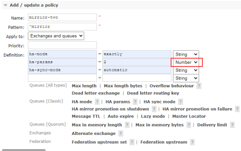
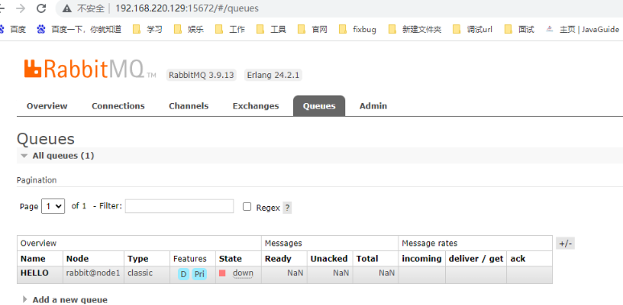
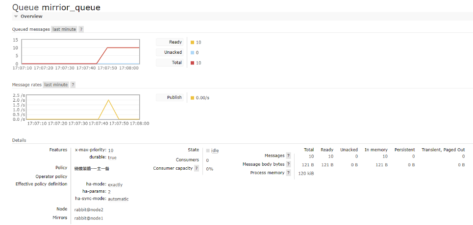
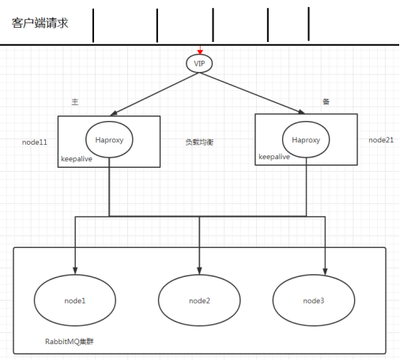

###10.2.镜像队列

#### 10.2.1.使用镜像的原因

如果 RabbitMQ 集群中只有一个 Broker 节点，那么该节点的失效将导致整体服务的临时性不可用，并且也可能会导致消息的丢失。
可以将所有消息都设置为持久化，并且对应队列的durable 属性也设置为true， 但是这样仍然无法避免由于缓存导致的问题：
因为消息在发送之后和被写入磁盘井执行刷盘动作之间存在一个短暂却会产生问题的时间窗。通过 publisherconfirm 机制能够确保客户端知道哪些消息
己经存入磁盘， 尽管如此，一般不希望遇到因单点故障导致的服务不可用。

引入镜像队列(Mirror Queue)的机制，可以将队列镜像到集群中的其他 Broker 节点之上，如果集群中的一个节点失效了，队列能自动地切换到镜像中的另一个节点上以保证服务的可用性。

#### 10.2.2.搭建步骤
1.启动三台集群节点
2.随便找一个节点添加 policy

^mirrior 表示以 mirrior为前缀

3.在 node1 上创建一个队列发送一条消息，队列存在镜像队列

使用node2 获取消息结果如下：

Caused by: com.rabbitmq.client.ShutdownSignalException: channel error; protocol method: #method<channel.close>(reply-code=404, reply-text=NOT_FOUND - home node 'rabbit@node1' of durable queue 'HELLO' in vhost '/' is down or inaccessible, class-id=60, method-id=20)
at com.rabbitmq.utility.ValueOrException.getValue(ValueOrException.java:66)
at com.rabbitmq.utility.BlockingValueOrException.uninterruptibleGetValue(BlockingValueOrException.java:36)
at com.rabbitmq.client.impl.AMQChannel$BlockingRpcContinuation.getReply(AMQChannel.java:502)
at com.rabbitmq.client.impl.ChannelN.basicConsume(ChannelN.java:1378)
... 4 more
Caused by: com.rabbitmq.client.ShutdownSignalException: channel error; protocol method: #method<channel.close>(reply-code=404, reply-text=NOT_FOUND - home node 'rabbit@node1' of durable queue 'HELLO' in vhost '/' is down or inaccessible, class-id=60, method-id=20)

表示集群中一个节点node1 宕机后，消息丢失。
所以需要镜像队列（备份消息）

###10.3.Haproxy+Keepalive 实现高可用负载均衡

#### 10.3.1.整体架构图

#### 10.3.2.Haproxy 实现负载均衡

HAProxy 提供高可用性、负载均衡及基于TCPHTTP 应用的代理，**支持虚拟主机，它是免费、快速并且可靠的一种解决方案**，包括 **Twitter,Reddit,StackOverflow,
GitHub 在内的多家知名互联网公司在使用**。HAProxy 实现了一种事件驱动、单一进程模型，此模型支持非常大的井发连接数。

扩展:[nginx,lvs,haproxy 之间的区别](http://www.ha97.com/5646.html)

#### 10.3.4.Keepalived 实现双机(主备)热备

试想如果前面配置的 HAProxy 主机突然宕机或者网卡失效，那么虽然 RbbitMQ 集群没有任何故障，但是对于外界的客户端来说所有的连接都会被断开结果将是灾难性的。
为了确保负载均衡服务的可靠性同样显得十分重要，这里就要**引入 Keepalived 它能够通过自身健康检查、资源接管功能做高可用(双机热备)，实现故障转移**.

