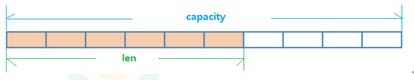

redis系统学习：
[【尚硅谷】Redis 6 入门到精通 超详细 教程](https://www.bilibili.com/video/BV1Rv41177Af?p=2)

#### session 共享问题?

1. 存储到客户端 cookie
2. session 复制
3. 用 nosql 数据库 进行用户信息的存储：存到内存中读取的速度更快。不需要经过io

### NoSQL 数据库
概述：
    NoSQL(NosQL = Not Only sQL )，意即“不仅仅是sQL”，泛指非关系型的数据库
    NoSQL不依赖业务逻辑方式存储，而以简单的 key-value模式存储。因此大大的增加了数据库的扩展能力。
    不遵循SQL标准
    不支持ACID 原子性、一致性、隔离性、持久性
    远超于SQL的性能

#### NoSQL适用场景
    对数据高并发的读写。
    海量数据的读写
    对数据高可扩展性的

#### NoSQL不适用场景。

    ·需要事务支持
    ·基于sql的结构化查询存储，处理复杂的关系,需要即席查询。
    ·(用不着sql的和用了sql也不行的情况，请考虑用NoSql ) 

#### 常见NoSQL数据库

## Redis概述

Redis是一个开源的 key-value存储系统。

和Memcached类似，它支持存储的value类型相对更多，包括string(字符串).list(链表)
、set(集合)、zset(sorted set --有序集合)和hash（哈希类型)。

这些数据类型都支持 push/pop、add/remove 及取交集并集和差集及更丰富的操作,而且这些操作都是原子性的。

在此基础上，Redis支持各种不同方式的排序。

和memcached 一样，为了保证效率，数据都是缓存在内存中。

区别的是 Redis会周期性的把更新的数据写入磁盘或者把修改操作写入追加的记录文件。

并且在此基础上实现了master-slave(主从)同步。

**单线程 + 多路io复用**

#### redis的应用场景

一：配合关系型数据库做高速缓存

    高频次，热门访问的数据，降低数据库IO.
    分布式架构，做session共享

二：多样的数据结构存储持久化数据：

    最新N个数据                  <========    通过list实现按自然时间排序的数据
    排行榜，Top N               <======== 利用zset(有序集合)
    时效性的数据，比如手机验证码  <========  Expire 过期
    计数器，秒杀                  <======== 原子性，自增方法INCR、DECR
    去除大量数据中的重复数据        <======== 利用Set集合
    构建队列                    <======== 利用list集合
    发布订阅消息系统                <======== publsub模式

#### redis 中linux的安装

[redis官网](https://redis.io)
[Redis中文官方网站](http://redis.cn/)
[redis下载](https://redis.io/download)
[redis 安装教程](https://www.cnblogs.com/hunanzp/p/12304622.html)
[配置文件参数说明](https://lion-wu.blog.csdn.net/article/details/108019877?spm=1001.2101.3001.6650.13&utm_medium=distribute.pc_relevant.none-task-blog-2%7Edefault%7ECTRLIST%7ERate-13.pc_relevant_default&depth_1-utm_source=distribute.pc_relevant.none-task-blog-2%7Edefault%7ECTRLIST%7ERate-13.pc_relevant_default&utm_relevant_index=16)

1. 下载：

   wget https://download.redis.io/releases/redis-6.2.6.tar.gz

2.解压

3.改名字

    mv redis-6.2.6 redis
4 
    
    cd redis

    pwd            /usr/local/redis

5 进入下载路径

    make

    cd src

    make install

6 修改配置文件 redis.conf

`cp /usr/local/redis/redis.conf redis.conf.bak`

vim

7

    [root@192 redis]# cd /usr/local/bin/
    [root@192 bin]# ls
    redis-benchmark  redis-check-aof  redis-check-rdb  redis-cli  redis-sentinel  redis-server
    [root@192 bin]# pwd
    /usr/local/bin
    [root@192 bin]#

    查看默认安装目录:
    redis-benchmark:性能测试工具，可以在自己本子运行，看看自己本子性能如何redis-check-aof:修复有问题的AOF文件，rdb和aof后面讲
    redis-check-dump:修复有问题的 dump.rdb文件
    redis-sentinel : Redis集群使用
    redis-server : Redis服务器启动命令
    redis-cli:客户端，操作入口

8 前台启动（不推荐）

    redis-server

9 后台启动 （推荐）

    cp /usr/local/redis/redis.conf /etc/redis.conf
    
    vim /etc/redis.conf
    
    # 把支持后台启动的配置 no 改为 yes 
    
    g
    /daemonize  
    ## 在redis.conf的 11% 254行
    shift 加冒号  
    wq
    
    #启动：
    
    redis-server /etc/redis.conf

    #进入redis客户端
    redis-cli

    #退出redis客户端
    exit

    #关闭
    reids-cli shutdown     #或 kill进程号

Reis知识：

#### 

查看当前库所有的key

    keys *  查看当前库所有key(匹配: keys *1)exists key判断某个key是否存在·
    type key                    查看你的 key是什么类型·
    del key                     删除指定的key 数据
    unlink key                  根据value选择非阻塞删除。 仅将 keys 从 keyspace元数据中删除，真正的删除会在后续异步操作。
    expire key 10               为给定的key设置过期时间·10秒钟
    ttl key                     查看还有多少秒过期，-1表示永不过期，-2表示已过期。
    select 0-16                 切换数据库。
    dbsize                      查看当前数据库的key的数量。

    慎用以下两个命令：
    flushdb                     清空当前库
    flushall                    通杀全部库

    -1 表示永不过期  -2 表示已过期

#### Redis五大数据类型：

String 是 Redis 最基本的类型，你可以理解成与Memcached一模一样的类型，一个 key 对应一个 value 。

String 类型是二进制安全的。意味着Redis的string可以包含任何数据。比如 jpg 图片或者序列化的对象。

String 类型是 Redis 最基本的数据类型，一个Redis 中字符串的 value 最多可以是512M

    set <key> <value>           添加键值对
    get <key>                   获取值
    setnx <key><value>          只有在key不存在时设置key的值,
    strlen <key>                获得值的长度
    incr <key>                  将key中储存的数字值增1 只能对数字值操作，如果为空，新增值为1
    decr <key>                  将key中储存的数字值减1

所谓原子操作是指不会被线程调度机制打断的操作;
这种操作一旦开始，就一直运行到结束，中间不会有任何context switch(切换到另 一个线程)。

(1）在单线程中，能够在单条指令中完成的操作都可以认为是"原子操作"，因为中断只能发生于指令之间。
(2）在多线程中，不能被其它进程（线程)打断的操作就叫原子操作。
Redis单命令的原子性主要得益于Redis的单线程。v

案例:
java 中的i++是否是原子操作?  **不是**

i=0;两个线程分别对i进行++100次,值是多少? 不是固定值，范围 2到200
 

i++ 三步： 
   1. i++ 
   1. 取值 
   2. ++赋值

setex <key><过期时间><value>         设置键值的同时，设置过期时间，单位秒。
getset <key><value>                 以新换旧，设置了新值同时获得旧值。

String 的数据结构为简单动态字符串(Simple Dynamic String,缩写SDS)。是可以修改的字符串，
内部结构实现上类似于Java的ArrayList，采用预分配冗余空间的方式来减少内存的频繁分配..

如图中所示，内部为当前字符串实际分配的空间capacity一般要高于实际字符串长度len。当字符串长度小于1M时，
扩容都是加倍现有的空间，如果超过1M，扩容时一次只会多扩1M的空间。需要注意的是字符串最大长度为512M。

####    Redis 的列表 List

单键多值

Redis列表是简单的字符串列表，按照插入顺序排序。你可以添加一个元素到列表的头部(左边）或者尾部(右边)。
它的底层实际是个双向链表，对两端的操作性能很高，通过索引下标的操作中间的节点性能会较差。

lpush/rpush .key><value1><value2><value3> .....          从左边/右边插入一个或多个值。

vlpop/rpop <key>                                        从左边/右边吐出一个值。值在键在，值光键亡。

rpoplpush <key1><key2>从<key1>                           列表右边吐出一个值，插到<key2>列表左边。

lrange <key><start><stop>v                               按照索引下标获得元素(从左到右)

决定跳过本章节。可能用到的很少
详情参考
[【尚硅谷】Redis 6 入门到精通 超详细 教程 P9 常用数据类型List列表](https://www.bilibili.com/video/BV1Rv41177Af?p=9&spm_id_from=pageDriver)

#### list 数据结构

    List的数据结构为快速链表quickList。
    首先在列表元素较少的情况下会使用一块连续的内存存储，这个结构是ziplist，也即是压缩列表。
    它将所有的元素紧挨着一起存储，分配的是一块连续的内存。
    当数据量比较多的时候才会改成quicklist。
    因为普通的链表需要的附加指针空间太大，会比较浪费空间。比如这个列表里存的只是int类型的数据，结构上还需要两个额外的指针prev和next。
    
    Redis将链表和ziplist结合起来组成了quicklist。也就是将多个ziplist使用双向指针串起来使用。这样既满足了快速的插入删除性能，
    又不会出现太大的空间冗余。

#### Redis 集合 Set
Redis set对外提供的功能与list类似是一个列表的功能，特殊之处在于set是可以自动排重的，当你需要存储一个列表数据，
又不希望出现重复数据时，set是一个很好的选择，并且set提供了判断某个成员是否在一个set集合内的重要接口，这个也是list所不能提供的。
Redis的Set是string类型的**无序集合。它底层其实是一个value为null的hash表**，所以添加，删除，查找的复杂度都是O(1)。
一个算法，随着数据的增加，执行时间的长短，如果是O(1)，数据增加，查找数据的时间不变

    sadd <key><value1><value2>          将一个或多个 member 元素加入到集合 key 中，已经存在的 member 元素将被忽略
    smembers <key>                      取出该集合的所有值。
    sismember <key><value>              判断集合<key>是否为含有该<value>值，有1，没有0
    scard<key>                          返回该集合的元素个数。
    srem <key><value1><value2>          删除集合中的某个元素。
    spop <key>                          随机从该集合中吐出一个值。
    srandmember <key><n>                随机从该集合中取出n个值。不会从集合中删除 。
    smove <source><destination>value    把集合中一个值从一个集合移动到另一个集合
    sinter <key1><key2>                 返回两个集合的交集元素。
    sunion <key1><key2>                 返回两个集合的并集元素。
    sdiff <key1><key2>                  返回两个集合的差集元素(key1中的，不包含key2中的)

#### redis中 Set 的数据结构：

    Set数据结构是dict字典，字典是用哈希表实现的。
    Java中HashSet的内部实现使用的是HashMap，只不过所有的value都指向同一个对象。Redis的set结构也是一样，
    它的内部也使用hash结构，所有的value都指向同一个内部值。

#### 哈希  Hash

Redis hash 是一个键值对集合。

Redis hash是一个string类型的**field和value的映射表**，hash特别适合用于存储对象。
类似Java里面的Map<String,Object>

用户ID为查找的key，存储的value用户对象包含姓名，年龄，生日等信息，如果用普通的key/value结构来存储

主要有以下2种存储方式：

    hset <key><field><value>                            给<key>集合中的  <field>键赋值<value>
    hget <key1><field>                                  从<key1>集合<field>取出 value
    hmset <key1><field1><value1><field2><value2>         批量设置hash的值
    hexists<key1><field>                                查看哈希表 key 中，给定域 field 是否存在。
    hkeys <key>                                         列出该hash集合的所有field
    hvals <key>                                         列出该hash集合的所有value
    hincrby <key><field><increment>                     为哈希表 key 中的域 field 的值加上增量 1   -1
    hsetnx <key><field><value>                          将哈希表 key 中的域 field 的值设置为 value ，当且仅当域 field 不存在 .

#### hash 数据结构

Hash类型对应的数据结构是两种：ziplist（压缩列表），hashtable（哈希表）。当field-value长度较短且个数较少时，使用ziplist，否则使用hashtable。

