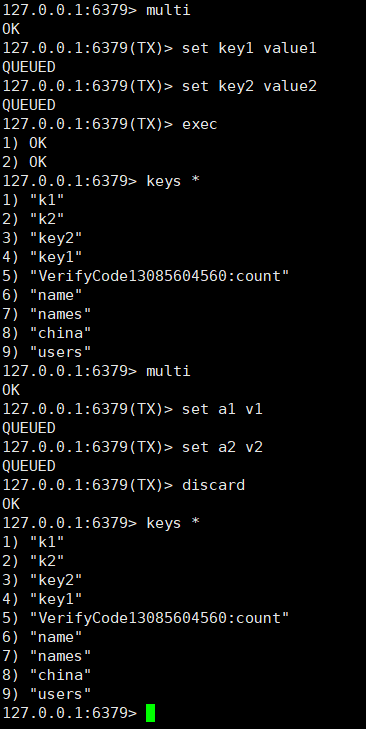

redis系统学习：
[【尚硅谷】Redis 6 入门到精通 超详细 教程](https://www.bilibili.com/video/BV1Rv41177Af?p=2)


#### session 共享问题?


1. 存储到客户端 cookie
2. session 复制
3. 用 nosql 数据库 进行用户信息的存储：存到内存中读取的速度更快。不需要经过io


### NoSQL 数据库
概述：
    NoSQL(NosQL = Not Only sQL )，意即“不仅仅是sQL”，泛指非关系型的数据库
    NoSQL不依赖业务逻辑方式存储，而以简单的 key-value模式存储。因此大大的增加了数据库的扩展能力。
    不遵循SQL标准
    不支持ACID 原子性、一致性、隔离性、持久性
    远超于SQL的性能

#### NoSQL适用场景
    对数据高并发的读写。
    海量数据的读写
    对数据高可扩展性的

#### NoSQL不适用场景。

    ·需要事务支持
    ·基于sql的结构化查询存储，处理复杂的关系,需要即席查询。
    ·(用不着sql的和用了sql也不行的情况，请考虑用NoSql ) 

#### 常见NoSQL数据库


## Redis概述

Redis是一个开源的 key-value存储系统。

和Memcached类似，它支持存储的value类型相对更多，包括string(字符串).list(链表)
、set(集合)、zset(sorted set --有序集合)和hash（哈希类型)。

这些数据类型都支持 push/pop、add/remove 及取交集并集和差集及更丰富的操作,而且这些操作都是原子性的。

在此基础上，Redis支持各种不同方式的排序。

和memcached 一样，为了保证效率，数据都是缓存在内存中。

区别的是 Redis会周期性的把更新的数据写入磁盘或者把修改操作写入追加的记录文件。

并且在此基础上实现了master-slave(主从)同步。

**单线程 + 多路io复用**

#### redis的应用场景

一：配合关系型数据库做高速缓存

    高频次，热门访问的数据，降低数据库IO.
    分布式架构，做session共享

二：多样的数据结构存储持久化数据：

    最新N个数据                  <========    通过list实现按自然时间排序的数据
    排行榜，Top N               <======== 利用zset(有序集合)
    时效性的数据，比如手机验证码  <========  Expire 过期
    计数器，秒杀                  <======== 原子性，自增方法INCR、DECR
    去除大量数据中的重复数据        <======== 利用Set集合
    构建队列                    <======== 利用list集合
    发布订阅消息系统                <======== publsub模式

#### redis 中linux的安装

[redis官网](https://redis.io)
[Redis中文官方网站](http://redis.cn/)
[redis下载](https://redis.io/download)
[redis 安装教程](https://www.cnblogs.com/hunanzp/p/12304622.html)
[redis配置文件参数说明](https://lion-wu.blog.csdn.net/article/details/108019877?spm=1001.2101.3001.6650.13&utm_medium=distribute.pc_relevant.none-task-blog-2%7Edefault%7ECTRLIST%7ERate-13.pc_relevant_default&depth_1-utm_source=distribute.pc_relevant.none-task-blog-2%7Edefault%7ECTRLIST%7ERate-13.pc_relevant_default&utm_relevant_index=16)

1. 下载：

   wget https://download.redis.io/releases/redis-6.2.6.tar.gz

2.解压

3.改名字

    mv redis-6.2.6 redis
4 
    
    cd redis

    pwd            /usr/local/redis

5 进入下载路径

    make

    cd src

    make install

6 修改配置文件 redis.conf

`cp /usr/local/redis/redis.conf redis.conf.bak`

vim

7

    [root@192 redis]# cd /usr/local/bin/
    [root@192 bin]# ls
    redis-benchmark  redis-check-aof  redis-check-rdb  redis-cli  redis-sentinel  redis-server
    [root@192 bin]# pwd
    /usr/local/bin
    [root@192 bin]#

    查看默认安装目录:
    redis-benchmark:性能测试工具，可以在自己本子运行，看看自己本子性能如何redis-check-aof:修复有问题的AOF文件，rdb和aof后面讲
    redis-check-dump:修复有问题的 dump.rdb文件
    redis-sentinel : Redis集群使用
    redis-server : Redis服务器启动命令
    redis-cli:客户端，操作入口

8 前台启动（不推荐）

    redis-server

9 后台启动 （推荐）

    cp /usr/local/redis/redis.conf /etc/redis.conf
    
    vim /etc/redis.conf
    
    # 把支持后台启动的配置 no 改为 yes 
    
    g
    /daemonize  
    ## 在redis.conf的 11% 254行
    shift 加冒号  
    wq
    
    #启动：
    
    redis-server /etc/redis.conf

    #进入redis客户端
    redis-cli

    #退出redis客户端
    exit

    #关闭
    reids-cli shutdown     #或 kill进程号

Reis知识：


[](http://www.redis.cn/commands.html)


#### 

查看当前库所有的key

    keys *  查看当前库所有key(匹配: keys *1)exists key判断某个key是否存在·
    type key                    查看你的 key是什么类型·
    del key                     删除指定的key 数据
    unlink key                  根据value选择非阻塞删除。 仅将 keys 从 keyspace元数据中删除，真正的删除会在后续异步操作。
    expire key 10               为给定的key设置过期时间·10秒钟
    ttl key                     查看还有多少秒过期，-1表示永不过期，-2表示已过期。
    select 0-16                 切换数据库。
    dbsize                      查看当前数据库的key的数量。

    慎用以下两个命令：
    flushdb                     清空当前库
    flushall                    通杀全部库


    -1 表示永不过期  -2 表示已过期


#### Redis五大数据类型：

String 是 Redis 最基本的类型，你可以理解成与Memcached一模一样的类型，一个 key 对应一个 value 。

String 类型是二进制安全的。意味着Redis的string可以包含任何数据。比如 jpg 图片或者序列化的对象。

String 类型是 Redis 最基本的数据类型，一个Redis 中字符串的 value 最多可以是512M

    set <key> <value>           添加键值对
    get <key>                   获取值
    setnx <key><value>          只有在key不存在时设置key的值,
    strlen <key>                获得值的长度
    incr <key>                  将key中储存的数字值增1 只能对数字值操作，如果为空，新增值为1
    decr <key>                  将key中储存的数字值减1


所谓原子操作是指不会被线程调度机制打断的操作;
这种操作一旦开始，就一直运行到结束，中间不会有任何context switch(切换到另 一个线程)。

(1）在单线程中，能够在单条指令中完成的操作都可以认为是"原子操作"，因为中断只能发生于指令之间。
(2）在多线程中，不能被其它进程（线程)打断的操作就叫原子操作。
Redis单命令的原子性主要得益于Redis的单线程。v

案例:
java 中的i++是否是原子操作?  **不是**

i=0;两个线程分别对i进行++100次,值是多少? 不是固定值，范围 2到200
 


i++ 三步： 
   1. i++ 
   1. 取值 
   2. ++赋值


setex <key><过期时间><value>         设置键值的同时，设置过期时间，单位秒。
getset <key><value>                 以新换旧，设置了新值同时获得旧值。


String 的数据结构为简单动态字符串(Simple Dynamic String,缩写SDS)。是可以修改的字符串，
内部结构实现上类似于Java的ArrayList，采用预分配冗余空间的方式来减少内存的频繁分配..

如图中所示，内部为当前字符串实际分配的空间capacity一般要高于实际字符串长度len。当字符串长度小于1M时，
扩容都是加倍现有的空间，如果超过1M，扩容时一次只会多扩1M的空间。需要注意的是字符串最大长度为512M。


####    Redis 的列表 List

单键多值

Redis列表是简单的字符串列表，按照插入顺序排序。你可以添加一个元素到列表的头部(左边）或者尾部(右边)。
它的底层实际是个双向链表，对两端的操作性能很高，通过索引下标的操作中间的节点性能会较差。

lpush/rpush .key><value1><value2><value3> .....          从左边/右边插入一个或多个值。

vlpop/rpop <key>                                        从左边/右边吐出一个值。值在键在，值光键亡。

rpoplpush <key1><key2>从<key1>                           列表右边吐出一个值，插到<key2>列表左边。

lrange <key><start><stop>v                               按照索引下标获得元素(从左到右)


决定跳过本章节。可能用到的很少
详情参考
[【尚硅谷】Redis 6 入门到精通 超详细 教程 P9 常用数据类型List列表](https://www.bilibili.com/video/BV1Rv41177Af?p=9&spm_id_from=pageDriver)

#### list 数据结构

    List的数据结构为快速链表quickList。
    首先在列表元素较少的情况下会使用一块连续的内存存储，这个结构是ziplist，也即是压缩列表。
    它将所有的元素紧挨着一起存储，分配的是一块连续的内存。
    当数据量比较多的时候才会改成quicklist。
    因为普通的链表需要的附加指针空间太大，会比较浪费空间。比如这个列表里存的只是int类型的数据，结构上还需要两个额外的指针prev和next。
    
    Redis将链表和ziplist结合起来组成了quicklist。也就是将多个ziplist使用双向指针串起来使用。这样既满足了快速的插入删除性能，
    又不会出现太大的空间冗余。

#### Redis 集合 Set
Redis set对外提供的功能与list类似是一个列表的功能，特殊之处在于set是可以自动排重的，当你需要存储一个列表数据，
又不希望出现重复数据时，set是一个很好的选择，并且set提供了判断某个成员是否在一个set集合内的重要接口，这个也是list所不能提供的。
Redis的Set是string类型的**无序集合。它底层其实是一个value为null的hash表**，所以添加，删除，查找的复杂度都是O(1)。
一个算法，随着数据的增加，执行时间的长短，如果是O(1)，数据增加，查找数据的时间不变

    sadd <key><value1><value2>          将一个或多个 member 元素加入到集合 key 中，已经存在的 member 元素将被忽略
    smembers <key>                      取出该集合的所有值。
    sismember <key><value>              判断集合<key>是否为含有该<value>值，有1，没有0
    scard<key>                          返回该集合的元素个数。
    srem <key><value1><value2>          删除集合中的某个元素。
    spop <key>                          随机从该集合中吐出一个值。
    srandmember <key><n>                随机从该集合中取出n个值。不会从集合中删除 。
    smove <source><destination>value    把集合中一个值从一个集合移动到另一个集合
    sinter <key1><key2>                 返回两个集合的交集元素。
    sunion <key1><key2>                 返回两个集合的并集元素。
    sdiff <key1><key2>                  返回两个集合的差集元素(key1中的，不包含key2中的)


#### redis中 Set 的数据结构：

    Set数据结构是dict字典，字典是用哈希表实现的。
    Java中HashSet的内部实现使用的是HashMap，只不过所有的value都指向同一个对象。Redis的set结构也是一样，
    它的内部也使用hash结构，所有的value都指向同一个内部值。

#### 哈希  Hash

Redis hash 是一个键值对集合。

Redis hash是一个string类型的**field和value的映射表**，hash特别适合用于存储对象。
类似Java里面的Map<String,Object>

用户ID为查找的key，存储的value用户对象包含姓名，年龄，生日等信息，如果用普通的key/value结构来存储

主要有以下2种存储方式：


    hset <key><field><value>                            给<key>集合中的  <field>键赋值<value>
    hget <key1><field>                                  从<key1>集合<field>取出 value
    hmset <key1><field1><value1><field2><value2>         批量设置hash的值
    hexists<key1><field>                                查看哈希表 key 中，给定域 field 是否存在。
    hkeys <key>                                         列出该hash集合的所有field
    hvals <key>                                         列出该hash集合的所有value
    hincrby <key><field><increment>                     为哈希表 key 中的域 field 的值加上增量 1   -1
    hsetnx <key><field><value>                          将哈希表 key 中的域 field 的值设置为 value ，当且仅当域 field 不存在 .


#### hash 数据结构

Hash类型对应的数据结构是两种：ziplist（压缩列表），hashtable（哈希表）。当field-value长度较短且个数较少时，使用ziplist，否则使用hashtable。


#### redis的配置文件讲解

[redis配置文件参数说明](https://lion-wu.blog.csdn.net/article/details/108019877?spm=1001.2101.3001.6650.13&utm_medium=distribute.pc_relevant.none-task-blog-2%7Edefault%7ECTRLIST%7ERate-13.pc_relevant_default&depth_1-utm_source=distribute.pc_relevant.none-task-blog-2%7Edefault%7ECTRLIST%7ERate-13.pc_relevant_default&utm_relevant_index=16)

更改的地方：

    bind                注释掉 bind 127.0.0.1 默认情况bind=127.0.0.1只能接受本机的访问请求。注释掉(不写的情况下)则无限制接受任何ip地址的访问。生产环境肯定要写你应用服务器的地址；服务器是需要远程访问的，所以需要将其注释掉 。如果开启了protected-mode，那么在没有设定bind ip且没有设密码的情况下，Redis只允许接受本机的响应

    protected-mode      将本机访问保护模式设置no 来支持远程访问

    port                默认端口6379 (要更改 搜索 port) 

    timeout             一个空闲的客户端维持多少秒会关闭，0表示关闭该功能。即永不关闭

    tcp-keepalive        对访问客户端的一种心跳检测，每个n秒检测一次。单位为秒，如果设置为0，则不会进行Keepalive检测，建议设置成60 

    daemonize           是否为后台进程，设置为yes

    loglevel            指定日志记录级别，Redis总共支持四个级别：debug、verbose、notice、warning，默认为notice 四个级别根据使用阶段来选择，生产环境选择notice 或者warning

    databases 16        设定库的数量 默认16，默认数据库为0，可以使用SELECT <dbid>命令在连接上指定数据库id

    requirrepass        访问密码的查看、设置和取消

    maxclients          设置redis同时可以与多少个客户端进行连接

    maxmemory 
                        	建议必须设置，否则，将内存占满，造成服务器宕机
                        	设置redis可以使用的内存量。一旦到达内存使用上限，redis将会试图移除内部数据，移除规则可以通过maxmemory-policy来指定。
                        	如果redis无法根据移除规则来移除内存中的数据，或者设置了“不允许移除”，那么redis则会针对那些需要申请内存的指令返回错误信息，比如SET、LPUSH等。
                        	但是对于无内存申请的指令，仍然会正常响应，比如GET等。如果你的redis是主redis（说明你的redis有从redis），那么在设置内存使用上限时，需要在系统中留出一些内存空间给同步队列缓存，只有在你设置的是“不移除”的情况下，才不用考虑这个因素。

   maxmemory-policy

                        	volatile-lru：使用LRU算法移除key，只对设置了过期时间的键；（最近最少使用）
                        	allkeys-lru：在所有集合key中，使用LRU算法移除key
                        	volatile-random：在过期集合中移除随机的key，只对设置了过期时间的键
                        	allkeys-random：在所有集合key中，移除随机的key
                        	volatile-ttl：移除那些TTL值最小的key，即那些最近要过期的key
                        	noeviction：不进行移除。针对写操作，只是返回错误信息

####  5.	Redis的发布和订阅

什么是发布和订阅

**Redis 发布订阅 (pub/sub) 是一种消息通信模式：发送者 (pub) 发送消息，订阅者 (sub) 接收消息。
Redis 客户端可以订阅任意数量的频道**


    1、打开一个客户端订阅channel1
    SUBSCRIBE channel
    
    2、打开另一个客户端，给channel1发布消息hello
    publish channel1 hello
    
        返回的1是订阅者数量
    3、打开第一个客户端可以看到发送的消息
    
    注：发布的消息没有持久化，如果在订阅的客户端收不到hello，只能收到订阅后发布的消息


#### 6 redis中新的数据类型     Bitmaps/HyperLogLog/Geospatial

这三节暂时跳过--
[redisbitmaps尚硅谷](https://www.bilibili.com/video/BV1Rv41177Af?p=17)
[redis HyperLogLog 尚硅谷](https://www.bilibili.com/video/BV1Rv41177Af?p=18)
[redis Geospatial 尚硅谷](https://www.bilibili.com/video/BV1Rv41177Af?p=19)

## redis客户端工具 通过 Jedis操作 Redis6

```java
package com.atguigu.jedis;

import org.junit.Test;
import redis.clients.jedis.Jedis;

import java.util.List;
import java.util.Set;

/**
 * redis java 操作 redis
 *
 * @author pengtao
 * @createdate 2022/03/06 0006
 */
public class JedisDemo0 {

    public static void main(String[] args) {

        // 创建 Jedis 对象  import redis.clients.jedis.Jedis;

        String host = "192.168.159.132";
        int port = 6379;

        Jedis jedis = new Jedis(host, port);

        // 测试
        String value = jedis.ping();

        System.out.println(value); // PONG

        /**
         timeout报错：
         考虑防火墙放行端口
         firewall-cmd --permanent --add-port=6379/tcp

         firewall-cmd --reload

         Exception in thread "main" redis.clients.jedis.exceptions.JedisConnectionException:
         Failed to connect to any host resolved for DNS name.
         报错解决：需要把配置文件 redis.conf 设置好后  重启
         ps -ef|grep redis
         kill -9 pid
         redis-server /etc/redis.conf

         * */
    }

    /** 创建 Jedis 对象 */
    public static Jedis getRedisConnection() {
        String host = "192.168.159.132";
        int port = 6379;

        Jedis jedis = new Jedis(host, port);
        return jedis;
    }

    //操作zset
    @Test
    public void testZset() {
        //创建Jedis对象
        Jedis jedis = getRedisConnection();

        jedis.zadd("china", 100d, "shanghai");

        List<String> china = jedis.zrange("china", 0, -1);
        System.out.println(china);

        jedis.close();
    }

    //操作hash
    @Test
    public void testHash() {
        //创建Jedis对象
        Jedis jedis = getRedisConnection();

        jedis.hset("users","age","20");
        String hget = jedis.hget("users", "age");

        System.out.println(hget);
        System.out.println("操作类型：" + jedis.type("users"));

        jedis.close();
    }

    //操作set
    @Test
    public void testDemoSet() {
        //创建Jedis对象
        Jedis jedis = getRedisConnection();

        jedis.sadd("names","lucy");
        jedis.sadd("names","mary");

        Set<String> names = jedis.smembers("names");
        System.out.println(names);
        System.out.println("操作类型：" + jedis.type("names"));
        jedis.close();
    }

    //操作list
    @Test
    public void testRedisList() {
        //创建Jedis对象
        Jedis jedis = getRedisConnection();

        jedis.lpush("key1","lucy", "mary", "jack");

        List<String> values = jedis.lrange("key1", 0, -1);
        System.out.println("values: " + values);
        jedis.close();
    }

    //操作key string
    @Test
    public void demo1() {
        //创建Jedis对象
        Jedis jedis = getRedisConnection();

        //添加
        jedis.set("name", "lucy");

        //获取
        String name = jedis.get("name");
        System.out.println(name);

        //设置多个key-value
        jedis.mset("k1", "v1", "k2", "v2");
        List<String> mget = jedis.mget("k1", "k2");
        System.out.println(mget);

        Set<String> keys = jedis.keys("*");
        for(String key : keys) {
            System.out.println("keys:" + key);
        }
        jedis.close();
    }
}

```

完成一个手机验证码功能

    要求：
  * 1、输入手机号，点击发送后随机生成6位数字码，2分钟有效
  * 2、输入验证码，点击验证，返回成功或失败
  * 3、每个手机号每天只能输入3次
```java

```

#### redis 事务

Redis事务是一个单独的隔离操作：事务中的所有命令都会序列化、按顺序地执行。
事务在执行的过程中，不会被其他客户端发送来的命令请求所打断。

Redis事务的主要作用就是串联多个命令防止别的命令插队。

##### Multi、Exec、discard
从输入Multi命令开始，输入的命令都会依次进入命令队列中，但不会执行，直到输入Exec后，
Redis会将之前的命令队列中的命令依次执行。

组队的过程中可以通过discard来放弃组队。




#### 事务的错误处理

在组队的时候有一个命令失败，那么十五中的所有命令都不会执行。返回报错提示：
(error) EXECABORT Transaction discarded because of previous errors.


如果组队中没有错误，执行中谁有错误谁不执行。其他正确的命令将执行

#### 事务冲突问题

**悲观锁(Pessimistic Lock)**, 顾名思义，就是很悲观，每次去拿数据的时候都认为别人会修改，所以每次在拿数据的时候都会上锁，
这样别人想拿这个数据就会block直到它拿到锁。传统的关系型数据库里边就用到了很多这种锁机制，比如行锁，表锁等，读锁，写锁等，
都是在做操作之前先上锁。


**乐观锁(Optimistic Lock)**, 顾名思义，就是很乐观，每次去拿数据的时候都认为别人不会修改，所以不会上锁，但是在更新的时候会
**判断一下在此期间别人有没有去更新这个数据**，
可以**使用版本号**等机制。**乐观锁适用于多读的应用类型，这样可以提高吞吐量。Redis就是利用这种check-and-set机制实现事务的**。

现实中乐观锁的场景：抢票

10.5.4.	WATCH key [key ...]
在执行multi之前，先执行watch key1 [key2],可以监视一个(或多个) key ，如果在事务执行之前这个(或这些) key 被其他命令所改动，那么事务将被打断。


#### unwatch
取消 WATCH 命令对所有 key 的监视。
如果在执行 WATCH 命令之后，EXEC 命令或DISCARD 命令先被执行了的话，那么就不需要再执行UNWATCH 了。
[](http://doc.redisfans.com/transaction/exec.html)


#### Redis事务三特性

**单独的隔离操作**
    事务中的所有命令都会序列化、按顺序地执行。事务在执行的过程中，不会被其他客户端发送来的命令请求所打断。

**没有隔离级别的概念**
    队列中的命令没有提交之前都不会实际被执行，因为事务提交前任何指令都不会被实际执行

**不保证原子性**
    事务中如果有一条命令执行失败，其后的命令仍然会被执行，没有回滚 


#### 事务和锁机制秒杀案例(P24-P27未在 自己实现 可能需要做一个check)

使用工具ab模拟测试
CentOS6 默认安装
CentOS7需要手动安装
联网：yum install httpd-tools

ab -help

vim postfile 模拟表单提交参数,以&符号结尾;存放当前目录。
内容：prodid=0101&

ab -n 2000 -c 200 -k -p ~/postfile -T application/x-www-form-urlencoded http://本机ip:8081/Seckill/doseckill


7到7:45  28 29
8到8:45 30 31
9到9:30 32 33


## Redis 持久化操作-RDB 

[官网介绍：](http://www.redis.io)
[官网介绍：](https://redis.io/topics/persistence#snapshotting)

本页提供了 Redis 持久性的技术说明，**建议所有 Redis 用户阅读**。有关 Redis 持久性及其提供的持久性保证的更广泛概述，您可能还想阅读 Redis 持久性揭秘。

Redis Persistence
Redis 提供了一系列不同的持久性选项：

RDB（Redis 数据库）：**RDB 按指定的时间间隔内执行 将数据集的快照写入到磁盘中的操作。**
AOF（仅追加文件 Append Only File）：AOF 持久性已日志的形式来记录服务器接收的每个写入操作(读操作不可记录)，这些操作将在服务器启动时再次播放，从而重建原始数据集。

使用与 Redis 协议本身相同的格式以仅追加的方式记录命令。
Redis 能够在日志变得太大时在后台重写日志。
无持久性：如果您愿意，可以完全禁用持久性，前提是您希望数据在服务器运行期间一直存在。
RDB + AOF：可以在同一实例中同时组合 AOF 和 RDB。请注意，在这种情况下，当 Redis 重新启动时，AOF 文件将用于重建原始数据集，因为它保证是最完整的。
要了解的最重要的事情是RDB和AOF持久性之间的不同权衡。让我们从RDB开始：

####RDB 的优势

    RDB 是 Redis 数据的非常紧凑的单文件时间点表示形式。RDB文件非常适合备份。例如，您可能希望在最近 24 小时内每小时存档一次 RDB 文件，并希望每天保存一个 RDB 快照，
    持续 30 天。这使您可以在发生灾难时轻松还原数据集的不同版本。
    RDB非常适合灾难恢复，它是一个紧凑的文件，可以传输到远数据中心或Amazon S3（可能加密）。
    RDB最大限度地提高了Redis的性能，因为Redis父进程为了持久化而需要做的唯一工作就是分叉一个子进程，它将完成其余的所有事情。父进程永远不会执行磁盘 I/O 或类似操作。
    与AOF相比，RDB允许使用大型数据集更快地重新启动。
    在副本上，RDB 支持在重新启动和故障转移后进行部分重新同步。

#### RDB的缺点

    如果您需要在 Redis 停止工作（例如在断电后）将数据丢失的可能性降至最低，则 RDB 并不好。您可以在生成 RDB 的位置配置不同的保存点（例如，在对数据集进行至少 5 分钟和 100 次写入后，
    您可以有多个保存点）。但是，您通常每五分钟或更长时间创建一个RDB快照，因此，如果Redis因任何原因在没有正确关闭的情况下停止工作，您应该准备好丢失最新分钟的数据。
    RDB 需要经常分叉（），以便使用子进程在磁盘上持久保存。如果数据集很大，则 fork（） 可能会非常耗时，并且如果数据集非常大且 CPU 性能不是很高，
    则可能导致 Redis 停止为客户端提供服务数毫秒甚至一秒钟。AOF 还需要分叉（），但频率较低，您可以调整重写日志的频率，而无需在持久性上进行任何权衡。

#### AOF 优势

    使用 AOF Redis 更加持久：您可以拥有不同的 fsync 策略：根本没有 fsync，每秒 fsync 一次，每次查询时 fsync。使用 fsync 的默认策略，
    每秒写入性能仍然很好（fsync 是使用后台线程执行的，当没有 fsync 正在进行时，主线程将努力执行写入），但您只能损失一秒钟的写入。
    AOF 日志是仅追加日志，因此在断电时不会出现寻道或损坏问题。即使由于某种原因（磁盘已满或其他原因），日志也能够以半写的命令结尾，该工具也可以轻松修复它。redis-check-aof
    AOF 以易于理解和解析的格式一个接一个地包含所有操作的日志。您甚至可以轻松导出AOF文件。例如，即使您不小心使用 FLUSHALL 命令刷新了所有内容，
    只要在此期间未执行日志重写，您仍然可以通过停止服务器、删除最新命令并再次重新启动 Redis 来保存数据集。

#### AOF 的缺点

    AOF 文件通常大于同一数据集的等效 RDB 文件。
    AOF 可能比 RDB 慢，具体取决于确切的 fsync 策略。一般来说，将 fsync 设置为每秒一次的性能仍然非常高，并且在禁用 fsync 的情况下，即使在高负载下，它也应该与 RDB 一样快。
    尽管如此，RDB仍然能够提供更多关于最大延迟的保证，即使在巨大的写入负载的情况下也是如此。
红< 7.0

如果在重写期间对数据库有写入操作，AOF 可能会使用大量内存（这些写入操作在内存中，并在末尾写入新的 AOF）。
在重写期间到达的所有写入命令都会写入磁盘两次。
Redis 可以在重写结束时冻结写入这些写入命令并将其同步到新的 AOF 文件。

好的，那么我应该使用什么呢？

一般迹象表明，如果你想要一定程度的数据安全性，你应该使用这两种持久性方法，与PostgreSQL可以为你提供的数据安全相媲美。

如果您非常关心您的数据，但在发生灾难时仍然可以忍受几分钟的数据丢失，那么您可以单独使用RDB。

有许多用户单独使用 AOF，但我们不鼓励这样做，因为不时拥有 RDB 快照对于执行数据库备份、加快重新启动速度以及在 AOF 引擎中出现错误是一个好主意。

注意：由于所有这些原因，**我们最终可能会在未来将AOF和RDB统一为一个单一的持久性模型（长期计划）。**

以下各节将说明有关这两种持久性模型的更多详细信息。


快照
默认情况下，Redis 将数据集的快照保存在磁盘上，保存在名为 的二进制文件中。您可以配置 Redis，使其在数据集中至少有 M 个更改时每 N 秒保存一次数据集，
或者您可以手动调用 SAVE 或 BGSAVE 命令。**dump.rdb**

例如，如果至少更改了 1000 个键，则此配置将使 Redis 每 60 秒自动将数据集转储到磁盘：

save 60 1000
此策略称为快照。

它是如何运作的
每当 Redis 需要将数据集转储到磁盘时，都会发生以下情况：

Redis forks.我们现在有一个孩子和一个父进程。

子级开始将数据集写入临时 RDB 文件。

当子级完成写入新的 RDB 文件时，它将替换旧的 RDB 文件。

此方法允许 Redis 从写入时复制语义中受益。


仅追加文件
快照不是很持久。如果运行 Redis 的计算机停止运行、电源线出现故障或实例意外发生故障，则写入 Redis 的最新数据将丢失。虽然对于某些应用程序来说，这可能不是什么大问题，但存在完全持久性的用例，在这些情况下，仅使用Redis快照并不是一个可行的选择。kill -9

仅追加文件是 Redis 的替代、完全持久的策略。它在1.1版中可用。

您可以在配置文件中打开 AOF：

appendonly yes

从现在开始，每次 Redis 收到更改数据集的命令（例如 SET）时，它都会将其附加到 AOF。当您重新启动 Redis 时，它将重新播放 AOF 以重建状态。

从 Redis 7.0.0 开始，Redis 使用多部分 AOF 机制。也就是说，原始的单个 AOF 文件被拆分为基本文件（最多一个）和增量文件（可能有多个）。基文件表示重写 AOF 时存在的数据的初始（RDB 或 AOF 格式）快照。增量文件包含自上次创建基本 AOF 文件以来的增量更改。所有这些文件都放在单独的目录中，并由清单文件跟踪。

日志重写
正如您可以猜到的那样，随着写入操作的执行，AOF 会变得越来越大。例如，如果将计数器递增 100 倍，则最终将在数据集中得到一个包含最终值的键，但在 AOF 中包含 100 个条目。不需要其中 99 个条目来重建当前状态。

重写是完全安全的。当 Redis 继续追加到旧文件时，将生成一个全新的文件，其中包含创建当前数据集所需的最少操作集，一旦第二个文件准备就绪，Redis 就会切换两个文件并开始追加到新文件。

因此，Redis支持一个有趣的功能：它能够在后台重建AOF，而不会中断对客户端的服务。每当您发出BGREWRITEAOF Redis时，Redis都会写入在内存中重建当前数据集所需的最短命令序列。如果您将 AOF 与 Redis 2.2 配合使用，则需要不时运行 BGREWRITEAOF。由于 Redis 2.4 能够自动触发日志重写（有关详细信息，请参阅示例配置文件）。

从 Redis 7.0.0 开始，当计划重写 AOF 时，Redis 父进程将打开一个新的增量 AOF 文件以继续写入。子进程执行重写逻辑并生成新的基本 AOF。Redis 将使用临时清单文件来跟踪新生成的基本文件和增量文件。准备就绪后，Redis 将执行原子替换操作，以使此临时清单文件生效。为了避免在 AOF 重写反复失败和重试时创建许多增量文件的问题，Redis 引入了 AOF 重写限制机制，以确保以越来越慢的速度重试失败的 AOF 重写。

仅追加文件的持久性如何？
您可以配置 Redis 在磁盘上同步数据的次数。有三个选项：

appendfsync always：每次将新命令追加到 AOF 时。非常非常慢，非常安全。请注意，在执行来自多个客户端或管道的一批命令后，这些命令将附加到 AOF，因此这意味着一次写入和一次 fsync（在发送回复之前）。fsync
appendfsync everysec：每秒。足够快（因为版本 2.4 可能与快照一样快），如果发生灾难，您可能会丢失 1 秒钟的数据。fsync
appendfsync no：从不，只需将您的数据交到操作系统手中即可。更快，更不安全的方法。通常，Linux 使用此配置每 30 秒刷新一次数据，但这取决于内核的确切调整。fsync
建议的（也是默认的）策略是每秒。它既非常快又非常安全。该策略在实践中非常慢，但它支持组提交，因此如果有多个并行写入，Redis 将尝试执行单个操作。fsyncalwaysfsync

如果我的 AOF 被截断，我该怎么办？
服务器在写入 AOF 文件时崩溃，或者存储 AOF 文件的卷在写入时已满。发生这种情况时，AOF 仍包含表示数据集的给定时间点版本的一致数据（使用默认 AOF fsync 策略时，该版本可能长达一秒），但 AOF 中的最后一个命令可能会被截断。Redis 的最新主要版本无论如何都可以加载 AOF，只需丢弃文件中最后一个格式不正确的命令即可。在这种情况下，服务器将发出如下所示的日志：

* Reading RDB preamble from AOF file...
* Reading the remaining AOF tail...
# !!! Warning: short read while loading the AOF file !!!
# !!! Truncating the AOF at offset 439 !!!
# AOF loaded anyway because aof-load-truncated is enabled
如果需要，您可以更改默认配置以强制 Redis 在这种情况下停止，但默认配置是继续，而不管文件中的最后一个命令格式不正确，以便保证重新启动后的可用性。

旧版本的 Redis 可能无法恢复，可能需要执行以下步骤：

创建 AOF 文件的备份副本。
使用Redis附带的工具修复原始文件：redis-check-aof

$ redis-check-aof --fix

（可选）用于检查两个文件之间的区别。diff -u

使用固定文件重新启动服务器。

如果我的 AOF 已损坏，我该怎么办？
如果AOF文件不仅被截断，而且被损坏，中间有无效的字节序列，那么事情就会更加复杂。Redis 会在启动时抱怨并中止：

* Reading the remaining AOF tail...
# Bad file format reading the append only file: make a backup of your AOF file, then use ./redis-check-aof --fix <filename>
最好的办法是运行该实用程序，最初没有选项，然后了解问题，跳转到文件中的给定偏移量，并查看是否可以手动修复文件：AOF使用Redis协议的相同格式，并且手动修复非常简单。否则，可以让实用程序为我们修复文件，但是在这种情况下，从无效部分到文件末尾的所有AOF部分都可能被丢弃，如果损坏恰好在文件的初始部分，则会导致大量数据丢失。redis-check-aof--fix

它是如何运作的
日志重写使用已用于快照的相同写入时复制技巧。这是它的工作原理：

Redis >= 7.0

Redis 分叉，所以现在我们有一个子进程和一个父进程。

子级开始在临时文件中写入新的基础 AOF。

父级打开一个新的增量 AOF 文件以继续写入更新。如果重写失败，则旧的基文件和增量文件（如果有）加上这个新打开的增量文件表示完整的更新数据集，因此我们是安全的。

当子级完成重写基文件时，父级将收到一个信号，并使用新打开的增量文件和子级生成的基本文件来生成临时清单，并保留它。

利润！现在 Redis 执行清单文件的原子交换，以便此 AOF 重写的结果生效。Redis 还会清理旧的基本文件和任何未使用的增量文件。

红< 7.0

Redis 分叉，所以现在我们有一个子进程和一个父进程。

子项开始在临时文件中写入新的 AOF。

父级将所有新更改累积到内存中缓冲区中（但同时它将新更改写入旧的仅追加文件中，因此如果重写失败，我们是安全的）。

当子级完成重写文件时，父级会收到一个信号，并在子级生成的文件末尾追加内存中缓冲区。

利润！现在，Redis 以原子方式将新文件重命名到旧文件上，并开始将新数据追加到新文件中。

如果我当前使用的是 dump.rdb 快照，如何切换到 AOF？
在版本2.0及更高版本中执行此操作的过程不同，因为您可以猜到自Redis 2.2以来它更简单，并且根本不需要重新启动。

Redis >= 2.2

备份最新的 dump.rdb 文件。
将此备份传输到安全的位置。
发出以下两个命令：
redis-cli config set appendonly yes
redis-cli config set save ""
请确保您的数据库包含的键数与切换前所包含的键数相同。
确保将写入操作正确追加到仅追加文件。
第一个 CONFIG 命令启用"仅追加文件"持久性。

第二个 CONFIG 命令用于关闭快照持久性。这是可选的，如果您愿意，可以启用这两种持久性方法。

重要说明：请记住编辑 redis.conf 以打开 AOF，否则，当您重新启动服务器时，配置更改将丢失，服务器将以旧配置重新启动。

瑞迪斯 2.0

备份最新的 dump.rdb 文件。
将此备份传输到安全的位置。
停止对数据库的所有写入！
发出 .这将创建仅追加文件。redis-cli BGREWRITEAOF
在 Redis 完成生成 AOF 转储时停止服务器。
Edit redis.conf end enable only append file persistence。
重新启动服务器。
请确保您的数据库包含的键数与切换前所包含的键数相同。
确保将写入操作正确追加到仅追加文件。
AOF 和 RDB 持久性之间的交互
Redis >= 2.4 可确保避免在 RDB 快照操作仍在进行时触发 AOF 重写，或在 AOF 重写过程中允许 BGSAVE。这可以防止两个 Redis 后台进程同时执行繁重的磁盘 I/O。

当正在进行快照并且用户使用 BGREWRITEAOF 显式请求日志重写操作时，服务器将使用 OK 状态代码进行回复，告知用户已计划该操作，并且一旦快照完成，重写将开始。

如果同时启用了 AOF 和 RDB 持久性，并且 Redis 重新启动 AOF 文件将用于重建原始数据集，因为它保证是最完整的。

备份 Redis 数据
在开始本节之前，请确保阅读以下句子：确保备份数据库。磁盘损坏，云中的实例消失，等等：没有备份意味着数据消失到/dev/null中的巨大风险。

Redis 非常适合数据备份，因为您可以在数据库运行时复制 RDB 文件：RDB 一旦生成，就永远不会被修改，而当它被生成时，它使用一个临时名称，并且只有在新快照完成时才使用 rename（2） 以原子方式重命名为其最终目标。

这意味着在服务器运行时复制 RDB 文件是完全安全的。这是我们的建议：

在服务器中创建一个 cron 作业，在一个目录中创建 RDB 文件的每小时快照，并在另一个目录中创建每日快照。
每次运行 cron 脚本时，请确保调用该命令以确保删除太旧的快照：例如，您可以拍摄最近 48 小时的每小时快照，以及一到两个月的每日快照。确保使用日期和时间信息命名快照。find
每天至少一次确保将 RDB 快照传输到数据中心外部，或者至少在运行 Redis 实例的物理机外部传输 RDB 快照。
备份 AOF 持久性
如果您运行的 Redis 实例仅启用了 AOF 持久性，您仍然可以执行备份。从 Redis 7.0.0 开始，AOF 文件被拆分为多个文件，这些文件驻留在由配置确定的单个目录中。在正常操作期间，您需要做的就是复制/压缩此目录中的文件以实现备份。但是，如果在重写期间执行此操作，则最终可能会得到无效的备份。要解决此问题，您必须在备份期间禁用 AOF 重写：appendddirname

使用
CONFIG SET
关闭自动重写 确保在此期间不要手动启动重写（使用 BGREWRITEAOF）。auto-aof-rewrite-percentage 0
使用
INFO 检查当前是否正在重写，
并验证是否为 0。如果为 1，则需要等待重写完成。persistenceaof_rewrite_in_progress
现在，您可以安全地复制目录中的文件。appenddirname
完成后重新启用重写：
配置集 auto-aof-rewrite-percentage <prev-value>
注意：如果要最大程度地减少禁用 AOF 重写的时间，则可以创建指向（在上面的步骤 3 中）中的文件的硬链接，然后在创建硬链接后重新启用 rewites（步骤 4）。现在，您可以复制/压缩硬链接，并在完成后将其删除。这是有效的，因为 Redis 保证它只追加到此目录中的文件，或者在必要时完全替换它们，因此在任何给定的时间点，内容都应该是一致的。appenddirname

注意：如果要处理服务器在备份期间重新启动的情况，并确保重新启动后不会自动开始重写，则可以更改上面的步骤 1，以通过 CONFIG REWRITE 保留更新的配置。只需确保在完成后重新启用自动重写（步骤 4），并使用另一个配置重写将其保留。

在版本 7.0.0 之前，只需复制 aof 文件即可备份 AOF 文件（如备份 RDB 快照）。该文件可能缺少最终部分，但 Redis 仍能够加载它（请参阅前面有关截断的 AOF 文件的部分）。

灾难恢复
Redis 环境中的灾难恢复与备份基本相同，并且能够在许多不同的外部数据中心传输这些备份。通过这种方式，即使在发生一些灾难性事件，影响 Redis 正在运行的主数据中心并生成其快照时，数据也能得到保护。

由于许多Redis用户都在创业领域，因此没有足够的钱可以花，我们将回顾成本不太高的最有趣的灾难恢复技术。

Amazon S3 和其他类似服务是实施灾难恢复系统的好方法。只需以加密形式将每日或每小时 RDB 快照传输到 S3 即可。您可以使用（在对称加密模式下）加密数据。确保将密码存储在许多不同的安全位置（例如，将副本提供给组织中最重要的人员）。建议使用多种存储服务，以提高数据安全性。gpg -c
使用 SCP（SSH 的一部分）将快照传输到远端服务器。这是一个相当简单和安全的路线：在离你很远的地方得到一个小的VPS，在那里安装ssh，并生成一个没有密码的ssh客户端密钥，然后将其添加到你的小VPS的文件中。您已准备好以自动方式传输备份。在两个不同的提供商中获取至少两个VPS以获得最佳效果。authorized_keys
重要的是要了解，如果不以正确的方式实现，这个系统很容易失败。至少要绝对确保在传输完成后，您可以验证文件大小（应与您复制的文件之一相匹配），并且如果您使用的是VPS，则可以验证SHA1摘要。

如果由于某种原因，新备份的传输不起作用，您还需要某种独立的警报系统。

----------以上内容来自官网-待整理-----------------------------------------------------------

