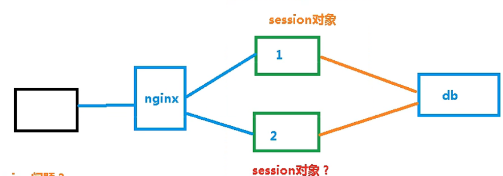
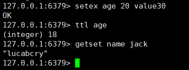
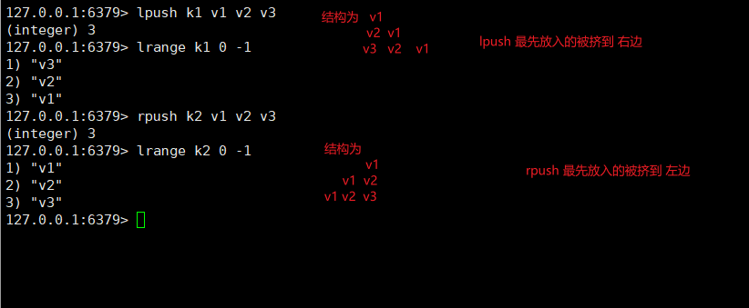
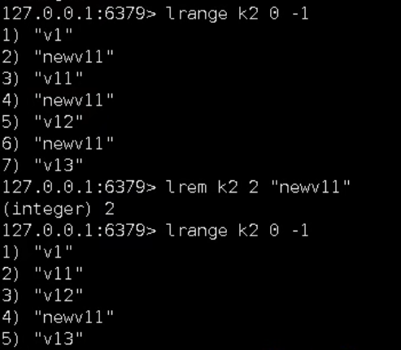
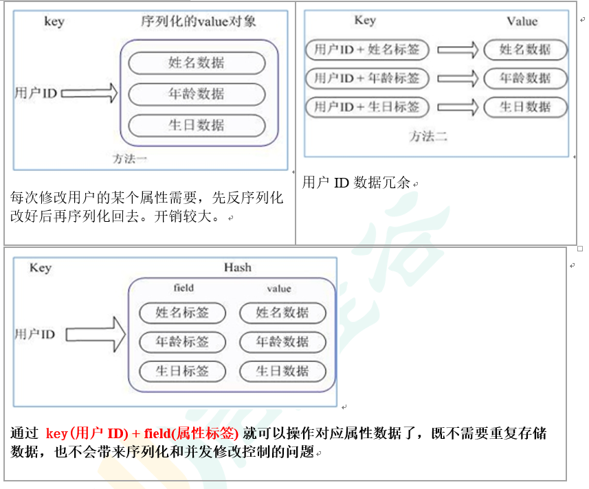
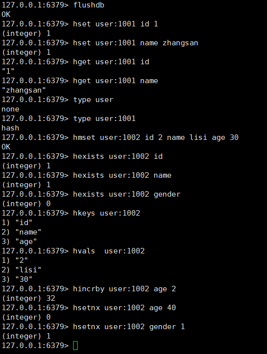
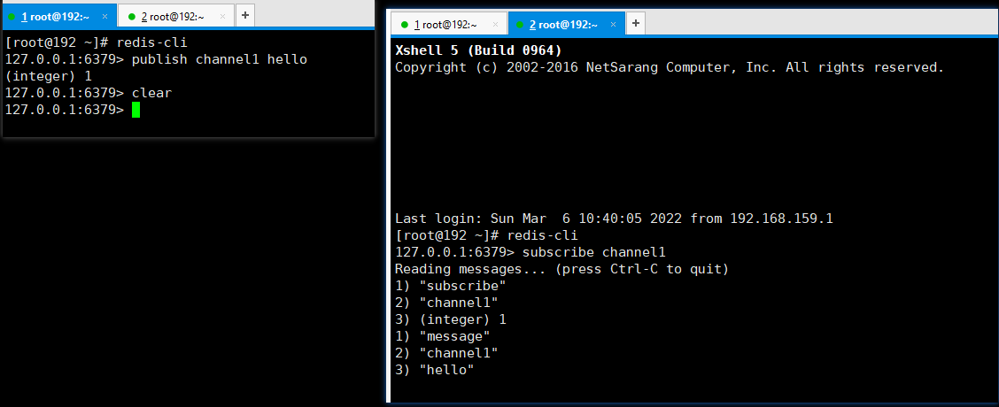
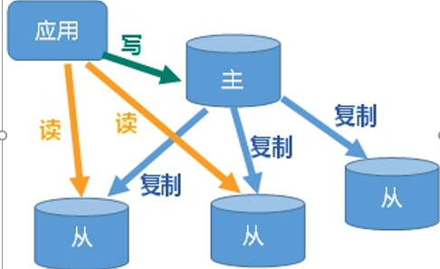
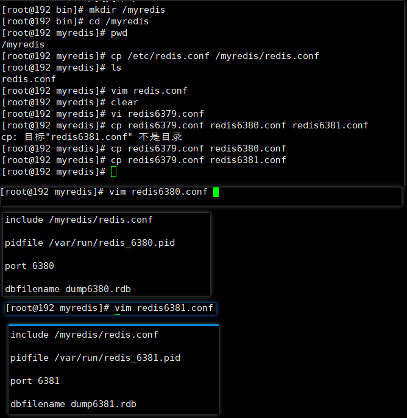
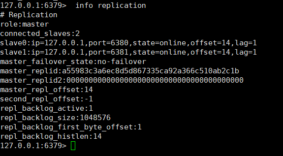

redis系统学习：
[【尚硅谷】Redis 6 入门到精通 超详细 教程](https://www.bilibili.com/video/BV1Rv41177Af?p=2)


#### session 共享问题?


1. 存储到客户端 cookie
2. session 复制
3. 用 nosql 数据库 进行用户信息的存储：存到内存中读取的速度更快。不需要经过io


### NoSQL 数据库
概述：
    NoSQL(NosQL = Not Only sQL )，意即“不仅仅是sQL”，泛指非关系型的数据库
    NoSQL不依赖业务逻辑方式存储，而以简单的 key-value模式存储。因此大大的增加了数据库的扩展能力。
    不遵循SQL标准
    不支持ACID 原子性、一致性、隔离性、持久性
    远超于SQL的性能

#### NoSQL适用场景
    对数据高并发的读写。
    海量数据的读写
    对数据高可扩展性的

#### NoSQL不适用场景。

    ·需要事务支持
    ·基于sql的结构化查询存储，处理复杂的关系,需要即席查询。
    ·(用不着sql的和用了sql也不行的情况，请考虑用NoSql ) 

#### 常见NoSQL数据库


## Redis概述

Redis是一个开源的 key-value存储系统。

和Memcached类似，它支持存储的value类型相对更多，包括string(字符串).list(链表)
、set(集合)、zset(sorted set --有序集合)和hash（哈希类型)。

这些数据类型都支持 push/pop、add/remove 及取交集并集和差集及更丰富的操作,而且这些操作都是原子性的。

在此基础上，Redis支持各种不同方式的排序。

和memcached 一样，为了保证效率，数据都是缓存在内存中。

区别的是 Redis会周期性的把更新的数据写入磁盘或者把修改操作写入追加的记录文件。

并且在此基础上实现了master-slave(主从)同步。

**单线程 + 多路io复用**

#### redis的应用场景

一：配合关系型数据库做高速缓存

    高频次，热门访问的数据，降低数据库IO.
    分布式架构，做session共享

二：多样的数据结构存储持久化数据：

    最新N个数据                  <========    通过list实现按自然时间排序的数据
    排行榜，Top N               <======== 利用zset(有序集合)
    时效性的数据，比如手机验证码  <========  Expire 过期
    计数器，秒杀                  <======== 原子性，自增方法INCR、DECR
    去除大量数据中的重复数据        <======== 利用Set集合
    构建队列                    <======== 利用list集合
    发布订阅消息系统                <======== publsub模式

#### redis 中linux的安装

[redis官网](https://redis.io)
[Redis中文官方网站](http://redis.cn/)
[redis下载](https://redis.io/download)
[redis 安装教程](https://www.cnblogs.com/hunanzp/p/12304622.html)
[redis配置文件参数说明](https://lion-wu.blog.csdn.net/article/details/108019877?spm=1001.2101.3001.6650.13&utm_medium=distribute.pc_relevant.none-task-blog-2%7Edefault%7ECTRLIST%7ERate-13.pc_relevant_default&depth_1-utm_source=distribute.pc_relevant.none-task-blog-2%7Edefault%7ECTRLIST%7ERate-13.pc_relevant_default&utm_relevant_index=16)

1. 下载：

   wget https://download.redis.io/releases/redis-6.2.6.tar.gz

2.解压

3.改名字

    mv redis-6.2.6 redis
4 
    
    cd redis

    pwd            /usr/local/redis

5 进入下载路径

    make

    cd src

    make install

6 修改配置文件 redis.conf

`cp /usr/local/redis/redis.conf redis.conf.bak`

vim

7

    [root@192 redis]# cd /usr/local/bin/
    [root@192 bin]# ls
    redis-benchmark  redis-check-aof  redis-check-rdb  redis-cli  redis-sentinel  redis-server
    [root@192 bin]# pwd
    /usr/local/bin
    [root@192 bin]#

    查看默认安装目录:
    redis-benchmark:性能测试工具，可以在自己本子运行，看看自己本子性能如何redis-check-aof:修复有问题的AOF文件，rdb和aof后面讲
    redis-check-dump:修复有问题的 dump.rdb文件
    redis-sentinel : Redis集群使用
    redis-server : Redis服务器启动命令
    redis-cli:客户端，操作入口

8 前台启动（不推荐）

    redis-server

9 后台启动 （推荐）

    cp /usr/local/redis/redis.conf /etc/redis.conf
    
    vim /etc/redis.conf
    
    # 把支持后台启动的配置 no 改为 yes 
    
    g
    /daemonize  
    ## 在redis.conf的 11% 254行
    shift 加冒号  
    wq
    
    #启动：
    
    redis-server /etc/redis.conf

    #进入redis客户端
    redis-cli

    #退出redis客户端
    exit

    #关闭
    reids-cli shutdown     #或 kill进程号

Reis知识：


[](http://www.redis.cn/commands.html)


#### 

查看当前库所有的key

    keys *  查看当前库所有key(匹配: keys *1)exists key判断某个key是否存在·
    type key                    查看你的 key是什么类型·
    del key                     删除指定的key 数据
    unlink key                  根据value选择非阻塞删除。 仅将 keys 从 keyspace元数据中删除，真正的删除会在后续异步操作。
    expire key 10               为给定的key设置过期时间·10秒钟
    ttl key                     查看还有多少秒过期，-1表示永不过期，-2表示已过期。
    select 0-16                 切换数据库。
    dbsize                      查看当前数据库的key的数量。

    慎用以下两个命令：
    flushdb                     清空当前库
    flushall                    通杀全部库


    -1 表示永不过期  -2 表示已过期


#### Redis五大数据类型：

String 是 Redis 最基本的类型，你可以理解成与Memcached一模一样的类型，一个 key 对应一个 value 。

String 类型是二进制安全的。意味着Redis的string可以包含任何数据。比如 jpg 图片或者序列化的对象。

String 类型是 Redis 最基本的数据类型，一个Redis 中字符串的 value 最多可以是512M

    set <key> <value>           添加键值对
    get <key>                   获取值
    setnx <key><value>          只有在key不存在时设置key的值,
    strlen <key>                获得值的长度
    incr <key>                  将key中储存的数字值增1 只能对数字值操作，如果为空，新增值为1
    decr <key>                  将key中储存的数字值减1


所谓原子操作是指不会被线程调度机制打断的操作;
这种操作一旦开始，就一直运行到结束，中间不会有任何context switch(切换到另 一个线程)。

(1）在单线程中，能够在单条指令中完成的操作都可以认为是"原子操作"，因为中断只能发生于指令之间。
(2）在多线程中，不能被其它进程（线程)打断的操作就叫原子操作。
Redis单命令的原子性主要得益于Redis的单线程。v

案例:
java 中的i++是否是原子操作?  **不是**

i=0;两个线程分别对i进行++100次,值是多少? 不是固定值，范围 2到200
 


i++ 三步： 
   1. i++ 
   1. 取值 
   2. ++赋值





setex <key><过期时间><value>         设置键值的同时，设置过期时间，单位秒。
getset <key><value>                 以新换旧，设置了新值同时获得旧值。


String 的数据结构为简单动态字符串(Simple Dynamic String,缩写SDS)。是可以修改的字符串，
内部结构实现上类似于Java的ArrayList，采用预分配冗余空间的方式来减少内存的频繁分配..

如图中所示，内部为当前字符串实际分配的空间capacity一般要高于实际字符串长度len。当字符串长度小于1M时，
扩容都是加倍现有的空间，如果超过1M，扩容时一次只会多扩1M的空间。需要注意的是字符串最大长度为512M。


####    Redis 的列表 List

单键多值

Redis列表是简单的字符串列表，按照插入顺序排序。你可以添加一个元素到列表的头部(左边）或者尾部(右边)。
它的底层实际是个双向链表，对两端的操作性能很高，通过索引下标的操作中间的节点性能会较差。

lpush/rpush .key><value1><value2><value3> .....          从左边/右边插入一个或多个值。

vlpop/rpop <key>                                        从左边/右边吐出一个值。值在键在，值光键亡。

rpoplpush <key1><key2>从<key1>                           列表右边吐出一个值，插到<key2>列表左边。

lrange <key><start><stop>v                               按照索引下标获得元素(从左到右)







决定跳过本章节。可能用到的很少
详情参考
[【尚硅谷】Redis 6 入门到精通 超详细 教程 P9 常用数据类型List列表](https://www.bilibili.com/video/BV1Rv41177Af?p=9&spm_id_from=pageDriver)

#### list 数据结构

    List的数据结构为快速链表quickList。
    首先在列表元素较少的情况下会使用一块连续的内存存储，这个结构是ziplist，也即是压缩列表。
    它将所有的元素紧挨着一起存储，分配的是一块连续的内存。
    当数据量比较多的时候才会改成quicklist。
    因为普通的链表需要的附加指针空间太大，会比较浪费空间。比如这个列表里存的只是int类型的数据，结构上还需要两个额外的指针prev和next。
    
    Redis将链表和ziplist结合起来组成了quicklist。也就是将多个ziplist使用双向指针串起来使用。这样既满足了快速的插入删除性能，
    又不会出现太大的空间冗余。

#### Redis 集合 Set
Redis set对外提供的功能与list类似是一个列表的功能，特殊之处在于set是可以自动排重的，当你需要存储一个列表数据，
又不希望出现重复数据时，set是一个很好的选择，并且set提供了判断某个成员是否在一个set集合内的重要接口，这个也是list所不能提供的。
Redis的Set是string类型的**无序集合。它底层其实是一个value为null的hash表**，所以添加，删除，查找的复杂度都是O(1)。
一个算法，随着数据的增加，执行时间的长短，如果是O(1)，数据增加，查找数据的时间不变

    sadd <key><value1><value2>          将一个或多个 member 元素加入到集合 key 中，已经存在的 member 元素将被忽略
    smembers <key>                      取出该集合的所有值。
    sismember <key><value>              判断集合<key>是否为含有该<value>值，有1，没有0
    scard<key>                          返回该集合的元素个数。
    srem <key><value1><value2>          删除集合中的某个元素。
    spop <key>                          随机从该集合中吐出一个值。
    srandmember <key><n>                随机从该集合中取出n个值。不会从集合中删除 。
    smove <source><destination>value    把集合中一个值从一个集合移动到另一个集合
    sinter <key1><key2>                 返回两个集合的交集元素。
    sunion <key1><key2>                 返回两个集合的并集元素。
    sdiff <key1><key2>                  返回两个集合的差集元素(key1中的，不包含key2中的)


#### redis中 Set 的数据结构：

    Set数据结构是dict字典，字典是用哈希表实现的。
    Java中HashSet的内部实现使用的是HashMap，只不过所有的value都指向同一个对象。Redis的set结构也是一样，
    它的内部也使用hash结构，所有的value都指向同一个内部值。

#### 哈希  Hash

Redis hash 是一个键值对集合。

Redis hash是一个string类型的**field和value的映射表**，hash特别适合用于存储对象。
类似Java里面的Map<String,Object>

用户ID为查找的key，存储的value用户对象包含姓名，年龄，生日等信息，如果用普通的key/value结构来存储

主要有以下2种存储方式：




    hset <key><field><value>                            给<key>集合中的  <field>键赋值<value>
    hget <key1><field>                                  从<key1>集合<field>取出 value
    hmset <key1><field1><value1><field2><value2>         批量设置hash的值
    hexists<key1><field>                                查看哈希表 key 中，给定域 field 是否存在。
    hkeys <key>                                         列出该hash集合的所有field
    hvals <key>                                         列出该hash集合的所有value
    hincrby <key><field><increment>                     为哈希表 key 中的域 field 的值加上增量 1   -1
    hsetnx <key><field><value>                          将哈希表 key 中的域 field 的值设置为 value ，当且仅当域 field 不存在 .



#### hash 数据结构

Hash类型对应的数据结构是两种：ziplist（压缩列表），hashtable（哈希表）。当field-value长度较短且个数较少时，使用ziplist，否则使用hashtable。


#### redis的配置文件讲解

[redis配置文件参数说明](https://lion-wu.blog.csdn.net/article/details/108019877?spm=1001.2101.3001.6650.13&utm_medium=distribute.pc_relevant.none-task-blog-2%7Edefault%7ECTRLIST%7ERate-13.pc_relevant_default&depth_1-utm_source=distribute.pc_relevant.none-task-blog-2%7Edefault%7ECTRLIST%7ERate-13.pc_relevant_default&utm_relevant_index=16)

更改的地方：

    bind                注释掉 bind 127.0.0.1 默认情况bind=127.0.0.1只能接受本机的访问请求。注释掉(不写的情况下)则无限制接受任何ip地址的访问。生产环境肯定要写你应用服务器的地址；服务器是需要远程访问的，所以需要将其注释掉 。如果开启了protected-mode，那么在没有设定bind ip且没有设密码的情况下，Redis只允许接受本机的响应

    protected-mode      将本机访问保护模式设置no 来支持远程访问

    port                默认端口6379 (要更改 搜索 port) 

    timeout             一个空闲的客户端维持多少秒会关闭，0表示关闭该功能。即永不关闭

    tcp-keepalive        对访问客户端的一种心跳检测，每个n秒检测一次。单位为秒，如果设置为0，则不会进行Keepalive检测，建议设置成60 

    daemonize           是否为后台进程，设置为yes

    loglevel            指定日志记录级别，Redis总共支持四个级别：debug、verbose、notice、warning，默认为notice 四个级别根据使用阶段来选择，生产环境选择notice 或者warning

    databases 16        设定库的数量 默认16，默认数据库为0，可以使用SELECT <dbid>命令在连接上指定数据库id

    requirrepass        访问密码的查看、设置和取消

    maxclients          设置redis同时可以与多少个客户端进行连接

    maxmemory 
                        	建议必须设置，否则，将内存占满，造成服务器宕机
                        	设置redis可以使用的内存量。一旦到达内存使用上限，redis将会试图移除内部数据，移除规则可以通过maxmemory-policy来指定。
                        	如果redis无法根据移除规则来移除内存中的数据，或者设置了“不允许移除”，那么redis则会针对那些需要申请内存的指令返回错误信息，比如SET、LPUSH等。
                        	但是对于无内存申请的指令，仍然会正常响应，比如GET等。如果你的redis是主redis（说明你的redis有从redis），那么在设置内存使用上限时，需要在系统中留出一些内存空间给同步队列缓存，只有在你设置的是“不移除”的情况下，才不用考虑这个因素。

   maxmemory-policy

                        	volatile-lru：使用LRU算法移除key，只对设置了过期时间的键；（最近最少使用）
                        	allkeys-lru：在所有集合key中，使用LRU算法移除key
                        	volatile-random：在过期集合中移除随机的key，只对设置了过期时间的键
                        	allkeys-random：在所有集合key中，移除随机的key
                        	volatile-ttl：移除那些TTL值最小的key，即那些最近要过期的key
                        	noeviction：不进行移除。针对写操作，只是返回错误信息

####  5.	Redis的发布和订阅

什么是发布和订阅

**Redis 发布订阅 (pub/sub) 是一种消息通信模式：发送者 (pub) 发送消息，订阅者 (sub) 接收消息。
Redis 客户端可以订阅任意数量的频道**


    1、打开一个客户端订阅channel1
    SUBSCRIBE channel
    
    2、打开另一个客户端，给channel1发布消息hello
    publish channel1 hello
    
        返回的1是订阅者数量
    3、打开第一个客户端可以看到发送的消息
    
    注：发布的消息没有持久化，如果在订阅的客户端收不到hello，只能收到订阅后发布的消息




#### 6 redis中新的数据类型     Bitmaps/HyperLogLog/Geospatial

这三节暂时跳过--
[redisbitmaps尚硅谷](https://www.bilibili.com/video/BV1Rv41177Af?p=17)
[redis HyperLogLog 尚硅谷](https://www.bilibili.com/video/BV1Rv41177Af?p=18)
[redis Geospatial 尚硅谷](https://www.bilibili.com/video/BV1Rv41177Af?p=19)

## redis客户端工具 通过 Jedis操作 Redis6

```java
package com.atguigu.jedis;

import org.junit.Test;
import redis.clients.jedis.Jedis;

import java.util.List;
import java.util.Set;

/**
 * redis java 操作 redis
 *
 * @author pengtao
 * @createdate 2022/03/06 0006
 */
public class JedisDemo0 {

    public static void main(String[] args) {

        // 创建 Jedis 对象  import redis.clients.jedis.Jedis;

        String host = "192.168.159.132";
        int port = 6379;

        Jedis jedis = new Jedis(host, port);

        // 测试
        String value = jedis.ping();

        System.out.println(value); // PONG

        /**
         timeout报错：
         考虑防火墙放行端口
         firewall-cmd --permanent --add-port=6379/tcp

         firewall-cmd --reload

         Exception in thread "main" redis.clients.jedis.exceptions.JedisConnectionException:
         Failed to connect to any host resolved for DNS name.
         报错解决：需要把配置文件 redis.conf 设置好后  重启
         ps -ef|grep redis
         kill -9 pid
         redis-server /etc/redis.conf

         * */
    }

    /** 创建 Jedis 对象 */
    public static Jedis getRedisConnection() {
        String host = "192.168.159.132";
        int port = 6379;

        Jedis jedis = new Jedis(host, port);
        return jedis;
    }

    //操作zset
    @Test
    public void testZset() {
        //创建Jedis对象
        Jedis jedis = getRedisConnection();

        jedis.zadd("china", 100d, "shanghai");

        List<String> china = jedis.zrange("china", 0, -1);
        System.out.println(china);

        jedis.close();
    }

    //操作hash
    @Test
    public void testHash() {
        //创建Jedis对象
        Jedis jedis = getRedisConnection();

        jedis.hset("users","age","20");
        String hget = jedis.hget("users", "age");

        System.out.println(hget);
        System.out.println("操作类型：" + jedis.type("users"));

        jedis.close();
    }

    //操作set
    @Test
    public void testDemoSet() {
        //创建Jedis对象
        Jedis jedis = getRedisConnection();

        jedis.sadd("names","lucy");
        jedis.sadd("names","mary");

        Set<String> names = jedis.smembers("names");
        System.out.println(names);
        System.out.println("操作类型：" + jedis.type("names"));
        jedis.close();
    }

    //操作list
    @Test
    public void testRedisList() {
        //创建Jedis对象
        Jedis jedis = getRedisConnection();

        jedis.lpush("key1","lucy", "mary", "jack");

        List<String> values = jedis.lrange("key1", 0, -1);
        System.out.println("values: " + values);
        jedis.close();
    }

    //操作key string
    @Test
    public void demo1() {
        //创建Jedis对象
        Jedis jedis = getRedisConnection();

        //添加
        jedis.set("name", "lucy");

        //获取
        String name = jedis.get("name");
        System.out.println(name);

        //设置多个key-value
        jedis.mset("k1", "v1", "k2", "v2");
        List<String> mget = jedis.mget("k1", "k2");
        System.out.println(mget);

        Set<String> keys = jedis.keys("*");
        for(String key : keys) {
            System.out.println("keys:" + key);
        }
        jedis.close();
    }
}

```

完成一个手机验证码功能

    要求：
  * 1、输入手机号，点击发送后随机生成6位数字码，2分钟有效
  * 2、输入验证码，点击验证，返回成功或失败
  * 3、每个手机号每天只能输入3次
```java

```

#### redis 事务

Redis事务是一个单独的隔离操作：事务中的所有命令都会序列化、按顺序地执行。
事务在执行的过程中，不会被其他客户端发送来的命令请求所打断。

Redis事务的主要作用就是串联多个命令防止别的命令插队。

##### Multi、Exec、discard
从输入Multi命令开始，输入的命令都会依次进入命令队列中，但不会执行，直到输入Exec后，
Redis会将之前的命令队列中的命令依次执行。

组队的过程中可以通过discard来放弃组队。


#### 事务的错误处理

在组队的时候有一个命令失败，那么十五中的所有命令都不会执行。返回报错提示：
(error) EXECABORT Transaction discarded because of previous errors.


如果组队中没有错误，执行中谁有错误谁不执行。其他正确的命令将执行

#### 事务冲突问题

**悲观锁(Pessimistic Lock)**, 顾名思义，就是很悲观，每次去拿数据的时候都认为别人会修改，所以每次在拿数据的时候都会上锁，
这样别人想拿这个数据就会block直到它拿到锁。传统的关系型数据库里边就用到了很多这种锁机制，比如行锁，表锁等，读锁，写锁等，
都是在做操作之前先上锁。


**乐观锁(Optimistic Lock)**, 顾名思义，就是很乐观，每次去拿数据的时候都认为别人不会修改，所以不会上锁，但是在更新的时候会
**判断一下在此期间别人有没有去更新这个数据**，
可以**使用版本号**等机制。**乐观锁适用于多读的应用类型，这样可以提高吞吐量。Redis就是利用这种check-and-set机制实现事务的**。

现实中乐观锁的场景：抢票

10.5.4.	WATCH key [key ...]
在执行multi之前，先执行watch key1 [key2],可以监视一个(或多个) key ，如果在事务执行之前这个(或这些) key 被其他命令所改动，那么事务将被打断。


#### unwatch
取消 WATCH 命令对所有 key 的监视。
如果在执行 WATCH 命令之后，EXEC 命令或DISCARD 命令先被执行了的话，那么就不需要再执行UNWATCH 了。
[](http://doc.redisfans.com/transaction/exec.html)


#### Redis事务三特性

**单独的隔离操作**
    事务中的所有命令都会序列化、按顺序地执行。事务在执行的过程中，不会被其他客户端发送来的命令请求所打断。

**没有隔离级别的概念**
    队列中的命令没有提交之前都不会实际被执行，因为事务提交前任何指令都不会被实际执行

**不保证原子性**
    事务中如果有一条命令执行失败，其后的命令仍然会被执行，没有回滚 


#### 事务和锁机制秒杀案例(P24-P27未在 自己实现 可能需要做一个check)

使用工具ab模拟测试
CentOS6 默认安装
CentOS7需要手动安装
联网：yum install httpd-tools

ab -help

vim postfile 模拟表单提交参数,以&符号结尾;存放当前目录。
内容：prodid=0101&

ab -n 2000 -c 200 -k -p ~/postfile -T application/x-www-form-urlencoded http://本机ip:8081/Seckill/doseckill


7到7:45  28 29
8到8:45 30 31
9到9:30 32 33


## Redis 持久化操作-RDB 

[官网介绍：](http://www.redis.io)
[官网介绍：](https://redis.io/topics/persistence#snapshotting)

本页提供了 Redis 持久性的技术说明，**建议所有 Redis 用户阅读**。有关 Redis 持久性及其提供的持久性保证的更广泛概述，您可能还想阅读 Redis 持久性揭秘。

[](redis的持久化官方文档.md)


#### Redis 主从复制 (主从复制的主服务器只能有一台。从服务器可以有多台)


主机数据更新后根据配置和策略， 自动同步到备机的master/slaver机制，Master以写为主，Slave以读为主

好处：

1. 读写分离
2. 容灾快速恢复




redis 配置主从复制

    # 为了方便操作 单独建一个文件夹进行主从复制的配置 操作
    
    make dir /myredis
    
    cp /etc/redis.conf /myredis/redis.conf
    
    vim /myredis/redis.conf
    
    # 配置文件中 appendonly yes -> no
    appendonly no
    
    vim /myredis/redis6379.conf
    # 粘贴以下内容
    
    # ----6379.conf 配置开始----------
    # 引入配置文件相同的公共配置
    include /myredis/redis.conf
    
    pidfile /var/run/redis_6379.pid
    
    port 6379
    
    dbfilename dump6379.rdb
    # ----6379.conf 配置结束----------
    
    :wq保存退出
    
    cp /myredis/redis6379.conf /myredis/redis6380.conf 
    
    对应修改：
    
    # ----6380.conf 配置开始----------
    # 引入配置文件相同的公共配置
    include /myredis/redis.conf
    
    pidfile /var/run/redis_6380.pid
    
    port 6380
    
    dbfilename dump6380.rdb
    # ----6380.conf 配置结束----------
    
    cp /myredis/redis6379.conf /myredis/redis6381.conf
    
    # ----6380.conf 配置开始----------
    # 引入配置文件相同的公共配置
    include /myredis/redis.conf
    
    pidfile /var/run/redis_6380.pid
    
    port 6380
    
    dbfilename dump6380.rdb
    # ----6380.conf 配置结束----------



启动三台redis

redis-server /myredis/redis6379.conf
redis-server /myredis/redis6380.conf
redis-server /myredis/redis6381.conf


info replication
查看当前主机运行状态
打印主从复制情况


在从机 6380 6381的客户端上执行 slaveof 主机ip 端口号
redis-cli -p 6380
slaveof 127.0.0.1 6379

redis-cli -p 6381
slaveof 127.0.0.1 6379




从机不能写，否则报错：

(error) READONLY You can't write against a read only replica.

当主服务器挂掉之后，两台从服务器依旧是从服务器
主服务器重启后，依然是主服务器


#### 主从复制原理：

1. 从服务器连接上主服务器之后，从服务器向主服务器发送进行数据同步的消息
2. 主服务器街道从服务器发送过来同步消息，把主服务器数据进行持久化，rdb文件，把rdb文件发送从服务器，从服务器拿到rdb进行读取
3. 每次主服务器进行写操作后，和从服务期进行数据同步。 由主服务器主动发起同步


主从复制分为 三种情况： 一主二从 、 薪火相传(主-从-从的从)、 反客为主(salveof no one)

#### 哨兵模式-反客为主的自动版


%s/源字符串/目的字符串/g

%s/https/http/g


