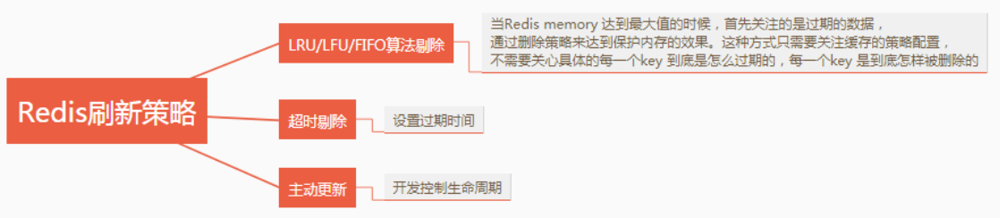
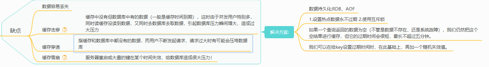

Redis篇 
### 1，为什么要用缓存
使用缓存的目的就是提升读写性能。而实际业务场景下，更多的是为了提升读性能，带来更好的性能，带来更高的并发量。 
Redis 的读写性能比 Mysql 好的多，我们就可以把 Mysql 中的热点数据缓存到 Redis 中，提升读取性能，同时也减轻了 Mysql 的读取压力。

### 2，使用 Redis 有哪些好处？

1) 读取速度快，因为数据存在内存中，所以数据获取快；
2) 支持多种数据结构，包括字符串、列表、集合、有序集合、哈希等；
3) 支持事务，且操作遵守原子性，即对数据的操作要么都执行，要么都不支持；
4) 还拥有其他丰富的功能，队列、主从复制、集群、数据持久化等功能。

### 3， 什么是 Redis？ 开源、基于内存存储、支持多种数据结构、支持事务和持久化，可以高可用
Redis 是一个开源（BSD 许可）、基于内存、支持多种数据结构的存储系统，可以作为数据库、缓存和消息中间件。
它支持的数据结构有字符串（strings）、哈希（hashes）、列表（lists）、集合（sets）、有序集合（sorted sets）等，
~~除此之外还支持 bitmaps、hyperloglogs 和地理空间（geospatial ）索引半径查询等功能~~。
它内置了~~复制（Replication）、LUA 脚本（Lua scripting）、LRU 驱动事件（LRU eviction）、~~ 
事务（Transactions）和不同级别的磁盘持久化（persistence）功能，并通过 Redis 哨兵（哨兵）和集群（Cluster）保证缓存的高可用性（High availability）。

### 4， 为什么 使用 Redis 而不是用 Memcache 呢？ 支持数据类型不同/是否支持持久化/key和value内存空间/缓存时间/应用场景/redis支持主从复制
**共同点** ：

1. 都是基于内存的数据库，一般都用来当做缓存使用。
2. 都有过期策略。
3. 两者的性能都非常高。

**区别** ：

1. **Redis 支持更丰富的数据类型（支持更复杂的应用场景）**。Redis 不仅仅支持简单的 k/v 类型的数据，同时还提供 list，set，zset，hash 等数据结构的存储。Memcached 只支持最简单的 k/v 数据类型。
2. **Redis 支持数据的持久化，可以将内存中的数据保持在磁盘中，重启的时候可以再次加载进行使用,而 Memcached 把数据全部存在内存之中。**
3. **Redis 支持持久化、有灾难恢复机制。** 可以把缓存中的数据持久化到磁盘上。
4. **Redis 在服务器内存使用完之后，可以将不用的数据放到磁盘上。但是，Memcached 在服务器内存使用完之后，就会直接报异常。**
5. **Memcached 没有原生的集群模式，需要依靠客户端来实现往集群中分片写入数据；但是 Redis 目前是原生支持 cluster 模式的。**
6. **Memcached 是多线程，非阻塞 IO 复用的网络模型；Redis 使用单线程的多路 IO 复用模型。** （Redis 6.0 引入了多线程 IO ）
7. **Redis 支持发布订阅模型、Lua 脚本、事务等功能，而 Memcached 不支持。并且，Redis 支持更多的编程语言。**
8. **Memcached 过期数据的删除策略只用了惰性删除，而 Redis 同时使用了惰性删除与定期删除。**

### 5，为什么 Redis 单线程模型效率也能那么高？ C语言，纯内存操作，非阻塞的IO复用模型机制、单线程好处、丰富的数据结构
1. C语言实现，效率高
2. 纯内存操作
3. 基于非阻塞的IO复用模型机制
4. 单线程的话就能避免多线程的频繁上下文切换问题
5. 丰富的数据结构（全称采用hash结构，读取速度非常快，对数据存储进行了一些优化，比如亚索表，跳表等）
### 6，说说 Redis 的线程模型？ 基于非阻塞的IO复用模型。内部使用单线程的文件事件处理器
~~这问题是因为前面回答问题的时候提到了 Redis 是基于非阻塞的IO复用模型。如果这个问题回答不上来，就相当于前面的回答是给自己挖坑，因为你答不上来，
面试官对你的印象可能就要打点折扣了。~~

Redis 内部使用文件事件处理器 file event handler ，这个文件事件处理器是单线程的，所以Redis 才叫做单线程的模型。
它采用 IO 多路复用机制同时监听多个 socket ，根据 socket 上的事件来选择对应的事件处理器进行处理。
**I/O 多路复用技术的使用让 Redis 不需要额外创建多余的线程来监听客户端的大量连接，降低了资源的消耗**
文件事件处理器的结构包含 4 个部分：
1. 多个 socket 。 
2. IO 多路复用程序。
3. 文件事件分派器。
4. 事件处理器（连接应答处理器、命令请求处理器、命令回复处理器）。

多个 socket 可能会并发产生不同的操作，每个操作对应不同的文件事件，但是 IO 多路复用程序会监听多个 socket，会将 socket 产生的事件放入队列中排队，
事件分派器每次从队列中取出一个事件，把该事件交给对应的事件处理器进行处理。

来看客户端与 Redis 的一次通信过程：
   下面来大致说一下这个图：
1. 客户端 Socket01 向 Redis 的 Server Socket 请求建立连接，此时 Server Socket 会产生一个
   AE_READABLE 事件，IO 多路复用程序监听到 server socket 产生的事件后，将该事件压入队列
   中。文件事件分派器从队列中获取该事件，交给连接应答处理器。连接应答处理器会创建一个
   能与客户端通信的 Socket01，并将该 Socket01 的 AE_READABLE 事件与命令请求处理器关
   联。
2. 假设此时客户端发送了一个 set key value 请求，此时 Redis 中的 Socket01 会产生
   AE_READABLE 事件，IO 多路复用程序将事件压入队列，此时事件分派器从队列中获取到该事
   件，由于前面 Socket01 的 AE_READABLE 事件已经与命令请求处理器关联，因此事件分派器
   将事件交给命令请求处理器来处理。命令请求处理器读取 Socket01 的 set key value 并在自己
   内存中完成 set key value 的设置。操作完成后，它会将 Socket01 的 AE_WRITABLE 事件与令
   回复处理器关联。
3. 如果此时客户端准备好接收返回结果了，那么 Redis 中的 Socket01 会产生一个
   AE_WRITABLE 事件，同样压入队列中，事件分派器找到相关联的命令回复处理器，由命令回复
   处理器对 Socket01 输入本次操作的一个结果，比如 ok ，之后解除 Socket01 的
   AE_WRITABLE 事件与命令回复处理器的关联。
   这样便完成了一次通信。 不要怕这段文字，结合图看，一遍不行两遍，实在不行可以网上查点资料
   结合着看，一定要搞清楚，否则前面吹的牛逼就白费了。

### 7，为什么 Redis 需要把所有数据放到内存中？ 实现最快对数据的读取，如果数据存储在磁盘中会严重影响Redis的性能/ 提供了数据持久化功能
Redis 将数据放在内存中有一个好处，那就是可以**实现最快的对数据读取，如果数据存储在硬盘中，磁盘 I/O 会严重影响 Redis 的性能**。
而且 Redis 还提供了数据持久化功能，不用担心服务器重启对内存中数据的影响。其次现在硬件越来越便宜的情况下，
Redis 的使用也被应用得越来越多使得它拥有很大的优势。

### 8，Redis 的同步机制了解是什么？
Redis 主从复制 (主从复制的主服务器只能有一台。从服务器可以有多台)
主机数据更新后根据配置和策略， 自动同步到备机的master/slaver机制，Master以写为主，Slave以读为主

好处：
1. 读写分离
2. 容灾快速恢复
#####主从复制原理：
1. 从服务器连接上主服务器之后，从服务器向主服务器发送进行数据同步的消息
2. 主服务器接到从服务器发送过来同步消息，把主服务器数据进行持久化，rdb文件，把rdb文件发送从服务器，从服务器拿到rdb进行读取
3. 每次主服务器进行写操作后，和从服务期进行数据同步。 由主服务器主动发起同步

~~Redis 支持主从同步、从从同步。如果是第一次进行主从同步，主节点需要使用 bgsave 命令，再将后续修改操作记录到内存的缓冲区，
等 RDB 文件全部同步到复制节点，复制节点接受完成后将RDB 镜像记载到内存中。等加载完成后，复制节点通知主节点将复制期间修改的操作记录同步到复制节点，
即可完成同步过程。~~


### 9， pipeline 有什么好处，为什么要用 pipeline？ pipeline就是管道，好处是可以讲多次IO晚饭的时间缩短为一次

使用 `pipeline`（管道）的好处在于可以将多次 I/O 往返的时间缩短为一次，但是要求管道中执行的指令间没有因果关系。
用 `pipeline` 的原因在于可以实现请求/响应服务器的功能，当客户端尚未读取旧响应时，它也可以处理新的请求。如果客户端存在多个命令发送到服务器时，
那么客户端无需等待服务端的每次响应才能执行下个命令，只需最后一步从服务端读取回复即可。

### 10，说一下 Redis 有什么优点和缺点？ 优点：速度快/支持丰富的数据结构/持久化存储/高可用/丰富的特性 缺点：内存数据库存储的数据量和机器本身内存代销有关。完整重新同步会占用CPU，时间较久。
#####优点
- **速度快**：因为数据存在内存中，类似于 HashMap ， HashMap 的优势就是查找和操作的时间复杂度都是O (1) 。
- **支持丰富的数据结构**：支持 String ，List，Set，Sorted Set，Hash 五种基础的数据结构。
- **持久化存储**：Redis 提供 RDB 和 AOF 两种数据的持久化存储方案，解决内存数据库最担心的万一 Redis 挂掉，数据会消失掉
- **高可用**：内置 Redis Sentinel ，提供高可用方案，实现主从故障自动转移。 内置 Redis Cluster ，提供集群方案，实现基于槽的分片方案，从而支持更大的 Redis 规模。
- **丰富的特性**：Key过期、计数、分布式锁、消息队列等。

#####缺点
   由于 Redis 是内存数据库，所以，单台机器，存储的数据量，跟机器本身的内存大小。虽然Redis 本身有 Key 过期策略，
   但是还是需要提前预估和节约内存。如果内存增长过快，需要定期删除数据。
   如果进行完整重同步，由于需要生成 RDB 文件，并进行传输，会占用主机的 CPU ，并会消耗现网的带宽。不过 Redis 2.8 版本，已经有部分重同步的功能，
   但是还是有可能有完整重同步的。比如，新上线的备机。
   修改配置文件，进行重启，将硬盘中的数据加载进内存，时间比较久。在这个过程中， Redis不能提供服务。

### 11 Redis 缓存刷新策略有哪些？


###12， Redis 持久化方式有哪些？以及有什么区别？
Redis 提供两种持久化机制 RDB 和 AOF 机制:
##### RDB 持久化方式
是指用数据集快照的方式半持久化记录 redis 数据库的所有键值对,在某个时间点将数据写入一个临时文件，持久化结束后，
用这个临时文件替换上次持久化的文件，达到数据恢复。

优点：
只有一个文件 dump.rdb ，方便持久化。
- 容灾性好，一个文件可以保存到安全的磁盘。
- 性能最大化，fork 子进程来完成写操作，让主进程继续处理命令，所以是 IO 最大化。使用单独子进程来进行持久化，主进程不会进行任何 IO 操作，保证了 Redis 的高性能
- 相对于数据集大时，比 AOF 的启动效率更高。

缺点：
数据安全性低。 RDB 是间隔一段时间进行持久化，如果持久化之间 Redis 发生故障，会发生数据丢失。所以这种方式更适合数据要求不严谨的时候

##### AOF=Append-only file 持久化方式
是指所有的命令行记录以 Redis 命令请求协议的格式完全持久化存储，保存为 AOF 文件。

优点：
1. 数据安全， AOF 持久化可以配置 appendfsync 属性，有 always，每进行一次命令操作就记录到 AOF 文件中一次。
2. 通过 append 模式写文件，即使中途服务器宕机，可以通过 redis-check-aof 工具解决数据一致性问题。
3. AOF机制的 rewrite 模式。 AOF 文件没被 rewrite 之前（文件过大时会对命令进行合并重写），可以删除其中的某些命令（比如误操作的 flushall )
   
缺点： 
1. AOF 文件比 RDB 文件大，且恢复速度慢。
2. 数据集大的时候，比 RDB 启动效率低。

### 13，持久化有两种，那应该怎么选择呢？
1. 不要仅仅使用 RDB ，因为那样会导致你丢失很多数据。
2. 也不要仅仅使用 AOF ，因为那样有两个问题，第一，你通过 AOF 做冷备没有 RDB 做冷备的恢复速度更快;
   第二， RDB 每次简单粗暴生成数据快照，更加健壮，可以避免 AOF 这种复杂的备份和恢复机制的 bug 。 
3. Redis 支持同时开启开启两种持久化方式，我们可以综合使用 AOF 和 RDB 两种持久化机制，这也是redis官网推荐的方式
   用 AOF 来保证数据不丢失，作为数据恢复的第一选择; 用 RDB 来做不同程度的冷备，在 AOF 文件都丢失或损坏不可用的时候，还可以使用 RDB 来进行快速的数据恢复。
4. 如果同时使用 RDB 和 AOF 两种持久化机制，那么在 Redis 重启的时候，会使用 AOF 来重新构建数据，因为 AOF 中的数据更加完整。

### 14，怎么使用 Redis 实现消息队列？
   一般使用 list 结构作为队列， rpush 生产消息， lpop 消费消息。当 lpop 没有消息的时候，要适当 sleep 一会再重试。
   面试官可能会问可不可以不用 sleep 呢？list 还有个指令叫 blpop ，在没有消息的时候，它会阻塞住直到消息到来。
   面试官可能还问能不能生产一次消费多次呢？ 使用 Redis的 pub / sub 主题订阅者模式，可以实现 1:N 的消息队列。
   面试官可能还问 pub / sub 有什么缺点？在消费者下线的情况下，生产的消息会丢失，得使用专业的消息队列如 rabbitmq 等。
   面试官可能还问 Redis 如何实现延时队列？~~我估计现在你很想把面试官一棒打死如果你手上有一根棒球棍的话，怎么问的这么详细。但是你很克制，然后神态自若的回答道：~~
   使用 sortedset ，拿时间戳作为 score ，消息内容作为 key 调用 zadd 来生产消息，消费者用 `zrangebyscore` 指令获取 N 秒之前的数据轮询进行处理。
   面试扩散：很多面试官上来就直接这么问： **Redis 如何实现延时队列**？
   
###15. 说说你对Redis事务的理解？ 一组命令的集合
##### 什么是 Redis 事务？原理是什么？ 

Redis 中的事务是一组命令的集合，是 Redis 的最小执行单位。它可以保证一次执行多个命令，每个事务是一个单独的隔离操作，事务中的所有命令都会序列化、按顺序地执行。
服务端在执行事务的过程中，不会被其他客户端发送来的命令请求打断。它的原理是先将属于一个事务的命令发送给 Redis，然后依次执行这些命令。

##### Redis 事务的注意点有哪些？
需要注意的点有：
Redis 事务是不支持回滚的，不像 MySQL 的事务一样，要么都执行要么都不执行；Redis 服务端在执行事务的过程中，不会被其他客户端发送来的命令请求打断。
直到事务命令全部执行完毕才会执行其他客户端的命令。
##### Redis 事务为什么不支持回滚？
Redis 的事务不支持回滚，但是执行的命令有语法错误，Redis 会执行失败，这些问题可以从程序层面捕获并解决。但是如果出现其他问题，
则依然会继续执行余下的命令。这样做的原因是因为回滚需要增加很多工作，而不支持回滚则可以保持简单、快速的特性。

### 16，Redis 为什么设计成单线程的？
多线程处理会涉及到锁，并且多线程处理会涉及到线程切···换而消耗 CPU。采用单线程，避免了不必要的上下文切换和竞争条件。
其次 CPU 不是 Redis 的瓶颈，Redis 的瓶颈最有可能是机器内存或者网络带宽。
### 17，什么是 bigkey？会存在什么影响？
   bigkey 是指键值占用内存空间非常大的 key。例如一个字符串 a 存储了 200M 的数据。
   bigkey 的主要影响有：
   - 网络阻塞；获取 bigkey 时，传输的数据量比较大，会增加带宽的压力。
   - 超时阻塞；因为 bigkey 占用的空间比较大，所以操作起来效率会比较低，导致出现阻塞的可能性增加。
   - 导致内存空间不平衡；一个 bigkey 存储数据量比较大，同一个 key 在同一个节点或服务器中存储，会造成一定影响。
### 18，熟悉哪些 Redis 集群模式？

1. Redis Sentinel
   体量较小时，选择 Redis Sentinel ，单主 Redis 足以支撑业务。
2. Redis Cluster
   Redis 官方提供的集群化方案，体量较大时，选择 Redis Cluster ，通过分片，使用更多内
   存。
3. Twemprox
   Twemprox 是 Twtter 开源的一个 Redis 和 Memcached 代理服务器，主要用于管理 Redis 和
   Memcached 集群，减少与Cache 服务器直接连接的数量。
4. Codis
   Codis 是一个代理中间件，当客户端向 Codis 发送指令时， Codis 负责将指令转发到后面的
   Redis 来执行，并将结果返回给客户端。一个 Codis 实例可以连接多个 Redis 实例，也可以启
   动多个 Codis 实例来支撑，每个 Codis 节点都是对等的，这样可以增加整体的 QPS 需求，还能
   起到容灾功能。
5. 客户端分片
   在 Redis Cluster 还没出现之前使用较多，现在基本很少热你使用了，在业务代码层实现，起
   几个毫无关联的 Redis 实例，在代码层，对 Key 进行 hash 计算，然后去对应的 Redis 实例操
   作数据。这种方式对 hash 层代码要求比较高，考虑部分包括，节点失效后的替代算法方案，
   数据震荡后的自动脚本恢复，实例的监控，等等。

### 19，是否使用过 Redis Cluster 集群，集群的原理是什么？
   使用过 Redis 集群，它的原理是：
   所有的节点相互连接集群消息通信通过集群总线通信，集群总线端口大小为客户端服务端口 + 10000（固定值）
   节点与节点之间通过**二进制协议进行通信**
   客户端和集群节点之间通信和通常一样，通过文本协议进行集群节点不会代理查询
   数据按照 Slot 存储分布在多个 Redis 实例上
   集群节点挂掉会自动故障转移
   可以相对平滑扩/缩容节点
   Redis 集群中内置了 16384 个哈希槽，当需要在 Redis 集群中放置一个 key-value 时，redis 先对
   key 使用 crc16 算法算出一个结果，然后把结果对 16384 求余数，这样每个 key 都会对应一个编号
   在 0~16383 之间的哈希槽，redis 会根据节点数量大致均等的将哈希槽映射到不同的节点。

### 20， Redis Cluster 集群方案什么情况下会导致整个集群不可用？

 Redis 没有使用哈希一致性算法，而是使用哈希槽。Redis 中的哈希槽一共有 16384 个，计算给定密钥的哈希槽，我们只需要对密钥的 CRC16 取摸 16384。
 假设集群中有 A、B、C 三个集群节点，
 不存在复制模式下，每个集群的节点包含的哈希槽如下：
 节点 A 包含从 0 到 5500 的哈希槽；
 节点 B 包含从 5501 到 11000 的哈希槽；
 节点 C 包含从 11001 到 16383 的哈希槽；
 这时，如果节点 B 出现故障，整个集群就会出现缺少 5501 到 11000 的哈希槽范围而不可用。

### 21，Redis 集群架构模式有哪几种？
Redis 集群架构是支持单节点单机模式的，也支持一主多从的主从结构，还支持带有哨兵的集群部署模式

### 22，说说 Redis 哈希槽的概念？ 2^14）个哈希槽
Redis 集群并没有使用一致性 hash，而是引入了哈希槽的概念。Redis 集群有 16384（2^14）个哈希槽，
每个 key 通过 crc16 校验后对 16384 取模来决定放置哪个槽，集群的每个节点负责一部分hash 槽。

[扩展：职场中程序员必须知道的redis哈希槽原理](https://baijiahao.baidu.com/s?id=1667846581124648589&wfr=spider&for=pc)

### 23，Redis 常见性能问题和解决方案有哪些

1) Redis主库 Master 最好不要做任何持久化工作，如 RDB （Redis DataBase）内存快照和 AOF (Append Only File)日志文件；
2) 如果数据比较重要，某个 Slave 开启 AOF 备份数据，策略设置为每秒同步一次；
3) 为了主从复制的速度和连接的稳定性，Master 和 Slave 最好在同一个局域网内；
4) 尽量避免在压力很大的主库上增加从库；
5) 主从复制不要用图状结构，用单向链表结构更为稳定，即：Master <- Slave1 <- Slave2 <- Slave3….；
  这样的结构方便解决单点故障问题，实现 Slave 对 Master 的替换。如果 Master 挂了，可以立刻启用 Slave1 做 Master，其他不变。

### 24. 假如 Redis 里面有 1 亿个 key，其中有 10w 个 key 是以某个固定的已知的前缀开头的，如果将它们全部找出来？ keys命令或 scan命令

1. 使用 keys 命令
   直接使用 keys 命令查询，但是如果是在生产环境下使用会出现一个问题，keys 命令是遍历查询的，查询的时间复杂度为 O(n)，数据量越大查询时间越长。
   而且 Redis 是单线程，**keys 指令会导致线程阻塞一段时间，会导致线上 Redis 停顿一段时间，
   直到 keys 执行完毕才能恢复。在生产环境是不允许的**。除此之外，**keys 命令没有分页功能**，会一次性查询出所有符合条件的 key 值，
   会发现查询结果非常大，输出的信息非常多。所以不推荐使用这个命令。

2. 使用 scan 命令
   scan 命令可以实现和 keys 一样的匹配功能，但是 **scan 命令在执行的过程不会阻塞线程**，并且**查找的数据可能存在重复，需要客户端操作去重**。 
   因为 scan 是通过游标方式查询的，所以不会导致Redis 出现假死的问题。Redis 查询过程中会把游标返回给客户端，单次返回空值且游标不为 0，
   则说明遍历还没结束，客户端继续遍历查询。scan 在检索的过程中，被删除的元素是不会被查询出来的，但是如果在迭代过程中有元素被修改， 
   scan 不能保证查询出对应元素。相对来说，scan 指令查找花费的时间会比 keys 指令长。

### 25，如果有大量的 key 需要设置同一时间过期，一般需要注意什么？
如果有大量的 key 在同一时间过期，那么可能同一秒都从数据库获取数据，给数据库造成很大的压力，导致数据库崩溃，系统出现 502 问题。
也有可能同时失效，那一刻不用都访问数据库，压力不够大的话，那么 Redis 会出现短暂的卡顿问题。
所以为了预防这种问题的发生，最好给数据的过期时间加一个随机值，让过期时间更加分散。

### 26，什么情况下可能会导致 Redis 阻塞？

Redis 产生阻塞的原因主要有内部和外部两个原因导致：
##### 内部原因
如果 Redis 主机的 CPU 负载过高，也会导致系统崩溃；
数据持久化占用资源过多；
对 Redis 的 API 或指令使用不合理，导致 Redis 出现问题。
##### 外部原因
外部原因主要是服务器的原因，例如服务器的 CPU 线程在切换过程中竞争过大，内存出现问题、网络问题等。

### 27，缓存和数据库谁先更新呢？
高并发场景下，到底先更新缓存（Redis）还是先更新数据库（MySQL）的问题？
此问题待梳理，有点难
[](https://blog.csdn.net/qq_39033181/article/details/119276120?spm=1001.2101.3001.6650.6&utm_medium=distribute.pc_relevant.none-task-blog-2%7Edefault%7EBlogCommendFromBaidu%7Edefault-6-119276120-blog-103092613.pc_relevant_multi_platform_whitelistv1_exp2&depth_1-utm_source=distribute.pc_relevant.none-task-blog-2%7Edefault%7EBlogCommendFromBaidu%7Edefault-6-119276120-blog-103092613.pc_relevant_multi_platform_whitelistv1_exp2&utm_relevant_index=9)
解决方案
1. 写请求过来，将写请求缓存到缓存队列中，并且开始执行写请求的具体操作（删除缓存中的数据，更新数据库，更新缓存）。
2. 如果在更新数据库过程中，又来了个读请求，将读请求再次存入到缓存队列（可以搞n个队列，采用key的hash值进行队列个数取模hash%n，落到对应的队列中，队列需要保证顺序性）
   中，顺序性保证等待队列前的写请求执行完成，才会执行读请求之前的写请求删除缓存失败，直接返回，此时数据库中的数据是旧值，并且与缓存中的数据是一致的，不会出现缓存一致性
   的问题。
3. 写请求删除缓存成功，则更新数据库，如果更新数据库失败，则直接返回，写请求结束，此时数据库中的值依旧是旧值，读请求过来后，发现缓存中没有数据， 则会直接向数据库中请求，
   同时将数据写入到缓存中，此时也不会出现数据一致性的问题。
4. 更新数据成功之后，再更新缓存，如果此时更新缓存失败，则缓存中没有数据，数据库中是新值 ，写请求结束，此时读请求还是一样，发现缓存中没有数据，同样会从数据库中读取数据，
   并且存入到缓存中，其实这里不管更新缓存成功还是失败， 都不会出现数据一致性的问题。
   上面这方案解决了数据不一致的问题，主要是使用了串行化，每次操作进来必须按照顺序进行。如果某个队列元素积压太多，可以针对读请求进行过滤，提示用户刷新页面，重新请求。

   潜在的问题，留给大家自己去想吧，因为这个问题属于发散性。
   1，请求时间过长，大量的写请求堆压在队列中，一个读请求来得等都写完了才可以获取到数据。
   2，读请求并发高
   3，热点数据路由问题，导致请求倾斜。

### 28.怎么提高缓存命中率？
- 提前加载数据到缓存中；
- 增加缓存的存储空间，提高缓存的数据；
- 调整缓存的存储数据类型；
- 提升缓存的更新频率。



### 29 Redis 如何解决 key 冲突？
Redis 如果 key 相同，后一个 key 会覆盖前一个 key。如果要解决 key 冲突，最好给 key 取好名区分开，
可以按业务名和参数区分开取名，避免重复 key 导致的冲突。

### 30.Redis 报内存不足怎么处理？
- Redis 内存不足可以这样处理：
- 修改配置文件 redis.conf 的 maxmemory 参数，增加 Redis 可用内存；
- 设置缓存淘汰策略，提高内存的使用效率；
- 使用 Redis 集群模式，提高存储量。

### 31、说说Redis持久化机制
Redis是一个支持持久化的内存数据库，通过持久化机制把内存中的数据同步到硬盘文件来保证数据持久化。当Redis重启后通过把硬盘文件重新加载到内存，
就能达到恢复数据的目的。 
实现：单独创建fork()一个子进程，将当前父进程的数据库数据复制到子进程的内存中，然后由子进程写入到临时文件中，持久化的过程结束了，
再用这个临时文件替换上次的快照文件，然后子进程退出，内存释放。

- RDB是Redis默认的持久化方式。按照一定的时间周期策略把内存的数据以快照的形式保存到硬盘的二进制文件。即`Snapshot`快照存储，
对应产生的数据文件为dump.rdb，通过配置文件中的save参数来定义快照的周期。（ 快照可以是其所表示的数据的一个副本，也可以是数据的一个复制品。）
- AOF：Redis会将每一个收到的写命令都通过Write函数追加到文件最后，类似于MySQL的`binlog`。
当Redis重启是会通过重新执行文件中保存的写命令来在内存中重建整个数据库的内容。 当两种方式同时开启时，数据恢复Redis会优先选择AOF恢复。

### 32，缓存雪崩、缓存穿透、缓存预热、缓存更新、缓存降级等问题

##### 缓存预热 缓存预热就是系统上线后，将相关的缓存数据直接加载到缓存系统。（~~这个应该是一个比较常见的概念，相信很多小伙伴都应该可以很容易的理解，）~~
这样就可以避免在用户请求的时候，先查询数据库，然后再将数据缓存的问题！用户直接查询事先被预热的缓存数据！ 
解决思路： 
1. 直接写个缓存刷新页面，上线时手工操作下； 
2. 数据量不大，可以在项目启动的时候自动进行加载； 
3. 定时刷新缓存；

##### 缓存更新 除了缓存服务器自带的缓存失效策略之外（Redis默认的有6种类策略可供选择），我们还可以根据具体的业务需求进行自定义的缓存淘汰，
常见的策略有两种： 
1. 定时去清理过期的缓存；
2. 当有用户请求过来时，再判断这个请求所用到的缓存是否过期，过期的话就去底层系统得到新数据并更新缓存。 

两者各有优劣，第一种的缺点是维护大量缓存的key是比较麻烦的，第二种的缺点就是每次用户请求过来都要判断缓存失效，逻辑相对比较复杂！
需要根据具体的应用场景来权衡。

##### 缓存降级 当访问量剧增、服务出现问题（如响应时间慢或不响应）或非核心服务影响到核心流程的性能时，仍然需要保证服务还是可用的，即使是有损服务。
系统可以根据一些关键数据进行自动降级，也可以配置开关实现人工降级。 降级的最终目的是保证核心服务可用，即使是有损的。而且有些服务是无法降级的（如加入购物车、结算）。 
以参考日志级别设置预案： 
1) 一般：比如有些服务偶尔因为网络抖动或者服务正在上线而超时，可以自动降级；
2) 警告：有些服务在一段时间内成功率有波动（如在95~100%之间），可以自动降级或人工降级，并发送告警； 
3) 错误：比如可用率低于90%，或者数据库连接池被打爆了，或者访问量突然猛增到系统能承受的最大阀值，此时可以根据情况自动降级或者人工降级； 
4) 严重错误：比如因为特殊原因数据错误了，此时需要紧急人工降级。

服务降级的目的，是为了防止Redis服务故障，导致数据库跟着一起发生雪崩问题。因此，对于不重要的缓存数据，可以采取服务降级策略，
例如一个比较常见的做法就是，Redis出现问题，不去数据库查询，而是直接返回默认值给用户。

##### 缓存击穿 （缓存没有，数据库有的数据， 并发多引起数据库瞬时压力增大）
缓存中没有但数据库中有的数据（一般是缓存时间到期），这时由于并发用户特别多，同时读缓存没读到数据，又同时去数据库去取数据，引起数据库压力瞬间增大，造成过大压力

解决方案：
1. 设置热点数据永不过期
2. 加互斥锁(什么是互斥锁？互斥锁是多个线程一起去抢，抢到锁的线程先执行，没有抢到锁的线程需要等待，等互斥锁使用完释放后，其它等待的线程再去抢这个锁。)

##### 缓存穿透(缓存和数据库都没有的数据， 失去了缓存的意义，恶意利用不存在的key攻击应用)
指缓存和数据库中都没有的数据，而用户不断发起请求，请求过大时有可能会压垮数据库。 每次请求都要到数据层去查询，失去了缓存的意义。

在流量大时，可能DB就挂掉了，要是有人利用不存在的key频繁攻击我们的应用，这就是漏洞。
如发起为id为“-1”的数据或id为特别大不存在的数据。这时的用户很可能是攻击者，攻击会导致数据库压力过大

解决方案：
1. 设置拦截, 对于不存在的key,进行拦截
2. 可以通过redis设置并发锁，防止请求大量请求数据库，如果获取到锁了，去数据库查询，如果没有，说明有其他线程在查询数据库，那么只需要重试一下就好了
```
public String get(key) {
      String value = redis.get(key);
      if (value == null) { //代表缓存值过期
          //设置3min的超时，防止del操作失败的时候，下次缓存过期一直不能load db
	       if (redis.setnx(key_mutex, 1, 3 * 60) == 1) {  //代表设置成功
		       value = db.get(key);
		       redis.set(key, value, expire_secs);
		       redis.del(key_mutex);
	       } else {  //这个时候代表同时候的其他线程已经load db并回设到缓存了，这时候重试获取缓存值即可
		      Thread.sleep(50);
		      get(key);  //重试
	       }
       } else {
              return value;      
       }
}

```

##### 缓存雪崩（服务器重启或大量的键在某个时间失效）
服务器重启或大量的键在某个时间失效，给数据库造成很大压力！
redis缓存雪崩是指redis在某个时间大量失效，突然造成数据库访问压力急剧增大，像雪崩一样，redis雪崩危害巨大，甚至有可能服务器宕机，给公司造成巨大的经济损失。

解决方案：设置超时时间的时候要设置随机值，不要设置固定值

[缓存击穿、缓存穿透、缓存雪崩](https://blog.csdn.net/m0_37937394/article/details/122564362?spm=1001.2101.3001.6650.6&utm_medium=distribute.pc_relevant.none-task-blog-2%7Edefault%7EBlogCommendFromBaidu%7Edefault-6-122564362-blog-123971680.pc_relevant_multi_platform_whitelistv2&depth_1-utm_source=distribute.pc_relevant.none-task-blog-2%7Edefault%7EBlogCommendFromBaidu%7Edefault-6-122564362-blog-123971680.pc_relevant_multi_platform_whitelistv2&utm_relevant_index=13)

### 33. 热点数据和冷数据是什么

其实就是名字上的意思。**热数据就是访问次数较多的数据，冷数据就是访问很少或者从不访问的数据**。 要注意的是只有热点数据，缓存才有价值
对于冷数据而言，太部分数据可能还没有更次问到就已经被挤出内存，不仅占用内存，而且价值不大。
数据更新前至少读取两次，缓存才有意义。这个是最基本的策略。如果缓存还没有起作用就失效了，那就没有太大价值了。

### 34.Redis的数据类型，以及每种数据类型的使用场景

    常规key-value缓存应用。常规计数功能: 微博数, 粉丝数。 <========  Redis字符串 String
    最新N个数据                  <========    通过list实现按自然时间排序的数据
    排行榜，Top N               <======== 利用zset(有序集合)
    时效性的数据，比如手机验证码  <========  Expire 过期
    计数器，秒杀                  <======== 原子性，自增方法INCR、DECR
    去除大量数据中的重复数据        <======== 利用Set集合
    构建队列                    <======== 利用list集合
    发布订阅消息系统        <======== Redis 发布订阅 (publish/subscribe) 是一种消息通信模式：发送者 (pub) 发送消息，订阅者 (sub) 接收消息。

1) String 最常规的set/get操作，value可以是String也可以是数字。一般做一些复杂的计数功能的缓存。 
2) hash 这里value存放的是结构化的对象，比较方便的就是操作其中的某个字段。博主在做单点登录的时候，就是用这种数据结构存储用户信息，以
  cookieId作为key，设置30分钟为缓存过期时间，能很好的模拟出类似session的效果。 
3) list 
List的数据结构，可以做简单的消息队列的功能。另外还有一个就是，可以利用lrange命令，做基于redis的分页功能，性能极佳，用户体验好。
  本人还用一个场景，很合适—取行情信息。就也是个生产者和消费者的场景。LIST可以很好的完成排队，先进先出的原则。
4) set set堆放的是一堆不重复值的集合。所以可以做全局去重的功能。为什么不用JVM自带的Set进行去重？因为我们的系统一般都是集群部署，使用JVM自带的Set，
  比较麻烦，难道为了一个做一个全局去重，再起一个公共服务，太麻烦了。 另外，就是利用交集、并集、差集等操作，可以计算共同喜好，全部的喜好，自己独有的喜好等功能。 
5) sorted set sorted set多了一个权重参数score,集合中的元素能够按core进行排列。可以做排行榜应用，取TOP N操作。

TODO

### 35.redis的过期策略以及内存淘汰机制？

redis采用的是定期删除+惰性删除策略。 为什么不用定时删除策略? 定时删除,用一个定时器来负责监视key,过期则自动删除。虽然内存及时释放，但是十分消耗CPU资源。
在大并发请求下，CPU要 将时间应用在处理请求，而不是删除key,因此没有采用这一策略. 
##### 定期删除+惰性删除是如何工作的呢? 
定期删除，redis默认每个100ms检查，是否有过期的key,有过期key则删除。需要说明的是，redis不是每个100ms将所有的key检查一次，
而是随机抽取进行检查(如果每隔100ms,全部key进行检查，redis岂不是卡死)。因此，如果只采用定期删除策略，会导致很多key到时间没有删除。 
于是，惰性删除派上用场。也就是说在你获取某个key的时候，redis会检查一下，这个key如果设置了过期时间那么是否过期了？如果过期了此时就会删除。 

##### 采用定期删除+惰性删除就没其他问题了么?
不是的，如果定期删除没删除key。然后你也没即时去请求key，也就是说惰性删除也没生效。这样，redis的内存会越来越高。那么就应该采用内存淘汰机制。
##### redis的内存淘汰机制
在redis.conf中有一行配置 
```
maxmemory-policy volatile-lru
```
该配置就是配内存淘汰策略的
- volatile-lru：从已设置过期时间的数据集（server.db[i].expires）中挑选最近最少使用的数据淘汰 
- volatile-ttl：从已设置过期时间的数据集（server.db[i].expires）中挑选将要过期的数据淘汰 
- volatile-random：从已设置过期时间的数据集（server.db[i].expires）中任意选择数据淘汰 
- allkeys-lru：从数据集 （server.db[i].dict）中挑选最近最少使用的数据淘汰 
- allkeys-random：从数据集（server.db[i].dict）中任意选择数据淘汰 
- no-enviction（驱逐）：禁止驱逐数据，新写入操作会报错 
  
ps：如果没有设置 expire 的key, 不满足先决条件(prerequisites); 那么 volatile-lru, volatile-random 和 volatile-ttl 策略的行为,
和 noeviction(不删除) 基本上一致。

### 如何保证缓存和数据库数据的一致性？

细说的话可以扯很多，但是我觉得其实没太大必要（小声 BB：很多解决方案我也没太弄明白）。我个人觉得引入缓存之后，如果为了短时间的不一致性问题，选择让系统设计变得更加复杂的话，完全没必要。

下面单独对 **Cache Aside Pattern（旁路缓存模式）** 来聊聊。

Cache Aside Pattern 中遇到写请求是这样的：更新 DB，然后直接删除 cache 。

如果更新数据库成功，而删除缓存这一步失败的情况的话，简单说两个解决方案：

1. **缓存失效时间变短（不推荐，治标不治本）** ：我们让缓存数据的过期时间变短，这样的话缓存就会从数据库中加载数据。另外，这种解决办法对于先操作缓存后操作数据库的场景不适用。
2. **增加 cache 更新重试机制（常用）**： 如果 cache 服务当前不可用导致缓存删除失败的话，我们就隔一段时间进行重试，重试次数可以自己定。如果多次重试还是失败的话，我们可以把当前更新失败的 key 存入队列中，等缓存服务可用之后，再将缓存中对应的 key 删除即可。

相关文章推荐：[缓存和数据库一致性问题，看这篇就够了 - 水滴与银弹](https://mp.weixin.qq.com/s?__biz=MzIyOTYxNDI5OA==&mid=2247487312&idx=1&sn=fa19566f5729d6598155b5c676eee62d&chksm=e8beb8e5dfc931f3e35655da9da0b61c79f2843101c130cf38996446975014f958a6481aacf1&scene=178&cur_album_id=1699766580538032128###rd)

总结 : 总结一下这篇相关文章推荐的重点。

1. 想要提高应用的性能，可以引入「缓存」来解决
2. 引入缓存后，需要考虑缓存和数据库一致性问题，可选的方案有：「更新数据库 + 更新缓存」、「更新数据库 + 删除缓存」
3. 更新数据库 + 更新缓存方案，在「并发」场景下无法保证缓存和数据一致性，且存在「缓存资源浪费」和「机器性能浪费」的情况发生
4. 在更新数据库 + 删除缓存的方案中，「先删除缓存，再更新数据库」在「并发」场景下依旧有数据不一致问题，解决方案是「延迟双删」，但这个延迟时间很难评估，所以**推荐用「先更新数据库，再删除缓存」的方案**
5. 在「先更新数据库，再删除缓存」方案下，为了保证两步都成功执行，需配合「消息队列」或「订阅变更日志」的方案来做，本质是通过「重试」的方式保证数据一致性
6. 在「先更新数据库，再删除缓存」方案下，「读写分离 + 主从库延迟」也会导致缓存和数据库不一致，缓解此问题的方案是「延迟双删」，凭借经验发送「延迟消息」到队列中，
   延迟删除缓存，同时也要控制主从库延迟，尽可能降低不一致发生的概率
