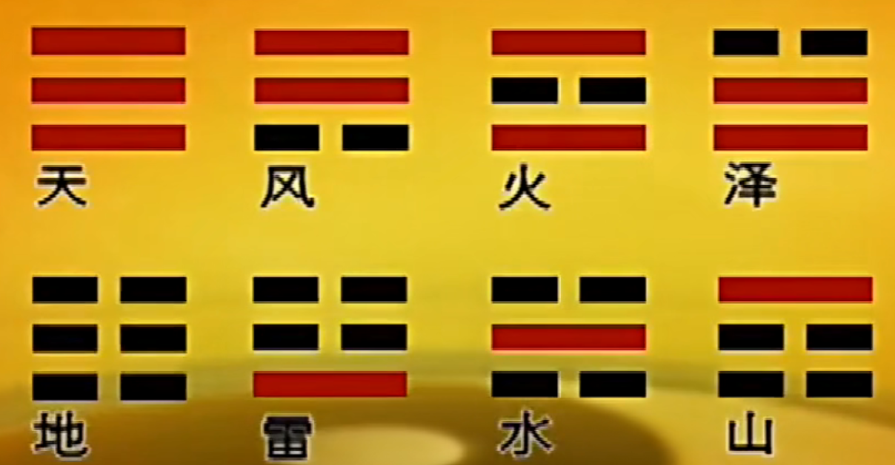
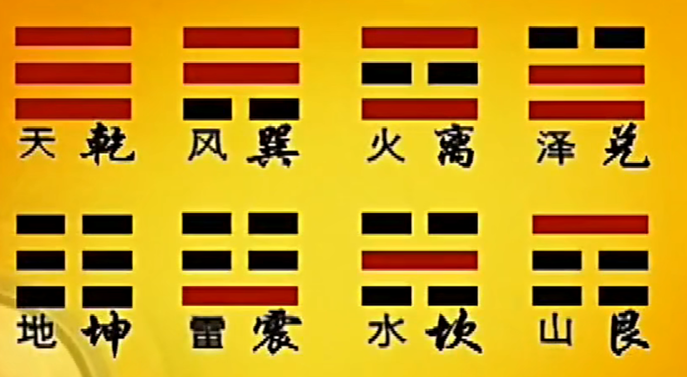

天地水火雷风山泽

天     乾  乾 代表刚健   ：刚强恒久

地     坤  坤 代表柔顺   ：土地 可以挖，可以堆山，埋尸

水    坎：欠土   水来冲掉泥土

火    离： 美丽 同归于尽 到最后自己也不见了

风    巽(xun四声)  齐、入   无孔不入

雷    震          震动

山    艮 暂停、停止  前面有山，休息一下。适可而止： 休息是为了走更长的路

泽    兑 (悦)

天地雷风
乾坤震巽 坎离艮兑

颠倒乾坤

天乾       风巽     火离   泽兑
地坤       雷震     水坎   山艮

八卦图

怎么调试使我们品德越来越高尚

朱熹 八卦取象歌

朱熹《周易本义》中的《八卦取象歌》：
乾三连，坤六断；
震仰盂，艮覆碗：
离中虚，坎中满；
兑上缺，巽下断。

6个爻
爻有变动的意思也有仿效的意思

6 * 64 = 384

64*64 = 4096

人的命运和宇宙一样，都是动态的，随时在改变

从来没有变也就是没有长进的意思

士别三日当刮目相待 日日新   又日新

看命是从 动态里去了解

有例行，就有例外

任何东西都可以安放在易经里面
一 又 千变万化 。就是  万变不离其宗

八卦就是人类最早的共识

伏羲八卦图本无字， 所以又称无字天书

周文王（周西伯）利用文字 写成 易经   所以易经也被称为周易

## P3 易经与命运

商纣 害怕周西伯，关他在牢里 周文王在牢里 完成了 

卦 爻 

留白性

### 卦名 爻辞

64卦下载完整无缝 环环相扣，没有矛盾，可以互补

周文王之子周武王。说 人为万物之灵（人本来是动物的一种，要拉开和动物的距离）

易经 很不幸的被披上了一层神秘的外衣(商周 当时的迷信需要)

一阴一阳谓之道

卜筮 （占卜）

汉朝把易经分成了两部分（术数，义理），违反了易经的 合的 道理

情理情理 是合在一起的。 完全讲道理过分理智了之后 有些人连自己的生活都安排不清了

伏羲一画开天地
周文王用六十四卦推理出世间的万物万象
但是易经流传到了现在，几乎成了一种算命用的工具

易经的真正的用力是什么呢？
抬头三尺有神明：人应该有所畏惧，不能为了自己的需求，放纵自己，为所欲为

踩门槛会运气不好。实际上是为了安全，门槛设计也是为了安全。 踩上去可能头碰到

任何事情用的合理就会有价值：
所谓看见尼姑会倒霉。  尼姑附近常常碰到的人就是  农夫和猎人，不安全。

一阴一阳之谓道

### 求神拜佛有用么？

佛在 梵文里意为 教授
求神拜佛在会是提醒我们神佛在哪里，不要胡乱作为，好好修习自己

你收了她心理的暗示。 配合他，就会很准。
算命是你算算看，听听看，如果有利，我尽量达成，如果是无利的，我尽量避免
这才是算命的意义。就是趋吉避凶的大道理。

心诚则灵
你相信不相信， 你相信他就要接受他的摆布，你不相信他，你就可以防备。防备到什么程度，还是看你自己

人的自主性。

### 自天佑之，吉无不利。
了解天理，又顺从自然，就会吉祥，就会无不利的后果。
伦理从自然而来。

易经其实是比较接近真理的

###易经的三个特性：
1. 模糊性    讲话点到为止
2. 灵活性    怎么讲怎么对，怎么讲怎么不对。所谓： 慎断是非  对中有错错中有对。绝对对或者绝对错的太少了
3. 空白性    留白，尊重看的人

民智未开，知识未普及。易经很难被理解。 艰难险阻，看起来不好，但是才能磨练自己，更成熟

**人生经过更多的磨练，才会变的成熟**

## P4 破解占卦

