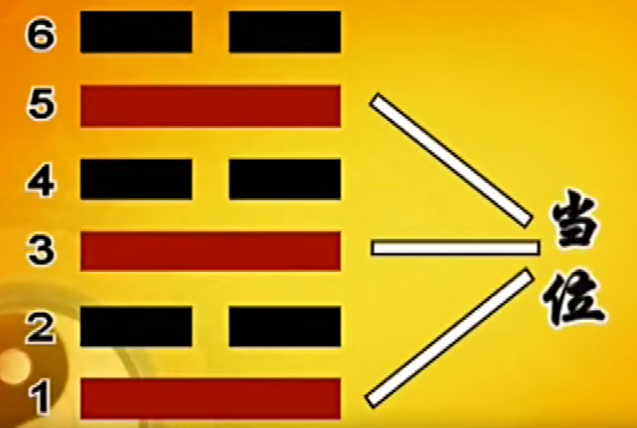

天地水火雷风山泽

天     乾  乾 代表刚健   ：刚强恒久

地     坤  坤 代表柔顺   ：土地 可以挖，可以堆山，埋尸

水    坎：欠土   水来冲掉泥土

火    离： 美丽 同归于尽 到最后自己也不见了

风    巽(xun四声)  齐、入   无孔不入

雷    震          震动

山    艮 暂停、停止  前面有山，休息一下。适可而止： 休息是为了走更长的路

泽    兑 (悦)

天地雷风
乾坤震巽 坎离艮兑

颠倒乾坤

天乾       风巽     火离   泽兑
地坤       雷震     水坎   山艮

八卦图

怎么调试使我们品德越来越高尚

朱熹 八卦取象歌

朱熹《周易本义》中的《八卦取象歌》：
乾三连，坤六断；
震仰盂，艮覆碗：
离中虚，坎中满；
兑上缺，巽下断。

6个爻
爻有变动的意思也有仿效的意思

6 * 64 = 384

64*64 = 4096

人的命运和宇宙一样，都是动态的，随时在改变

从来没有变也就是没有长进的意思

士别三日当刮目相待 日日新   又日新

看命是从 动态里去了解

有例行，就有例外

任何东西都可以安放在易经里面
一 又 千变万化 。就是  万变不离其宗

八卦就是人类最早的共识

伏羲八卦图本无字， 所以又称无字天书

周文王（周西伯）利用文字 写成 易经   所以易经也被称为周易

## P3 易经与命运

商纣 害怕周西伯，关他在牢里 周文王在牢里 完成了 

卦 爻 

留白性

### 卦名 爻辞

64卦下载完整无缝 环环相扣，没有矛盾，可以互补

周文王之子周武王。说 人为万物之灵（人本来是动物的一种，要拉开和动物的距离）

易经 很不幸的被披上了一层神秘的外衣(商周 当时的迷信需要)

一阴一阳谓之道

卜筮 （占卜）

汉朝把易经分成了两部分（术数，义理），违反了易经的 合的 道理

情理情理 是合在一起的。 完全讲道理过分理智了之后 有些人连自己的生活都安排不清了

伏羲一画开天地
周文王用六十四卦推理出世间的万物万象
但是易经流传到了现在，几乎成了一种算命用的工具

易经的真正的用力是什么呢？
抬头三尺有神明：人应该有所畏惧，不能为了自己的需求，放纵自己，为所欲为

踩门槛会运气不好。实际上是为了安全，门槛设计也是为了安全。 踩上去可能头碰到

任何事情用的合理就会有价值：
所谓看见尼姑会倒霉。  尼姑附近常常碰到的人就是  农夫和猎人，不安全。

一阴一阳之谓道

### 求神拜佛有用么？

佛在 梵文里意为 教授
求神拜佛在会是提醒我们神佛在哪里，不要胡乱作为，好好修习自己

你收了她心理的暗示。 配合他，就会很准。
算命是你算算看，听听看，如果有利，我尽量达成，如果是无利的，我尽量避免
这才是算命的意义。就是趋吉避凶的大道理。

心诚则灵
你相信不相信， 你相信他就要接受他的摆布，你不相信他，你就可以防备。防备到什么程度，还是看你自己

人的自主性。

### 自天佑之，吉无不利。
了解天理，又顺从自然，就会吉祥，就会无不利的后果。
伦理从自然而来。

易经其实是比较接近真理的

###易经的三个特性：
1. 模糊性    讲话点到为止
2. 灵活性    怎么讲怎么对，怎么讲怎么不对。所谓： 慎断是非  对中有错错中有对。绝对对或者绝对错的太少了
3. 空白性    留白，尊重看的人

民智未开，知识未普及。易经很难被理解。 艰难险阻，看起来不好，但是才能磨练自己，更成熟

**人生经过更多的磨练，才会变的成熟**

## P4 破解占卦

占卜是为了帮助我们趋吉避凶，减少损害

占卜为什么被当做迷信。因为只有少数人会。而占卜的人又无法告诉你道理。

不要完全相信占卜的结果

了解别人容易，了解自己很难。
当局者迷。当局者为什么会迷，因为你看不清楚自己。
把自己的处境，把自己的一切一切用卦 悬挂起来，放在你的眼前。你就是旁观者清了。就像再看别人的事情。

算卦准不准，一件事情十个人算算出来的卦 十个卦

邪不敌正。邪不胜正。
浩然正气，邪不入侵你自己。

如果打仗，想的是我这一仗火不了了。那大多死了。
同样一幅药，先生才，病人福。

道德是最高的信仰。

## 占卜的基本概念

占卦也是一种游戏，这个游戏的名称就叫

一二三四 推出 六七八九

假设一个铜板又 正面  反面两个面。
一阴一阳。

三个铜板。

三个铜板转动起来。 正面是 三  反面是 二
三个铜板一共只有四种变化

三个正面              3 +  3 + 3 = 9
两个正面一个反面        3 +  3 + 2 = 8
一个正面两个反面        3 +  2 + 2 = 7
三个正面              2 +  2 + 2 = 6

 

七上八下
阳九阴六

一   九

--  六

    坤 三条线  六个横
--
--
--

 **乾**

而阳统阴

阳中包含阴，索引是  3+6 = 9  阳九阴六

应变得宜 数是随时空而变化的，不一定的

时： 时间
位： 空间
性质：阴阳

三样东西代表每一个 爻

比如
泰卦

任何事情刚开始的时候，
时比较重要  空间比较不重要

一个人出生  赶快记下来几点几分 生辰
一个人死了  死了一个人比较重要，几点几分不重视 重视这个人的成就和地位： 唉，死了一个好人，  哎，这个坏人终于死了

开张算日子图个吉利。没问题

倒闭了算日子 那不神经病么

八卦.png

三个硬币转一次， 转6次
由下而上记下来

积爻成卦

泰  否 pi

## P5 乾坤并列 
第一二卦

64卦只有三种。一类是乾卦，纯阳，一类是坤卦，纯阴
第三类就是有阴有阳。62重

所以有： **乾坤易之门** 的说法。 乾坤是易学的大门

乾卦 是父亲
坤卦 是母亲

儿子多半像妈妈 女儿多半像爸爸

乾卦三爻都是阳刚的
坤卦三爻都是柔顺的

三画卦代表 天地人三材

六画卦

因为地越挖越刚。 地表柔，锄头可挖动。越往下越硬。
所以地基深才能牢固。

所以**地道**是  先刚后柔

人道 是以 **义** 为基础
才能证明心是仁爱的

天道 阴 阳

中国人讲阴阳。从来不讲阳阴。
冷气是往下走的。 热气是往上扬的
索引阴往下阳往上，才能交流。

头一个是阳， 脚两个是阴

而头要 “阴”一点，此处阴代表冷静。头脑要冷静一点，不要太热了
脚要“阳”一点，脚需要热，这个人才是健康的。

#### 如何应对生活中的变化

重卦是 两个单卦的组合

上卦 代表能量  下卦代表物质的

任何一个卦 6个爻 代表 6个 位阶

偶数是阴， 奇数是阳

1,3,5 阳爻是 当位的爻辞比较让人放心

1,3,5 阴爻是 不位的爻辞比较 不让人放心

2,4,6 阴爻是当位

**1,3,5阳爻当位， 2，4,6阴爻当位**

64卦中， 6个爻全是当位的只有一个卦：
**既济**

既济是 易经中的第62卦。

64卦中， 6个爻全是不当位的只有一个卦：
**未济**
第64卦：未济就是还没有完成的意思

一个人有什么能力去做什么事，做得好表示当位
否则是不当位

易经里面是没有好坏的：好会变好，坏会变好。
好的里面有很多坏的因素随时会产生。
坏的里面有很多好的因素随时把坏的取消掉变好。

新陈代谢。每七天细胞大部分都改变了。所以随时可以做一个新的人
**不要只看眼前，要知道未来的变化**

现在好不好已经定了。不要抱怨，
要想办法把它（未来）变好。

#### 卦爻蕴含的智慧

6个位阶表示 6个不同阶段的变化。

初爻跟上爻对起来叫做有始有终。
**初难知，上易知。**

小时了了，大未必佳。

**二多誉，五多功**
我们很习惯于把所有的功劳归功于上级。
因为抢不过，抢过了必然会倒霉。

归功于领导，领导会赞誉你。

**三多凶，四多惧**
三。物极必反，下卦的最顶端，很快能产生变化

故：

就是这样，一定是这样，铁口直断。这样就违反了易经的精神
从下往上念：

上易知
五多功
四多惧
三多凶
二多誉
初难知

乾卦是易经的第一卦。我们叫做天下第一卦

## P6 乾卦上 乾卦六龙
#### 乾卦六龙
乾卦代表6条龙，应该采取怎样的行动

龙：
三个特性：
变化多端
比较难缠 你掌握不住它
神通广大

希望像龙一样：
神通广大随时应变无所不通

乾卦的大象：
天行健，君子以自强不息。

象：就是《象转》。是解释卦爻的一种辞。古时对卦辞的解释叫做“大象”

行：运行。 天空，天是空的。  云行雨施
持久的运行才叫做天行健。
君子应向天学习，学习什么：自强不息。

见（现）

潜龙： 潜：初难知 1.刚刚冒出来，不知道将来会怎么样
                2.人或事情，自己也没有把握将来怎么样
                3. 环境合不合适，也不知道

潜龙爻辞： 潜龙勿用。
勿用不是不用， 是要用

元亨利贞？

刚到一个地方就开始发表很多意见，人家就知道你对我们本地不了解，你很危险。
一个人来到一个新地方。一定要多多了解，要入境问俗。

子入太庙，每事问。
不是孔子他不懂，是他想知道你们这些人到底了解到什么地步，我怎么跟你们配合
而且 有没有变化。是否做出了什么调整。
如果不知道，到时候出洋相的是我（孔子，也是我们每个人）

潜龙勿用: **站在不要用的立场来用**。有话暂时不讲。
在应该表现的时候才要表现。将自我的才华在最恰当的时候表现出来。

潜龙勿用。历史上最成功的的人就是诸葛亮：卧龙
我不急，要叫我求人，我不干。他就那么高姿态
潜了整整27年。
等刘备三顾茅庐，是诸葛亮“潜”出来的。

现龙在田，立见大人。一出来就是一个大人(了不起)的样子
当一个人表现得越好，就进入了 惕龙。（警惕）

没有人把他当做对手，就是没有价值。
锻炼又锻炼，提升又提升。
否则，一个人就提前报废掉了。

人有名，有钱，有事。你就快要自我爆破了。
所以易经告诉我们，当你表现的非常好的时候，你就进入“惕龙”了
高度危险。

好像随时会发生灾难： **忧患意识**
它不是怕东怕西，畏首畏尾，而是：
我有今天的成就，我不能把他毁掉。
爱惜羽毛，不要毁于一旦。
警惕的目的就是再上一条龙

如果自得其乐，就把下潜做好。有没有必要再上一层龙，就好好斟酌一下。、
如果要， 那就“跃龙”。

当你要更上一层楼的时候，你要小心了。 
高处不胜寒，越高层，越孤单。你要不要往上挤。
要 “跳跃” 
第四爻辞（跃龙）为：
**或跃在渊，无咎。**
或者飞升，或者跌落谷底。

第五爻辞： 飞龙在天，利见大人。

调入深渊，可能调到不如潜龙。

很多人盲目地往上升迁，认为这是光荣。
一个人要不要往上走，最好自己决定，不要由人家摆布。
供你的人，

你可以立定志向，我最起码要当到主管。没问题
可是你要当上总经理。 大可不必
上去固然好，下来如果心甘情愿。 那就去做

飞龙在天可以说是人生最高的境界。
作为一个人，你当一个领导，你下面有很多人，到底是他们在捧你。还是
你在领导他们。 水能载舟亦能覆舟。
要去关心底下的人，平常要照顾他们，否则 飞了半天掉下来，没人同情你。
飞龙之后：适可而止，度量要大。

高亢：亢： 脱离群众。
当你脱离群众，就像断了线的风筝一样，高而无位，失去了群众基础，再说话可能就没有人理你

#### 什么叫有本事
做事情刚开始要了解现况：潜龙勿用。不要一味的求表现。先安静下来。了解状况，了解领导个性。
再熟悉环境，跟其他人打交道。等到大家都支持你，再去表现。
否则你一表现，稳定出丑

中国人不讲能力不能力。不是不重视能力，而是将一种比能力很深层的东西，叫做本事。
就是你有能力，还要加上你表现得人家接受你，对你口服心服，才叫本事。

**把所有64卦的道理都通了，还需要占卜么，这才是真正易经的功能**

## P7 乾卦下： 六龙御天

