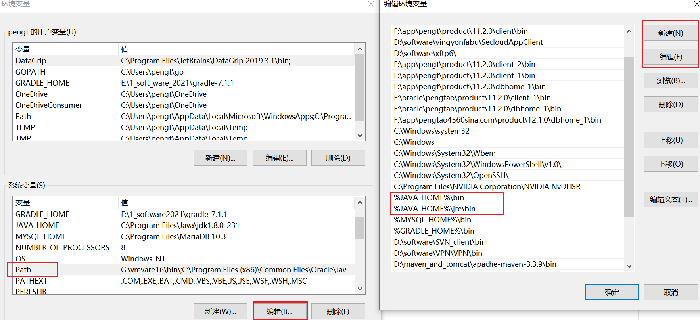

# win10安装jdk
1.win+r 输入 sysdm.cpl （系统属性）- “高级” 页签 - 环境变量  或  右键此电脑-管理-高级系统设置-环境变量  

2.系统变量-新建JAVA_HOME

变量名： JAVA_HOME

变量值： JDK的安装路径

3.系统变量-新建CLASSPATH

变量名： CLASSPATH
变量值： .;%JAVA_HOME%\lib\dt.jar;%JAVA_HOME%\lib\tools.jar

4.系统变量-找到PATH-编辑-新建

%JAVA_HOME%\bin
%JAVA_HOME%\jre\bin

