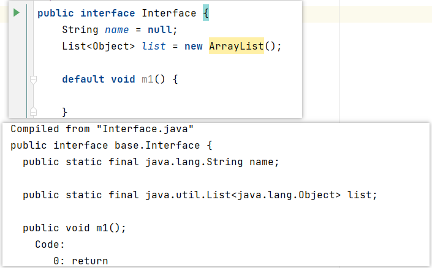

# 1、 Java语言有哪些特点
1、简单易学、有丰富的类库
2、面向对象（Java最重要的特性，让程序耦合度更低，内聚性更高）
3、与平台无关性（JVM是Java跨平台使用的根本）
4、可靠安全
5、支持多线程

# 2、面向对象和面向过程的区别
面向过程：是分析解决问题的步骤，然后用函数把这些步骤一步一步地实现，然后在使用的时候一一调用则可。性能较高，所以单片机、嵌入式开发等一般采用面向过程开发
面向对象：是把构成问题的事务分解成各个对象，而建立对象的目的也不是为了完成一个个步骤，而是为了描述某个事物在解决整个问题的过程中所发生的行为。
面向对象有封装、继承、多态的特性，所以易维护、易复用、易扩展。可以设计出低耦合的系统。 但是性能上来说，比面向过程要
低。

# 3、java面向对象有哪些特征?
面向对象有三大特性，封装、继承和多态。

封装就是将一类事物的属性和行为抽象成一个类，使其属性私有化，行为公开化，提高了数据的隐秘性的同时，使代码模块化。这样做使得代码的复用性更高。

继承则是进一步将一类事物共有的属性和行为抽象成一个父类，而 个子类--有父类的行为和属性，也有自己特有的行为和属性。
这样做扩展了已存在的代码块，进一步提高了代码的复用性。

如果说封装和继承是为了使代码重用，那么多态则是为了实现接口重用。多态的一大作用就是为了解耦--为了解除父子类继承的耦合度。
如果说继承中父子类的关系式IS-A的关系，那么接口和实现类之之间的关系式HAS-A。简单来说，多态就是允许父类引用(或接口)指向子类(或实现类)对象。
很多的设计模式都是基于面向对象的多态性设计的。

总结一下，如果说封装和继承是面向对象的基础，那么多态则是面向对象最精髓的理论。掌握多态必先了解接口，只有充分理解接口才能更好的应用多态。

[面向对象特征](https://blog.csdn.net/weixin_40066829/article/details/78111476)

# 5、ArrayList和LinkedList有什么区别

1. **是否保证线程安全：** `ArrayList` 和 `LinkedList` 都是不同步的，也就是不保证线程安全；
2. **底层数据结构：** `Arraylist` 底层使用的是 **`Object` 数组**；
   `LinkedList` 底层使用的是 **双向链表** 数据结构（JDK1.6 之前为循环链表，JDK1.7 取消了循环。注意双向链表和双向循环链表的区别，下面有介绍到！）
3. **插入和删除是否受元素位置的影响：** ① **`ArrayList` 采用数组存储，所以插入和删除元素的时间复杂度受元素位置的影响。
   ** 比如：执行`add(E e)`方法的时候， `ArrayList` 会默认在将指定的元素追加到此列表的末尾，这种情况时间复杂度就是 O(1)。
   但是如果要在指定位置 i 插入和删除元素的话（`add(int index, E element)`）时间复杂度就为 O(n-i)。因为在进行上述操作的时候集合中
   第 i 和第 i 个元素之后的(n-i)个元素都要执行向后位/向前移一位的操作。
   ② **`LinkedList` 采用链表存储，所以对于`add(E e)`方法的插入，删除元素时间复杂度不受元素位置的影响，近似 O(1)，
   如果是要在指定位置`i`插入和删除元素的话（`(add(int index, E element)`） 时间复杂度近似为`o(n))`因为需要先移动到指定位置再插入。**
4. **是否支持快速随机访问：** `LinkedList` 不支持高效的随机元素访问，而 `ArrayList` 支持。快速随机访问就是通过元素的序号快速获取元素对象(对应于`get(int index)`方法)。
5. **内存空间占用：** `ArrayList` 的空 间浪费主要体现在在 list 列表的结尾会预留一定的容量空间，而 `LinkedList` 的空间花费则体现在它的每一个元素都需要消耗
   比 `ArrayList` 更多的空间（因为要存放直接后继和直接前驱以及数据）。

# 6、接口和抽象类有什么共同点和区别？

**共同点** ：

- 都不能被实例化。
- 都可以包含抽象方法。
- 都可以有默认实现的方法（Java 8 可以用 `default` 关键在接口中定义默认方法）。

**区别** ：

1.在语义上的区别是 接口主要用于对类的行为进行约束，你实现了某个接口就具有了对应的行为，**描述的是具备的特征**。
  抽象类是一个比较具体存在的概念，主要用于代码复用，强调的是所属关系（比如说我们抽象了一个发送短信的抽象类，）。
2.一个类只能继承一个类，但是可以实现多个接口。

3.抽象类中可以定义构造器, 接口中不能定义构造器
4.抽象类可以有抽象方法和具体方法。 接口中可以有抽象方法，接口中的具体方法必须是default 修饰，
5.抽象类中的成员可以是private、default、protected、public。接口中的成员变量只能是 public static final，就算不写，编译时也会加上
6.有抽象方法的类必须被声明为抽象类，而抽象类未必要有抽象方法
7.抽象类中可以包含静态方法，接口中也可以有静态方法
  7.一个类只能继承一个抽象类, 一个类可以实现多个接口
- 


#39. HashMap 和 Hashtable 的区别

1. **线程是否安全：** `HashMap` 是非线程安全的，`Hashtable` 是线程安全的,因为 `Hashtable` 内部的方法基本都经过`synchronized` 修饰。如果你要保证线程安全的话就使用 `ConcurrentHashMap`
2. **效率：** 因为线程安全的问题，`HashMap` 要比 `Hashtable` 效率高一点。另外，`Hashtable` 基本被淘汰，需要避免在代码中使用Hashtable；
3. **对 空键（Null key） 和 空值（Null value） 的支持：** `HashMap` 可以存储 空键和空值，但 空键只能有一个，空值可以有多个；
   Hashtable 不允许有 空的键或值，否则会抛出 `NullPointerException`。
4. **初始容量大小和每次扩充容量大小的不同 ：** ① 创建时如果不指定容量初始值，`Hashtable` 默认的初始大小为 11，之后每次扩充，容量变为原来的 2n+1。
   `HashMap` 默认的初始化大小为 16。之后每次扩充，容量变为原来的 2 倍。② 创建时如果给定了容量初始值，那么 Hashtable 会直接使用你给定的大小，
   而 `HashMap` 会将其扩充为 2 的幂次方大小（`HashMap` 中的`tableSizeFor()`方法保证）。也就是说 `HashMap` 总是使用 2 的幂作为哈希表的大小
5. **底层数据结构：** JDK1.8 以后的 `HashMap` 在解决哈希冲突时有了较大的变化，当链表长度大于阈值（默认为 8）
   （将链表转换成红黑树前会判断，如果当前数组的长度小于 64，那么会选择先进行数组扩容，而不是转换为红黑树）时，将链表转化为红黑树，以减少搜索时间。Hashtable 没有这样的机制。

# hashCode和 equals如何使用

hashCode()的设计原则
在一个Java应用的执行期间，如果一个对象提供给equals做比较的信息没有被修改的话，该对象多次调用hashCode()方法，该方法必须始终如一返回同一个integer。
如果两个对象根据equals(Object)方法是相等的，那么调用二者各自的hashCode()方法必须产生同一个integer结果。
并**不要求**根据equals(java.lang.Object)方法不相等的两个对象，调用二者各自的hashCode()方法必须产生不同的integer结果。
然而，程序员应该意识到对于不同的对象产生不同的integer结果，有可能会提高hash table的性能。

equals的设计原则
equals要遵守的通用约定（equals方法实现了等价关系）：自反性、对称性、传递性、一致性
对于两个对象 x,y
1）自反性：x.equals(x)一定返回true
2）对称性：x.equals(y)返回true当且仅当y.equals(x)
3）传递性：x.equals(y)且y.equals(z)为true，则x.equals(z)为true
4）一致性：若x.equals(y)返回true，则不改变x，y时多次调用x.equals(y)都返回true
5）对于任意的非空引用值x，x.equals(null)一定返回false。
当重写完equals方法后，应该检查是否满足对称性、传递性、一致性。（自反性、null通常会自行满足）

只要重写 equals，就必须重写 hashCode。
因为 Set 存储的是不重复的对象，依据 hashCode 和 equals 进行判断，所以 Set 存储的对象必须重写这两个方法。
如果自定义对象做为 Map 的键，那么必须重写 hashCode 和 equals。

[hashCode和equals如何使用](https://blog.csdn.net/qing0706/article/details/50593823)

# equals和== 的区别

equals和==最大的区别是一个是方法一个是运算符。

==：如果比较的对象是基本数据类型，则比较的是数值是否相等：如果比较的是引用数把类型，则比较的是对象的地址值是否相等。
equals():用来比校方法两个对象的内容是否相等。

注意：equals方法不能用于基本数据类型的变量，如果没有对equals方法进行重写，则比较的是引用类型的变量所指向的对象的地址。

# 重载和重写的区别

# 10.String、String StringBuffer 和 StringBuilder 的区别是什么?

String是只读字符串，它并不是基本数据类型，而是一个对象。从底层源码来看是一个final类型的字符数组( private final char value[];)，
所引用的字符串不能被改变，一经定义，无法再增删改。每次对String的操作都会生成新的String对象。
让str重新指向了一个新的字符串bc对象，而原对像并没有任何改变，只不过原对象已经成为一个不可及对象。

StringBuffer 和 StringBuilder 他们两都继承了 AbstractStringBuilder 抽象类，从 AbstractStringBuilder 抽象类中我们可以看到
他们的底层都是可变的字符数组(char[] value)，所以在进行频繁的字符串操作时，建议使用StringBuilder  和 StringBuffer 来进行操作。 
另外StringBuffer 对方法加了同步锁或者对调用的方法加了同步锁，所以是线程安全的。StringBuilder 并没有对方法进行加同步锁，所以是非线程安全的。

```java
/**
 * @see java.lang.String
 * @see java.lang.StringBuilder
 * @see java.lang.StringBuffer
 */
```
# 怎样声明一个类不会被继承，什么场景下会用到

自定义异常在生产中如何应用
Jva虽然提供了丰言的异常处理类，但是在项目中还会经常使用自定义异常，其主要原因是v提供的异常类在某些情况下还是不能满足
实际需球。例如以下情况：
1、系统中有些错误是符合ava语法，但不符合业务逻组。
2、在分层的软件结构中，通常是在表现层统一对系统其他层次的异常进行铺获处理。

# 计算机的缓存有几级，为什么

**CPU一级缓存**
CPU的一级缓存. 主要工作是缓存指令和数据. 一级缓存的容量和结构对CPU的性能有很大的影响，但是由于它的结构比较复杂，
并且考虑到成本等因素，因此通常来说，CPU的一级缓存很小，通常也可以使用CPU的一级缓存. 达到大约256KB的水平.
**缓存行（缓存块）64个字节**
**CPU二级缓存**(L2 Cache66)

CPU二级缓存是指CPU的二级缓存，二级缓存的容量直接影响CPU的性能. 第二级缓存越大，效果越好. 例如，英特尔的第八代i7-8700处理器共有六个内核，
每个内核具有256KB的二级缓存(每个内核专有)，因此二级缓存的总数达到1.5MB.

**CPU三级缓存(L3缓存)**

CPU三级缓存是指CPU的三级缓存. 它的功能是进一步减少内存的等待时间并提高海量数据的计算性能. 
与第一级缓存和第二级缓存不同，第三级缓存由内核共享，这可能使容量非常大.

# 缓存一致性协议 （硬件层面的协议，和软件无关）
**当CPU写数据时，如果发现操作的变量是共享变量，即在其它CPU中也存在该变量的副本，会发出信号通知其它CPU将该内存变量的缓存行设置为无效，
因此当其它CPU读取这个变量的时，发现自己缓存该变量的缓存行是无效的，那么它就会从内存中重新读取。**
缓存一致性协议中比较著名的是MESI，是inter的。  amd、阿里的不一样。
百度百科：
MESI协议是基于 Invalidate 的高速缓存一致性协议，并且是支持回写高速缓存的最常用协议之一。
它也被称为伊利诺伊州协议（由于其在伊利诺伊大学厄巴纳 - 香槟分校的发展）。 回写高速缓存可以节省很多通常在写入缓存上浪费的带宽。 
回写高速缓存中总是存在脏状态，表示高速缓存中的数据与主存储器中的数据不同。 如果块驻留在另一个缓存中，
则Illinois协议要求缓存在未命中时缓存传输。 该协议相对于MSI协议减少了主存储器事务的数量。 这标志着性能的显着改善。
M : Modified
E : exclusive
S : Shared
I : Invalid
修正；否决；参与；无效（协议）(Modified, Exclusive, Shared, and Invalid);

空间换时间。

# 多线程的有序性 (指令重排-属于cpu不属于某一种语言)

计算机在执行程序时，为了提高性能，编译器和处理器常常会对指令重排，一般分为以下三种：

**源代码 -> 编译器优化的重排 -> 指令并行的重排 -> 内存系统的重排 -> 最终执行指令**

单线程环境里面确保最终执行结果和代码顺序的结果一致

处理器在进行重排序时，必须要考虑指令之间的**数据依赖性**（先有你爹妈，才能有你。 做题的顺序和卷子的顺序不见得一样）

多线程环境中线程交替执行，由于编译器优化重排的存在，两个线程中使用的变量能否保证一致性是无法确定的，结果无法预测。

# this 溢出问题

创建对象的时候，对象还没有创建完成，这个对象(this)就暴露给某个线程了。

this溢出问题的解决办法：
effective java中有提到
**不要在构造方法中启动线程**。

```java
public class Te3_ThisEscape {
   private int num = 8;

   public T03_ThisEscape() {
      new Thread(() -> System.out.println(this.num)
      ).start();
   }
      public static void main (String[]args) throws Exception{
      new To3_ThisEscape();
      System.in.read();
   }
}
```

# DCL是什么， DCL要不要加 volatile 问题？

double check lock 双重检查锁

```java
package com.atguigu.review.volatiledemo;

/**
 * 单例模式
 */
public class SingletonDemo {

    private static volatile SingletonDemo instance = null;

    private SingletonDemo() {
        System.out.println(Thread.currentThread().getName() + "\t 我是构造方法singletonDemo() ");
    }

    /*    public static SingletonDemo getInstance() {
            if (instance == null) {
                instance = new SingletonDemo();
            }
            return instance;
        }*/

    // DCL(Doouble check Lock双端检锁机制)
    public static SingletonDemo getInstance() {
        if (instance == null) {
           // a 双重检查加锁多线程情况下会出现某个线程虽然这里已经为空，但是另外一个线程已经执行到d处

           synchronized (SingletonDemo.class) {
              //c不加volitale关键字的话有可能会出现尚未完全初始化就获取到的情况。原因是内存模型允许无序写入

              if (instance == null) {
                    instance = new SingletonDemo();
                }
            }
        }
        return instance;

    }

    //

    public static void main(String[] args) {
        /* 单线程（main线程的操作动作。。。。。。）
         */
//        System.out.println(SingletonDemo.getInstance() == SingletonDemo.getInstance()); //引用类型 == 比较内存地址
//        System.out.println(SingletonDemo.getInstance() == SingletonDemo.getInstance());
//        System.out.println(SingletonDemo.getInstance() == SingletonDemo.getInstance());

        // 并发多线程后，情况发生了很大的变化

        for (int i = 1; i <= 1000; i++) {
            new Thread(() -> {
                SingletonDemo.getInstance();
            }, String.valueOf(i)).start();
        }
        // 多线程下控制台打印结果是不确定的
    }

    /**
     * main	 我是构造方法singletonDemo()
     * true
     * true
     * true
     */
}

```
